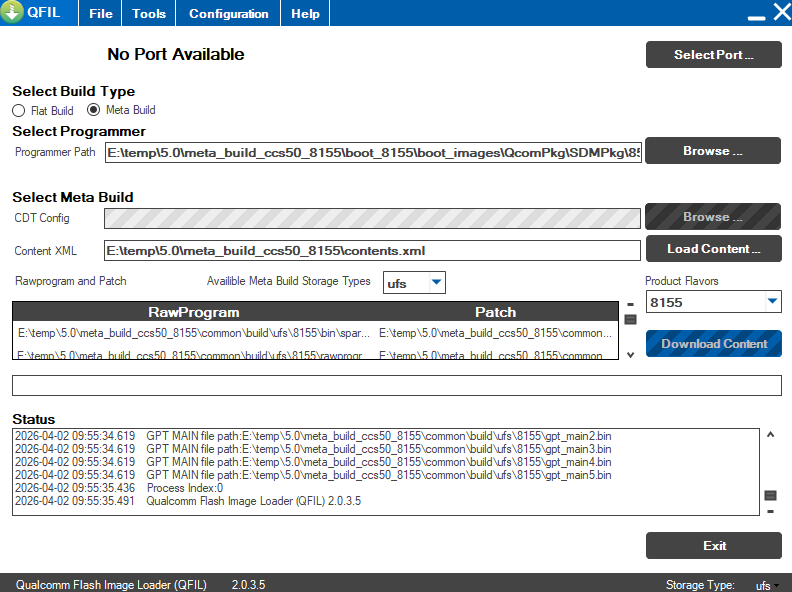
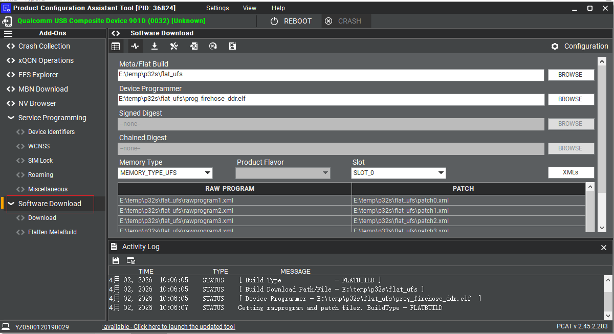

1、QFIL

分为flat build 和meta build两种模式。meta build需要指定contents.xml。flat build需要选中prog_firehose_ddr.elf和6个rawprogram5文件6个patch文件。

2、PCAT

高通更现代化的专业工具，

连上机器后，指定烧录包路径即可自动识别和配置大部分参数，不需要手动选。memory Type改成UFS。

3、对于QFIL，驱动和软件直接安装即可。对于PCAT，安装比较麻烦，需要：

1）先注册高通账号，认证企业。

2）然后下载QPM，登录高通账号后才能进入下载页面，安装。

https://qpm.qualcomm.com/#/main/tools/details/QPM3

3）启动QPM，QPM内登录高通账号

4）通过QPM安装PCAT。

即PCAT是没有离线包的。是否有邪修手段提取离线程序暂不在考虑范围内。

