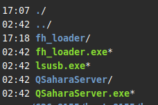

安装QFIL后，安装路径下能找到这两个程序：

`fh_loader.exe`和`QSaharaServer.exe`。

QSaharaServer提供通信协议，fh_loader则是调用的命令。

PCAT还是基于同样的协议，但是已经不依赖这个命令行。

我们先给方法，后给原理。

## 命令行

下面给出的是flat build方式烧录的命令行(linux shell)：

```shell
# 1、通过QSaharaServer将Firehose程序加载到EDL设备。UFS_PATH是你放烧录包的路径
./QSaharaServer -v 2 -p /dev/ttyUSB0 -s 13:$UFS_PATH/prog_firehose_ddr.elf
#tips: a. 这里的/dev/ttyUSB0是Ubuntu主机上识别到的高通开发板
#      b. -v用来设置QSaharaServer的log等级
#      c. -s用来指定Sahara协议文件映射，格式为<img_id:file_name>，Firehose文件默认对应的id为13


# 2、fh_loader命令,通过fh_loader将flat build下载到EDL设备的UFS闪存
tty_path=/dev/tty_qcom_9008
UFS_PATH=/home/xxxxx/ROM/flat_ufs
./fh_loader --port=$tty_path --sendxml=rawprogram_unsparse0.xml --search_path=$UFS_PATH --noprompt --showpercentagecomplete --memoryname=UFS
./fh_loader --port=$tty_path --sendxml=patch0.xml --search_path=$UFS_PATH --noprompt --showpercentagecomplete --memoryname=UFS
./fh_loader --port=$tty_path --sendxml=rawprogram1.xml --search_path=$UFS_PATH --noprompt --showpercentagecomplete --memoryname=UFS
./fh_loader --port=$tty_path --sendxml=patch1.xml --search_path=$UFS_PATH --noprompt --showpercentagecomplete --memoryname=UFS
./fh_loader --port=$tty_path --sendxml=rawprogram2.xml --search_path=$UFS_PATH --noprompt --showpercentagecomplete --memoryname=UFS
./fh_loader --port=$tty_path --sendxml=patch2.xml --search_path=$UFS_PATH --noprompt --showpercentagecomplete --memoryname=UFS
./fh_loader --port=$tty_path --sendxml=rawprogram3.xml --search_path=$UFS_PATH --noprompt --showpercentagecomplete --memoryname=UFS
./fh_loader --port=$tty_path --sendxml=patch3.xml --search_path=$UFS_PATH --noprompt --showpercentagecomplete --memoryname=UFS
./fh_loader --port=$tty_path --sendxml=rawprogram4.xml --search_path=$UFS_PATH --noprompt --showpercentagecomplete --memoryname=UFS
./fh_loader --port=$tty_path --sendxml=patch4.xml --search_path=$UFS_PATH --noprompt --showpercentagecomplete --memoryname=UFS
./fh_loader --port=$tty_path --sendxml=rawprogram5.xml --search_path=$UFS_PATH/ --noprompt --showpercentagecomplete --memoryname=UFS
./fh_loader --port=$tty_path --sendxml=patch5.xml --search_path=$UFS_PATH/ --noprompt --showpercentagecomplete --memoryname=UFS

#3、可以合并为一条
XMLFILES=rawprogram_unsparse0.xml,patch0.xml,rawprogram1.xml,patch1.xml,rawprogram2.xml,patch2.xml,rawprogram3.xml,patch3.xml,rawprogram4.xml,patch4.xml,rawprogram5.xml,patch5.xml
./fh_loader --port=$tty_path --sendxml=$XMLFILES --search_path=$UFS_PATH --noprompt --showpercentagecomplete --memoryname=UFS
```

完整命令和工具见附件。

### 适用环境

* windows和linux这个命令都是可以的。

* windows环境有QFIL工具，所以无需命令行。但是这个工具没有linux版本。

  然而，QFIL本质也是调用fh_loader命令。所以只要能搞到fh_loader和QSaharaServer的linux版进行了。

* PCAT有没有linux版不太清楚。

* windows需要先搞定对应设备的usb驱动。ubuntu通常默认就能识别，不过不能，安装最新版本的Ubuntu，或者找其他方法。看到`/dev/tty*`设备就是识别了。

* 命令行毕竟门槛较高。假如我们的主机是ubuntu，自然的想法是安装windows的虚拟机，然后把USB挂到虚拟机里面。在虚拟机里用QFIL。实测下来，sahara协议通信经常报错，烧录失败。所以不可行。当然，不排除换台电脑、换个虚拟机软件能成功的可能。

* 反过来，主机是windows，虚拟机ubuntu，用命令行烧录，成功了。

## 编译QSaharaServer和fh_loader工具

为了获得linux版本的程序，自己从高通chipcode源码编译。

boot_8155/boot_images/QcomPkg/Tools/storage/fh_loader路径下，可以看到已经有windows版本的程序：



我们需要编译Ubuntu版本的。

编译QsharaServer：

```
cd boot_8155/boot_images/QcomPkg/Tools/storage/fh_loader/QSaharaServer/src
mkdir build
cd build
cmake ..
make
```

编译完成后，在新建的build目录下即会生成Ubuntu下可执行的QSaharaServer。

再来编译fh_loader：

```
cd boot_8155/boot_images/QcomPkg/Tools/storage/fh_loader/fh_loader
make
```

626的源码这两个程序编译会报错：

问题1 LOG_LEVE重复定义

```
/usr/bin/ld: CMakeFiles/QSaharaServer.dir/sahara_protocol.c.o:/media/xue/workspace/626_8155/boot_8155/boot_images/QcomPkg/Tools/storage/fh_loader/QSaharaServer/src/kickstart_log.h:55: multiple definition of `LOG_LEVEL';
```

解决方法是：

```
vi ../kickstart_log.h 55行添加：
#ifndef LOG_LEVEL
#define LOG_LEVEL
...
#endif
```

 问题2 memscpy.c等四个文件不存在。

1、 Makefile文件里去掉这4个文件

```
boot_images/QcomPkg/Tools/storage/fh_loader/fh_loader/Makefile
@@ -16,10 +16,6 @@ OBJ = fh_cobs.c \
       fh_transport_com.c \
       fh_transport_hsuart.c \
       fh_transport_linux_pipe.c \
-      stringl/memscpy.c \
-      stringl/memsmove.c \
-      stringl/strlcat.c \
-      stringl/strlcpy.c

```

 2、 修改stringl/stringl.h头文件，只需要改memscpy和memsmove即可

```
-size_t memscpy(void *dst, size_t dst_size, const void *src, size_t src_size);
+#define memscpy(dest,destsize,src,srcsize) memcpy(dest,src,srcsize)
+//size_t memscpy(void *dst, size_t dst_size, const void *src, size_t src_size);
 
-size_t memsmove(void *dst, size_t dst_size, const void *src, size_t src_size);
+#define memsmove(dest,destsize,src,srcsize) memmove(dest,src,srcsize)
+//size_t memsmove(void *dst, size_t dst_size, const void *src, size_t src_size);
```


## 烧录流程

一、进9008模式

1. 通过短接串口上的特定位置。如日产nv626项目短接3、9号位置。
2. 通过命令adb reboot edl
3. QNX Host + Android Guest on QNX Hypervisor方案的SA8155P设备上通过adb reboot edl只会让Android虚拟机重启，并不会使设备进入到EDL模式。用如下方法进EDL：

- `在QNX命令行执行reboot -f使设备进入fastboot模式`
- `执行fastboot erase xbl把XBL擦除`
- `执行fastboot reboot重启设备`

设备在擦除XBL后，设备开机时PBL加载XBL失败后会将设备进入到edl模式

二、高通平台EDL刷机过程

```
1. SOC进入到EDL后，PBL(固化在CPU中的BootROM)会等待和PC端的QSaharaServer通过Sahara协议进行握手 
2. PC端的QSaharaSever程序和SOC握手成功后会将Firehose程序(prog_firehose_ddr.elf，相当于MTK平台的DA文件)发送给SOC 
3. SOC接收PC端QSaharaSever发来的Firehose程序到CPU内部的RAM中，然后跳转到Firehose程序运行 
4. PC端的fh_loader程序与SOC端运行的Firehose程序进行通信来将所有的镜像文件下载到设备(ufs或emmc)中
```

