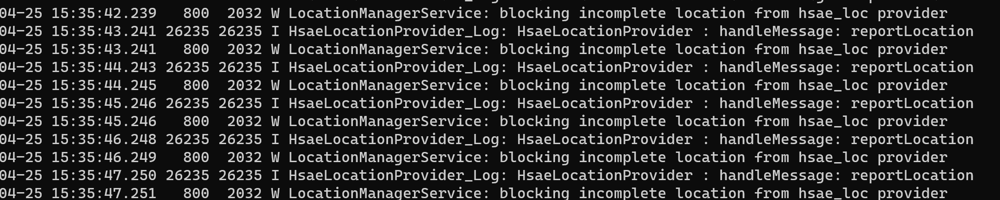
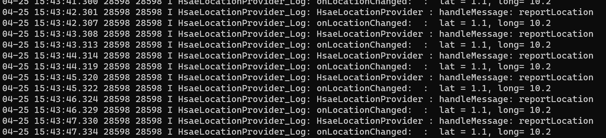

## 新增HsaeLocationProvider上报定位信息
### 一、framework方面修改

（1）在framework的res.apk中新增`config_enableHsaeLocationOverlay`和`config_hsaeLocationProviderPackageName`字段，

```xml {.line-numbers}
<!-- frameworks/base/core/res/res/values/config.xml -->
<bool name="config_enableHsaeLocationOverlay" translatable="false">true</bool>
<string name="config_hsaeLocationProviderPackageName" translatable="false">com.example.locationprovider</string>
```
```xml {.line-numbers}
<!-- frameworks/base/core/res/res/values/symbools.xml -->
<java-symbol type="bool" name="config_enableHsaeLocationOverlay" />
<java-symbol type="string" name="config_hsaeLocationProviderPackageName" />
```

（2）API新增 `hsae_loc`provider类型

`frameworks/lcation`
``` java {.line-numbers}
    public static final String HSAE_PROVIDER = "hsae_loc";
```
Tips: API新增后需要执行以下命令，需要同步更新`framework/base/api/current.txt`，否则整编会抛出异常。
``` shell
make update-api
```

(3) 在LocationMangerService启动时，添加注册HsaeLocationService流程


```java {.line-numbers}
// frameworks/base/services/core/java/com/android/server/location/LocationManagerService.java
import static android.location.LocationManager.HSAE_PROVIDER;

public class LocationManagerService extends ILocationManager.Stub {

    private static final String HSAE_LOCATION_SERVICE_ACTION =
            "com.android.location.service.HsaeLocationProvider";

    @GuardedBy("mLock")
    private void initializeProvidersLocked() {
        // bind to hsaeProvider
        LocationProviderProxy hsaeProvider = LocationProviderProxy.createAndRegister(
            mContext,
            HSAE_LOCATION_SERVICE_ACTION,
            com.android.internal.R.bool.config_enableHsaeLocationOverlay,
            com.android.internal.R.string.config_hsaeLocationProviderPackageName);
        if (hsaeProvider != null) {
            LocationProviderManager hsaeManager = new LocationProviderManager(HSAE_PROVIDER);
            mProviderManagers.add(hsaeManager);
            hsaeManager.setRealProvider(hsaeProvider);
        } else {
           Log.e(TAG, "no hsae location provider found");
        }
    }
}  
```

### 二、创建HaseLocationProvider提供定位更新功能
(1) 创建HsaeLocationProvider

```java {.line-numbers}
package com.example.locationprovider;

import android.content.Context;
import android.location.Criteria;
import android.location.Location;
import android.os.Handler;
import android.os.Message;
import android.os.SystemClock;
import android.os.WorkSource;

import com.android.location.provider.LocationProviderBase;
import com.android.location.provider.LocationRequestUnbundled;
import com.android.location.provider.ProviderPropertiesUnbundled;
import com.android.location.provider.ProviderRequestUnbundled;
import com.example.locationprovider.util.LogUtil;

public class HsaeLocationProvider extends LocationProviderBase {

    private static final String TAG = "HsaeLocationProvider";

    private float lat = 1.0f;
    private float lon = 10.0f;

    private static final ProviderPropertiesUnbundled PROPERTIES =
            ProviderPropertiesUnbundled.create(
                    /* requiresNetwork = */ false,
                    /* requiresSatellite = */ false,
                    /* requiresCell = */ false,
                    /* hasMonetaryCost = */ false,
                    /* supportsAltitude = */ true,
                    /* supportsSpeed = */ true,
                    /* supportsBearing = */ true,
                    Criteria.POWER_LOW,
                    Criteria.ACCURACY_FINE
            );

    public HsaeLocationProvider(Context context) {
        super(TAG, PROPERTIES);
    }

    private Handler mHandler = new Handler() {
        @Override
        public void handleMessage(Message msg) {
            LogUtil.i(TAG, "handleMessage: reportLocation");
            Location location = new Location("hsae_loc");
            location.setLatitude(lat + 0.1);
            location.setLongitude(lon + 0.2);
            location.makeComplete();
            reportLocation(location);
            mHandler.sendEmptyMessageDelayed(1, 1000);
        }
    };

    @Override
    protected void onSetRequest(ProviderRequestUnbundled request, WorkSource source) {

    }

    public void startMock() {
        LogUtil.i(TAG, "startMock");
        mHandler.sendEmptyMessageDelayed(1, 1000);
    }
}

```

```java
package com.example.locationprovider;

import android.app.Service;
import android.content.Intent;
import android.os.IBinder;

public class HsaeLocationService extends Service {

    private HsaeLocationProvider mProvider;

    @Override
    public IBinder onBind(Intent intent) {
        if (mProvider == null) {
            mProvider = new HsaeLocationProvider(this);
            mProvider.startMock();
        }
        return mProvider.getBinder();
    }

    @Override
    public void onDestroy() {
        if (mProvider != null) {
            mProvider = null;
        }
    }
}
```

(2) 请求Location
```java {.line-numbers}
package com.example.locationprovider;

import android.app.Activity;
import android.content.Context;
import android.location.Location;
import android.location.LocationListener;
import android.location.LocationManager;
import android.os.Bundle;

public class MainActivity extends Activity {
    private static final String TAG = "MainActivity";

    private LocationManager mLocationManager;

    @Override
    protected void onCreate(Bundle savedInstanceState) {
        super.onCreate(savedInstanceState);
        setContentView(R.layout.activity_main);
        initLocationManager();
    }

    private void initLocationManager() {
        Log.i(TAG,"initLocationManager");
        mLocationManager = (LocationManager) getSystemService(Context.LOCATION_SERVICE);
        mLocationManager.requestLocationUpdates("hsae_loc", 1000, 0, new LocationListener() {
            @Override
            public void onLocationChanged(Location location) {
                Log.i("onLocationChanged: ", " lat = " + location.getLatitude() + ", long= " + location.getLongitude());
            }

            @Override
            public void onStatusChanged(String provider, int status, Bundle extras) {
                Log.i(TAG, "onProviderEnabled: onStatusChanged=" + provider);
            }

            @Override
            public void onProviderEnabled(String provider) {
                Log.i(TAG, "onProviderEnabled: provider=" + provider);
            }

            @Override
            public void onProviderDisabled(String provider) {
                Log.i(TAG, "onProviderDisabled: provider=" + provider);
            }
        });
    }

}
```
### 三、调试

上面的测试Demo中，`HsaeLocationProvider`每隔1s就会上报一个位置信息，应用却无法收到`onLocationChanged`回调，查看日志发现被Blocking了：



分析源码可以看到
```java {.line-numbers}
 public void onReportLocation(Location location) {
            
            // ...

            // 在回调位置信息给客户端时，会有一个isComplete的判断，在这里卡住了
            if (!location.isComplete()) {
                Log.w(TAG, "blocking incomplete location from " + mName + " provider");
                return;
            }
            // ...

            handleLocationChangedLocked(this, location, mLocationFudger.createCoarse(location));
        }
```
接着，查看一下Location中相关方法
``` java {.line-numbers}
    @SystemApi
    public boolean isComplete() {
        if (mProvider == null) return false;
        if (!hasAccuracy()) return false;
        if (mTime == 0) return false;
        if (mElapsedRealtimeNanos == 0) return false;
        return true;
    }

    @TestApi
    @SystemApi
    public void makeComplete() {
        if (mProvider == null) mProvider = "?";
        if (!hasAccuracy()) {
            mFieldsMask |= HAS_HORIZONTAL_ACCURACY_MASK;
            mHorizontalAccuracyMeters = 100.0f;
        }
        if (mTime == 0) mTime = System.currentTimeMillis();
        if (mElapsedRealtimeNanos == 0) mElapsedRealtimeNanos = SystemClock.elapsedRealtimeNanos();
    }
```
调用makeComplete方法将location必要信息填满，再次运行测试Demo，HsaeLocationProvider上报的地址信息，可以正常回调给LocationListener了



