Android 15 应用适配指南更新时间: 2025-04-17 14:50:00

# 一、获取Android 15

## 1、谷歌发布时间表

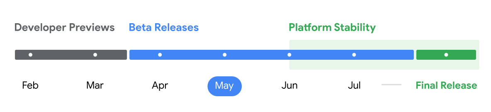

## 2、小米手机升级Android 15

为帮助开发者第一时间对小米手机进行Android 15版本的升级适配，小米 14 、Redmi K60 至尊版、Xiaomi Pad 6S Pro 12.4的「小米澎湃OS体验增强版Beta」内测版本已发布，如果您已有内测权限，请您点击设置-我的设备-系统版本进行OTA更新。
如果您没有内测权限，可以通过链接申请（必须是上述三款设备）：[申请内测 | 三方应用数据中心 (](https://thirdapps.pt.xiaomi.com/inner/apply)[xiaomi.com](https://thirdapps.pt.xiaomi.com/inner/apply)[)](https://thirdapps.pt.xiaomi.com/inner/apply)。
注：此版本是独立于小米澎湃OS主线版本之外的分支版本，将引入大量内核层的新技术方案可能存在不稳定性。
如您暂未拥有上述设备也没关系，我们为您提供了足量的云测设备，来支持广大开发者的适配工作。
云测平台Android 15 权限申请：https://m.beehive.miui.com/vHRYzbRMBF3PQseTGz5cDw
Android 15云测平台：https://testit.miui.com/remote?cUserId=fKR6m9svV1pR8sBADN_MLkJCt-Y

## 3、在 Google Pixel 设备上获取 Android 15

开发者持有Pixel系列的机器可以直接ota升级，或者下载镜像升级，具体见链接：
[在 Google Pixel 设备上获取 Android 15 Beta 版](https://developer.android.com/about/versions/15/get?hl=zh-cn#on_pixel)
[适用于 Google Pixel 的出厂映像](https://developer.android.google.cn/about/versions/15/download)
[适用于 Google Pixel 的 OTA 映像](https://developer.android.google.cn/about/versions/15/download-ota)

## 4、设置Android模拟器

请参考[设置 Android 模拟器](https://developer.android.com/about/versions/15/get?hl=zh-cn#phone-avd)。

## 5、设置 Android 15 SDK

请参考[设置 Android 15 SDK](https://developer.android.com/about/versions/15/setup-sdk?hl=zh-cn)。

# 二、影响Android 15上所有应用的行为变更

## 1、最低可安装TargetSDK级别为24

#### 1.1、特性背景

Android 15进一步提升了最低可安装TargetSDK级别。

#### 1.2、适用范围

Android15上的所有App。

#### 1.3、特性内容

Android 15在Android 14所做的更改的基础上进一步加强了安全性。在Android 15中，目标SDK版本低于24的应用程序无法安装。要求应用程序满足现代API级别有助于确保更好的安全性和隐私保护。
恶意软件通常针对较低的API级别，以绕过在较高Android版本中引入的安全性和隐私保护。例如，一些恶意软件应用程序使用目标SDK版本22，以避免受到Android 6.0 Marshmallow（API级别23）在2015年引入的运行时权限模型的限制。这个Android 15的变化使得恶意软件更难避开安全和隐私的改进。尝试安装一个针对较低API级别的应用程序会导致安装失败，并在Logcat中出现以下消息：

```java
INSTALL_FAILED_DEPRECATED_SDK_VERSION: App package must target at least SDK version 24, but found 7
```

在升级到Android 15的设备上，任何目标SDK版本低于24的应用程序仍然保留安装。
如果您需要测试针对旧API级别的应用程序，请使用以下ADB命令：

```undefined
adb install --bypass-low-target-sdk-block FILENAME.apk
```

1.4应用适配

请确保应用的targetSDK至少为24。

## 2、软件包停止状态变更

#### 2.1、特性背景

针对应用的PendingIntent，Android 15进一步增强了forcestop机制的作用。

#### 2.2、适用范围

Android15上的所有App。

#### 2.3、特性内容

当应用在 Android 15 上进入停止状态时，系统会取消这个应用的所有PendingIntent。当用户的操作将应用从停止状态中移除时，系统会向应用传递 ACTION_BOOT_COMPLETED 广播，使应用可以重新注册PendingIntent。具体情况还需参考各家厂商对ACTION_BOOT_COMPLETED 广播的管控。

如果应用进入停止状态，则所有这些待处理的 intent 都会被取消，系统会停用该应用的 widget。这些 widget 呈灰显状态，用户无法与其互动。系统会在用户下次启动应用时重新启用这些 widget，目前的测试结果显示用户点击一次widget也能启用。
**Demo演示**
我们分别在Android14和15上执行PendingIntent.getActivity方法，然后使用adb shell dumpsys activity intents命令来dump AMS中mIntentSenderRecords字段的内容并观察。测试代码：

```java
Intent intent = new Intent(mContext, MainActivity.class); PendingIntent pi = PendingIntent.getActivity(mContext, 5, intent, PendingIntent.FLAG_IMMUTABLE);
```

测试应用的包名为com.example.alarmlab。

**Android 14上现象：**
在运行测试代码之前，在终端运行adb shell dumpsys activity intents | grep -i "alarmlab"，终端没有给出任何输出，说明mIntentSenderRecords中没有com.example.alarmlab创建的PendingIntent。
运行测试代码，运行adb shell dumpsys activity intents | grep -i "alarmlab"，终端给出了我们创建的PendingIntent的dump信息，可见这个PendingIntent已被AMS记录。
forcestop掉我们的测试应用com.example.alarmlab，运行adb shell dumpsys activity intents | grep -i "alarmlab"，终端给出了我们创建的PendingIntent的dump信息，可见这个PendingIntent在AMS中没有被删除。

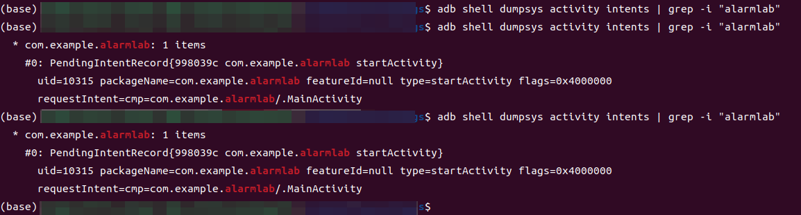

**Android 15上现象：**
在运行测试代码之前，在终端运行adb shell dumpsys activity intents | grep -i "alarmlab"，终端没有给出任何输出，说明mIntentSenderRecords中没有com.example.alarmlab创建的PendingIntent。
运行测试代码，运行adb shell dumpsys activity intents | grep -i "alarmlab"，终端给出了我们创建的PendingIntent的dump信息，可见这个PendingIntent已被AMS记录。
forcestop掉我们的测试应用com.example.alarmlab，运行adb shell dumpsys activity intents | grep -i "alarmlab"，终端没有给出任何输出，说明mIntentSenderRecords中com.example.alarmlab创建的PendingIntent被删除了。

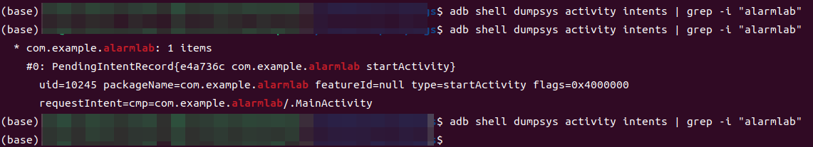

**2.4、应用适配**

建议应用结合自身对PendingIntent的使用场景，考虑应用被force-stop之后AMS中的PendingIntentRecord会被删除的情况，按需做出调整。可以结合ApplicationStartInfo API中的wasForceStopped()接口做出判断。

## 3、在达到资源限制时，直接和分流音频播放会使之前打开的直接或分流音轨失效

#### 3.1、特性背景

Android15之前，如果应用请求使用 direct playback 或者 offload playback 播放模式时，另一个应用正在播放音频并且资源达到限制，则请求的应用无法创建新的 AudioTrack 。

#### 3.2、适用范围

Android 15上的所有App。

#### 3.3、特性内容

Android15 中当应用请求使用 direct playback 或者 offload playback 播放模式时资源达到限制后，系统会让已经创建使用的 AudioTrack 对象也失效。

#### 3.4、应用适配

使用 offload playback 播放模式的音频类App需要适配这个特性。

## 4、支持16KB Page Size

#### 4.1、特性背景

一直以来，Android 仅支持 4 KB 的内存页面大小，针对 Android 设备通常拥有的平均总内存量，系统内存性能进行了优化。从 Android 15 开始，Android 支持配置为使用 16 KB 页面大小的设备（即 16 KB 设备）。

#### 4.2、适用范围

Google计划明年开始把兼容16KB页面作为上架Google Play的必要条件。今年携带Android 15的设备可能尚不会使用16KB页面，但国内厂商最终将跟随Google，因此建议应用适配。

#### 4.3、特性内容

随着设备制造商不断打造具有更大物理内存 (RAM) 的设备，这些设备中的许多可能会配置 16 KB（最终更大）的页面大小，以优化设备的性能。添加对 16 KB 设备的支持可让应用在这些设备上运行，并帮助应用从相关性能改进中受益。

性能提升：

- 在系统面临内存压力时缩短应用启动时间：平均降低了 3.16%
- 降低应用启动时的功耗：平均降低 4.56%
- 相机启动速度更快：平均热启动速度加快 4.48%，冷启动速度平均加快 6.60%
- 缩短了系统启动时间：平均缩短了 1.5%（约 0.8 秒）

兼容性影响：

- 含有so库的应用需要重新构建支持 16KB 设备的应用，否则在16KB设备上很可能会crash。

#### 4.4、应用适配

建议应用适配该特性。

检查应用是否受到影响：

- 含有so库的应用都会收到影响。
- 如果不确定应用是否含有so库，可以使用Apk Analyzer分析。

构建支持 16KB 设备的应用：

1. 升级到 AGP 版本 8.3 或更高版本，并使用未压缩的共享库，或在AGP 版本 8.2 或更低版本上使用压缩共享库。
2. 使用 16 KB ELF 对齐编译应用。
3. 检查引用特定页面大小的代码。

在 16 KB 的环境中测试您的应用：

使用基于 16 KB 的 Android 15 系统映像设置 Android 模拟器。

适配细节可参考官方文档 [https://developer.android.com/guide/practices/page-sizes?hl=zh-cn](https://dev.mi.com/xiaomihyperos/documentation/四、应用适配 检查应用是否受到影响： 含有so库的应用都会收到影响。 如果不确定应用是否含有so库，可以使用Apk Analyzer分析。 构建支持 16KB 设备的应用： 升级到 AGP 版本 8.3 或更高版本，并使用未压缩的共享库，或在AGP 版本 8.2 或更低版本上使用压缩共享库。 使用 16 KB ELF 对齐编译应用。 检查引用特定页面大小的代码。 在 16 KB 的环境中测试您的应用： 使用基于 16 KB 的 Android 15 系统映像设置 Android 模拟器。 适配细节可参考官方文档 https://developer.android.com/guide/practices/page-sizes?hl=zh-cn。  2.5 默认开启预测性返回动画 一、特性背景 已经迭代多个版本的预测性返回动画在Android 15上全面开放。 二、适用范围 Android 15上的所有App。 三、特性内容 从 Android 15 开始，移除了预测性返回动画的开发者选项。现在，对于已完全或在 activity 级别选择启用预测性返回手势的应用，系统现在会显示“返回主屏幕”“跨任务”和“跨 activity”等系统动画。 四、应用适配 现在，对于已完全或在 activity 级别选择启用预测性返回手势的应用，系统现在会显示“返回主屏幕”“跨任务”和“跨 activity”等系统动画。如果应用受到影响，请执行以下操作： 确保应用已正确迁移，以使用预测性返回手势。 确保 fragment 转换支持预测性返回导航。 停止使用动画和框架转换，并改用 Animator 和 AndroidX 转换。 从 FragmentManager 不知道的返回堆栈中迁出。请改用由      FragmentManager 或 Navigation 组件管理的返回堆栈。 如果想要从零开始适配预测性返回动画，请参考官方文档https://developer.android.google.cn/guide/navigation/custom-back/predictive-back-gesture?hl=zh-cn。)。

## 5、默认开启预测性返回动画

#### 5.1、特性背景

已经迭代多个版本的预测性返回动画在Android 15上全面开放。

#### 5.2、适用范围

Android 15上的所有App。

#### 5.3、特性内容

从 Android 15 开始，移除了预测性返回动画的开发者选项。现在，对于已完全或在 activity 级别选择启用预测性返回手势的应用，系统现在会显示“返回主屏幕”“跨任务”和“跨 activity”等系统动画。

#### 5.4、应用适配

现在，对于已完全或在 activity 级别选择启用预测性返回手势的应用，系统现在会显示“返回主屏幕”“跨任务”和“跨 activity”等系统动画。如果应用受到影响，请执行以下操作：

1. 确保应用已正确迁移，以使用预测性返回手势。
2. 确保 fragment 转换支持预测性返回导航。
3. 停止使用动画和框架转换，并改用 Animator 和 AndroidX 转换。
4. 从 FragmentManager 不知道的返回堆栈中迁出。请改用由 FragmentManager 或 Navigation 组件管理的返回堆栈。

如果想要从零开始适配预测性返回动画，请参考官方文档https://developer.android.google.cn/guide/navigation/custom-back/predictive-back-gesture?hl=zh-cn。

# 三、影响以Android 15为目标平台应用的行为变更

## 1、新的媒体处理前台服务类型

#### 1.1、特性背景

Android 15继续完善前台服务的类型机制。

#### 1.2、适用范围

targetSDK≥Android 15

#### 1.3、特性内容

Android 15引入了一种新的前台服务类型，即mediaProcessing。这种服务类型适用于像转码媒体文件这样的操作。例如，媒体应用程序可能会下载音频文件并需要在播放之前将其转换为不同的格式。您可以使用mediaProcessing前台服务来确保即使应用程序在后台运行，转换也可以继续进行。
该系统允许一个应用的媒体处理服务在24小时内运行总共6个小时，之后系统会调用正在运行的服务的Service.onTimeout(int, int)方法（在Android 15中引入）。此时，服务有几秒钟的时间来调用Service.stopSelf()。如果服务没有调用Service.stopSelf()，则会出现以下错误消息的故障："A foreground service of <fgs_type> did not stop within its timeout: <component_name>"。在Beta 2中，故障消息显示为ANR，但在未来的Beta版本中，此故障消息将抛出自定义异常。
注意：一个应用所有的mediaProcessing前台服务共享6小时的时间限制。例如，如果一个应用运行了一个mediaProcessing服务4个小时，然后启动了另一个mediaProcessing服务，那么第二个服务只能运行2个小时。但是，如果用户将应用程序置于前台，则计时器将重置，应用程序将有6个小时的可用时间。
为了避免出现ANR，您可以执行以下操作之一：

1. 让您的服务实现新的Service.onTimeout(int, int)方法。当您的应用接收到回调时，请确保在几秒钟内调用stopSelf()。（如果您不立即停止应用程序，则可能会出现问题。）
2. 确保您的应用的mediaProcessing服务在任何24小时内不超过总共6个小时（除非用户与应用交互，重置计时器）。
3. 仅在直接用户交互的结果下启动媒体处理前台服务；由于您的应用程序在服务启动时处于前台，因此在应用程序进入后台后，您的服务有完整的6个小时。
4. 使用替代API（如WorkManager）而不是使用mediaProcessing前台服务。

如果您的应用的mediaProcessing前台服务在过去的24小时内运行了6个小时，则除非用户将您的应用带到前台（重置计时器），否则您不能启动另一个mediaProcessing前台服务。如果您尝试启动另一个mediaProcessing前台服务，则系统会抛出ForegroundServiceStartNotAllowedException异常，并显示类似于“mediaProcessing”前台服务类型的时间限制已经耗尽的错误消息。
更多mediaProcessing前台服务类型的信息，请参考[Android 15前台服务类型变更：Media processing](https://developer.android.com/about/versions/15/changes/foreground-service-types#media-processing).

#### 1.4、应用适配

应用可以选择使用Media processing类型的前台服务来处理转码媒体文件这样的操作。
要使用这种前台服务类型，需要在manifest中申明相关权限和foregroundServiceType属性：

```xml
<manifest xmlns:android="http://schemas.android.com/apk/res/android"
    xmlns:tools="http://schemas.android.com/tools">
    <uses-permission android:name="android.permission.FOREGROUND_SERVICE" />
    <uses-permission android:name="android.permission.POST_NOTIFICATIONS" />
    <uses-permission android:name="android.permission.FOREGROUND_SERVICE_MEDIA_PROCESSING" />
.....
        <service
            android:name=".MyService"
            android:enabled="true"
            android:exported="true"
            android:foregroundServiceType="mediaProcessing"
            >
    </service>
......
```

## 2、对启动前台服务的 BOOT_COMPLETED 广播接收器的限制

#### 2.1、特性背景

Android15之前， BOOT_COMPLETED 广播接收方允许启动除 microphone 类型的前台服务。

#### 2.2、适用范围

targetSDK≥Android 15

#### 2.3、特性内容

Android15 对`BOOT_COMPLETED`类型的广播接收方启动前台服务有了新的限制。如果 BOOT_COMPLETED 广播接收方尝试启动除 LOCATION、CONNECTED_DEVICE、REMOTE_MESSAGING、HEALTH、SYSTEM_EXEMPTED 和 SPECIAL_USE 类型以外的前台服务，系统则会抛出ForegroundServiceStartNotAllowedException 异常。此外，持有SYSTEM_ALERT_WINDOW权限的应用现在需要有一个可见的悬浮窗才能从后台启动前台服务。否则，系统也会抛出ForegroundServiceStartNotAllowedException异常。

#### 2.4、应用适配

开发者应该注意不要监听BOOT_COMPLETED来启动除 LOCATION、CONNECTED_DEVICE、REMOTE_MESSAGING、HEALTH、SYSTEM_EXEMPTED 和 SPECIAL_USE 类型以外的前台服务。持有SYSTEM_ALERT_WINDOW权限的应用需要首先启动一个TYPE_APPLICATION_OVERLAY类型的悬浮窗并保证悬浮窗可见，才能启动前台服务。开发者可以调用View.getWindowVisibility()来查看悬浮窗的可见性，也可以监听View.onWindowVisibilityChanged()回调。

## 3、对请求音频焦点的限制

#### 3.1、特性背景

Android15之前， 应用可以无任何限制的申请音频焦点。Android 15针对此做出了规范。

#### 3.2、适用范围

targetSDK ≥ Android 15

#### 3.3、特性内容

#### **概述** 面向 Android 15 的应用必须是前台应用或运行与音频相关的前台服务（ `mediaPlayback`, `camera`, `microphone`, 或 `phoneCall`） 才能请求音频焦点。 如果应用程序在不满足这些要求之一时尝试请求焦点，则调用将返回 AUDIOFOCUS_REQUEST_FAILED。 **示例代码** 此Demo会在用户按压Home键时，使用WorkManager执行一个后台延时10s的任务，以验证应用不在前台，且无音频相关的前台服务时，是否可以申请音频焦点。 AudioFocusActivity.kt

```java
package com.example.myapplication

import android.content.Context
import android.content.Intent
import android.media.AudioManager
import android.os.Bundle
import android.util.Log
import androidx.activity.ComponentActivity
import androidx.activity.compose.setContent
import androidx.compose.foundation.layout.Arrangement
import androidx.compose.foundation.layout.Column
import androidx.compose.foundation.layout.fillMaxSize
import androidx.compose.foundation.layout.padding
import androidx.compose.material3.Button
import androidx.compose.material3.MaterialTheme
import androidx.compose.material3.Surface
import androidx.compose.material3.Text
import androidx.compose.runtime.Composable
import androidx.compose.ui.Alignment
import androidx.compose.ui.Modifier
import androidx.compose.ui.platform.LocalContext
import androidx.compose.ui.tooling.preview.Preview
import androidx.compose.ui.unit.dp
import androidx.work.Constraints
import androidx.work.OneTimeWorkRequest
import androidx.work.WorkManager
import com.example.myapplication.ui.theme.MyApplicationTheme
import java.util.concurrent.TimeUnit


class AudioFocusActivity : ComponentActivity() {


    override fun onCreate(savedInstanceState: Bundle?) {
        super.onCreate(savedInstanceState)
        setContent {
            MyApplicationTheme {
                // A surface container using the 'background' color from the theme
                Surface(
                    modifier = Modifier.fillMaxSize(),
                    color = MaterialTheme.colorScheme.background
                ) {
                    AudioFocus("AudioFocus")
                }
            }
        }
    }


    override fun onPause() {
        super.onPause()
        Log.i(TAG, "onPause")
        // 创建一个约束条件，例如要求设备处于空闲状态
        val constraints: Constraints = Constraints.Builder()
            .setRequiresCharging(true)
            .build()
        // 创建一个WorkRequest，指定要执行的Worker类和约束条件
        val workRequest = OneTimeWorkRequest.Builder(BackgroundWorker::class.java)
            .setConstraints(constraints)
            .setInitialDelay(10000, TimeUnit.MILLISECONDS)
            .build()
        // 使用WorkManager调度任务
        WorkManager.getInstance(applicationContext).enqueue(workRequest)
    }

    override fun onNewIntent(intent: Intent) {
        super.onNewIntent(intent)
        Log.i(TAG, "onNewIntent: $intent")
    }

    companion object {
        const val TAG = "AudioFocusActivity"
    }
}

@Preview(showBackground = true)
@Composable
fun AudioFocusPreview() {
    MyApplicationTheme {
        AudioFocus("AudioFocus")
    }
}

@Composable
fun AudioFocus(name: String, modifier: Modifier = Modifier) {
    val context = LocalContext.current
    val packageName = LocalContext.current.packageName

    Column(
        modifier = Modifier
            .fillMaxSize()
            .padding(vertical = 16.dp), // 添加垂直内边距
        verticalArrangement = Arrangement.Center, // 垂直居中对齐
        horizontalAlignment = Alignment.CenterHorizontally // 水平居中对齐
    ) {
        Text(
            text = "Hello $name!",
            modifier = modifier.padding(bottom = 8.dp)
        )
        Button(onClick = {
            val audioManager = context.getSystemService(Context.AUDIO_SERVICE) as AudioManager
            val result = audioManager.requestAudioFocus(
                null,
                AudioManager.STREAM_MUSIC,
                AudioManager.AUDIOFOCUS_GAIN
            )
            Log.w(AudioFocusActivity.TAG, "requestAudioFocus failure，result:$result")
        }) {
            Text("Request AudioFocus")
        }
    }
}
```

BackgroundWorker.kt

```java
package com.example.myapplication

import android.content.Context
import android.media.AudioManager
import android.util.Log
import androidx.work.Worker
import androidx.work.WorkerParameters

class BackgroundWorker(context: Context, workerParams: WorkerParameters) :
    Worker(context, workerParams) {
    override fun doWork(): Result {
        // 在这里执行后台任务
        Log.w("BackgroundWorker", "Doing work...")

        val audioManager =
            applicationContext.getSystemService(Context.AUDIO_SERVICE) as AudioManager
        val result = audioManager.requestAudioFocus(
            null,
            AudioManager.STREAM_MUSIC,
            AudioManager.AUDIOFOCUS_GAIN
        )

        if (result == AudioManager.AUDIOFOCUS_REQUEST_GRANTED) {
            Log.w(
                "BackgroundWorker",
                "requestAudioFocus success, AudioManager.AUDIOFOCUS_REQUEST_GRANTED "
            )
        } else {
            Log.w("BackgroundWorker", "requestAudioFocus failure，result:$result")
        }
        return Result.success()
    }
}
```

AndroidManifest.xml

```xml
<?xml version="1.0" encoding="utf-8"?>
<manifest xmlns:android="http://schemas.android.com/apk/res/android"
    xmlns:tools="http://schemas.android.com/tools">

    <application
        android:allowBackup="true"
        android:dataExtractionRules="@xml/data_extraction_rules"
        android:fullBackupContent="@xml/backup_rules"
        android:icon="@mipmap/ic_launcher"
        android:label="@string/app_name"
        android:roundIcon="@mipmap/ic_launcher_round"
        android:supportsRtl="true"
        android:theme="@style/Theme.MyApplication"
        tools:targetApi="31">
       
        <activity
            android:name=".AudioFocusActivity"
            android:exported="false" />
            
        <service
            android:name=".BackgroundWorker"
            android:exported="false"
            android:permission="android.permission.BIND_JOB_SERVICE" />

    </application>

</manifest>
```

相关日志
很清晰的可以发现由Demo运行结果可知，当应用不在前台，且无音频相关的前台服务时，音频焦点申请会失败，系统输出类似“I Focus request DENIED for uid:10301 clientId:android.media.AudioManager@c71a082 req:1 procState:8”的日志，即告知开发者音频焦点申请被拒绝。

```java
2024-04-30 18:44:19.641 30567-30567 AudioFocusActivity      com.example.myapplication            I  onPause
2024-04-30 18:44:20.537 30567-30567 VRI[AudioFocusActivity] com.example.myapplication            D  visibilityChanged oldVisibility=true newVisibility=false
2024-04-30 18:44:29.680 30567-30657 BackgroundWorker        com.example.myapplication            W  Doing work...
2024-04-30 18:44:29.691  2201-5135  AS.HardeningEnforcer    system_process                       I  Focus request DENIED for uid:10301 clientId:android.media.AudioManager@c71a082 req:1 procState:8
2024-04-30 18:44:29.693 30567-30657 BackgroundWorker        com.example.myapplication            W  requestAudioFocus failure，result:0
```

#### 3.4、应用适配

如果需要播放音频或者录制音频，那么必须考虑当前是否为前台应用（**在前台**或者**有和音频相关的前台服务**）

## 4、elegantTextHeight属性默认为 true

**4.1、特性背景**

ElegantTextHeight：优雅的文本高度。某些语言的字体较高，如果该值为false会选用紧凑字体，设置为true就会比较宽松的字体。这个特性对中文没有影响。

#### **4.2、**适用范围

targetSDK≥Android 15
**4.3、特性内容**

对于targetSDK大于Android 15的应用来说，TextView中的elegantTextHeight属性默认值将是true。用更易读的字体替换了默认使用的紧凑字体，该紧凑字体是为了防止布局出现问题而引入的；Android13（API级别33）通过允许文本布局拉伸垂直高度，使用fallbackLinewSpacing属性来防止许多这些问题。
在Android15中，紧凑字体仍然存在于系统中，因此应用可以将elegantTextHeight设置为false，以获得与以前相同的行为，但是在未来版本可能不再支持。因此，应用支持以下脚本：阿拉伯语、老挝语，缅甸语、泰米尔语、古吉拉特语、卡纳达语、马拉雅拉姆语、奥迪亚语、泰卢固语或泰语，请将elegantTextHeight设置为true进行测试。


elegantTextHeight behavior for apps targeting Android 14 (API level 34) and lower.


elegantTextHeight behavior for apps targeting Android 15.

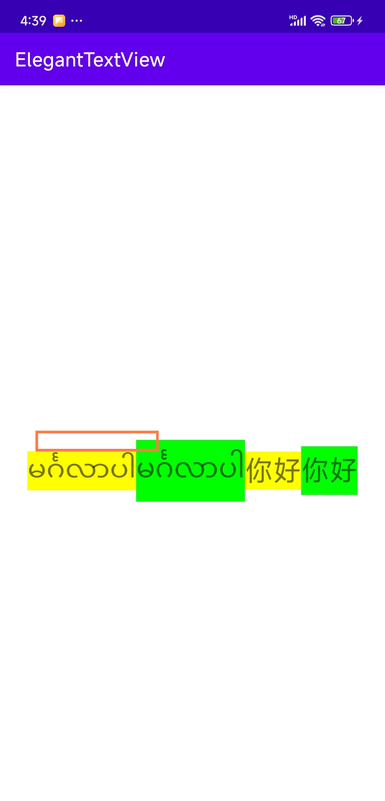

注：从左到右的语言分别为缅甸语、缅甸语、汉语和汉语

黄色背景：elegantTextHeight的值为false
绿色背景：elegantTextHeight的值为true

#### **4.4、**应用适配

该特性对某些字体有影响，对汉语无影响。如果想保持之前的状态，可将该值设置为false。但是在未来有可能谷歌会要求必须为true。所以三方应用需要提前做好适配准备。


## 5、Edge-to-edge（边到边）强制执行

**5.1、特性背景**

在Android 15设备上，targetSDK>=Android15的应用将强制进行全屏展示，并且状态和导航栏将保持透明化。
targetSDK<Android 15的应用程序默认不会允许边到边的特性，即仍然保持用户层的View在状态栏和导航栏之间。
当在Android15平台上之前使用的设置系统栏颜色的API将被弃用，包括`setNavigationBarColor`，`setNavigationBarColor`，即便使用这些方法设置了，系统也将默认保持沉浸式的体验。
**5.2、适用范围**

targetSDK≥Android 15
**5.3、特性内容**

在Android15之前系统会在DecorView 中添加两个背景View用来控制systembar的背景色，同时也把ContentView的大小范围控制在这两个view的之间，如下图：


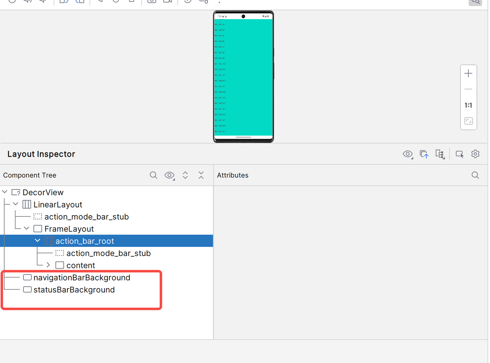


在Android15上系统默认去掉上述两个背景View，所以ContentView的范围和DecorView 一样，全屏展示：


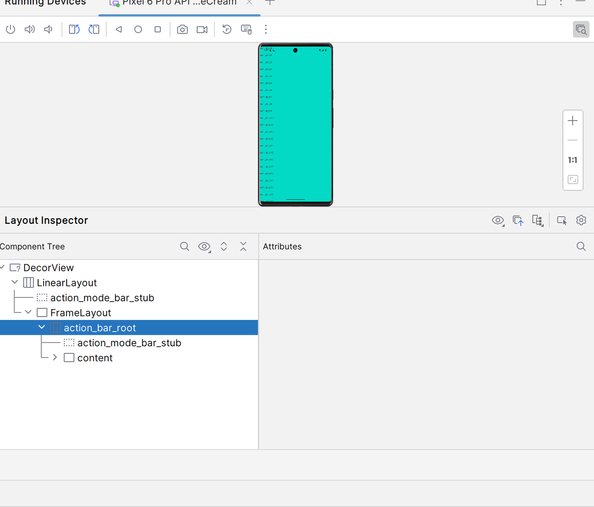

这一系列的变化对应用产生的影响
如下图应用没有适配边到边的情况下，会发生应用层的内容布局控件会展示到statusbar的后面，这种情况开发者需要对非compose应用和compose应用进行区分处理：

非compose应用需要在应用布局中添加android:fitsSystemWindows="true"，或者将用户View setFitsSystemWindows(true)，否则就会出现如下图所示的，内容布局控件会展示到了statusbar的后面的异常现象：

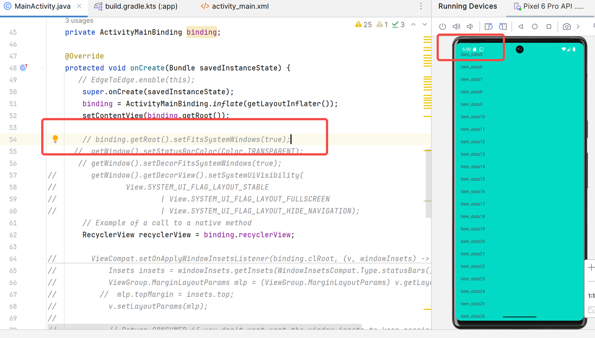

compose 中material3一些组件默认是处理掉这个insets，因此不会有问题，能正常显示：

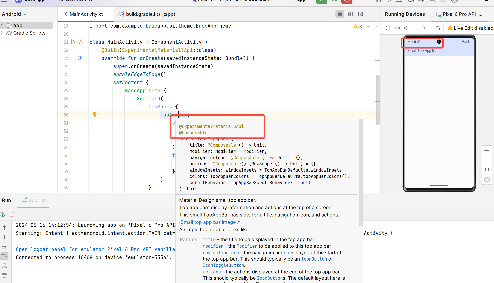

下图展示了material2系列组件没有添加padding导致的显示异常：

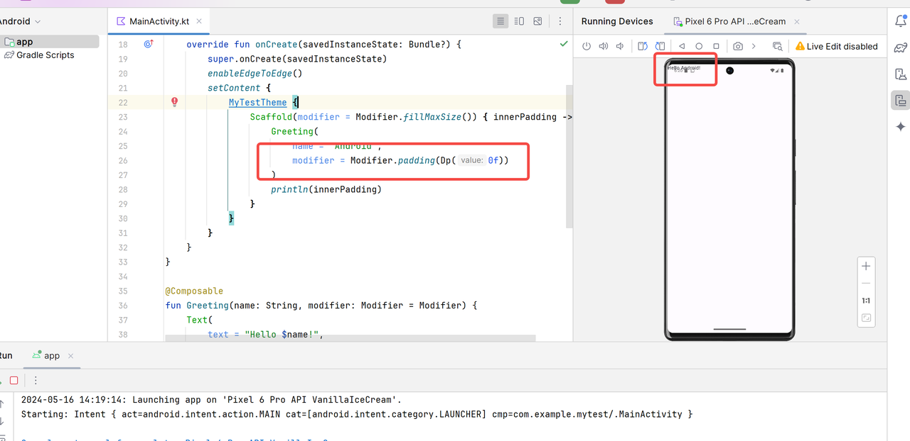

material2添加padding后，显示效果恢复正常：

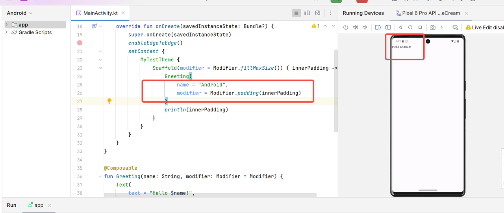

**5.4、应用适配**

如果应用targetSdk>=Android 15，那么针对布局需要设置android:fitsSystemWindows="true" ：


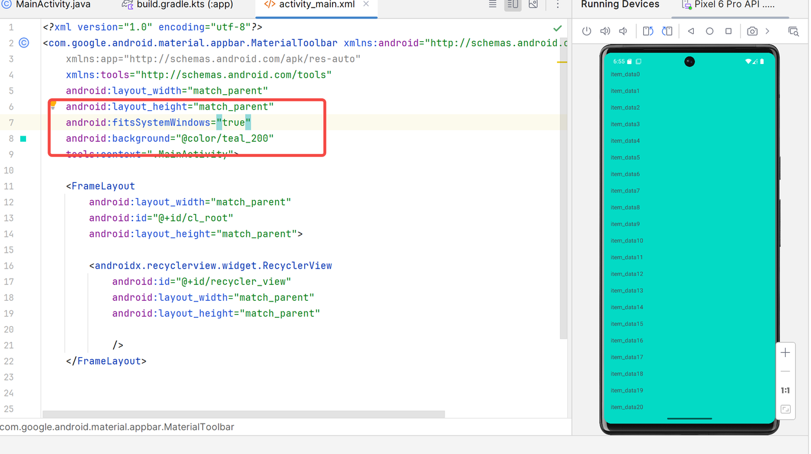

针对compose：

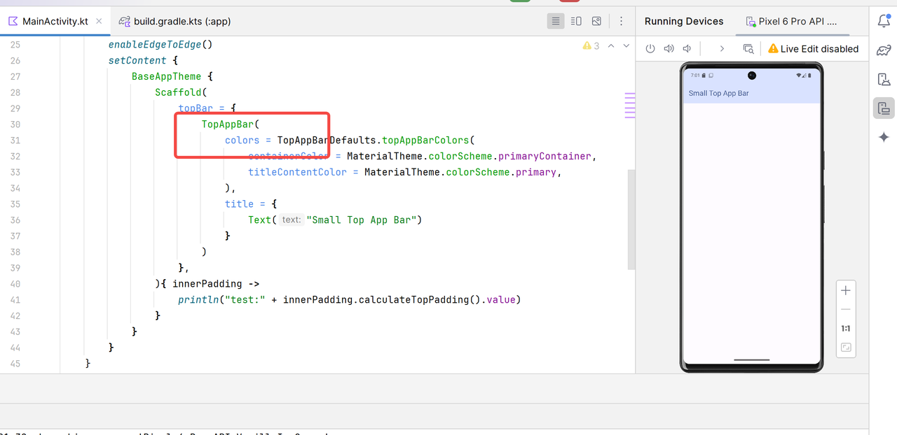

使用material3 的组件作为头布局和底布局如TopAppBar，BottomAppBar或者NavigationBar，
如需要使用material2的组件作为头布局和底布局，需要自己处理padding 或者`contentWindowInsets` 来处理。
并且在Android15版本应用使用`setStatusBarColor` 将不在生效，而`setNavigationBarColor` 只针对三键导航栏有效果。

## 6、稳定的configuration

#### 6.1、特性背景

#### **Configuration类专门用于描述手机设备上的配置信息：**

```java
public int densityDpi;  //得到设备的密度
public float fontScale; //获取当前用户设置的字体的缩放因子
public int KeyboardHidden;//该属性会返回一个boolean值用于表示当前的键盘是否可用,该属性不仅会判断系统的硬件键盘,也会判断系统位于屏幕上的软键盘,如果该系统的硬件键盘不可用但软键盘可用该属性会返回KEYBOARDHIDDEN_NO,只有当两个键盘都不可用的时候才返回KEYBOARDHIDDEN_YES
public int keyboard;//获取当前设备所关联的键盘的类型
public Locale locale;//获取用于当前的Locale
public int mcc;//得到移动信号的国家码
public int mnc;//得到移动信号的网络码
public int navigation;//判断系统上方向导航设备的类型。该属性的返回值：NAVIGATION_NONAV（无导航）、NAVIGATION_DPAD(DPAD导航）、NAVIGATION_TRACKBALL（轨迹球导航）、NAVIGATION_WHEEL（滚轮导航）
public int orientation;//得到系统屏幕的方向,该属性将会返回ORIENTATION_LANDSCAPE(横向屏幕),ORIENTATION_PORTRAIT(竖向屏幕),ORIENTATION_SQUARE(方形屏幕)三个属性值之一
public int touchscreen;//获取系统触摸屏的触摸方式。该属性的返回值：TOUCHSCREEN_NOTOUCH（无触摸屏）、TOUCHSCREEN_STYLUS（触摸笔式触摸屏）、TOUCHSCREEN_FINGER（接收手指的触摸屏）等属性值
```

如果应用程序的targetSDK版本是Android15或更高版本，则Configuration不再排除系统栏。如果在布局计算中使用Configuration类中的屏幕大小，开发者应该使用更好的替代方案，如适当的ViewGroup、WindowInsets或WindowMetricsCalculator，具体取决于您的需求。
Configuration自API1来就可用，通常从Activity.onConfigurationChanged中获取它。它提供了密度、方向和大小等信息。Configuration返回的窗口大小的一个重要特征是它排除了系统栏。
Configuration大小通常用于资源选择，例如res/layout-h500dp仍然有效。但是不鼓励使用它来进行布局的计算。如果进行布局计算，应该寻找更合适的方案来代替它。
如果用Configuration来计算布局，请使用适当的ViewGroup，如CoordinatorLayout或ConstraintLayout。如果你用它来确定系统导航栏的高度，使用WindowInsets。如果想确定当前应用窗口的大小，请使用computeCurrentWindowMetrics。
**6.2、适用范围**

targetSDK≥Android 15

#### **6.3、**特性内容

#### Android15上screenWidthDp和screenHeightDp将包含系统条等内容的尺寸。但是当应用使用Window#setDecorFitSystemWindowWindows(boolean)进行边到边显示的时候，系统条尺寸不被包含。 **6.4、**应用适配

应用需要适配使用到Configuration中的screenHeightDp和screenWeightDp的地方以及所间接影响到的相关值：
Configuration.smallestScreenWidthDp
Configuration.orientation
Display.getSize(Point) (该接口已在API level30废弃）
Display.getMetrics()（和API30及其以后的接口等级一致）

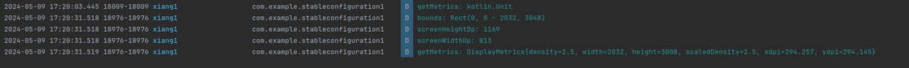

## 7、Android 15 中有关限制非 SDK 接口的更新

Android 15 包含更新后的受限非 SDK 接口列表（基于与 Android 开发者之间的协作以及最新的内部测试）。在限制使用非 SDK 接口之前，我们会尽可能确保有可用的公开替代方案。
如果您的应用并非以 Android 15 为目标平台，其中一些变更可能不会立即对您产生影响。不过，虽然您的应用可以访问某些非 SDK 接口（具体取决于应用的目标 API 级别），但使用任何非 SDK 方法或字段始终存在导致应用出问题的显著风险。
如果您不确定自己的应用是否使用了非 SDK 接口，则可以测试该应用进行确认。如果您的应用依赖于非 SDK 接口，则应开始计划迁移到 SDK 替代方案。不过，我们知道某些应用具有使用非 SDK 接口的有效用例。如果您无法为应用中的功能找到无需使用非 SDK 接口的替代方案，则应请求新的公共 API。
如需查看 Android 15 的所有非 SDK 接口的完整列表，请下载以下文件：

文件：[hiddenapi-flags.csv](https://dl.google.com/developers/android/vic/non-sdk/hiddenapi-flags.csv?hl=zh-cn)
SHA-256 校验和：7aa0987aea4b25f5371b7e377c9f37375ada3b7e30465c0e2d910a5b646c10c1

## 8、OpenJDK 17变更

Android 15继续更新Android核心库，以与最新的OpenJDK LTS版本的功能保持一致。其中一个更改可能会影响针对Android 15的应用程序兼容性：

- 字符串格式化API的更改：在使用以下String.format()和Formatter.format() API时，参数索引、标志、宽度和精度的验证现在更加严格：
  - String.format(String, Object[])
  - String.format(Locale, String, Object[])
  - Formatter.format(String, Object[])
  - Formatter.format(Locale, String, Object[])

例如，当在格式字符串中使用参数索引为0（%0）时，将抛出以下异常：

```java
IllegalFormatArgumentIndexException: Illegal format argument index = 0
```

在这种情况下，可以通过使用参数索引为1（%1）来解决问题。

- 语言代码处理的更改：在使用Locale API时，希伯来语、意第绪语和印度尼西亚语的语言代码不再转换为其过时的形式（希伯来语：iw，意第绪语：ji，印度尼西亚语：in）。当指定其中一种语言环境的语言代码时，请改用ISO 639-1中的代码（希伯来语：he，意第绪语：yi，印度尼西亚语：id）。
- 随机整数序列的更改：在https://bugs.openjdk.org/browse/JDK-8301574中所做的更改后，以下Random.ints()方法现在返回与Random.nextInt()方法不同的数字序列：
  - Random.ints(long)
  - Random.ints(long, int, int)
  - Random.ints(int, int)
  - Random.ints()

通常情况下，这种更改不应导致应用程序崩溃，但您的代码不应期望从Random.ints()方法生成的序列与Random.nextInt()匹配。

## 9、安全的后台Activity启动

#### 9.1、特性背景

Android15继续加强对后台启动activity的管控，以提高安全性。

#### 9.2、适用范围

targetSDK≥Android 15

#### 9.3、特性内容

- 栈顶应用如果在AndroidManifest.xml 文件中设置allowCrossUidActivitySwitchFromBelow为false，可以阻止自己UID 不匹配的应用启动activity。
- PendingIntent的创建者可以通过ActivityOptions#setPendingIntentCreatorBackgroundActivityStartMode(int state)方法来赋予PendingIntent后台启动activity的权力。
- PendingIntent的发送者也可以通过ActivityOptions#setPendingIntentBackgroundActivityStartMode(int state)方法来赋予PendingIntent后台启动activity的权力。
- 防止其他应用的 activity 随意启动到您自己的task中。
- 防止不可见的窗口被用于后台启动。

#### 9.4、应用适配

应用需要认真考察并测试需要后台启动的情况，防止后台启动被系统限制从而造成功能异常。

# 四、新功能和API

## 1、ApplicationStartInfo API

#### 1.1、特性背景

Android 15提供了ApplicationStartInfo API供开发者获取应用启动的相关信息。

#### 1.2、适用范围

Android15上的新功能。

#### 1.3、特性内容

ApplicationStartInfo API可以为开发者提供非常丰富的应用启动相关信息。想要调用API并获取信息，可以参考以下代码：

```java
mAM = getSystemService(ActivityManager.class);
List < ApplicationStartInfo > startInfoList = mAM.getHistoricalProcessStartReasons(3);

for (int i = 0; i < startInfoList.size(); i++) {
  Log.d("StartInfo", "getDefiningUid: " + startInfoList.get(i).getDefiningUid());
  Log.d("StartInfo", "getIntent: " + startInfoList.get(i).getIntent());
  Log.d("StartInfo", "getLaunchMode: " + startInfoList.get(i).getLaunchMode());
  Log.d("StartInfo", "getPackageUid: " + startInfoList.get(i).getPackageUid());
  Log.d("StartInfo", "getPid: " + startInfoList.get(i).getPid());
  Log.d("StartInfo", "getProcessName: " + startInfoList.get(i).getProcessName());
  Log.d("StartInfo", "getRealUid: " + startInfoList.get(i).getRealUid());
  Log.d("StartInfo", "getReason: " + startInfoList.get(i).getReason());
  Log.d("StartInfo", "getStartType: " + startInfoList.get(i).getStartType());
  Log.d("StartInfo", "getStartupState: " + startInfoList.get(i).getStartupState());
  Log.d("StartInfo", "getStartupTimestamps: " + startInfoList.get(i).getStartupTimestamps());
  Log.d("StartInfo", "wasForceStopped: " + startInfoList.get(i).wasForceStopped());
}
```

上面的代码中，我们首先调用了ActivityManager的getHistoricalProcessStartReasons方法获取了ApplicationStartInfo对象，然后依次打印了ApplicationStartInfo提供的信息。
来看日志输出：

```java
05-13 17:41:41.684  6804  6804 D StartInfo: getDefiningUid: 10327
05-13 17:41:41.684  6804  6804 D StartInfo: getIntent: Intent { act=android.intent.action.MAIN cat=[android.intent.category.LAUNCHER] flg=0x10000000 cmp=com.zhao.adpflab/.MainActivity }
05-13 17:41:41.684  6804  6804 D StartInfo: getLaunchMode: 0
05-13 17:41:41.684  6804  6804 D StartInfo: getPackageUid: 10327
05-13 17:41:41.684  6804  6804 D StartInfo: getPid: 0
05-13 17:41:41.684  6804  6804 D StartInfo: getProcessName: com.zhao.adpflab
05-13 17:41:41.684  6804  6804 D StartInfo: getRealUid: 10327
05-13 17:41:41.684  6804  6804 D StartInfo: getReason: 6
05-13 17:41:41.684  6804  6804 D StartInfo: getStartType: 1
05-13 17:41:41.684  6804  6804 D StartInfo: getStartupState: 0
05-13 17:41:41.684  6804  6804 D StartInfo: getStartupTimestamps: {0=23165720444546, 3=23165818441004}
05-13 17:41:41.684  6804  6804 D StartInfo: wasForceStopped: true
```

我们来逐行解读ApplicationStartInfo给我们提供的信息。

- getDefiningUid(): 大多数情况下与通常认为的UID相同，使用了android:useAppZygote属性和Context.BIND_EXTERNAL_SERVICE标志位的service可能会导致这个字段有所不同。
- getIntent(): 就是引发这个应用启动的intent。
- getLaunchMode(): 启动模式，本例中为0，意为LAUNCH_MODE_STANDARD。
- getPackageUid(): 即App安装时分配到的UID。
- getPid()、getProcessName(): 即进程Pid、进程名。
- getRealUid(): 大多数情况下与PackageUid相同，在涉及应用分身、多用户等情况下可能会不同。
- getReason(): 应用启动的原因。可能返回的值有：

0，START_REASON_ALARM，应用被闹钟启动；
1， START_REASON_BACKUP，因为执行backup而启动；
2，START_REASON_BOOT_COMPLETE，应用因为开机完成启动；
等等。本例中的值6意为从launcher启动。

- getStartType(): App自动的类型，比如：

1，START_TYPE_COLD，冷启动；
3，START_TYPE_HOT，热启动

- getStartupState(): 启动状态。如：

0，STARTUP_STATE_STARTED，启动成功；
1，STARTUP_STATE_ERROR，启动失败；
等等。

- getStartupTimestamps(): 得到不同启动阶段的时间戳，比如：

START_TIMESTAMP_LAUNCH，START_TIMESTAMP_BIND_APPLICATION等等。

- wasForceStopped(): 应用是否是被forcestop结束的。开发者可以利用这个API决定应用启动后是否重新注册闹钟、JobScheduler等被forcestop清除掉的机制。

开发者也可以使用addApplicationStartInfoCompletionListener与removeApplicationStartInfoCompletionListener方法来添加和删除监听器，监听器会在应用启动信息生成完毕后回调：

```java
Consumer < ApplicationStartInfo > applicationStartConsumer = applicationStartInfo - >Log.d("StartInfo", "getStartType: " + applicationStartInfo.getStartType());

mAM.addApplicationStartInfoCompletionListener(this.getMainExecutor(), applicationStartConsumer);
```

应用启动时打出日志：

```undefined
05-14 06:16:29.919 17260 17260 D StartInfo: getStartType: 1
```

#### 1.4、应用适配

开发者可以积极使用ApplicationStartInfo API来获取应用启动信息，按需调整相关策略。

## 2、局部屏幕共享

#### 2.1、特性背景

Android 15 支持部分屏幕共享，用户可以仅共享或记录某个应用窗口，而不是整个设备屏幕，Android 14 QPR2 中其实已经启用了这个支持，这个功能包括有 MediaProjection 回调 ：

- `MediaProjection.Callback#onCapturedContentResize()` 允许根据拍摄的显示区域的大小调整共享投影的大小。
- `MediaProjection.Callback#onCapturedContentVisibilityChanged()` 将拍摄内容是否可见告知共享投影托管应用，托管应用可以根据捕获的区域对用户是否可见，在输出 surface 上显示或隐藏捕获的内容，例如在多窗口模式下，如果另一个应用完全覆盖了共享应用，主机可以在输出 surface 上隐藏共享应用。

需要注意的是API 34 开始，每个 MediaProjection 捕获会话都需要户同意，每个`MediaProjection`实例只能使用一次，该特性原生新增了逻辑，MediaProjection如果每次重建的话，则需要用户重新授权，此时系统会帮应用弹出屏幕录制的权限请求弹窗。

#### 2.2、适用范围

Android15上的新功能。

#### 2.3、特性内容

新增API：应用可以通过`onCapturedContentResize(int width, int height)` 宽高来自定义共享屏幕的大小，在捕获开始后或捕获区域的大小发生变化时立即调用，为流式捕获提供准确的大小。

```java
@Override
  public String onCapturedContentResize(int width, int height) {
      // VirtualDisplay instance from MediaProjection#createVirtualDisplay
      virtualDisplay.resize(width, height, dpi);
 
      // Create a new Surface with the updated size (depending on the application's use
      // case, this may be through different APIs - see Surface documentation for
      // options).
      int texName; // the OpenGL texture object name
      SurfaceTexture surfaceTexture = new SurfaceTexture(texName);
      surfaceTexture.setDefaultBufferSize(width, height);
      Surface surface = new Surface(surfaceTexture);
 
      // Ensure the VirtualDisplay has the updated Surface to send the capture to.
      virtualDisplay.setSurface(surface);
  }
```

新增API`onCapturedContentVisibilityChanged(isVisible: **Boolean**)`

它在捕获开始后或捕获区域的可见性发生变化时调用。方法参数指示捕获区域的当前可见性。
回调在以下情况下触发：

- 捕获的区域变得不可见(isVisible==False)。当投影的应用程序不再位于最顶层时（例如当另一个应用程序完全覆盖它时，或者用户导航离开捕获的应用程序时），可能会发生这种情况。
- 捕获的区域再次变得可见(isVisible==True)。如果用户移动覆盖的应用程序以显示捕获的应用程序的至少某些部分（例如，用户在多窗口模式下有多个可见的应用程序），则可能会发生这种情况。

应用程序可以利用此回调，根据捕获的区域当前是否对用户可见，从输出Surface中显示或隐藏捕获的内容。您应该相应地暂停或恢复共享，以节省资源


**示例代码:**

```java
mediaProjectionManager = (MediaProjectionManager) getSystemService(MEDIA_PROJECTION_SERVICE);
mediaProjection = mediaProjectionManager.getMediaProjection(resultCode, resultData);
mediaProjection.registerCallback(new MediaProjection.Callback() {
    @Override
    public void onStop() {
        //停止共享后回调此函数
        super.onStop();
    }

    @Override
    public void onCapturedContentResize(int width, int height) {
        //共享的窗口大小改变后回调此函数
        Log.d(TAG, "onCapturedContentResize width=" + height + "width=" + height);
        super.onCapturedContentResize(width, height);
    }

    @Override
    public void onCapturedContentVisibilityChanged(boolean isVisible) {
        //共享窗口可见状态变化时回调此函数
        //如当投影的应用程序不再位于最顶层时（例如当另一个应用程序完全覆盖它时，或者用户导航离开捕获的应用程序时
        Log.d(TAG, "onCapturedContentVisibilityChanged isVisible=" + isVisible);
        if (isVisible) {
            //可见
        } else {
            //不可见
        }
        super.onCapturedContentVisibilityChanged(isVisible);
    }
}, new Handler());
```

#### 2.4、应用适配

#### 应用需要注意的是API 34 开始，每个 MediaProjection 捕获会话都需要户同意，每个`MediaProjection`实例只能使用一次，该特性原生新增了逻辑，MediaProjection如果每次重建的话，则需要用户重新授权，此时系统会帮应用弹出屏幕录制的权限请求弹窗。 另外新增两个API， `onCapturedContentResize(int width, int height)` 屏幕共享区域大小resize改变后回调此函数 `onCapturedContentVisibilityChanged(isVisible: Boolean)` 应用程序可以利用此回调，根据捕获的区域当前是否对用户可见，从输出Surface中显示或隐藏捕获的内容。您应该相应地暂停或恢复共享，以节省资源。

## 3、虚拟 MIDI 2.0 设备

#### 3.1、特性背景

Android 13 添加了对使用 USB 连接到 MIDI 2.0 设备的支持，USB 使用通用 MIDI 数据包 (UMP) 进行通信。Android 15 扩展了对虚拟 MIDI 应用的 UMP 支持，使composition应用能够将synthesizer应用作为虚拟 MIDI 2.0 设备进行控制，就像控制 USB MIDI 2.0 设备一样。

#### 3.2、适用范围

Android15上的新功能。

#### 3.3、特性内容

UMP：Universal MIDI Packet，即通用MIDI数据包，后文将以官方文档习惯，使用UMP代指。UMP除了支持MIDI2.0数据包外，还兼容MIDI1.0数据包，且拥有更高的优先级。除此之外还为未来的升级留有足够的空间，使用时标记为保留字段（Reserved），标记为“r”，以及未定义的比特内容时，应设置为0。适用于通过高速传输（如 USB 或网络连接）或在个人计算机操作系统上运行的应用程序之间发送MIDI数据。
Android 15以前，创建一个虚拟的MIDI服务需要继承`MidiDeviceService`服务，此服务只支持MIDI1.0数据包消息。Android15开始，新增了一个`MidiUmpDeviceService`服务，创建支持UMP的虚拟MIDI应用需要继承`MidiUmpDeviceService`并实现它的抽象方法。

**3.4、应用适配**
子类须实现 `onGetInputPortReceivers() `方法以提供 `MidiReceivers `列表来接收发送到设备输入端口的数据。同样，子类可以调用 `getOutputPortReceivers()` 来获取 `MidiReceivers `列表，以将数据发送到输出端口。与传统的 MIDI 字节流不同，只应发送完整的 UMP。与 `MidiDeviceService `不同，`MidiUmpDeviceService`输入和输出端口的数量必须相等。
要扩展此类，您必须在`AndroidManifest.xml`文件中使用带有 SERVICE_INTERFACE 操作和元数据的意图过滤器来声明服务来描述虚拟设备。例如：

```xml
<service android:name=".VirtualMIDIUMPDeviceService"
    android:permission="android.permission.BIND_MIDI_DEVICE_SERVICE"
    android:exported="true">
    <intent-filter>
        <action android:name="android.media.midi.MidiUmpDeviceService" />
    </intent-filter>
    <property android:name="android.media.midi.MidiUmpDeviceService"
        android:resource="@xml/ump_synth_device_info" />
</service>
```

设备资源信息存储在“res / xml / ump_synth_device_info.xml”中。 在此文件中声明的端口名称将可从PortInfo.getName()获得。

```xml
<devices>
    <device manufacturer="XiaoMi" product="MidiUMP">
        <port name="UMP_PORT" />
    </device>
</devices>
```


```java
@RequiresApi(api = 35)
public class VirtualDeviceService extends MidiUmpDeviceService {

    @NonNull
    @Override
    public List<MidiReceiver> onGetInputPortReceivers() {
        List<MidiReceiver> list = new ArrayList<>();
        list.add(new MyMidiReceivers());
        return list;
    }

    @Override
    public IBinder onBind(Intent intent) {
        throw new UnsupportedOperationException("Not yet implemented");
    }

    private static class MyMidiReceivers extends MidiReceiver {
        public static final String TAG = "MyMidiReceivers";
        @Override
        public void onSend(byte[] bytes, int i, int i1, long timestamp) throws IOException {

         
        }
    }
}
```

继承`MidiUmpDeviceService `后并在`AndroidManifest.xml`中注册，MIDI的虚拟设备就已经创建完成。
此时虚拟MIDI2.0设备就已经可以在另外的app中搜索到。使用`mMidiManager.getDevices()`接口获取不到MIDI2.0的设备

```undefined
MidiDeviceInfo[] infos = mMidiManager.getDevices();
```

需要使用新的接口，`mMidiManager.getDevicesForTransport`来获取

```xml
Set<MidiDeviceInfo> infos = mMidiManager.getDevicesForTransport(MidiManager.TRANSPORT_UNIVERSAL_MIDI_PACKETS);
```

## 4、应用内相机控件

#### 4.1、特性背景

为了更好的支持应用操纵相机硬件及其算法，以便于更好的预览和拍照。
闪光灯调节强度调节功能，在暗环境下，可在拍摄图像时精确控制SINGLE和TORCH模式下的闪光灯强度。
该特性针对的是Camera2，因为Camera1已经废弃。

#### 4.2、适用范围

Android15上的新功能。

#### 4.4、特性内容

Android15增加了新的功能，以便于在支持的设备上对相机硬件机器算法进行更多的控制。
增强闪光灯强度调节功能
该功能在拍摄图像时精确控制SINGLE和TORCH模式下的闪光灯强度

新增的值：

FLASH_SINGLE_STRENGTH_DEFAULT_LEVEL
FLASH_SINGLE_STRENGTH_MAX_LEVEL
FLASH_TORCH_STRENGTH_DEFAULT_LEVEL
FLASH_TORCH_STRENGTH_MAX_LEVEL

**实现实例**

```java
判断当前打开的摄像头是否是支持闪光灯（一般后置摄像支持）
boolean flashAvailable = cameraCharacteristics.get(CameraCharacteristics.FLASH_INFO_AVAILABLE);
控制闪光灯的方法
case 0:
    mBtnFlash.setImageResource(R.drawable.btn_flash_off);
    mPreviewBuilder.set(CaptureRequest.CONTROL_AE_MODE, CameraMetadata.CONTROL_AE_MODE_ON);
    mPreviewBuilder.set(CaptureRequest.FLASH_MODE, CameraMetadata.FLASH_MODE_OFF);
    break;
case 1:
    mBtnFlash.setImageResource(R.drawable.btn_flash_on);
    mPreviewBuilder.set(CaptureRequest.CONTROL_AE_MODE, CameraMetadata.CONTROL_AE_MODE_ON);
    mPreviewBuilder.set(CaptureRequest.FLASH_MODE, CameraMetadata.FLASH_MODE_SINGLE);
    break;
case 2:
    mBtnFlash.setImageResource(R.drawable.btn_flash_all_on);
    mPreviewBuilder.set(CaptureRequest.CONTROL_AE_MODE, CameraMetadata.CONTROL_AE_MODE_ON);
    mPreviewBuilder.set(CaptureRequest.FLASH_MODE, CameraMetadata.FLASH_MODE_TORCH);
    break;
```

新增值的含义
FLASH_MODE：SINGLE
FLASH_SINGLE_STRENGTH_DEFAULT_LEVEL：SINGLE模式下的闪光灯强度的默认值
FLASH_SINGLE_STRENGTH_MAX_LEVEL：SINGLE模式下的闪光灯强度的最大值
FLASH_MODE：TORCH
FLASH_TORCH_STRENGTH_DEFAULT_LEVEL：TORCH模式下的闪光灯强度的默认值
FLASH_TORCH_STRENGTH_MAX_LEVEL：TORCH模式下的闪光灯强度的最大值
以上app使用是通过以下方法进行闪光灯强度的设置。

```java
CameraManager.java
public void turnOnTorchWithStrengthLevel (String cameraId, 
                int torchStrength)
```

**4.4、应用适配**

该新特性是对于操控相机的功能拓展，三方app可自行选择是否使用。

## 5、HDR 余量控制

#### 5.1、特性背景

5.1.1、HDR 图片概述
HDR 图片具有比普通图片更高的动态范围，可以显示更广泛的亮度和颜色范围。这种技术通过在图像中捕获更多的亮度和色彩信息，并在显示时进行合成，使图像看起来更加真实和生动。
5.1.2、Android 的 HDR 支持
Android 平台从较早的版本开始就开始支持 HDR 显示，随着硬件和软件的发展，对 HDR 的支持也得到了不断的改进。现代 Android 设备可以通过硬件和软件的配合来展示 HDR 图片和视频内容。
5.1.3、HDR 图片的显示背景
5.1.3.1、设备能力
Android 设备需要具备一定的硬件能力才能有效显示 HDR 图片。这包括支持更高的色彩深度（比如 10 位或更高的色彩位深度）、更广泛的色域范围以及支持 HDR10、Dolby Vision 等 HDR 标准的硬件。
5.1.3.2、软件支持
除了硬件，Android 系统也需要相应的软件支持来处理和显示 HDR 图片。这涉及到系统级的图像处理算法、显示驱动程序以及应用程序的适配和优化。

#### 5.2、适用范围

Android15上的新功能。

#### 5.3、特性内容

Android 15 会根据底层设备的能力和面板的位深度选择适合的 HDR 预留空间。对于包含大量 SDR 内容的页面，比如一个显示单个 HDR 缩略图的消息应用，这种行为可能会对 SDR 内容的感知亮度产生不利影响。Android 15 允许你使用 `setDesiredHdrHeadroom` 来控制 HDR 预留空间，以达到在 SDR 和 HDR 内容之间取得平衡的效果
设置所需的 HDR 预留空间，以渲染目标 HDR 峰值亮度 / 目标 SDR 白点亮度的比率。仅在 [setColorMode(int)](https://developer.android.com/reference/kotlin/android/view/Window#setColorMode(kotlin.Int))为 [ActivityInfo#COLOR_MODE_HDR](https://developer.android.com/reference/kotlin/android/content/pm/ActivityInfo.html#COLOR_MODE_HDR:kotlin.Int) 时应用。
默认情况下，系统会根据底层设备的能力和面板的位深度选择适当的 HDR 预留空间。然而，对于某些类型的内容，这可能会产生比必要或期望的 HDR 预留空间更多的情况。例如，消息应用或者相册缩略图视图中可能需要一定程度的 HDR 突出效果，但不希望过度影响大多数 SDR 内容的感知亮度。这也可以用于在 HDR 范围内进行平滑的过渡动画。
注意：实际的 HDR 预留空间量取决于多种因素，如环境条件、显示能力或位深度限制等。查看 [Display#getHdrSdrRatio()](https://developer.android.com/reference/kotlin/android/view/Display#getHdrSdrRatio()) 了解更多信息，以及如何查询当前值

#### 5.4、应用适配

此特性为新增API，应用可以按需主动调用。
适配案例：

```java
// 设置显示模式为HDR
getWindow().setColorMode(ActivityInfo.COLOR_MODE_HDR);

// 获取当前窗口的 LayoutParams
WindowManager.LayoutParams params = getWindow().getAttributes();

// 设置 HDR Headroom 值为 1.0f
// 所需的 HDR 预留空间量。必须大于或等于 1.0（无 HDR），
// 且小于或等于 10,000.0。传递 0.0 将重置为默认值，即自动选择的值。
// 值在 0.0f 到 10000.0 之间（包括边界值）。
params.setDesiredHdrHeadroom(1.0f);

// 应用 LayoutParams 的改变
getWindow().setAttributes(params);

// 获取并打印当前 HDR Headroom 值
float hdrHeadroom = 0;
hdrHeadroom = params.getDesiredHdrHeadroom();
Log.d(TAG, "当前 HDR Headroom 值为：" + hdrHeadroom);
```


中间屏幕上的 SDR UI 元素的亮度似乎比右边屏幕上的亮度更加均匀，这模拟了当混合 HDR 和 SDR 内容时可能出现的预留空间问题。通过调整 HDR 预留空间，可以在 SDR 和 HDR 内容之间达到更好的平衡。

## 6、音量控制

#### 6.1、特性背景

Android 15 引入了对 [CTA-2075](https://shop.cta.tech/products/loudness-standard-for-over-the-top-television-and-online-video-distribution-for-mobile-and-fixed-devices-ansi-cta-2075) 音量标准的支持，这一标准有助于确保用户在切换不同音频内容时，不会遇到显著的音量变化，例如从电影中的安静对话场景切换到响亮的动作场面，或者在不同的媒体应用之间切换。系统利用输出设备（耳机和扬声器）的已知特征以及 AAC 音频内容中提供的音量元数据来智能地调整音频音量和动态范围压缩级别。
[CTA-2075](https://shop.cta.tech/products/loudness-standard-for-over-the-top-television-and-online-video-distribution-for-mobile-and-fixed-devices-ansi-cta-2075)是一个关于音频响度标准的规范，由消费技术协会（Consumer Technology Association，简称CTA）制定。这个标准旨在处理和改善音频内容播放时的响度一致性问题，尤其是在不同设备和内容之间切换时用户经常遇到的音量波动问题。

#### 6.2、适用范围

Android15上的新功能。

#### 6.3、特性内容

要在您的Android应用中启用和使用CTA-2075响度标准，请按照以下步骤操作：

1. 确保AAC内容包含响度元数据

首先，您需要确保您的AAC音频内容包含响度元数据。这些元数据提供了关于音频的预期响度和动态范围的信息，系统将使用这些信息来调整播放级别。

2. 启用功能

要在您的应用中启用功能，您需要实例化一个`LoudnessCodecController`对象。这个控制器负责根据CTA-2075标准应用响度调整。
Google提供了一个新的类`LoudnessCodecController`来实现管理音频解码器在播放媒体内容时响度参数更新。这些更新利用压缩音频流中存在的响度元数据，确保内容的响度和动态范围根据音频输出设备的物理特性进行优化。这些更新可以自动应用到`MediaCodec`实例上，或者提供给用户。
要为每个音频会话实例化一个新对象，可以使用`create(int)`方法或`create(int, Executor, OnLoudnessCodecUpdateListener)`方法。
`create(int)`: 根据提供的音频会话ID创建一个新的对象实例。
`create(int, Executor, OnLoudnessCodecUpdateListener)`: 除了创建实例外，还允许开发者指定一个`Executor`和一个`OnLoudnessCodecUpdateListener`监听器。这样，开发者可以在一个指定的执行环境中处理响度参数更新，以及在更新被应用到编解码器之前修改或过滤这些参数。

#### 6.4、应用适配

```java
// Media 包含类型为 MPEG_4 或 MPEG_D 的元数据
val mediaCodec = …

// 创建 AudioTrack 的构建器
val audioTrack = AudioTrack.Builder()
    // 设置会话ID
    .setSessionId(sessionId)
    // 构建 AudioTrack 实例
    .build()

...

// 创建一个新的响度控制器，该控制器将参数应用于 MediaCodec
try {
    // 创建 LoudnessCodecController 实例，传入会话ID
    val lcController = LoudnessCodecController.create(mSessionId)
    // 开始为每个添加的 MediaCodec 应用音频更新
} catch (e: Exception) {
    e.printStackTrace()
}
```

## 7、更顺畅的 NFC 体验

#### 7.1、特性背景

原有的NFC不太方便

#### 7.2、适用范围

Android15上的新功能。

#### 7.3、特性内容

**概述**
Android 15 正努力让感应式付款体验更加顺畅和可靠，同时继续支持 Android 强大的 NFC 应用生态系统。在受支持的设备上，应用可以请求 `NfcAdapter` 进入[观察模式](https://developer.android.com/reference/android/nfc/NfcAdapter?hl=zh-cn#setObserveModeEnabled(boolean))，在该模式下，设备侦听但不响应 NFC 读取器，而是发送应用程序的 NFC 服务`PollingFrame` [对象](https://developer.android.com/reference/android/nfc/cardemulation/HostApduService?hl=zh-cn#processPollingFrames(java.util.List))进行处理。`PollingFrame` 对象可用于在与 NFC 读取器的第一次通信之前进行身份验证，从而在许多情况下允许一键式事务。
此外，应用程序现在可以在支持的设备上[register a fingerprint](https://developer.android.com/reference/android/nfc/cardemulation/CardEmulation#registerPollingLoopPatternFilterForService(android.content.ComponentName, java.lang.String, boolean))，以便它们可以收到轮询循环活动的通知，从而可以与多个 NFC 感知应用程序顺利运行。
**示例代码**
**请求应用进入观察模式：**

```java
if (Build.VERSION.SDK_INT >= 35) {
    val support = nfcAdapter.isObserveModeSupported;
    Log.d(TAG, "initNfc, isObserveModeSupported $support")
    if (support) {
        val success = nfcAdapter.setObserveModeEnabled(true)
        Log.d(TAG, "initNfc, setObserveModeEnabled(true) is called， result $success")
        Log.d(
            TAG,
            "initNfc, isObserveModeEnabled() is called ${nfcAdapter.isObserveModeEnabled}"
        )
    }
} else {
    Log.d(
        TAG,
        "initNfc failure , Build.VERSION.SDK_INT is ${Build.VERSION.SDK_INT}"
    )
}
```

**APDU中复写processPollingFrames方法：**

```java
public class TempHostApduService extends HostApduService {
    private static final String TAG = "APDU";

    @Override
    public void onCreate() {
        super.onCreate();
        Log.i(TAG, "onCreate ");
    }

    @Override
    public byte[] processCommandApdu(byte[] commandApdu, Bundle extras) {
        Log.i(TAG, "processCommandApdu, commandApdu: " + ByteArrayToHexString(commandApdu));

        // 在这里进行身份验证或其他操作

        return new byte[]{0x6A, (byte) 0x80}; 
    }

    @Override
    public void processPollingFrames(@NonNull List<PollingFrame> frame) {
        super.processPollingFrames(frame);
        Log.i(TAG, "processPollingFrames, frame: " + frame);
    }

    @Override
    public void onDeactivated(int reason) {
        Log.d(TAG, "Deactivated: " + reason);
    }

}
```

#### 7.1、应用适配

新增API，使用时需要判断sdk版本。

**开启观察模式**

```java
if (Build.VERSION.SDK_INT >= 35) {
    val support = nfcAdapter.isObserveModeSupported;
    Log.d(TAG, "initNfc, isObserveModeSupported $support")
    if (support) {
        val success = nfcAdapter.setObserveModeEnabled(true)
        Log.d(TAG, "initNfc, setObserveModeEnabled(true) is called， result $success")
        Log.d(
            TAG,
            "initNfc, isObserveModeEnabled() is called ${nfcAdapter.isObserveModeEnabled}"
        )
    }
}
```

**复写HostApduService#processPollingFrames方法**

```java
@Override
public void processPollingFrames(@NonNull List<PollingFrame> frame) {
    super.processPollingFrames(frame);
    Log.i(TAG, "processPollingFrames, frame: " + frame);
}
```

## 8、详细的应用大小信息

#### 8.1、特性背景

自 Android 8.0（API 级别 26）起，Android 就一直包含 `StorageStats.getAppBytes` API，该 API 将应用的安装大小汇总为一个字节，这些字节是 APK 大小、从 APK 中提取的文件的大小以及设备上生成的文件（例如预先 (AOT) 编译代码）的总和。就应用的存储空间使用情况而言，此数据不够详细。

#### 8.2、适用范围

Android15上的新功能。

#### 8.3、特性内容

概述

Android 15 增加了 `StorageStats.getAppBytesByDataType([type])` API，可让您深入了解应用如何使用所有空间，包括 APK 文件拆分、AOT 和加速相关代码、dex 元数据、库和引导式配置文件。
**示例代码：**

```java
@RequiresApi(35)
fun getAppStorageUsageInBytes(context: Context, uid: Int) {
    val storageStatsManager =
        context.getSystemService(Context.STORAGE_STATS_SERVICE) as StorageStatsManager
    val storageManager = context.getSystemService(Context.STORAGE_SERVICE) as StorageManager
    try {
        // 获取所有存储卷的信息
        for (volume in storageManager.storageVolumes) {
            val uuid = volume.storageUuid
            Log.d("StorageInfo", "$volume, ${volume.directory}");
            // 获取指定存储卷的应用存储使用情况
            val storageStats =
                uuid?.let { storageStatsManager.queryStatsForUid(it, uid) }
            if (storageStats != null) {
                // 返回应用使用的存储空间大小（以字节为单位）
                val appBytesStr = formatFileSizeGBorMB(storageStats.appBytes)
                Log.d("StorageInfo", "appBytes: $appBytesStr")
                val dexoptBytes =
                    storageStats.getAppBytesByDataType(StorageStats.APP_DATA_TYPE_FILE_TYPE_DEXOPT_ARTIFACT)
                val refProfBytes =
                    storageStats.getAppBytesByDataType(StorageStats.APP_DATA_TYPE_FILE_TYPE_REFERENCE_PROFILE)
                val curProfBytes =
                    storageStats.getAppBytesByDataType(StorageStats.APP_DATA_TYPE_FILE_TYPE_CURRENT_PROFILE)
                val apkBytes =
                    storageStats.getAppBytesByDataType(StorageStats.APP_DATA_TYPE_FILE_TYPE_APK)
                val libBytes =
                    storageStats.getAppBytesByDataType(StorageStats.APP_DATA_TYPE_LIB)
                val dmBytes =
                    storageStats.getAppBytesByDataType(StorageStats.APP_DATA_TYPE_FILE_TYPE_DM)
                Log.d(
                    "StorageInfo",
                    "dexoptBytes: $dexoptBytes , refProfBytes: $refProfBytes , curProfBytes: $curProfBytes , apkBytes: $apkBytes , libBytes: $libBytes , dmBytes: $dmBytes"
                )
                Log.d(
                    "StorageInfo",
                    "VERSION.SDK_INT: ${Build.VERSION.SDK_INT}"
                )
            }
        }
    } catch (e: Exception) {
        Log.d("StorageInfo", "getAppStorageUsageInBytes error", e)
    }
}
```

**8.4、应用适配**

新增API，提供更详细的应用大小信息。
使用时需要判断sdk版本，相关代码如下：

```undefined
if (Build.VERSION.SDK_INT >= 35) {
    getAppStorageUsageInBytes(context, uid)
}
```

## 9、SQLite 数据库改进

#### 9.1、特性背景

Android 15 引入了新的 SQLite API，可提供底层 SQLite 引擎的高级功能，这些功能旨在解决应用中可能出现的特定性能问题。
开发者应查阅 [SQLite 性能最佳实践](https://developer.android.com/topic/performance/sqlite-performance-best-practices?hl=zh-cn)，以充分利用其 SQLite 数据库，尤其是在使用大型数据库或运行对延迟敏感的查询时。

#### 9.2、适用范围

Android15上的新功能。

#### 9.3、特性内容

- 只读延迟事务：发出只读事务（不包括写入语句）时，使用 `beginTransactionReadOnly()` 和 `beginTransactionWithListenerReadOnly(SQLiteTransactionListener)` 发出只读 `DEFERRED` 事务。此类事务可以相互并发运行，如果数据库处于 WAL 模式，则它们可以与 `IMMEDIATE` 或 `EXCLUSIVE` 事务并发运行。
- 行数和 ID：新增了 API，用于检索已更改的行的计数或最后插入的行 ID，而无需发出额外的查询。`getLastChangedRowCount()` 返回当前事务中的最新 SQL 语句插入、更新或删除的行数，而 `getTotalChangedRowCount()` 返回当前连接的相关计数。`getLastInsertRowId()` 返回要在当前连接上插入的最后一行的 `rowid`。
- 原始语句：发出原始 SQlite 语句，绕过便捷封装容器以及它们可能产生的任何其他处理开销。

#### 9.4、应用适配

只读延迟事务：

```java
//listener可以为空
db.beginTransactionReadOnly(listener);
    try {
      ...
    } finally {
      db.endTransaction();
    }
  
 //可实现的listener接口
 public interface SQLiteTransactionListener {
    /**
     * Called immediately after the transaction begins.
     */
    void onBegin();

    /**
     * Called immediately before commiting the transaction.
     */
    void onCommit();

    /**
     * Called if the transaction is about to be rolled back.
     */
    void onRollback();
}
```

行数和 ID：

```java
db.beginTransaction();
    try {
      ...
      Long i = db.getLastInsertRowId();
      Long j = db.getLastChangedRowCount();
      Long k = db.getTotalChangedRowCount();
    } finally {
      db.endTransaction();
    }
```

## 10、屏幕录制检测

#### 10.1、特性背景

Android 15 增加了对应用检测功能的支持，以检测其是否被录制，如果应用正在执行敏感操作，就可以告知用户系统正在记录这些操作，有助于应用开发者保护用户隐私的功能。

#### 10.2、适用范围

Android15上的新功能。

#### 10.3、特性内容

Android 15上新增了API addScreenRecordingCallback
每当应用程序在屏幕录制中可见或在屏幕录制中可见但在屏幕录制中变得不可见时，都会调用回调该方法。
示例：

```java
 windowManager.addScreenRecordingCallback(state -> {
     // 这里添加想要在回调时执行的操作
 });
```

PS：需要权限 `Manifest.permission.DETECT_SCREEN_RECORDING`

#### 10.4、 适配案例

笔者实现了一个简单的DEMO，如下所示：

```java
    @Override
    protected void onCreate(Bundle savedInstanceState) {
        super.onCreate(savedInstanceState);
        setContentView(R.layout.activity_main);

            Executor mainExecutor =null;

            //获取 Executor，用于在主线程执行回调
            if (Build.VERSION.SDK_INT >= Build.VERSION_CODES.P) {
                mainExecutor = getMainExecutor();
            }

            //添加屏幕录制回调
            if (Build.VERSION.SDK_INT >= 35 && mainExecutor != null) {
                getWindowManager().addScreenRecordingCallback(mainExecutor, state ->{
                    // 当屏幕录制状态变化时，显示相应的 Toast
                    if (state == SCREEN_RECORDING_STATE_VISIBLE) {
                        showToast("正在录屏中");
                    } else {
                        showToast("退出录屏状态");
                    }

                });
            }

    }

        // 显示 Toast 方法
        private void showToast(String message) {
            Toast.makeText(this, message, Toast.LENGTH_SHORT).show();
        }
```

**demo结果：**
（这里以小米录屏工具为例，demo实现在录屏开始时，应用回调方法，弹出"正在录屏中"的toast，录屏结束时弹出"退出录屏状态"的toast。）


## 11、扩展了 IntentFilter 功能

#### 11.1、特性背景

Android 15 新增 `UriRelativeFilterGroup` 支持更精确的 `Intent` 解析，其中包含一组 `UriRelativeFilter` 对象，这些对象构成了一组必须满足的 `Intent` 匹配规则，其中包括网址查询参数、网址片段以及屏蔽或排除规则。开发者可以使用新的 `<uri-relative-filter-group>` 标记在 `AndroidManifest` XML 文件中定义这些规则，也可以选择包含 `android:allow` 标记。这些标记可以包含使用现有数据标记属性以及新的 `android:query` 和 `android:fragment` 属性的 `<data>` 标记。

#### 11.2、适用范围

Android15上的新功能。

#### 11.3、特性内容

UriRelativeFilter
新增字段：FRAGMENT（0x00000002）、PATH（0x00000000）、QUERY（0x00000001）
UriRelativeFilterGroup
新增字段：ACTION_ALLOW（0x00000000）、ACTION_BLOCK（0x00000001）

#### 11.4、应用适配

可以在程序中使用Google提供的API来完成对uri的过滤，也可以直接在manifest文件中配置。一般来说使用文件配置较多，因此我们这里仅在介绍manifest中该如何适配。

```xml
<intent-filter>
  <action android:name="android.intent.action.VIEW" />
  <category android:name="android.intent.category.BROWSABLE" />
  
  <data android:scheme="http" />
  <data android:scheme="https" />
  <data android:domain="astore.com" />
  
  <uri-relative-filter-group>
    <data android:pathPrefix="/auth" />
    <data android:query="region=na" />
  </uri-relative-filter-group>
  
  <uri-relative-filter-group android:allow="false">
    <data android:pathPrefix="/auth" />
    <data android:query="mobileoptout=true" />
  </uri-relative-filter-group>
  
  <uri-relative-filter-group android:allow="false">
    <data android:pathPrefix="/auth" />
    <data android:fragmentPrefix="faq" />
  </uri-relative-filter-group>
  
</intent-filter>
```

## 12、改进了“勿扰”规则

#### 12.1、特性背景

AutomaticZenRule 定义了自动启动 “勿扰模式” (DND) 的规则，并决定其何时启动或停止，这些规则可以由系统或第三方应用程序提供。

#### 12.2、适用范围

Android15上的新功能。

#### 12.3、特性内容

Android 15 大幅扩展了 AutomaticZenRule 功能，以改善用户体验。其中引入了以下新变化：
将类型添加到 AutomaticZenRule，允许系统对某些规则特殊处理。
向 AutomaticZenRule 添加了图标，有助于使模式更易于识别。
向 AutomaticZenRule 添加 triggerDescription 字符串，用于描述应在哪些条件下为用户启用规则。
向 AutomaticZenRule 添加了 ZenDeviceEffects，以允许规则触发灰度显示、夜间模式或调暗壁纸等功能。

#### 12.4、适配案例

```java
String createAutomaticRule() {
    ComponentName componentName = new ComponentName(mContext,
            MyConditionProviderService.class.getName());
    // 定义规则自动开启时间和结束时间
    Uri uri = Condition.newId(mContext)
            .appendPath("schedule")
            .appendQueryParameter("days", "1.2.3.4.5.6.7")
            .appendQueryParameter("start", "22.00")
            .appendQueryParameter("end", "07.30")
            .appendQueryParameter("exitAtAlarm", "false")
            .build();
    // 创建触发条件
    ZenPolicy zenPolicy = new ZenPolicy.Builder()
            .allowReminders(true)
            .allowEvents(true)
            .allowCalls(ZenPolicy.PEOPLE_TYPE_CONTACTS)
            .allowMessages(ZenPolicy.PEOPLE_TYPE_ANYONE)
            .build();
    // 创建一个 AutomaticZenRule 对象实例
    AutomaticZenRule automaticZenRule = new AutomaticZenRule("MiAutomaticRule", componentName, null,
            uri, zenPolicy, NotificationManager.INTERRUPTION_FILTER_PRIORITY, true);
    // 获取 type 和 icon 的值
    int zenRuleType = automaticZenRule.getType();
    int iconResId = automaticZenRule.getIconResId();
    //添加 ZenDeviceEffects
    ZenDeviceEffects deviceEffects = new ZenDeviceEffects.Builder()
            .setShouldUseNightMode(true)
            .build();
    automaticZenRule.setDeviceEffects(deviceEffects);
    
    return mNotificationManager.addAutomaticZenRule(automaticZenRule);
}
```

开发者可按需使用。

### 13、适用于端到端加密的密钥管理

#### 13.1、特性背景

Android 15 中引入了 `E2eeContactKeysManager`，它提供用于存储加密公钥的操作系统级 API，有助于 Android 应用中的端到端加密 (E2EE)。`E2eeContactKeysManager` 旨在与平台通讯录应用集成，使用户能够集中管理和验证其联系人的公钥。

#### 13.2、适用范围

Android15上的新功能。

#### 13.3、特性内容

`E2eeContactKeysManager` 是在Android V上新增的class，因此介绍一下`E2eeContactKeysManager`。

`E2eeContactKeysManager` 提供对端到端加密联系密钥提供商的访问。它管理两种类型的密钥 -`E2eeContactKey`和`E2eeSelfKey`。

- `E2eeContactKey`：联系人关联的公钥。它用于对用户和联系人之间的通信进行端到端加密。此 API 允许对 `E2eeContactKey` 进行插入/更新、删除、更改验证状态以及检索密钥（由调用者应用程序创建或对调用者应用程序可见）的操作。
- `E2eeSelfKey`：设备的密钥，因此该密钥代表设备的所有者。此 API 允许对`E2eeSelfKey`进行插入/更新、删除和检索自密钥（由调用者应用程序创建或对调用者应用程序可见）的操作。

#### 13.4、适配案例

插入/更新端到端加密联系人密钥

```java
    public void updateOrInsertE2eeContactKey (String lookupKey, 
                String deviceId, 
                String accountId, 
                byte[] keyValue)
```

注：需要权限`Manifest.permission.WRITE_CONTACTS`。

```java
    public E2eeContactKey getE2eeContactKey(
            @NonNull String lookupKey,
            @NonNull String deviceId,
            @NonNull String accountId)
```

1. `lookupKey` 用于标识ContactsProvider 中的联系人。
2. `deviceId` 应用程序指定的设备标识符，用于区分用户的设备。
3. `accountId`应用程序指定的可使用联系人密钥的帐户标识符，用于区分用户的账号。

创建 `E2eeContactKey`，需要利用应用`context`创建对应的`ContactKeysManager`，以及上述的元素才能实现。

Demo 1：插入/更新端到端加密联系人密钥 + 解密加密联系人密钥

```java
private static final String LOOKUP_KEY = "0r1-423A2E4644502A2E50";
private static final String DEVICE_ID = "device_id_value";
private static final String ACCOUNT_ID = "+1 (555) 555-1234";
private static final byte[] KEY_VALUE = new byte[]{(byte) 0xba, (byte) 0x8a};


public void testUpdateOrInsertContactKey() {
    //插入加密的 ContactKey 
    mContactKeysManager.updateOrInsertE2eeContactKey(LOOKUP_KEY, DEVICE_ID, ACCOUNT_ID,
            KEY_VALUE);
    //获取加密的 ContactKey
    E2eeContactKeysManager.E2eeContactKey contactKey =
            mContactKeysManager.getE2eeContactKey(LOOKUP_KEY, DEVICE_ID,
                    ACCOUNT_ID);

    if (contactKey != null) {
        String deviceId = contactKey.getDeviceId();
        String accountId = contactKey.getAccountId();
        byte[] keyValue = contactKey.getKeyValue();
        int localVerificationState = contactKey.getLocalVerificationState();
        int remoteVerificationState = contactKey.getRemoteVerificationState();
        String ownerPackageName = contactKey.getOwnerPackageName();
        String displayName = contactKey.getDisplayName();
        String emailAddress = contactKey.getEmailAddress();
        String phoneNumber = contactKey.getPhoneNumber();

        // Log the obtained content
        Log.d("ContactKeyInfo", "Device ID: " + deviceId);
        Log.d("ContactKeyInfo", "Account ID: " + accountId);
        Log.d("ContactKeyInfo", "Key Value: " + Arrays.toString(keyValue));
        Log.d("ContactKeyInfo", "Local Verification State: " + localVerificationState);
        Log.d("ContactKeyInfo", "Remote Verification State: " + remoteVerificationState);
        Log.d("ContactKeyInfo", "Owner Package Name: " + ownerPackageName);
        Log.d("ContactKeyInfo", "Display Name: " + displayName);
        Log.d("ContactKeyInfo", "Email Address: " + emailAddress);
        Log.d("ContactKeyInfo", "Phone Number: " + phoneNumber);
    } else {
        Log.e("ContactKeyInfo", "Contact key is null");
    }
}
```

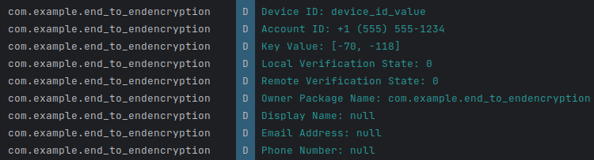

需要注意的点：
通过`getE2eeContactKey` 获取`ContactKey` 时，返回值为null时不会抛出异常。
`keyValue`的范围必须在1到5000 之间
大于5000会有以下报错

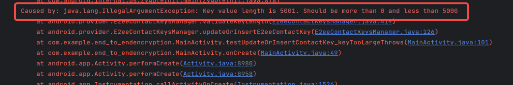

等于0会有以下报错

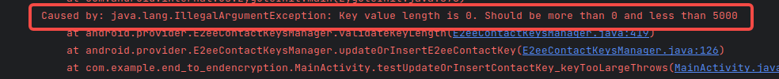

查看所有加密联系人密钥

getAllE2eeContactKeys 和 getOwnerE2eeContactKeys 源码

```java
    //检索属于调用者可见的应用程序的所有端到端加密联系人密钥条目。 键将被去除 deviceId、timeUpdated 和 keyValue 数据。
    public List<E2eeContactKey> getAllE2eeContactKeys(@NonNull String lookupKey) {
        Bundle extras = new Bundle();
        extras.putString(E2eeContactKeys.LOOKUP_KEY, Objects.requireNonNull(lookupKey));

        Bundle response = nullSafeCall(mContentResolver,
            E2eeContactKeys.GET_ALL_CONTACT_KEYS_METHOD, extras);
       .....
       .....     
       }
    
    
    //检索属于调用者应用程序的给定lookupKey的所有端到端加密联系人密钥条目。
    public List<E2eeContactKey> getOwnerE2eeContactKeys(@NonNull String lookupKey) {
        Bundle extras = new Bundle();
        extras.putString(E2eeContactKeys.LOOKUP_KEY, Objects.requireNonNull(lookupKey));

        Bundle response = nullSafeCall(mContentResolver,
            E2eeContactKeys.GET_OWNER_CONTACT_KEYS_METHOD, extras);
       .....
       .....     
       }
```

注：这里的的可见性（Android 11的特性），指的是包可见性，有两种方式实现

1. 通过授予调用程序 `QUERY_ALL_PACKAGES` 权限。）
2. 如需查看其他软件包，可以使用 `<queries>` 元素，实现对特定包可见性的增强。

例：
<queries>

<package android:name="Package_Name" /> </queries>
Demo 2：APP 1 、APP 2分别update各自的 `E2eeContactKey`，由APP 1 查看所有的 `E2eeContactKey`。
APP 1

```java
    private static final String LOOKUP_KEY = "0r1-423A2E4644502A2E50";
    private static final String DEVICE_ID = "device_id_value";
    private static final String ACCOUNT_ID = "+1 (555) 555-1234";
    private static final byte[] KEY_VALUE = new byte[]{(byte) 0xba, (byte) 0x8a};
    
    public void testGetAllContactKeys_callerIsDifferentFromOwner() {
        
        startHelperApp();
        
        // 插入或更新contact密钥
        mContactKeysManager.updateOrInsertE2eeContactKey(LOOKUP_KEY, DEVICE_ID_2, ACCOUNT_ID,
        KEY_VALUE);
        
        //检索属于调用者可见的应用程序的所有端到端加密联系人密钥条目
        List<E2eeContactKeysManager.E2eeContactKey> allContactKeys = mContactKeysManager.getAllE2eeContactKeys(LOOKUP_KEY);
        
        //检索属于调用者应用程序的给定lookupKey的所有端到端加密联系人密钥条目。
        List<E2eeContactKeysManager.E2eeContactKey> ownerContactKeys = mContactKeysManager.getAllE2eeContactKeys(LOOKUP_KEY);

        for (E2eeContactKeysManager.E2eeContactKey contactKey : allContactKeys) {
            Log.e("chenhao59", "All ContactKeys Size: " + allContactKeys.size() + " "
                                            + "ContactKeys DeviceId: " + contactKey.getDeviceId() + " "
                                            + "ContactKeys AccountId: "+ contactKey.getAccountId()+ " "
                                            + " " + contactKey.getLocalVerificationState() + " "
                                            + " " + contactKey.getRemoteVerificationState() + " "
                                            + " " + contactKey.getOwnerPackageName());
        }

        for (E2eeContactKeysManager.E2eeContactKey contactKey : ownerContactKeys) {
            Log.e("chenhao59", "Owner ContactKeys Size: " + ownerContactKeys.size() + " "
                    + "Owner ContactKeys DeviceId: " + contactKey.getDeviceId() + " "
                    + "ContactKeys AccountId: "+ contactKey.getAccountId()+ " "
                    + " " + contactKey.getLocalVerificationState() + " "
                    + " " + contactKey.getRemoteVerificationState() + " "
                    + " " + contactKey.getOwnerPackageName());

        }
    }
    private static final String HELPER_APP_PACKAGE = "com.example.e2eecontactskeysmanager_test_otherapp_get";
    private static final String HELPER_APP_CLASS =
            "com.example.e2eecontactskeysmanager_test_otherapp_get.MyService";
    
    private ServiceConnection mConnection = new ServiceConnection(){
    @Override
    public void onServiceConnected(ComponentName componentName, IBinder iBinder) {
        Toast.makeText(MainActivity.this, "连接成功", Toast.LENGTH_SHORT).show();
        //在服务连接成功后进行调用
        mRemoteService = IMyAidlInterface.Stub.asInterface(iBinder);
        try {
            //通过 AIDL 调用对端创建 E2eeContactKeys
            mRemoteService.setContactKeysManager();
        }catch (RemoteException e){
            e.printStackTrace();
        }
    }

    @Override
    public void onServiceDisconnected(ComponentName componentName) {

    }
};
    
    
    private void startHelperApp() {
        Intent intent = new Intent();
        intent.setComponent(new ComponentName(
                HELPER_APP_PACKAGE,
                HELPER_APP_CLASS));
        
        //通过 AIDL 启动 APP 2 的 SERVICE
        if(bindService(intent, mConnection, Context.BIND_AUTO_CREATE)){
            Toast.makeText(this, "BindService Success", Toast.LENGTH_SHORT).show();
        }else {
            Toast.makeText(this, "BindService Failed", Toast.LENGTH_SHORT).show();
        }
    
        // 等待对端服务启动，创建key也需要时间
        try {
            Thread.sleep(1000);
        } catch (InterruptedException e) {
            e.printStackTrace();
        }
    }
```

APP 2

```java
    private final IMyAidlInterface.Stub mBinder = new IMyAidlInterface.Stub() {
        @Override
        public void setmContactKeysManager() {
            // 通过context获取
            mContactKeysManager = (E2eeContactKeysManager)context.getSystemService(Context.CONTACT_KEYS_SERVICE);

            // 插入或更新contact密钥
            mContactKeysManager.updateOrInsertE2eeContactKey(LOOKUP_KEY, DEVICE_ID, ACCOUNT_ID, KEY_VALUE);

            // 获取所有contact密钥
            List<E2eeContactKeysManager.E2eeContactKey> clist = mContactKeysManager.getAllE2eeContactKeys(LOOKUP_KEY);

            // 打印日志
            Log.w("chenhao59", "List<E2eeContactKeysManager.E2eeContactKey> : " + clist);

        }
    }    
```

demo结果：

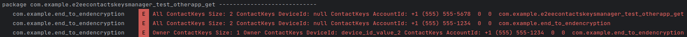

APP 1 调用方法`getAllE2eeContactKeys` 可以检索到 APP1 和 APP 2 的 `ContactKeys`，而调用`getOwnerE2eeContactKeys` 只能检索到APP 1自身的 `ContactKeys` 。
**deviceId 、timeUpdated** 的值均无法获取到。

- 更新属于调用者应用程序的端到端加密联系人密钥条目的本地验证状态。
- 更新属于调用者应用程序的端到端加密联系人密钥条目的远程验证状态。

```java
    public boolean updateE2eeContactKeyLocalVerificationState (String lookupKey, 
                    String deviceId, 
                    String accountId, 
                    int localVerificationState)
                    
     public boolean updateE2eeContactKeyRemoteVerificationState (String lookupKey, 
                    String deviceId, 
                    String accountId, 
                    int remoteVerificationState)         
```

1. `localVerificationState` : 本地验证状态。
2. `remoteVerificationState`: 远程验证状态。

Demo 3：APP 1 更新属于调用者应用程序的端到端加密联系人密钥条目的本地验证状态 和 远程验证状态。
APP 1

```java
    //接触端对端加密密钥的未经验证状态。
    public static final int VERIFICATION_STATE_UNVERIFIED = 0;
  
    //接触端对端加密密钥的验证状态失败。
    public static final int VERIFICATION_STATE_VERIFICATION_FAILED = 1;
    
    //已验证接触端对端加密密钥的状态。
    public static final int VERIFICATION_STATE_VERIFIED = 2;
    
    
    public void testUpdateContactKeyLocalVerificationState_securityExceptionThrows() {
        startHelperApp();
        List<E2eeContactKeysManager.E2eeContactKey> contactKeys = mContactKeysManager.getAllE2eeContactKeys(LOOKUP_KEY);

        mContactKeysManager.updateOrInsertE2eeContactKey(LOOKUP_KEY, DEVICE_ID_2, ACCOUNT_ID,
                KEY_VALUE);

        mContactKeysManager.updateE2eeContactKeyLocalVerificationState(
                            LOOKUP_KEY, DEVICE_ID_2,
                            ACCOUNT_ID,
                            E2eeContactKeysManager.VERIFICATION_STATE_VERIFIED);

        mContactKeysManager.updateE2eeContactKeyRemoteVerificationState(
                            LOOKUP_KEY, DEVICE_ID_2,
                            ACCOUNT_ID,
                            E2eeContactKeysManager.VERIFICATION_STATE_VERIFIED);

        mContactKeysManager.updateE2eeContactKeyLocalVerificationState(
                        HELPER_APP_LOOKUP_KEY, HELPER_APP_DEVICE_ID,
                        HELPER_APP_ACCOUNT_ID,
                        E2eeContactKeysManager.VERIFICATION_STATE_VERIFIED);

        mContactKeysManager.updateE2eeContactKeyRemoteVerificationState(
                        HELPER_APP_LOOKUP_KEY, HELPER_APP_DEVICE_ID,
                        HELPER_APP_ACCOUNT_ID,
                        E2eeContactKeysManager.VERIFICATION_STATE_VERIFIED);

        List<E2eeContactKeysManager.E2eeContactKey> allContactKeys = mContactKeysManager.getAllE2eeContactKeys(LOOKUP_KEY);

        for (E2eeContactKeysManager.E2eeContactKey contactKey : allContactKeys) {
            Log.e("chenhao59", "All ContactKeys Size: " + allContactKeys.size() + " "
                    + "ContactKeys DeviceId: " + contactKey.getDeviceId() + " "
                    + "ContactKeys AccountId: "+ contactKey.getAccountId()+ " "
                    + " " + contactKey.getLocalVerificationState() + " "
                    + " " + contactKey.getRemoteVerificationState() + " "
                    + " " + contactKey.getOwnerPackageName());
        }
    }
```

demo结果：


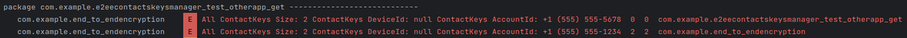

APP 1 只能更新自己创建的 `E2eeContactKey` 的的本地验证状态和远程验证状态 ，无法修改APP 2 的验证状态。

移除加密联系人密钥

```java
    public boolean removeE2eeContactKey (String lookupKey, 
                    String deviceId, 
                    String accountId)
```

Demo 4: 移除加密联系人密钥

```java
    public void testRemoveContactKey_deletesEntry() {
        mContactKeysManager.updateOrInsertE2eeContactKey(LOOKUP_KEY, DEVICE_ID, ACCOUNT_ID,
                KEY_VALUE);
        // 移除加密联系人密钥
        mContactKeysManager.removeE2eeContactKey(LOOKUP_KEY, DEVICE_ID, ACCOUNT_ID);

        E2eeContactKey contactKey =
                mContactKeysManager.getE2eeContactKey(LOOKUP_KEY, DEVICE_ID, ACCOUNT_ID);
        // 打印日志
        Log.e("chenhao59", "contactKey = " + contactKey);
    }
```

demo结果：

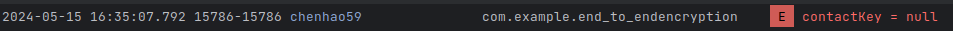

`E2eeSelfKey` 逻辑基本与`E2eeContactfKey`一致，这边就不再进行一一赘述了。

总结：
新增的API 主要用于 联系人 信息加密。加密通过 `lookupKey` 、`deviceId` 、`accountId` 实现，同时解密也需要这三个元素，才能获得对应的`E2eeContactKey` 。`E2eeContactKey` 包含联系人的各项信息，邮箱地址、号码等等。
其他应用只要对创建`E2eeContactKey` 的应用有包可见性，就可查询到到`E2eeContactKey` ，不过这份信息会抹去 `deviceId`等信息。

## 14、PDF 改进

#### 14.1、特性背景

Android 15 开发者预览版 2 包含对 `PdfRenderer` API 重大改进的早期预览版。应用可以整合各种高级功能，例如渲染受密码保护的文件、注解、表单编辑、搜索和通过文案进行选择。支持线性 PDF 优化，以加快本地 PDF 的查看速度并减少资源使用量。

#### 14.2、适用范围

Android15上的新功能。

#### 14.3、特性内容

针对 `PdfRenderer` 相关类进行了重大修改，新增了丰富的功能性 API，其中包括但不限于对不同类型的 PDF 文档进行区分、表单信息的查看、搜索和修改等功能。主要目标是增强对原生 PDF 文件处理 API 的能力，使其更加灵活和强大。
还需要注意一点变更，`PdfRenderer` 已移至一个模块，此模块可使用与平台版本无关的 Google Play 系统更新来进行更新，创建了兼容的 API Surface (`PdfRendererPreV`)来支持在 Android 11（API 级别 30）中更新这些变更。

#### 14.4、适配案例

笔者本地编写了一个简单的 PDF阅读器，demo代码如下：

```java
public class MainActivity extends AppCompatActivity {

    private RecyclerView recyclerView;
    private PdfRenderer mRenderer;
    private Uri pdfUri;

    @Override
    protected void onCreate(Bundle savedInstanceState) {
        super.onCreate(savedInstanceState);
        setContentView(R.layout.activity_main);
        //使用recyclerView展示
        recyclerView = findViewById(R.id.recyclerView);

        // 获取PDF文件的URI
        pdfUri = getUriFromFile("/*文件路径*/");

        if (pdfUri != null) {
            try {
                openRenderer(pdfUri);
            } catch (IOException e) {
                e.printStackTrace();
                Toast.makeText(this, "Error opening PDF file", Toast.LENGTH_SHORT).show();
            }
        } else {
            Toast.makeText(this, "PDF file not found", Toast.LENGTH_SHORT).show();
        }
    }

    private Uri getUriFromFile(String filePath) {
        File file = new File(filePath);
        if (file.exists()) {
            return Uri.fromFile(file);
        }
        return null;
    }

    private void openRenderer(Uri uri) throws IOException {
        ParcelFileDescriptor parcelFileDescriptor = getContentResolver().openFileDescriptor(uri, "r");
        if (parcelFileDescriptor != null) {
            //初始化 PdfRenderer
            mRenderer = new PdfRenderer(parcelFileDescriptor);

            // 设置 RecyclerView
            LinearLayoutManager layoutManager = new LinearLayoutManager(this);
            recyclerView.setLayoutManager(layoutManager);
            PdfAdapter adapter = new PdfAdapter();
            recyclerView.setAdapter(adapter);
        }
    }

    @Override
    protected void onDestroy() {
        // Activity销毁时释放资源
        try {
            closeRenderer();
        } catch (IOException e) {
            e.printStackTrace();
        }
        super.onDestroy();
    }

    private void closeRenderer() throws IOException {
        if (mRenderer != null) {
            mRenderer.close();
        }
    }

    class PdfAdapter extends RecyclerView.Adapter<PdfAdapter.PageViewHolder> {

        @Override
        public PageViewHolder onCreateViewHolder(ViewGroup parent, int viewType) {
            View view = LayoutInflater.from(parent.getContext()).inflate(R.layout.item_pdf_page, parent, false);
            return new PageViewHolder(view);
        }

        @Override
        public void onBindViewHolder(PageViewHolder holder, int position) {
            holder.bind(position);
        }

        @Override
        public int getItemCount() {
            if (mRenderer != null) {
                return mRenderer.getPageCount();
            }
            return 0;
        }

        class PageViewHolder extends RecyclerView.ViewHolder {
            ImageView imageView;

            PageViewHolder(View itemView) {
                super(itemView);
                imageView = itemView.findViewById(R.id.iv_pdf_page);
            }

            void bind(int position) {
                if (mRenderer != null) {
                    //打开对应PDF页面
                    PdfRenderer.Page page = mRenderer.openPage(position);
                    //创建用于展示的bitmap
                    Bitmap bitmap = Bitmap.createBitmap(page.getWidth(), page.getHeight(), Bitmap.Config.ARGB_8888);
                    //设定渲染的参数和内容
                    page.render(bitmap, null, null, PdfRenderer.Page.RENDER_MODE_FOR_DISPLAY);
                    //展示PDF内容
                    imageView.setImageBitmap(bitmap);
                    //释放page资源
                    page.close();
                }
            }
        }
    }
}
```

“渲染受密码保护的文件” 功能

本地将如下PDF文件加密之后，生成带encrypt字样的加密PDF文件。

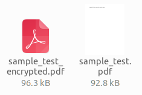

使用Android V版本的构造方法，如下代码就可以实现打开加密的PDF文件。

```java
    LoadParams password = null;
    
    password = new LoadParams.Builder()
            .setPassword("123456")//注：这里的密码是加密PDF文件时使用的密码
            .build();
    
    if (password != null) {
        mRenderer = new PdfRenderer(parcelFileDescriptor, password);
    } else {
        mRenderer = new PdfRenderer(parcelFileDescriptor);
    }
```

如果仍使用Android U 及之前版本的`PdfRenderer` 构造方式，就会有以下报错。

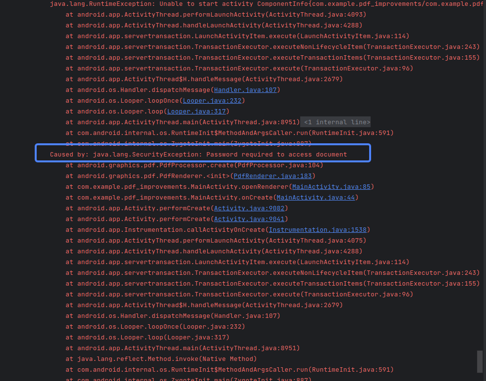

‘‘表单编辑’’功能

通过以下代码就可实现对表单文本内容修改

```java
    PdfRenderer.Page page = mRenderer.openPage(position);
    
    FormEditRecord meditrecord = new FormEditRecord.Builder(EDIT_TYPE_SET_TEXT,0,2)
            .setText("pdf_Form")
            .build();
    
    List<FormWidgetInfo> formWidgetInfos = page.getFormWidgetInfos();
    Log.d("chenhao59", "Form widget infos: " + formWidgetInfos.toString());
    
    List<Rect> mdestclip = page.applyEdit(meditrecord);
    
    formWidgetInfos = page.getFormWidgetInfos();
    Log.d("chenhao59", "Form widget infos: " + formWidgetInfos.toString());
```


“搜索” 功能

例如利用如下代码，可以得到所填`String`相同文本在PDF文件中的边界范围

```java
     List<PageMatchBounds> pageMatchBounds = page.searchText("LLM");
```

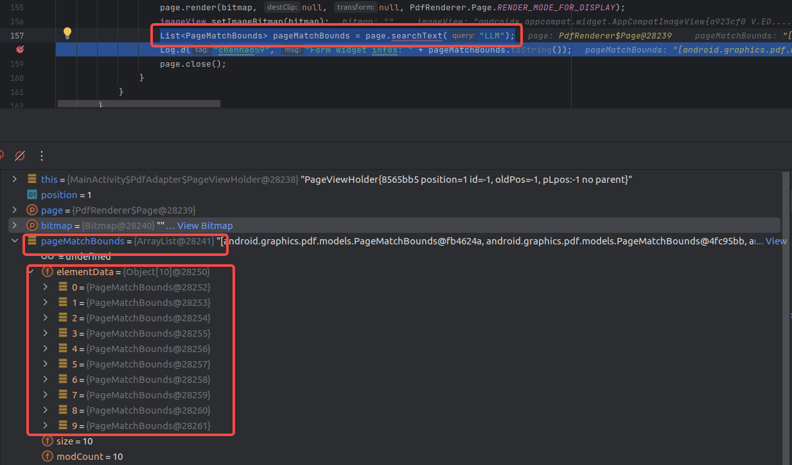


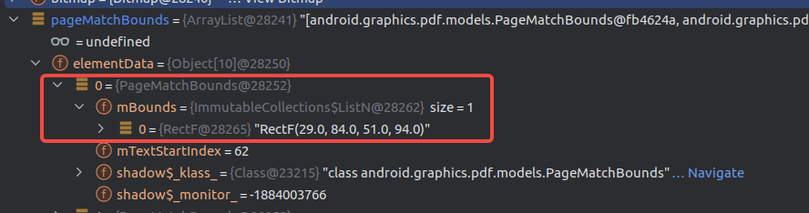

“选择”功能

使用以下示例代码以及PDF文件，可以显示对PDF文本内容的选择。

```java
    //首先查栈 Simple PDF File 的文字 
    List<PageMatchBounds> pageMatchBounds = page.searchText("Simple PDF File");
    
    ....
    ....
    /*
    查询到的两个文字位置如下：
        left = 91.0
        bottom = 76.0
        right = 285.0
        top = 49.0

        bottom = 76.0
        left = 66.0
        right = 259.0
        top = 49.0
    
    */
    
    //通过查询到的位置（单点选择）
    Point point = new Point(91, 49);
    SelectionBoundary start = new SelectionBoundary(point);
    SelectionBoundary stop = new SelectionBoundary(point);
    
    PageSelection firstTextSelection = page.selectContent(start, stop);
    
    // 通过查询到的位置（两点选择）
    Point leftPoint = new Point(66, 49);
    Point rightPoint = new Point(259, 49);
    
    PageSelection secondTextSelection = page.selectContent(
            new SelectionBoundary(leftPoint), new SelectionBoundary(rightPoint));
```

下图为笔者测试demo使用到的PDF文件内容


demo结果：

- 单点选择

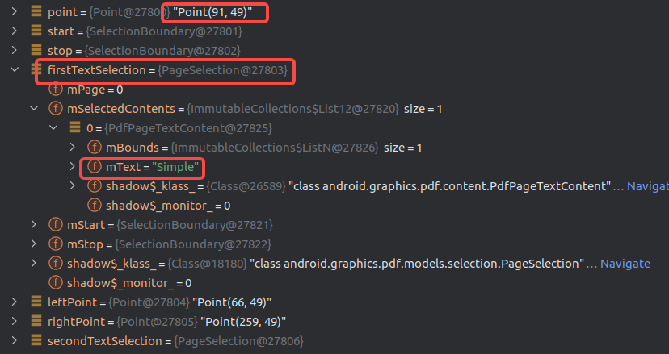

- 两点选择（左右顶点）

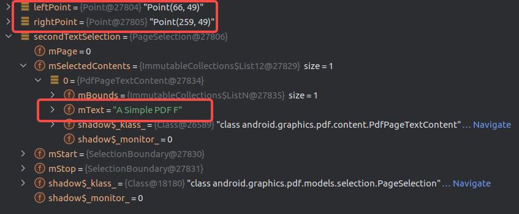

## 15、细化的换行符控件

#### 15.1、特性背景

保证显示的内容的可读性，即保证相应的词语在同一行和保证单词不被断字，使之更完整。

#### 15.2、适用范围

Android15上的新功能。

#### 15.3、特性内容

从Android 15开始，TextView和底层换行符可以将给定的文本部分保留在同一行中，以提高可读性。您可以通过使用字符串资源中的＜nobreak＞标记或createNoBreakSpan来利用这种换行自定义。类似地，您可以使用<nohyphen>标记或createNoHyphenationSpan来保护单词不被断字。
例如，以下字符串资源不包括换行符，并在不需要的地方使用文本“Pixel 8 Pro”进行渲染。

```xml
<resources>
    <string name="pixel8pro">The power and brains behind Pixel 8 Pro.</string>
</resources>
```

相比之下，此字符串资源包括<nobreak>标记，该标记包装短语“Pixel 8 Pro”并防止换行：

```xml
<resources>
    <string name="pixel8pro">The power and brains behind <nobreak>Pixel 8 Pro.</nobreak></string>
</resources>
```

这些字符串的渲染方式不同，如下图所示：


一行文本的布局，其中短语“Pixel 8 Pro”没有使用<nobreak>标签包装。


使用<nobreak>标签包装短语“Pixel 8 Pro”的同一行文本的布局。
实现效果
通过xml文件配置TextView内容


第一行是没有添加nobreak的内容，第二行是添加了nobreak的内容。

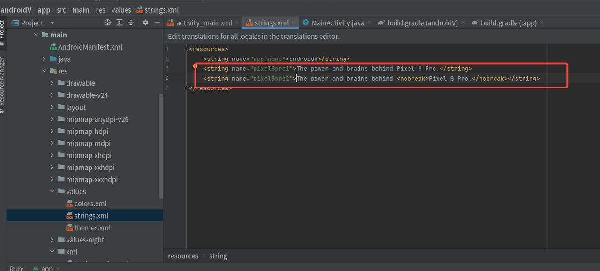


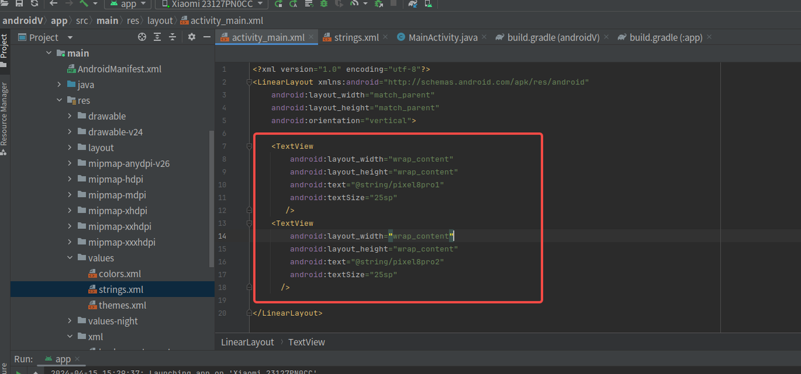

通过代码实现

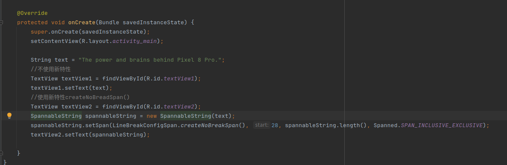


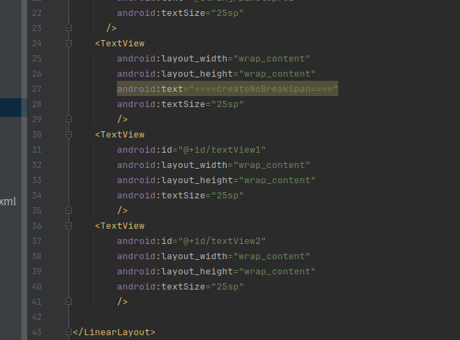


以上标签及API解析
新增类：LineBreakConfigSpan，主要是为了保证部分文本不被拆分，从而保证文本的可读性。
其中的
createNoBreakSpan()方法主要是保证组合一起的单词词组不被拆分成两行
createNoHyphenationSpan()保证一个单词不被断字。
新增标签：
<nobreak>：其功能和createNoBreakSpan()功能类似
<nohyphen>：其功能和createNoHyphenationSpacn()功能一致

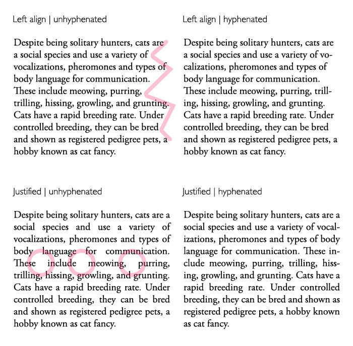

#### 15.4、应用适配

文本展示基本所有的app都会涉及到，app可自己决定是否采用该功能增加文本可读性。
如何使用

```xml
<nobreak>：保护Pixel 8 Pro.在同一行
<string name="pixel8pro2">The power and brains behind <nobreak>Pixel 8 Pro.</nobreak></string>
<nohyphen>：保护单词Pixel不被断字
<string name="pixel8pro2">The power and brains behind <nohyphen>Pixel</nohyphen> 8 Pro.</string>
String text = "The power and brains behind Pixel 8 Pro.";
//使用新特性createNoHyphenationSpan()：保护单词Pixel不被断字
TextView textView1 = findViewById(R.id.textView1);
SpannableString spannableString1 = new SpannableString(text);
spannableString1.setSpan(LineBreakConfigSpan.createNoHyphenationSpan, 28, 32, Spanned.SPAN_INCLUSIVE_EXCLUSIVE);
textView1.setText(spannableString);
//使用新特性createNoBreakSpan()：保护Pixel 8 Pro.在同一行
TextView textView2 = findViewById(R.id.textView2);
SpannableString spannableString = new SpannableString(text);
spannableString.setSpan(LineBreakConfigSpan.createNoBreakSpan(), 28, spannableString.length(), Spanned.SPAN_INCLUSIVE_EXCLUSIVE);
textView2.setText(spannableString);
```

## 16、封面屏幕支持

#### 16.1、特性背景

最近google也开始着手处理各种屏幕上的兼容性问题，逐渐推出各种系统策略，在Android15中也添加了部分属性内容来解决各种尺寸屏幕问题。

#### 16.2、适用范围

Android15上的新功能。

#### 16.3、特性内容

原文介绍
Android15为应用提供了充分利用android屏幕的技术支持，包含大屏幕、可翻转和可折叠。应用通过声明一个属性，借助该属性可让应用在Android15设备上的折叠屏或小屏幕上运行。
新增属性

PROPERTY_COMPAT_ALLOW_SMALL_COVER_SCREEN

为应用可以在manifest中声明PROPERTY_COMPAT_ALLOW_SMALL_COVER_SCREEN属性和COMPAT_SMALL_COVER_SCREEN_OPT_IN值来授权系统在flip机型的外屏上启动自己整个应用或者activity。声明了这个属性的应用可能无需用户授权即可在外屏启动。
PROPERTY_COMPAT_ALLOW_IGNORING_ORIENTATION_REQUEST_WHEN_LOOP_DETECTED
这是一个应用程序级别的PackageManager.Property，用于通知系统该应用程序可以选择退出兼容性处理，以避免Activity#setRequestedOrientation()循环。循环可能会被OEM配置的忽略请求方向显示设置（在Android 12（API级别31）及更高版本中）或设备的横向自然方向触发。换句话说，如果应用程序需要在某些情况下更改屏幕方向，而系统的兼容性处理会导致Activity#setRequestedOrientation()进入无限循环，那么可以使用此属性来告知系统，该应用程序可以选择退出兼容性处理，以避免此问题。如果不需要这种行为，则可以不使用此属性。
当以下两个条件满足，系统可以忽略应用调用Activity#setRequestedOrientation() 条件1：当在一秒内Activity有请求方向次数大于两次
条件2：Activity的letterboxed模式下的方向没有被固定
当设置为false的时候会通知系统，即使设备制造商已将应用程序选择为兼容性处理，也必须将应用程序从兼容性处理中退出。
如果不设置该属性，或者设置该属性的值为true。不起任何作用。

```xml
 <application>
   <property
     android:name=
       "android.window.PROPERTY_COMPAT_ALLOW_IGNORING_ORIENTATION_REQUEST_WHEN_LOOP_DETECTED"
     android:value="false"/>
 </application>
```

PROPERTY_COMPAT_ALLOW_MIN_ASPECT_RATIO_OVERRIDE
应用级PackageManager属性用于通知系统应该从兼容性覆盖中选择退出该应用程序，该覆盖会更改最小宽高比。当启用此兼容性覆盖时，设备制造商可以自行决定更改应用程序清单中给出的最小宽高比，以改善显示兼容性，除非应用程序清单值更高。如果在清单中未提供最小宽高比值，则也将应用此处理。这些处理可以在特定情况下应用（例如，设备处于纵向模式）或每次在屏幕上显示应用程序时应用。
将此属性设置为false会通知系统，即使设备制造商已将应用程序选择加入处理，该应用程序也必须选择退出兼容性处理。
如果根本不设置此属性或将此属性设置为true，则不会产生任何影响。

```xml
 <application>
   <property
     android:name="android.window.PROPERTY_COMPAT_ALLOW_MIN_ASPECT_RATIO_OVERRIDE"
     android:value="true|false"/>
 </application>
```

PROPERTY_COMPAT_ALLOW_RESIZEABLE_ACTIVITY_OVERRIDES
应用级别的PackageManager.Property用于通知系统，该应用程序应该选择退出兼容性覆盖，以更改应用程序的可调整大小性。
当启用这些兼容性覆盖时，它们会强制应用程序可调整大小/不可调整大小。如果应用程序被强制调整大小，这不会改变应用程序是否可以进入多窗口模式，但允许应用程序在窗口容器调整大小时调整大小，例如显示大小更改或屏幕旋转。
将此属性设置为false会通知系统，即使设备制造商已将应用程序纳入处理中，该应用程序也必须退出兼容性处理。
如果根本不设置此属性或将此属性设置为true，则不会产生任何影响。

```xml
 <application>
   <property
     android:name="android.window.PROPERTY_COMPAT_ALLOW_RESIZEABLE_ACTIVITY_OVERRIDES"
     android:value="true|false"/>
 </application>
```

PROPERTY_COMPAT_ALLOW_USER_ASPECT_RATIO_OVERRIDE
应用程序级别的 PackageManager.Property，当设置为 false 时，通知系统该应用程序已选择退出面向用户的纵横比兼容性覆盖。

兼容性覆盖功能使设备用户能够设置应用程序的纵横比或强制应用程序填充显示器，而不考虑应用程序清单中指定的纵横比或方向。
纵横比兼容性覆盖在设备设置中向用户公开。设备设置中的菜单列出了所有未选择退出兼容性覆盖的应用程序。用户从菜单中选择应用程序，并按应用程序设置应用程序的纵横比。通常，该菜单仅在大屏幕设备上可用。
当用户应用纵横比覆盖时，应用程序清单中指定的最小纵横比将被覆盖。如果用户选择全屏纵横比，则 Activity 的方向将被强制为 ActivityInfo.SCREEN_ORIENTATION_USER。
用户覆盖旨在改善在启用 OEM 忽略方向请求显示设置的设备上的应用程序体验（在 Android 12（API 级别 31）或更高版本上启用固定方向的兼容模式。
要退出用户纵横比兼容性覆盖，请将此属性添加到您的应用程序清单中，并将值设置为 false。您的应用程序将被排除在设备设置的应用程序列表之外，用户将无法覆盖应用程序的纵横比。
如果根本不设置此属性，或将此属性设置为 true，则不会产生任何影响。

```xml
 <application>
   <property
     android:name="android.window.PROPERTY_COMPAT_ALLOW_USER_ASPECT_RATIO_OVERRIDE"
     android:value="false"/>
 </application>
```

PROPERTY_COMPAT_ALLOW_USER_ASPECT_RATIO_FULLSCREEN_OVERRIDE
应用级别的PackageManager.Property标记，当设置为false时，通知系统该应用选择退出用户纵横比兼容性覆盖设置的全屏选项。
当用户应用全屏兼容性覆盖设置时，该活动的方向被强制设置为ActivityInfo.SCREEN_ORIENTATION_USER
用户覆盖旨在改善在启用OEM忽略方向请求显示设置的设备上的应用体验（在Android 12（API级别31）或更高版本上启用固定方向的兼容模式）。
要退出用户纵横比兼容性覆盖的全屏选项，请将此属性添加到您的应用程序清单中，并将值设置为false。您的应用程序将从设备设置的用户纵横比覆盖选项列表中删除全屏选项，用户将无法将全屏覆盖应用于您的应用程序。
注意：如果PROPERTY_COMPAT_ALLOW_USER_ASPECT_RATIO_OVERRIDE为false，则此属性无效。
完全不设置此属性或将此属性设置为true都没有效果。
**注意**： 如果 [PROPERTY_COMPAT_ALLOW_USER_ASPECT_RATIO_OVERRIDE](https://developer.android.com/guide/topics/large-screens/large-screen-compatibility-mode?hl=zh-cn#aspect_ratio_override) 为 **`false`**，则此属性不会产生任何影响。

```xml
 <application>
   <property
     android:name="android.window.PROPERTY_COMPAT_ALLOW_USER_ASPECT_RATIO_OVERRIDE"
     android:value="false"/>
 </application>
```

#### 16.4、应用适配 应用如需使用，使用相应接口即可。

##  17、OpenJDK 17更新

Android 15继续刷新Android核心库，以与最新的OpenJDK LTS版本的功能保持一致。以下是包括的关键功能和改进：

- 关于[NIO buffers](https://developer.android.com/reference/java/nio/ByteBuffer#get(int, byte[]))的改进
- [Streams](https://developer.android.com/reference/java/util/stream/DoubleStream.DoubleMapMultiConsumer)
- 新增 [math](https://developer.android.com/sdk/api_diff/v-dp2-incr/changes/java.lang.Math) 和 [strictmath](https://developer.android.com/sdk/api_diff/v-dp2-incr/changes/java.lang.StrictMath) 方法
- [util](https://developer.android.com/sdk/api_diff/v-dp2-incr/changes/pkg_java.util) 包更新，包括sequenced [collection](https://developer.android.com/reference/java/util/SequencedCollection), [map](https://developer.android.com/reference/java/util/SequencedMap), 与 [set](https://developer.android.com/reference/java/util/SequencedSet)
- [Deflater中的ByteBuffer支持](https://developer.android.com/sdk/api_diff/v-dp2-incr/changes/java.util.zip.Deflater)
- 安全更新，如[X500PrivateCredential](https://developer.android.com/reference/javax/security/auth/x500/X500PrivateCredential)和[安全密钥更新](https://developer.android.com/sdk/api_diff/v-dp2-incr/changes/pkg_java.security.spec)

这些API已经通过Google Play系统更新在运行Android 12（API级别31）及更高版本的超过10亿台设备上，因此您可以针对最新的编程功能进行开发。

##  18、更顺滑的PIP进入

#### 18.1、特性背景

为解决pip进出动画不够连贯的问题，Android 15引入了新的API。

#### 18.2、适用范围

Android 15上的新功能。

#### 18.3、特性内容

从Android15 开始，PictureInPictureUiState 类中引入了一个新的状态IsTransitioningToPip。当Pip进入动画开始时，系统将调用onPictureInPictureUiStateChanged 回调，并且应用程序可以通过判断isTransitioningToPip() = true来隐藏叠加在主UI之上的UI 元素，如视频播放中的布局，评分，标题等。

#### 18.4、应用适配

当三方应用有类似播放视频和动画的过程，如果进入Pip模式，为了让UI体验更好，需要先隐藏全屏下的部分UI，避免屏幕UI缩小后的过渡动画中出现UI显示闪烁等不好的体验。 如下，可根据动画适配相应的UI。也可根据具体业务来处理相应的逻辑

```java
override fun onPictureInPictureUiStateChanged(pipState: PictureInPictureUiState) { 
        if (pipState.isTransitioningToPip()) { 
          // Hide UI elements 
        } 
    }
override fun onPictureInPictureModeChanged(isInPictureInPictureMode: Boolean) { 
        if (isInPictureInPictureMode) { 
          // Unhide UI elements 
        } 
    }
```

#  五、废弃API

## 1、使用Spatializer代替Virtualizer

#### 1.1、特性背景

`Spatializer` 类在 Android 12（API 级别 32）中首次添加，可让应用查询设备上声音空间化的功能和行为。在 Android 15 中，Google废弃了 `Virtualizer` 类。如果支持空间化，请改用`AudioAttributes.Builder.setSpatializationBehavior` 来描述您希望的内容播放方式。

#### 1.2、适用范围

Android 15上废弃的API。

#### 1.3、特性内容

1、`Virtualizer`，API level 9中新增，API level VanillaIceCream 中废弃。
2、`AudioAttributes.Builder`，API level 21中新增。
3、`Spatializer`，API level 32中新增。
`Virtualizer`提供了音频效果处理的能力，特别是用于创建虚拟环绕声效果。这个类是`android.media.audiofx`包的一部分，通常用于增强音乐或其他音频内容的立体声效果，使听众感觉声音来自不同的方向，即便是使用普通的立体声耳机。
`Spatializer `是 Android 提供的一个音频效果类，它允许开发者在音频播放中添加三维空间效果，使得声音给人的感觉好像是在真实世界中的某个位置发出的。这种效果特别有用于游戏和虚拟现实应用，可以提高用户的沉浸感。`Spatializer `效果通过模拟声音的传播和反射，改变音频的频率和延迟，从而在听者的耳朵中重建声音源的位置感。这可能包括处理如回声、混响和其他因素，这些都是在现实世界中确定声音位置的线索。
**Virtualizer 此类在 API 级别 VanillaIceCream 中已弃用。** 使用`Spatializer`该类来查询平台在空间化（音频通道虚拟化的另一个名称）方面的功能，以及`AudioAttributes.Builder.setSpatializationBehavior(int)`在支持空间化时描述您希望如何播放内容的功能。

#### 1.4、应用适配

使用`Virtualizer`，需要遵循以下步骤：

1. 实例化`Virtualizer`对象：首先，你需要根据需要播放音频的音轨（`AudioTrack`）或媒体播放器（`MediaPlayer`）的音频会话ID来创建一个`Virtualizer`对象。
2. 配置`Virtualizer`：通过调用`setStrength()`方法，你可以设置虚拟环绕效果的强度。有些设备可能不支持所有强度设置，因此最好是检查设备支持的范围。
3. 启用`Virtualizer`：通过调用`setEnabled(true)`方法来启用虚拟效果。
4. 使用完成后释放资源：使用完毕后，调用`release()`方法释放`Virtualizer`对象占用的资源。

```java
// 获取AudioManager实例
val audioManager = getSystemService(Context.AUDIO_SERVICE) as AudioManager
// 生成一个新的音频会话ID
val audioSessionId = audioManager.generateAudioSessionId()
// 创建一个Virtualizer实例
val virtualizer = Virtualizer(0, audioSessionId)

// 检查是否支持强度调整，并设置强度
if (virtualizer.strengthSupported) {
    virtualizer.strength = 1000.toShort()
}

// 启用Virtualizer
virtualizer.enabled = true

// ... 使用Virtualizer

// 请确保在不再使用时释放Virtualizer资源
// virtualizer.release()
```

在 Android 设备上，`Spatializer` 效果是通过 `android.media.audiofx.Spatializer` 类提供的，该类是 `AudioEffect` 的子类。以下是该类的基本要素：

- 音频会话 ID：`Spatializer` 需要与一个特定的音频会话关联，这个会话代表了一个音频流。音频会话 ID 通常来自 `MediaPlayer`、`AudioTrack` 或其他音频源。
- 空间化行为：可以设置空间化的行为。例如，可以设置为自动（`SPATIALIZER_BEHAVIOR_AUTO`），在这种模式下，空间化效果会根据内容和用户的听觉偏好自动应用。
- 可用性检查：在尝试设置之前，需要检查 `Spatializer` 是否在当前设备上可用。这可以通过调用 `isAvailable` 方法来完成。
- 启用/禁用：调用 `setEnabled(true)` 或者直接设置 `enabled` 属性来启用 `Spatializer`。如果需要关闭空间化效果，可以设置为 `false`。

示例使用场景
假设您正在开发一个游戏，希望当玩家通过耳机玩游戏时，声音能够根据游戏中的虚拟环境来“移动”。您可以创建一个 `Spatializer` 实例，将其绑定到游戏音效的音频会话，并启用它。这样，玩家将能够体验到更加立体和定位明确的音效。
代码实现
在您的 Android 应用中，当您想要为音频播放添加空间化效果时，您需要创建一个 `Spatializer` 实例，并与音频会话 ID 绑定。如所示的代码段，您可以设置空间化行为、检查可用性，并启用效果。

```java
// 检查设备是否支持 Spatializer
val packageManager = context.packageManager
val hasSpatializer = packageManager.hasSystemFeature(PackageManager.FEATURE_AUDIO_SPATIALIZER)

if (hasSpatializer) {
    // 准备音频播放
    val mediaPlayer = MediaPlayer().apply {
        // 设置音频资源，例如一个音乐文件
        setDataSource("path/to/your/audio/file")

        // 构建 AudioAttributes 对象
        val audioAttributes = AudioAttributes.Builder()
            .setUsage(AudioAttributes.USAGE_MEDIA)
            .setContentType(AudioAttributes.CONTENT_TYPE_MUSIC)
            // 这里添加更多的属性设置
            .build()

        // 应用 AudioAttributes 到 MediaPlayer
        setAudioAttributes(audioAttributes)
        
        // 准备 MediaPlayer
        prepare()
    }

    // 获取音频会话 ID，稍后用于 Spatializer
    val audioSessionId = mediaPlayer.audioSessionId

    // 创建 Spatializer 实例
    if (Build.VERSION.SDK_INT >= Build.VERSION_CODES.Q) {
        val spatializer = Spatializer(0, audioSessionId).apply {
            // 检查设备是否支持空间音效处理
            if (isAvailable) {
                // 启用 Spatializer
                enabled = true

                // 使用 setSpatializationBehavior 方法设置期望的空间化行为
                if (hasControl()) {
                    setSpatializationBehavior(Spatializer.SPATIALIZER_BEHAVIOR_AUTO)
                }
            }
        }

        // 开始播放音频
        mediaPlayer.start()

        // ...

        // 在音频播放结束时，释放 Spatializer 和 MediaPlayer
        spatializer.release()
        mediaPlayer.release()
    }
} else {
    // Spatializer 不可用的处理逻辑
}
```

注意事项

- 性能影响：空间化处理可能会增加 CPU 负载，所以在性能受限的设备上使用时需要谨慎。
- 兼容性：并非所有 Android 设备都支持空间化，有些设备可能缺少必要的硬件或软件支持。
- 资源管理：确保及时释放 `Spatializer` 实例以避免资源泄漏。
- 用户体验：调整空间化效果以提供最佳用户体验，过度的或不恰当的空间化处理可能会导致用户感到不适。

## 2、弃用WebView中的WebSQL

WebSQL从Chrome中被移除，并且在Android WebView中弃用。推荐使用localStorage、sessionStorage、IndexedDB或者SQLite Wasm作为WebView内数据库的解决方案。

# 六、迁移指南

每次发布 Android 版本时，谷歌都会推出一些新功能并引入一些行为变更，目的就在于提高 Android 的实用性、安全性和性能。在许多情况下，您的应用都可以直接使用并完全按预期运行，而在其他情况下，您可能需要更新应用以适应平台变更。
源代码发布到 AOSP（Android 开源项目）后，用户就可能开始使用新平台。因此，应用必须做好准备，让用户能够正常使用，最好还能利用新功能和 API 来充分利用新平台。
典型的迁移包含两个阶段，这两个阶段可以同时进行：
确保应用兼容性（在 Android 15 最终发布前）
针对新平台的功能和 API 调整应用（最终发布后尽快）
确保与 Android 15 兼容
您必须测试现有应用在 Android 15 上的运行情况，确保更新到最新版 Android 的用户获得良好的体验。有些平台变更可能会影响应用的行为方式，因此，必须尽早进行全面测试并对应用进行任何必要的调整。
您通常可以调整应用并发布更新，而无需更改应用的 targetSdkVersion。同样，您不需要使用新的 API，也不需要更改应用的 compileSdkVersion，但这可能取决于应用的构建方式及其所使用的平台功能。
在开始测试之前，请务必熟悉所有应用的行为变更。即使您不更改应用的 targetSdkVersion，这些变更也可能会影响您的应用。


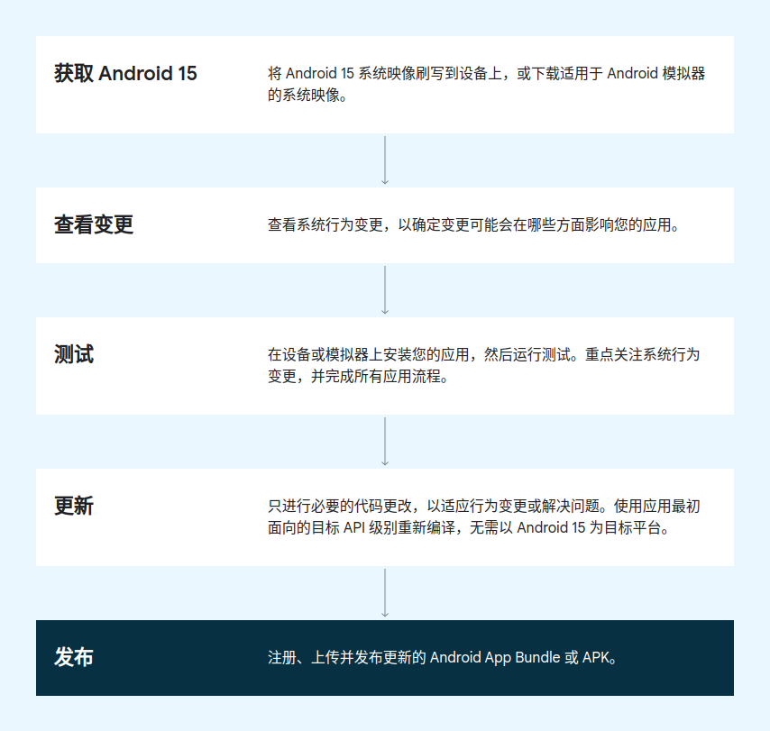


执行兼容性测试
在大多数情况下，测试与 Android 15 的兼容性与普通的应用测试类似。这时有必要查阅[核心应用质量指南](https://developer.android.com/docs/quality-guidelines/core-app-quality?hl=zh-cn)和[测试最佳实践](https://developer.android.com/training/testing?hl=zh-cn)。
如需进行测试，请在搭载 Android 15 的设备上安装您当前发布的应用，并完成所有流程和功能，同时查找问题。为帮助您确定测试重点，请**查看 Android 15 中引入的[适用于所有应用的行为变更](https://developer.android.com/about/versions/15/behavior-changes-all?hl=zh-cn)**，这些变更会影响应用的功能或导致应用崩溃。
此外，请务必**查看并测试[受限非 SDK 接口](https://developer.android.com/about/versions/15/changes/non-sdk-15?hl=zh-cn)的使用**。您应将应用使用的任何受限接口替换为公共 SDK 或 NDK 等效接口。留意突出显示这些访问权限的 logcat 警告，并使用 `StrictMode` 方法 `detectNonSdkApiUsage()` 以编程方式捕获它们。
最后，请务必全面**测试应用中的库和 SDK**，确保它们在 Android 15 上按预期运行，并遵循隐私权、性能、用户体验、数据处理和权限方面的最佳实践。如果您遇到问题，请尝试更新到最新版本的 SDK，或联系 SDK 开发者寻求帮助。
当您完成测试并进行更新后，我们建议您立即发布兼容的应用。这样可以尽早让您的用户测试应用，并帮助用户顺利过渡到 Android 15。
按照业务需求更新应用的目标平台并使用新 API 进行构建
发布应用的兼容版本后，下一步是按照业务需求通过更新 `targetSdkVersion` 并利用 Android 15 中的新 API 和功能来添加对 Android 15 的全面支持。准备就绪后，您即可开始进行这些更新。
当您计划全面支持 Android 15 时，请查看[影响以 Android 15 为目标平台的应用的行为变更](https://developer.android.com/about/versions/15/behavior-changes-15?hl=zh-cn)。这些针对性的行为变更可能会导致需要解决的功能问题。在某些情况下，这些变更需要进行重大开发，因此我们建议您尽早了解并解决这些变更。为帮助确定影响您的应用的具体行为变更，请使用[兼容性切换开关](https://developer.android.com/about/versions/15/migration?hl=zh-cn#using_app_compatibility_toggles)来测试已启用所选变更的应用。
以下步骤介绍了如何全面支持 Android 15。


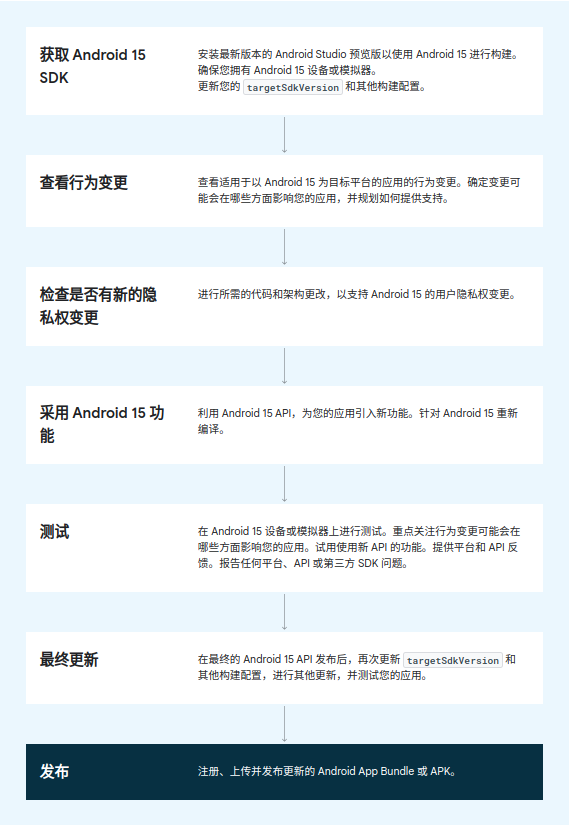

获取 SDK，更改目标平台，使用新 API 进行构建
如需开始针对 Android 15 全面支持进行测试，请使用最新预览版的 Android Studio 下载 Android 15 SDK 以及所需的任何其他工具。接下来，更新应用的 `targetSdkVersion` 和 `compileSdkVersion`，然后重新编译应用。如需了解详情，请参阅 [SDK 设置指南](https://developer.android.com/about/versions/15/setup-sdk?hl=zh-cn)。
测试 Android 15 应用
编译应用并将其安装到搭载 Android 15 的设备上后，请开始测试，以确保应用能够在 Android 15 上正常运行。某些行为变更仅在应用以新平台为目标平台时才适用，因此您需要在开始之前[查看这些变更](https://developer.android.com/about/versions/15/behavior-changes-15?hl=zh-cn)。
与基本兼容性测试一样，完成所有流程和功能以查找问题。将测试重点放在**[以 Android 15 为目标平台的应用的行为变更](https://developer.android.com/about/versions/15/behavior-changes-15?hl=zh-cn)**上。您还可以根据[核心应用质量指南](https://developer.android.com/docs/quality-guidelines/core-app-quality?hl=zh-cn)和[测试最佳实践](https://developer.android.com/training/testing?hl=zh-cn)检查您的应用。
请务必查看并**测试可能适用的[受限非 SDK 接口](https://developer.android.com/about/versions/15/changes/non-sdk-15?hl=zh-cn)的使用**。留意突出显示这些访问权限的 logcat 警告，并使用 StrictMode 方法 `detectNonSdkApiUsage()` 以编程方式捕获它们。
最后，请务必全面**测试应用中的库和 SDK**，确保它们在 Android 15 上按预期运行，并遵循隐私权、性能、用户体验、数据处理和权限方面的最佳实践。如果您遇到问题，请尝试更新到最新版本的 SDK，或联系 SDK 开发者寻求帮助。
使用应用兼容性切换开关进行测试
Android 15 包含兼容性切换开关，可让您更轻松地测试应用，以体现有针对性的行为变更。对于可调试的应用，切换开关可让您：

- **在不实际更改应用的 targetSdkVersion 的情况下测试针对性的变更**。您可以使用切换开关强制启用特定的针对性行为变更，以评估对现有应用的影响。
- **仅针对特定变更进行测试**。您可以使用切换开关停用除要测试的变更之外的所有针对性变更，而不必一次处理所有针对性变更。
- **通过 adb 管理切换开关**。您可以使用 adb 命令在自动化测试环境中启用和停用可切换的变更。
- **使用标准变更 ID 更快地进行调试**。每个可切换的变更都具有唯一 ID 和名称，可用于在日志输出中快速调试根本原因。

在您准备更改应用的目标平台时，或者在您积极开发以便支持 Android 15 时，切换开关将十分有用。如需了解详情，请参阅[兼容性框架变更 (Android 15)](https://developer.android.com/about/versions/15/reference/compat-framework-changes?hl=zh-cn)。

# 七、重点适配问题

开发者应重点关注加固问题，尽快完成适配。

#  八、开发者支持

若您在适配过程中遇到任何问题，都可以通过参考此文档反馈给我们，我们的兼容性工程师团队会尽快为您解决。
第三方适配技术接口：[mi-support-thirdapps@xiaomi.com](https://dev.mi.com/xiaomihyperos/documentation/mi-support-thirdapps@xiaomi.com)