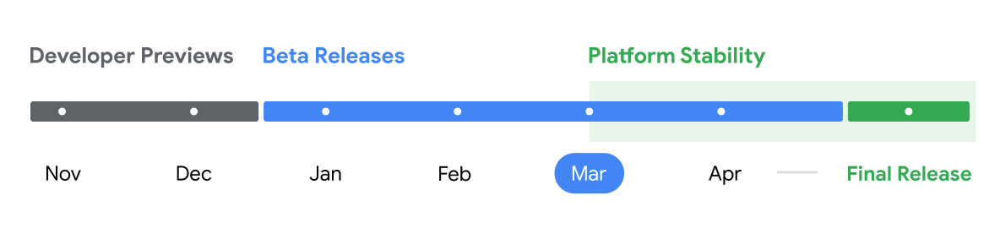
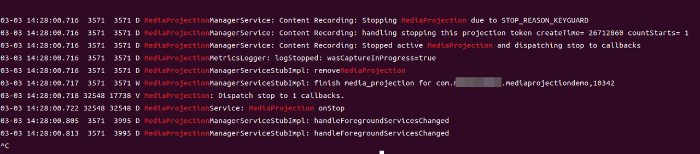
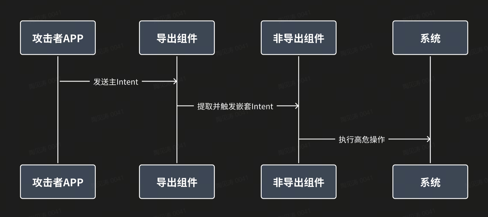
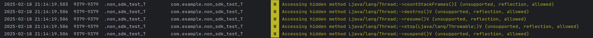
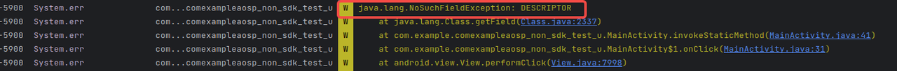
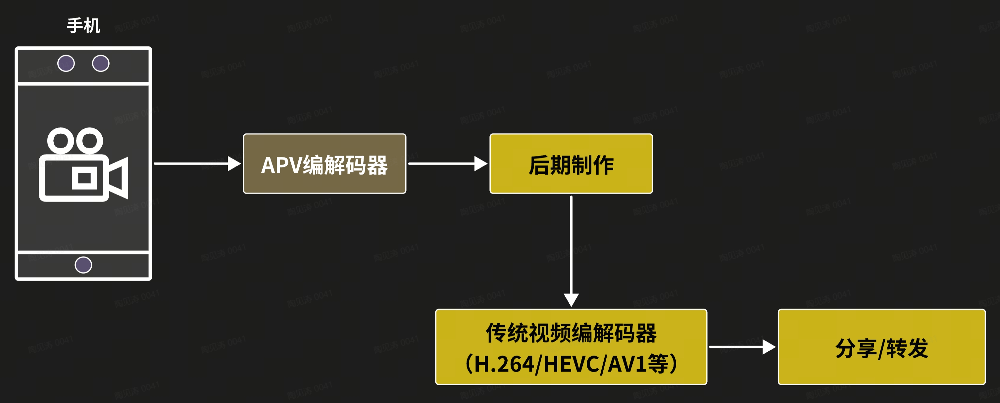
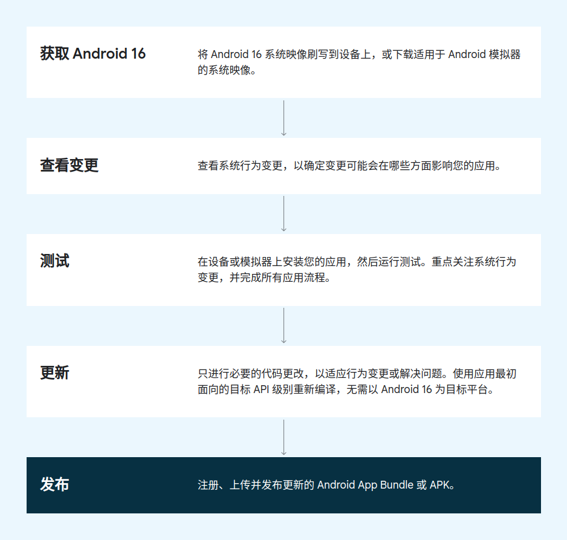
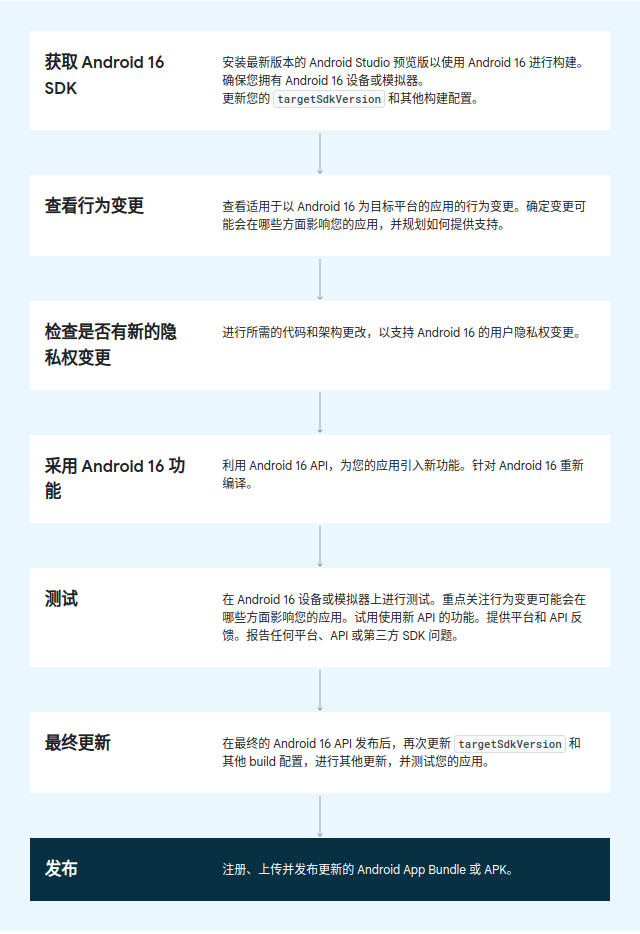

Android 16 应用适配指南更新时间: 2025-04-23 10:07:00

# 1.获取Android 16

## 1.1 谷歌发布时间表



## 1.2 小米手机获取Android 16

为方便帮助开发者第一时间对小米手机进行Android 16 Beta 2的升级适配，即日起Xiaomi 15 、Redmi K70 至尊版两款机型可通过以下链接卡刷基于Android 16 Beta 2的小米澎湃OS开发者预览版。

下载链接：https://web.vip.miui.com/page/info/mio/mio/detail?isTop=0&postId=49127158

注：基于Android 16 Beta版本的小米澎湃OS开发者预览版，稳定性不可预估，不建议您日常使用，请您在刷机前做好充分的预期准备。

如您暂未拥有上述设备也没关系，我们为您提供了足量的云测设备，来支持广大开发者的适配工作。

云测真机Android 16 权限申请： https://m.beehive.miui.com/VWfdrXKIGC9WZzTGig0vNQ/desktop/home

Android 16 云测真机：https://testit.miui.com/remote


## 1.3 在 Google Pixel 设备上获取 Android 16

开发者持有Pixel系列的机器可以直接ota升级，或者下载镜像升级，具体见链接：
[在 Google Pixel 设备上获取 Android 16 Beta 版](https://developer.android.com/about/versions/16/get?hl=zh-cn#on_pixel)
[适用于 Google Pixel 的出厂映像](https://developer.android.google.cn/about/versions/16/download?hl=zh-cn)
[适用于 Google Pixel 的 OTA 映像](https://developer.android.google.cn/about/versions/16/download-ota?hl=zh-cn)

## 1.4 设置Android模拟器

请参考[设置 Android 模拟器](https://developer.android.com/about/versions/16/get?hl=zh-cn#on_emulator)。

## 1.5 设置 Android 16 SDK

请参考[设置 Android 16 SDK](https://developer.android.com/about/versions/16/setup-sdk?hl=zh-cn)。

# 2.影响Android 16 上所有应用的行为变更

## 2.1 锁屏后MediaProjection被自动停止

### 一、特性背景

Android 近年来一直在加强MediaProjection的能力与隐私安全。Android 16 上，应用使用MediaProjection投屏、录屏时，屏幕左上角会出现醒目的标志，表明有应用正在录屏；同时，用户使用power键锁屏，或手机被长时间搁置自然锁屏后，MediaProjection会被stop，投/录屏被停止。
官网链接：[Status bar chip and auto stop](https://developer.android.com/media/grow/media-projection#status_bar_chip_auto_stop)

### 二、适用范围

Android 16 上的所有App。

### 三、特性内容

谷歌意图：通过新增的MediaProjectionStopController对象管控MediaProjection的停止逻辑，并添加了两种需要停止的场景，来实现更好的管控和更高的隐私安全。
变更内容：新增的MediaProjectionStopController对象管控MediaProjection的释放逻辑，手机按电源键/长时间搁置进入息屏状态时或者先打电话后投屏/录屏后挂断电话时，会停止当前的MediaProjection。

MediaProjection因息屏被停止时系统会打出这样的日志：




### 四、应用适配

建议开发者考虑到上述MediaProjection被系统停止的情形，做出针对性的处理。例如，可以实现MediaProjection.Callback.onStop()回调，在MediaProjection被系统停止的时候及时做出响应。

## 2.2 提高了对 Intent 重定向攻击的安全性

### 一、特性背景

Intent重定向漏洞是指，其他应用利用intent的Parcelable的特性，通过intent 的extra等信息，嵌套Intent从而绕过安全检查实现启动非导出组件 或者触发特权操作或获得对敏感数据的 URI 访问权限，可能导致数据被盗和任意代码执行。
**重定向原理图：**





Android 16 提供了针对常规 Intent 重定向攻击的默认安全防护，可帮助保护应用和用户免受恶意应用的侵害。
官网链接：[Improved security against Intent redirection attacks](https://developer.android.com/about/versions/16/behavior-changes-all?hl=zh-cn#intent-redirect-attacks)

### 二、适用范围

Android 16 上的所有App。

### 三、特性内容

**3.1 特性内容介绍**
**增强了针对 intent 重定向攻击的安全性**
Android 16 提供了针对常规 intent 重定向攻击的默认安全防护，并且所需的兼容性和开发者更改最少。
我们将默认针对 intent 重定向漏洞引入安全增强解决方案。在大多数情况下，使用 intent 的应用通常不会遇到任何兼容性问题；


**停用 intent 重定向处理**
Android 16 引入了一个新 API，允许应用选择停用启动安全保护。在默认安全行为干扰合法应用用例的特定情况下，这可能很有必要。
对于针对 Android 16 SDK 或更高版本进行编译的应用
您可以直接对 intent 对象使用`removeLaunchSecurityProtection()`方法。

```java
    val i = intent
    val iSublevel: Intent? = i.getParcelableExtra("sub_intent")
    iSublevel?.removeLaunchSecurityProtection() // Opt out from hardening
    iSublevel?.let { startActivity(it) }
```

**3.2 源码解读**
主要涉及到4个类的变动 **ActivityStarter** 、**Intent** 、**BaseBundle** 和**Clipdata**


**Intent 类新增和修改内容**

|      | **类型**   | **名称**                                       | **备注**                                                     |
| ---- | ---------- | ---------------------------------------------- | ------------------------------------------------------------ |
| 新增 | 静态变量   | EXTENDED_FLAG_MISSING_CREATOR_OR_INVALID_TOKEN | 用于该标志表示当前Intent的创建者令牌（creator token）缺失或无效。 |
| 新增 | 静态内部类 | CreatorTokenInfo                               | mCreatorToken用于标识嵌套Intent的创建者身份 mNestedIntentKey 跟踪所有 包含嵌套Intent的 Extra Key |
| 新增 | 静态内部类 | NestedIntentKey                                | NestedIntentKey 嵌套Intent的管理                             |
| 新增 | 方法       | removeLaunchSecurityProtection                 | 移除Intent的 EXTENDED_FLAG_MISSING_CREATOR_OR_INVALID_TOKEN 标志和 CreatorTokenInfo |
| 修改 | 方法       | writeToParcel/readFromParcel                   | - 序列化时会 附加创建者身份凭证 (mCreatorToken) 和 跨进程传递的嵌套 Intent 键信息 - 反序列化时恢复 创建者 Token ，用于校验源头合法性（对比当前进程的 Binder 身份） |


**ActivityStarter 类新增和修改内容**

|      | **类型** | **名称**                                                     | **备注**                                                     |
| ---- | -------- | ------------------------------------------------------------ | ------------------------------------------------------------ |
| 新增 | 静态变量 | ENABLE_PREVENT_INTENT_REDIRECT_TAKE_ACTION                   | 用来表示重定向限制功能是否开启                               |
| 新增 | 方法     | maybeMarkAsMissingCreatorToken maybeMarkAsMissingCreatorTokenInternal | 对序列化的intentadd XTENDED_FLAG_MISSING_CREATOR_OR_INVALID_TOKEN 标志 |
| 修改 | 内部类   | Requst                                                       | 新增 intentCreatorUid 和intentCreatorPackage用于确认intent的creator |
| 修改 | 方法     | resolveActivity                                              | 负责 解析要启动的 Activity 信息 并执行关键的 安全校验逻辑    |
| 修改 | 方法     | executeRequest                                               | 执行request时，新增了intentCreatorUid的判断是否为DEFAULT_INTENT_CREATOR_UID |
| 新增 | 方法     | getIntentRedirectPreventedLogMessage logAndThrowExceptionForIntentRedirect | 获取触发intent重定向日志信息获取以及打印该日志               |


**BaseBundle 类新增和修改内容**

|      | **类型** | **名称**   | **备注**                                                     |
| ---- | -------- | ---------- | ------------------------------------------------------------ |
| 修改 | 方法     | getValueAt | 在获取Bundle的值时调用maybeMarkAsMissingCreatorToken给Intentadd EXTENDED_FLAG_MISSING_CREATOR_OR_INVALID_TOKEN 标志 |


**Clipdata** **类新增和修改内容**

|      | **类型** | **名称**  | **备注**                                                     |
| ---- | -------- | --------- | ------------------------------------------------------------ |
| 修改 | 方法     | getIntent | 在获取Clipdata的值时调用maybeMarkAsMissingCreatorToken给Intentadd EXTENDED_FLAG_MISSING_CREATOR_OR_INVALID_TOKEN 标志 |


主要流程分为：

**1、Intent**的**CreatorTokenInfo** 初始化

- 在应用构建 完成intent之后，调用startactivity随后调用到Instrumentation 的execStartActivity，随后执行执行prepareToLeaveProcess，做intent跨进程的处理。
- 在intent 的prepareToLeaveProcess的方法中判断intent是否为初始intent，如果是则会调用内部类NestedIntentKey的collectExtraIntentKeys 方法
- NestedIntentKey的collectExtraIntentKeys的方法中会判断intent是否的mExtras和mClipData是否为空，如果不为空，就针对其中类型为intent的实例，初始化对应intent以及嵌套NestedIntent的mCreatorTokenInfo用于后续Intent的Creator的信息

2、**Intent**序列化/反序列化

- 在Intent进行序列化中，Android W新增了将CreatorTokenInfo.mCreatorToken 写入，在读的时候也会将Intent 的 CreatorTokenInfo读出。

3、解析**Intent**中**Bundle**和**Clipdata**

- 在被调用的APP内部如果对Intent的Extra的信息进行解析，即应用执行Intent 的getParcelableExtra，随后就会调用到Bundle的getParcelableExtra 最终走到BaseBundle 的getValueAt方法，在这个方法中会判断是否包含多个key的 Extra 信息，并调用Intent 的maybeMarkAsMissingCreatorToken方法
- 执行 maybeMarkAsMissingCreatorToken方法时，会对Extra包含的intent以及嵌套NestedIntent添加 EXTENDED_FLAG_MISSING_CREATOR_OR_INVALID_TOKEN的标志位。
- Clipdata也是也是同理，在被调用的APP内部如果对Intent的Clipdata的信息进行解析，会对Clipdata包含的intent以及嵌套NestedIntent添加 EXTENDED_FLAG_MISSING_CREATOR_OR_INVALID_TOKEN的标志位。

4、**Intent** 校验流程

ActivityStarter在Request 默认初始化时intentCreatorUid 设置DEFAULT_INTENT_CREATOR_UID

分为两种情况：

- executeRequest （显示 Intent 启动）
  - 在此过程中，如果intentCreatorUid不为DEFAULT_INTENT_CREATOR_UID 即说明该Intent 的Creator 属其他应用，随后checkStartAnyActivityPermission后判断应用无权限，会调用logAndAbortForIntentRedirect 抛出异常信息堆栈。
- resolveActivity（隐式 Intent 未指定组件）
  - 首先判断Intent的扩展标志检查是否包含EXTENDED_FLAG_MISSING_CREATOR_OR_INVALID_TOKEN，如果设置则表明Intent 重定向处理开启，且Intent存在问题。在检查URI权限时，如果存在Intent的CREATOR的权限问题，就会记录并抛出安全异常。

### 四、应用适配

总体来说，Android 16 的新增特性不会影响那些遵循正常启动流程的应用。以下是开发者在适配应用时需要注意：

Android 16 上如果希望**停用 intent 重定向处理**

可以直接对 intent 对象使用removeLaunchSecurityProtection()方法。

```java
    val i = intent
    val iSublevel: Intent? = i.getParcelableExtra("sub_intent")
    //执行removeLaunchSecurityProtection，停用 intent 重定向处理
    iSublevel?.removeLaunchSecurityProtection() // Opt out from hardening
    iSublevel?.let { startActivity(it) }
```

如果您在 intent 里添加嵌套 intent ，启动其他APP的**非导出组件请注意这种方式将在Android 16 之后无法使用，**请使用其他方式实现。

## 2.3 支持16KB Page Size

### 一、特性背景

从 Android 15 开始，Android 支持配置为使用 16 KB 页面大小的设备（即 16 KB 设备）。在Android 16 上，小米不会全面推行16KB页面，开发者今年无需担心常规场景下因为页面大小不兼容导致的启动失败问题。

### 二、适用范围

今年携带Android 16的设备尚不会全面使用16KB页面，开发者今年无需担心常规场景下因为页面大小不兼容导致的启动失败问题。但国内厂商最终将跟随Google，因此建议开发者适配。

### 三、特性内容

随着设备制造商不断打造具有更大物理内存 (RAM) 的设备，这些设备中的许多可能会配置 16 KB（最终更大）的页面大小，以优化设备的性能。添加对 16 KB 设备的支持可让应用在这些设备上运行，并帮助应用从相关性能改进中受益。
性能提升：

- 在系统面临内存压力时缩短应用启动时间：平均降低了 3.16%
- 降低应用启动时的功耗：平均降低 4.56%
- 相机启动速度更快：平均热启动速度加快 4.48%，冷启动速度平均加快 6.60%
- 缩短了系统启动时间：平均缩短了 1.5%（约 0.8 秒）

兼容性影响：

- 含有so库的应用需要重新构建支持 16KB 设备的应用，否则在16KB设备上很可能会crash。

### 四、应用适配

建议应用适配该特性。
检查应用是否受到影响：

- 含有so库的应用都会收到影响。
- 如果不确定应用是否含有so库，可以使用Apk Analyzer分析。

构建支持 16KB 设备的应用：

1. 升级到 AGP 版本 8.3 或更高版本，并使用未压缩的共享库，或在AGP 版本 8.2 或更低版本上使用压缩共享库。
2. 使用 16 KB ELF 对齐编译应用。
3. 检查引用特定页面大小的代码。

在 16 KB 的环境中测试您的应用：
使用基于 16 KB 的 Android 15 系统映像设置 Android 模拟器。


适配细节可参考官方文档 [支持 16 KB 的页面大小](https://developer.android.com/guide/practices/page-sizes?hl=zh-cn)。

## 2.4 ART 内部变更

### 一、特性背景

Android 16 包含了Android 运行时 (ART) 的最新更新，这些更新可提升 Android 运行时 (ART) 的性能，并支持更多 Java 功能。依赖于 ART 内部结构的库和应用代码在搭载 Android 16 的设备以及通过 Google Play 系统更新来更新 ART 模块的较低 Android 版本上可能无法正常运行。
官网链接：[ART internal changes](https://developer.android.com/about/versions/16/behavior-changes-all?hl=zh-cn#art-changes)

### 二、适用范围

Android 16 设备上的所有依赖ART内部结构的应用。

### 三、特性内容

应用需要避免依赖于ART内部结构，因为 ART 更改与设备所运行的平台版本无关，当所依赖的ART内部结构被修改后应用会因此崩溃，严重影响应用的兼容性和稳定性。事实上，谷歌每年对ART都会进行改动，今年着重强调这点是因为一些SDK(非混淆器)依赖于ART内部结构，很多应用依赖于这些SDK，导致这些应用在Android w beta版本上出现崩溃。小米在Android w beta测试中也发现了相关崩溃，较多的一些报错堆栈如下。

```undefined
Fatal signal 11 (SIGSEGV), code 1 (SEGV_MAPERR), fault addr 0xc in tid 17483 (M-PL-1-2-1) 
Revision: 'MP1.0' 
BI: 'arm64' Process uptime: 5s 
pid: 17296, tid: 17483, name: M-PL-1-2-1 
uid: 16668 
tagged_addr_ctrl: 0000000000000001 (PR_TAGGED_ADDR_ENABLE) 
pac_enabled_keys: 000000000000000f (PR_PAC_APIAKEY, PR_PAC_APIBKEY, PR_PAC_APDAKEY, PR_PAC_APDBKEY) 
signal 11 (SIGSEGV), code 1 (SEGV_MAPERR), fault addr 0x000000000000000c 
Cause: null pointer dereference
     x0  000000006fdaf2e0  x1  000000006fb759c0  x2  0000000000000000  x3  000000000000000c
     x4  0000007496cd42a0  x5  000000760343d688  x6  0000000000007e78  x7  b400007685202c52
     x8  00000000a6080101  x9  0000000071362640  x10 000000760343d68c  x11 00000076039ac1d8
     x12 00000076039ac238  x13 00000076039ac278  x14 00000076039ac2f8  x15 f000000000000000
     x16 0000007496cd4690  x17 0000000000000000  x18 0000007496b70000  x19 b4000077453d8200
     x20 0000000000000000  x21 b4000077453d82c0  x22 b4000077453d8200  x23 0000000000000001
     x24 0000000000000000  x25 00000076042cf660  x26 000000000001000a  x27 0000007496cd46a8
     x28 0000007496cd4700  x29 0000007496cd4240
     lr  00000076039ac398  sp  0000007496cd4210  pc  0000000071362644  pst 0000000060001000 
122 total frames 
backtrace:
       #00 pc 00000000002cf644  /system/framework/arm64/boot.oat (art_jni_trampoline+4) (BuildId: 048be15378cd9c4729e32049e7208f57f573ab1c)
       #01 pc 00000000002e9394  /apex/com.android.art/lib64/libart.so (art_quick_invoke_stub+612) (BuildId: fbdf253c37450644bf34bd0e0c2adeb0)
       #02 pc 00000000002dc238  /apex/com.android.art/lib64/libart.so (_jobject* art::InvokeMethod<(art::PointerSize)8>(art::ScopedObjectAccessAlreadyRunnable const&, _jobject*, _jobject*, _jobject*, unsigned long)+1032) (BuildId: fbdf253c37450644bf34bd0e0c2adeb0)
       #03 pc 000000000067ff70  /apex/com.android.art/lib64/libart.so (art::Method_invoke(_JNIEnv*, _jobject*, _jobject*, _jobjectArray*) (.__uniq.165753521025965369065708152063621506277)+32) (BuildId: fbdf253c37450644bf34bd0e0c2adeb0)
       #04 pc 00000000002cc9a4  /system/framework/arm64/boot.oat (art_jni_trampoline+116) (BuildId: 048be15378cd9c4729e32049e7208f57f573ab1c)
       #05 pc 00000000007477a0  /apex/com.android.art/lib64/libart.so (nterp_helper+4016) (BuildId: fbdf253c37450644bf34bd0e0c2adeb0)
       #06 pc 0000000000d2645e  /data/app/~~vCX-Rec3zYYLhQPzMkrLvQ==/-9I5iJo08m7TpqFl2GpTk6Q==/oat/arm64/base.vdex (com.mob.tools.a.c$c.b+82)
       #07 pc 0000000000746824  /apex/com.android.art/lib64/libart.so (nterp_helper+52) (BuildId: fbdf253c37450644bf34bd0e0c2adeb0)
       #08 pc 0000000000d25b58  /data/app/~~vCX-Rec3zYYLhQPzMkrLvQ==/-9I5iJo08m7TpqFl2GpTk6Q==/oat/arm64/base.vdex (com.mob.tools.a.c$a.a+316)
       #09 pc 0000000000746824  /apex/com.android.art/lib64/libart.so (nterp_helper+52) (BuildId: fbdf253c37450644bf34bd0e0c2adeb0)
       #10 pc 0000000000d25ce6  /data/app/~~vCX-Rec3zYYLhQPzMkrLvQ==/-9I5iJo08m7TpqFl2GpTk6Q==/oat/arm64/base.vdex (com.mob.tools.a.c$a.a+14)
       #11 pc 0000000000746824  /apex/com.android.art/lib64/libart.so (nterp_helper+52) (BuildId: fbdf253c37450644bf34bd0e0c2adeb0)
       #12 pc 0000000000d26774  /data/app/~~vCX-Rec3zYYLhQPzMkrLvQ==/-9I5iJo08m7TpqFl2GpTk6Q==/oat/arm64/base.vdex (com.mob.tools.a.c.a+0)
```


```xml
Fatal signal 11 (SIGSEGV), code 1 (SEGV_MAPERR), fault addr 0xc in tid 15186 (M-PL-0-1-2) 
ABI: 'arm64' 
Process uptime: 5s 
pid: 15038, tid: 15186, name: M-PL-0-1-2 
uid: 18603 
tagged_addr_ctrl: 0000000000000001 (PR_TAGGED_ADDR_ENABLE) 
pac_enabled_keys: 000000000000000f (PR_PAC_APIAKEY, PR_PAC_APIBKEY, PR_PAC_APDAKEY, PR_PAC_APDBKEY) 
signal 11 (SIGSEGV), code 1 (SEGV_MAPERR), fault addr 0x000000000000000c 
Cause: null pointer dereference
     x0  000000006fdaf2e0  x1  000000006fb759c0  x2  0000000000000000  x3  000000000000000c
     x4  0000007540d58400  x5  000000760343d688  x6  0000000000003df8  x7  b400007685202c52
     x8  00000000a6080101  x9  0000000071362640  x10 000000760343d68c  x11 00000076039ac1d8
     x12 00000076039ac238  x13 00000076039ac278  x14 00000076039ac2f8  x15 f000000000000000
     x16 0000007540d587f0  x17 0000000000000000  x18 00000074bc7b4000  x19 b400007745325150
     x20 0000000000000000  x21 b400007745325210  x22 b400007745325150  x23 0000000000000001
     x24 0000000000000000  x25 00000076042cf660  x26 000000000001000a  x27 0000007540d58808
     x28 0000007540d58860  x29 0000007540d583a0
     lr  00000076039ac398  sp  0000007540d58370  pc  0000000071362644  pst 0000000060001000 
120 total frames 
backtrace:
       #00 pc 00000000002cf644  /system/framework/arm64/boot.oat (art_jni_trampoline+4) (BuildId: 048be15378cd9c4729e32049e7208f57f573ab1c)
       #01 pc 00000000002e9394  /apex/com.android.art/lib64/libart.so (art_quick_invoke_stub+612) (BuildId: fbdf253c37450644bf34bd0e0c2adeb0)
       #02 pc 00000000002dc238  /apex/com.android.art/lib64/libart.so (_jobject* art::InvokeMethod<(art::PointerSize)8>(art::ScopedObjectAccessAlreadyRunnable const&, _jobject*, _jobject*, _jobject*, unsigned long)+1032) (BuildId: fbdf253c37450644bf34bd0e0c2adeb0)
       #03 pc 000000000067ff70  /apex/com.android.art/lib64/libart.so (art::Method_invoke(_JNIEnv*, _jobject*, _jobject*, _jobjectArray*) (.__uniq.165753521025965369065708152063621506277)+32) (BuildId: fbdf253c37450644bf34bd0e0c2adeb0)
       #04 pc 00000000002cc9a4  /system/framework/arm64/boot.oat (art_jni_trampoline+116) (BuildId: 048be15378cd9c4729e32049e7208f57f573ab1c)
       #05 pc 00000000007477a0  /apex/com.android.art/lib64/libart.so (nterp_helper+4016) (BuildId: fbdf253c37450644bf34bd0e0c2adeb0)
       #06 pc 000000000104895e  <anonymous:7562a92000> (cn.fly.tools.a.c$c.b+82)
       #07 pc 0000000000746824  /apex/com.android.art/lib64/libart.so (nterp_helper+52) (BuildId: fbdf253c37450644bf34bd0e0c2adeb0)
       #08 pc 0000000001047156  <anonymous:7562a92000> (cn.fly.tools.a.c$a.a+318)
       #09 pc 0000000000746824  /apex/com.android.art/lib64/libart.so (nterp_helper+52) (BuildId: fbdf253c37450644bf34bd0e0c2adeb0)
       #10 pc 000000000104746a  <anonymous:7562a92000> (cn.fly.tools.a.c$a.a+14)
       #11 pc 0000000000746824  /apex/com.android.art/lib64/libart.so (nterp_helper+52) (BuildId: fbdf253c37450644bf34bd0e0c2adeb0)
       #12 pc 0000000001048dd8  <anonymous:7562a92000> (cn.fly.tools.a.c.a+0)
       #13 pc 0000000000748564  /apex/com.android.art/lib64/libart.so (nterp_helper+7540) (BuildId: fbdf253c37450644bf34bd0e0c2adeb0)
```

同时谷歌在这篇行为变更公告中也列举了一些已知库，若应用依赖于这些库，需要进行升级相关版本。这些库依赖于ART内部结构并尝试绕过系统的限制。

- `HiddenApiBypass (org.lsposed.hiddenapibypass:hiddenapibypass)`
- `v2025.0224.1629 之前的 FlyCore (cn.fly:FlyCore)`

谷歌同时提醒开发者通过升级这些库并非最正确的解决方式，Google相关回复如下：

Please note that updating library to a newer version is not the right fix as the library's approach explicitly relies on the classes structure and even private field names in java.lang package (which are implementation details).
请注意，将库更新到新版本并不是正确的解决方法，因为库的方法明确依赖于类结构，甚至是 java.lang 包中的私有字段名称（这些都是实现细节）。


谷歌同时提醒开发者如果您的应用是否依赖于我们发现的任何依赖于内部 ART 结构的库。如果您的应用代码或库依赖项受到影响，请尽可能寻找**[公共 API](https://issuetracker.google.com/issues/new?component=328403&;template=1027267&hl=zh-cn&template=1027267)**替代方案，并在问题跟踪器中创建功能请求，为新用例请求公共 API。

### 四、应用适配

谷歌ART兼容性一些重要change及改动如下，谷歌合并了Class.java中的iFields和sFields，通过反射获取这两个私有变量的应用会由于空指针而崩溃，而通过公共方法getDeclaredFields获取静态字段和实例字段的应用不受影响。

- r.android.com/3380841
- r.android.com/3380108
- r.android.com/3382609

```java
     private transient Class<? super T> superClass;
     /**
      * Virtual method table (vtable), for use by "invoke-virtual". The vtable from the superclass
      * is copied in, and virtual methods from our class either replace those from the super or are
      * appended. For abstract classes, methods may be created in the vtable that aren't in
      * virtual_ methods_ for miranda methods.
      */
     private transient Object vtable;

     //类的实例字段（非静态字段）的元数据信息
     private transient long iFields; ------------

     /** Declared fields. */
     private transient long fields;  ++++++++++++

          /** Static fields */
     //类的静态字段的元数据信息
     private transient long sFields;-------------

     /** All methods with this class as the base for virtual dispatch. */
     private transient long methods;

      /** access flags; low 16 bits are defined by VM spec */
     private transient int accessFlags;

      /** Class flags to help the GC with object scanning. */
     private transient int classFlags;

      /**
      * Total size of the Class instance; used when allocating storage on GC heap.
      * See also {@link Class#objectSize}.
```

## 2.5 setImportantWhileForeground失效

### 一、特性背景

JobInfo.Builder#setImportantWhileForeground(boolean) 方法用于在调度应用位于前台或暂时豁免于后台限制时指示作业的优先级。
自 Android 12（API 级别 31）起，此方法已废弃。从 Android 16 开始，它不再有效，系统会忽略调用此方法。
此功能移除也适用于 JobInfo#isImportantWhileForeground()。从 Android 16 开始，如果调用该方法，该方法会返回 false。
官网链接：[Fully deprecating JobInfo#setImportantWhileForeground](https://developer.android.com/about/versions/16/behavior-changes-all?hl=zh-cn#jobinfo-setimportantwhileforeground)

### 二、适用范围

Android 16 上的所有App。

### 三、特性内容

JobInfo.Builder#setImportantWhileForeground将此设置为 true 表示当调度应用处于前台或处于后台限制的临时允许列表中时，此作业很重要。这意味着系统将在此期间放宽对此作业的打盹限制。应用应仅将此标志用于对应用在前台正常运行至关重要的短时间作业。请注意，一旦调度应用不再处于后台限制允许列表中，并且处于后台，或者作业因未满足约束而失败，则此作业的行为应与没有此标志的其他作业一样。
标记为前台时重要的作业默认被赋予 JobInfo.PRIORITY_HIGH。
从 android.os.Build.VERSION_CODES#B 开始，此标志将被忽略，并且不再有效运行，无论调用应用的目标 SDK 版本如何。{#isImportantWhileForeground()} 将始终返回 false。应用应使用 #setExpedited(true)来指示此作业很重要并且需要尽快运行。

### 四、应用适配

```java
//-----------------------------------original------------------------------------------ 
JobScheduler jobScheduler = (JobScheduler) getSystemService(Context.JOB_SCHEDULER_SERVICE); 
int jobId = 1; // 任务的唯一标识符 
ComponentName jobService = new ComponentName(this, MyJobService.class); // 指定要执行任务的 JobService 类  

JobInfo.Builder builder = new JobInfo.Builder(jobId, jobService); 
builder.setRequiredNetworkType(JobInfo.NETWORK_TYPE_ANY); // 设置任务需要的网络类型 
builder.setImportantWhileForeground(true);// 如果应用在前台运行时非常重要，则设置这个标志   

JobInfo jobInfo = builder.build(); 
jobScheduler.enqueue(jobInfo); // 将任务加入到 JobScheduler 的队列中并开始执行任务   

//-----------------------------------now------------------------------------------ 
JobScheduler jobScheduler = (JobScheduler) getSystemService(Context.JOB_SCHEDULER_SERVICE); 
int jobId = 1; // 任务的唯一标识符 
ComponentName jobService = new ComponentName(this, MyJobService.class); // 指定要执行任务的 JobService 类  

JobInfo.Builder builder = new JobInfo.Builder(jobId, jobService); 
builder.setRequiredNetworkType(JobInfo.NETWORK_TYPE_ANY); // 设置任务需要的网络类型 
builder.setExpedited(true); // 设置任务为加急状态   

JobInfo jobInfo = builder.build(); 
jobScheduler.enqueue(jobInfo); // 将任务加入到 JobScheduler 的队列中并开始执行任务
```

## 2.6 JobScheduler 配额优化

### 一、特性背景

Android 16 对常规作业和加急作业执行运行时配额进行了调整，将根据应用的待机状态、应用是否处于顶部状态以及是否与前台服务同时执行任务等因素进行调整，旨在更好地管理系统资源，提升性能和电池寿命。
官网链接：[JobScheduler quota optimizations](https://developer.android.com/about/versions/16/behavior-changes-all?hl=zh-cn#job-quota-opt)

### 二、适用范围

Android 16 上的所有App。

### 三、特性内容

从 Android 16 开始，谷歌将根据以下因素调整常规作业和加急作业执行运行时配额：

- **应用位于哪个应用待机分桶：**在 Android 16 中，系统将开始使用充足的运行时配额来强制执行处于活动状态的待机分桶。
- **如果作业在应用处于顶部状态时开始执行：**在 Android 16 中，如果作业在应用对用户可见时启动，并在应用变为不可见后继续执行，则将遵循作业运行时配额。
- **如果作业在运行前台服务时执行：**在 Android 16 中，与前台服务同时执行的作业将遵循作业运行时配额。如果您要使用作业进行用户发起的数据传输，请考虑改用用户发起的数据传输作业。

上述调整意味着处于不同待机状态的应用将根据其待机级别受到不同的运行时限制，活跃的应用将获得更多的执行时间。同时确保了即使应用不在前台，其后台任务也不会无限制地运行。
此更改会影响使用 WorkManager、JobScheduler 和 DownloadManager 调度的任务。如需调试作业停止的原因，我们建议您通过调用 WorkInfo.getStopReason() 来记录作业停止的原因（对于 JobScheduler 作业，请调用 JobParameters.getStopReason()）。
如需详细了解有关延长电池续航时间的最佳实践，请参阅有关[优化任务调度 API 的电池用量](https://developer.android.com/develop/background-work/background-tasks/optimize-battery?hl=zh-cn)的指南。
我们还建议您利用 Android 16 中引入的新 JobScheduler#getPendingJobReasonsHistory API 来了解作业未执行的原因。

### 四、应用适配

如需测试应用的行为，您可以启用替换特定作业配额优化，前提是应用在 Android 16 设备上运行。
如需停用强制执行“顶部状态将遵守作业运行时配额”政策，请运行以下 adb 命令：

```undefined
adb shell am compat enable OVERRIDE_QUOTA_ENFORCEMENT_TO_TOP_STARTED_JOBS APP_PACKAGE_NAME
```

如需停用强制执行“与前台服务同时执行的作业将遵守作业运行时配额”政策，请运行以下 adb 命令：

```undefined
adb shell am compat enable OVERRIDE_QUOTA_ENFORCEMENT_TO_FGS_JOBS APP_PACKAGE_NAME
```

如需测试特定的应用待机分桶行为，您可以使用以下 adb 命令设置应用的应用待机分桶：

```undefined
adb shell am set-standby-bucket APP_PACKAGE_NAME active|working_set|frequent|rare|restricted
```

您还可以使用该命令一次设置多个软件包：

```undefined
adb shell am set-standby-bucket package1 bucket1 package2 bucket2...
```

如需了解应用所在的应用待机分桶，您可以使用以下 adb 命令获取应用的应用待机分桶：

```undefined
adb shell am get-standby-bucket APP_PACKAGE_NAME
```

对于应用已遵循应用待机模式处理作业功能应该不会有太大的影响。
对于异常情况，Android 16 引入了新 JobScheduler#getPendingJobReasonsHistory API 来供开发者了解作业未执行的原因。

## 2.7 被废弃的空作业停止原因

### 一、特性背景

由于应用程序没有正确管理JobParameters对象的生命周期，可能会导致资源浪费、不一致性等问题，Android 16新增被废弃的空作业停止原因以确保应用开发者可以及时发现和解决问题。
官网链接：[Abandoned empty jobs stop reason](https://developer.android.com/about/versions/16/behavior-changes-all?hl=zh-cn#abandoned-job-stop-reason)

### 二、适用范围

Android 16 上的所有App。

### 三、特性内容

如果与作业关联的 JobParameters 对象已被垃圾回收，但尚未调用 JobService#jobFinished(JobParameters, boolean) 来指示作业已完成，则会发生作业被废弃的情况。这表示作业可能会在应用不知情的情况下运行和重新调度。
依赖于 JobScheduler 的应用不会维护对 JobParameters 对象的强引用，并且超时现在将获得新的作业停止原因 STOP_REASON_TIMEOUT_ABANDONED，而不是 STOP_REASON_TIMEOUT。
如果新的作业被废弃停止原因频繁出现，系统会采取缓解措施来降低作业频率。
应用应使用新的停止原因来检测和减少被废弃的作业。
如果您使用的是 WorkManager、AsyncTask 或 DownloadManager，则不会受到影响，因为这些 API 会代表您的应用管理作业生命周期。

### 四、应用适配

应用开发者可以自己选择是否使用此原因来及时判断Job中是否出现被废弃的空作业问题。

## 2.8 弃用干扰性的无障碍公告

### 一、特性背景

官网链接：[Deprecating disruptive accessibility announcements](https://developer.android.com/about/versions/16/behavior-changes-all#disruptive-a11y)

### 二、适用范围

Android 16 上的所有App。

### 三、特性内容

Android 16 废弃了无障碍功能通告，其特征是使用 `announceForAccessibility` 或调度 `TYPE_ANNOUNCEMENT` 无障碍功能事件。这可能会给 TalkBack 和 Android 屏幕阅读器用户带来不一致的用户体验，而替代方案可以更好地满足各种 Android 辅助技术的用户需求。

### 四、应用适配

1.对于窗口更改等重大界面更改，请使用 Activity.setTitle(CharSequence) 和 setAccessibilityPaneTitle(java.lang.CharSequence)。

```java
val btShowDialog = findViewById<AppCompatButton>(R.id.bt_show_dialog) 
btShowDialog.setOnClickListener {
    val dialog = TestDialogFragment()
    dialog.show(supportFragmentManager, "dialog")
 } 
 
class TestDialogFragment : DialogFragment() {
     override fun onCreate(savedInstanceState: Bundle?) {
         super.onCreate(savedInstanceState)
         setStyle(STYLE_NORMAL, R.style.MyDialogTheme)
     }

     override fun onCreateView(inflater: LayoutInflater, container: ViewGroup?, savedInstanceState: Bundle?): View {
         return inflater.inflate(R.layout.dialog_layout, container, false)
     }

      override fun onViewCreated(view: View, savedInstanceState: Bundle?) {
         super.onViewCreated(view, savedInstanceState)
         dialog?.window?.setBackgroundDrawable(ColorDrawable(Color.LTGRAY))
         dialog?.setCanceledOnTouchOutside(true)
         dialog?.setCancelable(true)
         view.findViewById<AppCompatButton>(R.id.bt_close).setOnClickListener {
            dismiss()
         }
    }
 }
```


```xml
<?xml version="1.0" encoding="utf-8"?> 
<androidx.constraintlayout.widget.ConstraintLayout xmlns:android="http://schemas.android.com/apk/res/android"
     xmlns:app="http://schemas.android.com/apk/res-auto"
     xmlns:tools="http://schemas.android.com/tools"
     android:id="@+id/main"
     android:layout_width="match_parent"
     android:layout_height="match_parent"
     android:accessibilityPaneTitle="测试android:accessibilityPaneTitle"
     android:padding="16dp"
     tools:context=".MainActivity">

     .......
  </androidx.constraintlayout.widget.ConstraintLayout>
```

2.如需向用户告知关键界面的更改，请使用 `setAccessibilityLiveRegion(int)`。在 Compose 中，请使用 `Modifier.semantics { liveRegion = LiveRegionMode.[Polite|Assertive]}`。应谨慎使用这些事件，因为它们可能会在每次更新视图时生成通知。

```java
   val tvCurrentTime = findViewById<AppCompatTextView>(R.id.tv_current_time)
         tvCurrentTime.text = buildString {
            append("当前时间: ")
            append(getFormattedTime())
         }
         tvCurrentTime.accessibilityLiveRegion
                  = View.ACCESSIBILITY_LIVE_REGION_POLITE
         // tvCurrentTime.accessibilityLiveRegion = View.ACCESSIBILITY_LIVE_REGION_ASSERTIVE
         // tvCurrentTime.accessibilityLiveRegion = View.ACCESSIBILITY_LIVE_REGION_NONE

         findViewById<AppCompatButton>(R.id.bt_update_time).setOnClickListener { view ->
            tvCurrentTime.text = buildString {
                append("当前时间: ")
                append(getFormattedTime())
             }
         }
```

3.如需向用户发送错误通知，请发送类型为 `AccessibilityEvent#CONTENT_CHANGE_TYPE_ERROR` 的 `AccessibilityEvent` 并设置 `AccessibilityNodeInfo#setError(CharSequence)`，或使用 `TextView#setError(CharSequence)`。

```java
val editTextPassword = findViewById<AppCompatEditText>(R.id.editText_password)  

findViewById<AppCompatButton>(R.id.bt_accessibility_error).setOnClickListener { view ->

  // 获取 AccessibilityManager 并发送事件
  getSystemService(Context.ACCESSIBILITY_SERVICE)?.let { service ->
      val accessibilityManager = (service as AccessibilityManager)
      if (!accessibilityManager.isEnabled) {
          Log.e("Accessibility", "Accessibility is off. Please enable it.")
          return@let
      }
      editTextPassword.error = "这是一个错误信息"

      // 创建 AccessibilityEvent
      val event = AccessibilityEvent(
          AccessibilityEvent.TYPE_WINDOW_CONTENT_CHANGED
      ).apply {
          contentChangeTypes = AccessibilityEvent.CONTENT_CHANGE_TYPE_ERROR
          setSource(editTextPassword)
          className = editTextPassword.javaClass.name
          packageName = editTextPassword.context.packageName
      }
      // 发送事件
      accessibilityManager.sendAccessibilityEvent(event)
   }
 }
```

## 2.9 有序广播优先级范围不再是全局

### 一、特性背景

通过兼容性变更限制了广播优先级的作用域，旨在解决跨进程优先级滥用导致的安全和性能问题
官网链接：[Ordered broadcast priority scope no longer global](https://developer.android.com/about/versions/16/behavior-changes-all#ordered-broadcast-priority)

### 二、适用范围

Android 16上的所有App。

### 三、特性内容

1. 在 Android 16 中，无法保证使用 `android:priority` 属性或 `IntentFilter#setPriority()` 在不同进程中传送广播的顺序。广播优先级**仅在同一应用进程内有效**，而**不会跨所有进程**有效。
2. 如果您的应用执行以下任一操作，可能会受到影响：

- 您的应用声明了具有相同广播 intent 的多个进程，并且希望根据优先级以特定顺序接收这些 intent。
- 您的应用进程与其他进程交互，并期望以特定顺序接收广播 intent。

如果进程需要相互协调，则应使用其他协调渠道进行通信。

### 四、应用适配

开发者应避免依赖跨进程的广播优先级逻辑，确保应用行为在不同 Android 版本上的一致性

## 2.10 预测性返回支持三键导航

### 一、特性背景

预测性返回在Android16以前仅支持全面屏手势，现在Android16也支持三键导航。长按后退按钮会启动预测性后退动画，可预览后退到的界面。
官网链接：[Support for 3-button navigation](https://developer.android.com/about/versions/16/behavior-changes-all#three-button-predictive-back)

### 二、适用范围

Android 16 上的所有App。

### 三、特性内容

三键导航支持所有的系统预测返回动画，包括：返回桌面，Task切换或Activity切换等动画。
同样在Android 16 中若app要不适配该特性，需要在AndroidManifest.xml文件中声明以下内容：
在Application中

```xml
<application
     ...
     android:enableOnBackInvokedCallback="false"
     ... >
 ...
 </application>
```

或对于单个Activity

```undefined
 <activity
     android:name=".MainActivity"
     android:enableOnBackInvokedCallback="false"
     ...
 </activity>
```

### 四、应用适配

若应用选择适配三键导航预测性返回手势动画，以下是适配的关键内容
4.1 在AndroidManifest.xml中添加以下内容

```undefined
<application
     ...
     //对所有activity都生效
     android:enableOnBackInvokedCallback="true"
     ... >
 ... 
</application>   

<application . . .
      android:enableOnBackInvokedCallback="false">
     //只在MainActivity生效
     <activity
         android:name=".MainActivity"
         android:enableOnBackInvokedCallback="true"
         ...
     </activity>
     <activity
         android:name=".SecondActivity"
         android:enableOnBackInvokedCallback="false"
         ...
     </activity> 
</application>
```

4.2 Android X 和系统接口


| app是否使用Android X | UnsupportApi                                                 | SupportApi                                    |
| -------------------- | ------------------------------------------------------------ | --------------------------------------------- |
| 是                   | OnBackPressed() （Android12及以下始终回调，高于Android12优先级低于OnPressedCallback） | OnBackPressedDispatcher OnBackPressedCallback |
| 否                   | onBackPressed()（Android12及以下始终回调，高于Android12优先级低于OnPressedCallback） | onBackInvokedDispatcher OnBackInvokedCallback |

具体参考：[Update an app that uses custom back navigation](https://developer.android.com/guide/navigation/custom-back/predictive-back-gesture#update-custom)

## 2.11 桌面窗口模式

由于Hyper OS上的工作台模式和无极窗口功能已经覆盖了谷歌原生桌面窗口模式功能，为了避免功能冲突，Hyper OS系统对该桌面窗口模式功能进行了屏蔽。

### 一、特性背景

从Android15开始，google逐步完善android在pad上的桌面窗口模式（Desktop Windowing Mode），该模式为平板引入了桌面窗口支持，允许用户在小窗下同时运行多个应用，同时可以像在传统 PC 平台上一样调整这些窗口的大小。
官网链接：[Support desktop windowing](https://developer.android.com/develop/ui/compose/layouts/adaptive/support-desktop-windowing?hl=zh-cn)

### 二、适用范围

Android 16 上的所有App；实际上Hyper OS系统对该桌面窗口模式功能进行了屏蔽。

### 三、特性内容

**桌面窗口模式**是面向大屏设备（如平板、折叠屏、外接显示器）的原生多窗口解决方案，允许用户以类似桌面操作系统的自由窗口形式运行应用。核心特性包括：

- **自由窗口调整**：动态缩放窗口，内容实时自适应布局。
- **多窗口并行**：同时运行多个窗口，支持任务栏管理、焦点切换。
- **窗口控件**：最大化、关闭按钮，快捷键操作。

### 四、应用适配

建议开发者针对小米Hyper OS的工作台模式和无极窗口进行适配和体验。

- [工作台模式适配指南](https://dev.mi.com/xiaomihyperos/documentation/detail?pId=2034)

## 2.12 更新对non-SDK API的限制

### 一、特性背景

从 **Android 9**（API 级别 28）开始，Android 平台对应用能使用的非 SDK 接口实施了限制。只要应用引用非 SDK 接口或尝试使用**反射或 JNI** 来获取其句柄，这些限制就适用。
Android W继续增加了non-SDK API的限制名单，ART的变化也对现有的绕过限制工具产生了影响。
官网链接：[Updates to non-SDK interface restrictions in Android 16](https://developer.android.com/about/versions/16/changes/non-sdk-16?hl=zh-cn)

### 二、适用范围

Android 16 上的所有App。

### 三、特性内容

笔者统计了V和W的`hiddenapi-flags.csv`中V上公开但W上被屏蔽或移除的API，共`**6**`个：
涉及到以下几个类别

1.**android/bluetooth/le/BluetoothLeScanner：** 这个类提供了低功耗蓝牙扫描功能，如启动截断扫描。


| API名称                                                      | V上标签                 | W上标签             |
| ------------------------------------------------------------ | ----------------------- | ------------------- |
| Landroid/bluetooth/le/BluetoothLeScanner;->startTruncatedScan(Ljava/util/List;Landroid/bluetooth/le/ScanSettings;Landroid/bluetooth/le/ScanCallback;) | sdk,system-api,test-api | removed,unsupported |


2.**java/lang/Thread：** 这个类提供了线程管理的底层控制方法，如强制停止或挂起线程。


| V上标签                                              | W上标签             |
| ---------------------------------------------------- | ------------------- |
| core-platform-api,public-api,sdk,system-api,test-api | removed,unsupported |
| core-platform-api,public-api,sdk,system-api,test-api | removed,unsupported |
| core-platform-api,public-api,sdk,system-api,test-api | removed,unsupported |
| core-platform-api,public-api,sdk,system-api,test-api | removed,unsupported |
| core-platform-api,public-api,sdk,system-api,test-api | removed,unsupported |


Tag的 含义：


| 代码标记                                          | 说明                                                         |
| ------------------------------------------------- | ------------------------------------------------------------ |
| blocked 已弃用：blacklist                         | 无论应用的[目标 API 级别](https://developer.android.com/google/play/requirements/target-sdk?hl=zh-cn)是什么，您都无法使用的非 SDK 接口。 如果您的应用尝试访问其中任何一个接口，系统就会[抛出错误](https://developer.android.com/guide/app-compatibility/restrictions-non-sdk-interfaces?hl=zh-cn#results-of-keeping-non-sdk)。 |
| max-target-x 已弃用：greylist-max-x               | 从 Android 9（API 级别 28）开始，当有应用以该 API 级别为目标平台时，我们会在每个 API 级别分别限制某些非 SDK 接口。 这些名单会以应用无法再访问相应名单中的非 SDK 接口之前可以作为目标平台的最高 API 级别 (max-target-x) 进行标记。例如，在 Android Pie 中未被屏蔽，但现在已被 Android 10 屏蔽的非 SDK 接口会列入 max-target-p (greylist-max-p) 名单，其中“p”表示 Pie 或 Android 9（API 级别 28）。 如果您的应用尝试访问受目标 API 级别限制的接口，系统就会[将此 API 视为已列入屏蔽名单](https://developer.android.com/guide/app-compatibility/restrictions-non-sdk-interfaces?hl=zh-cn#results-of-keeping-non-sdk)。 |
| unsupported 已弃用：greylist                      | 不受限制且您的应用可以使用的非 SDK 接口。但请注意，这些接口不受支持，可能会在不另行通知的情况下随时发生更改。预计这些接口在未来的 Android 版本中会被有条件地屏蔽，并列在 max-target-x 名单中。 |
| public-api 和 sdk 已废弃：public-api 和 whitelist | 已在 Android 框架[软件包索引](https://developer.android.com/reference/packages)中正式记录、现已受支持并且可以自由使用的接口。 |
| test-api                                          | 用于内部系统测试的接口，例如推动通过兼容性测试套件 (CTS) 进行测试的 API。测试 API 不是 SDK 的一部分。[从 Android 11（API 级别 30）开始](https://developer.android.com/about/versions/11/non-sdk-11?hl=zh-cn#test-api-restrictions)，测试 API 已包含在屏蔽名单中，因此无论应用的目标 API 级别是什么，都禁止使用测试 API。所有测试 API 均不受支持，且无论平台 API 级别如何，都可能会在不另行通知的情况下随时发生更改。 |

### 四、应用适配

根据之前的异常日志中
`Accessing hidden field`日志表明应用尝试利用**反射**调用某个被hidden的方法




```
NoSuchMethodException`或者`NoSuchFieldException`日志，表示未找到该`Method` 或者`Field
```




结合以上两种日志，即可判断出是`Android 更新对non-SDK API的限制` 此特性导致的闪退问题，后续修复即可。

# 3.影响以Android 16 为目标平台应用的行为变更

## 3.1 Edge to edge退出选项被停用

### 一、特性背景

Android 15 设备上为 targetSdk >= 35的应用强制开启 Edge-to-edge 特性，但同时也提供了 `R.attr#windowOptOutEdgeToEdgeEnforcement`设为`true`来让开发者主动停用该特性。
现在，对于 targetSdk >= 36且运行在 Android 16 上的应用来说，`R.attr#windowOptOutEdgeToEdgeEnforcement`将处于停用状态。
官网链接：[Edge to edge opt-out going away](https://developer.android.com/about/versions/16/behavior-changes-16?hl=zh-cn#edge-to-edge)

### 二、适用范围

targetSDK ≥ 36

### 三、特性内容

对于之前通过将`R.attr#windowOptOutEdgeToEdgeEnforcement`设为`true`来主动停用 Edge-to-edge 的应用来说，若将 targetSdk 升级至36及以上且运行在 Android 16 上时，那么需要对 Edge-to-edge 特性重新进行适配。

### 四、应用适配

- 应用如果在 Compose 中使用 Material 3组件，例如 TopAppBar、BottomAppBar 和 NavigationBar，这些组件可能不会受到影响，因为它们可以自动处理 insets。
- 如需要使用 Material 2的组件作为头布局和底布局，需要应用自己使用 `Padding` 或者`contentWindowInsets` 来处理。
- 应用如果使用视图 (Views)或自定义容器进行布局，请使用 `ViewCompat.setOnApplyWindowInsetsListener` 进行适配处理。

详细的关于edge-to-edge的说明可以参考[Android15_Edge-to-edge（边到边）强制执行](https://dev.mi.com/xiaomihyperos/documentation/detail?pId=1826#_17)

## 3.2 Health and fitness permissions

### 一、特性背景

谷歌在android 16 大版本升级中涉及一项权限规则变更：对于android 16及更高平台的设备，`android.permissions.BODY_SENSORS`权限需转换为`android.permissions.health`下的细粒度权限。以前需要`BODY_SENSORS`或`BODY_SENSORS_BACKGROUND`的 API 现在都需要相应的`android.permissions.health`权限。
官网链接：[Health fitness permissions](https://developer.android.com/about/versions/16/behavior-changes-16?hl=zh-cn#health-fitness-permissions)

### 二、适用范围

targetSDK ≥ 36

### 三、特性内容

受`BODY_SENSORS`和`BODY_SENSORS_BACKGROUND`影响的数据类型、API和前台服务类型如下：

- Wear Health Services 中的一种数据类型：[HEART_RATE_BPM](https://developer.android.com/reference/kotlin/androidx/health/services/client/data/DataType#HEART_RATE_BPM())
- 心率传感器：[Sensor.TYPE_HEART_RATE](https://developer.android.com/reference/android/hardware/Sensor#TYPE_HEART_RATE)
- Wear ProtoLayout 的API：[heartRateAccuracy](https://developer.android.com/reference/androidx/wear/protolayout/expression/PlatformHealthSources#heartRateAccuracy()) ＆ [heartRateBpm](https://developer.android.com/reference/androidx/wear/protolayout/expression/PlatformHealthSources#heartRateBpm())
- 前台服务：[FOREGROUND_SERVICE_TYPE_HEALTH](https://developer.android.com/develop/background-work/services/fgs/service-types#health)

p.s. 关于特性详情可参考[Android 16_Health and fitness](https://xiaomi.f.mioffice.cn/docx/doxk4yOVIGSiummPmSg0q7Vq5jc)

### 四、应用适配

如果应用内部使用了上述 API及服务等，则现在应请求相应的细粒度权限：

- 对于使用时监测心率、血氧饱和度或体表温度，请求`android.permissions.health`下的细粒度权限，例如使用`READ_HEART_RATE`代替`BODY_SENSORS`。
- 对于后台传感器访问，使用`READ_HEALTH_DATA_IN_BACKGROUND`代替`BODY_SENSORS_BACKGROUND`。

## 3.3 大屏自适应app

由于影响较大，在Hyper OS上该特性暂不开启！

### 一、特性背景

谷歌针对Android大屏幕设备（平板/折叠屏）推出适配修改：**目标API 16+的应用在全屏或多窗口模式下，系统将强制忽略屏幕方向锁定、Activity可调整性和宽高比限制**，以适应大屏设备不同的方向和可调整大小。
官网链接：[Adaptive layouts](https://developer.android.google.cn/about/versions/16/behavior-changes-16?hl=zh-cn#large-screens-form-factors)

### 二、适用范围

targetSDK ≥ 36；实际由于影响较大，在Hyper OS上该特性暂不开启。

### 三、特性内容

在大屏设备上，以下清单属性和运行时 API 会在全屏和多窗口模式下被忽略：

- `screenOrientation`
- `resizableActivity`
- `minAspectRatio`
- `maxAspectRatio`
- `setRequestedOrientation()`
- `getRequestedOrientation()`

以下情况不在新特性范围内：

- 游戏类应用（需要在清单属性中配置`android:appCategory`）
- 小于 `sw600dp` 的屏幕（常见手机设备不受影响）
- 用户在系统设置中启用了宽高比配置

**opt-out的方法**
如需在应用或者单个Activity上停用该特性，请声明 `PROPERTY_COMPAT_ALLOW_RESTRICTED_RESIZABILITY` 清单属性，示例如下：

- Activity级别：通过 `<activity>` 标签单独配置特定Activity。

```xml
<!-- 全局覆盖设置 --> 
<application>
   <property
     android:name="android.window.PROPERTY_COMPAT_ALLOW_RESTRICTED_RESIZABILITY"
     android:value="true"/> 
</application>
```

- 应用级别：通过 `<application>` 标签全局配置所有Activity。

```xml
<!-- 允许某个Activity覆盖设置 --> 
<activity>
   <property
     android:name="android.window.PROPERTY_COMPAT_ALLOW_RESTRICTED_RESIZABILITY"
     android:value="true"/> 
</activity>
```

默认行为：默认值为 `false`，表示如果用户启用了忽略方向请求，应用将无法覆盖用户的设置，必须遵循系统限制。
**注意：**该豁免配置仅在targetSDK 36上生效，在未来的targetSDK ≥ 37的设备上将不再适用。

### 四、应用适配

- 开发者需要在大屏设备上满足不同屏幕方向和窗口大小下的应用布局，避免出现拉伸、裁切等问题。
- 游戏类应用需要进行类型配置：ApplicationInfo.CATEGORY_GAME
- 允许设备旋转可能会导致重新创建 activity，因此建议开发者需要注意保存当前界面的状态。

## 3.4 Fixed rate定时任务调度优化

### 一、特性背景

Android 16 在 `scheduleAtFixedRate`定时任务调度上进行了优化。之前版本中，当应用进程处于无效生命周期时，错过多次任务执行后，恢复时会立即执行所有错过的任务。这可能导致性能问题，比如ANR或资源争抢。
官网链接：[Fixed rate work scheduling](https://developer.android.com/about/versions/16/behavior-changes-16?hl=zh-cn#schedule-at-fixed-rate)

### 二、适用范围

targetSDK ≥ 36

### 三、特性内容

Google对`ScheduledThreadPoolExecutor`类中的部分接口进行了调整，使得在Android16上最多补发一次错过的任务，后续任务按原定间隔继续执行。

### 四、应用适配

1、主动计算并处理错过的周期：

```java
executor.scheduleAtFixedRate(() -> {
     long currentTime = System.currentTimeMillis();
     long missedCycles = ((currentTime - lastExecutionTime) / interval) - 1;
     if (missedCycles > 0) {
          // 自定义补偿逻辑
     }
     ...
     lastExecutionTime = currentTime;
 }, initialDelay, interval, TimeUnit.MILLISECONDS);
```

2、 换用其他定时器方案

## 3.5 迁移到或停用预测性返回

### 一、特性背景

预测性返回就是在返回的过程中可提前预知将要返回到哪个界面，给用户带来更好的体验。预测性返回自Android13开始支持，经过近几年的完善，当在Android16或更高版本的应用程序，默认会开启预测性后台系统动画（包括：返回桌面、切换Activity或切换Task等）。
官网链接：[Migration or opt-out required for predictive back](https://developer.android.com/about/versions/16/behavior-changes-16#predictive-back)

### 二、适用范围

targetSDK ≥ 36

### 三、特性内容

在Android16中android:enableOnBackInvokedCallback的默认值为true。若targetSDK ≥ 36的app不适配该特性，需要在AndroidManifest.xml文件中声明以下内容：
在Application中

```xml
<application
     ...
     android:enableOnBackInvokedCallback="false"
     ... >
 ... 
</application>
```

或对于单个Activity

```undefined
 <activity
     android:name=".MainActivity"
     android:enableOnBackInvokedCallback="false"
     ... 
</activity>
```

**影响：**
若不在AndroidManifest.xml中没有主动声明android:enableOnBackInvokedCallback="false"，则不会回调onBackPressed()方法的以及不分发KeyEvent.KEYCODE_BACK。

### 四、应用适配

若应用选择适配预测性返回手势动画，以下是适配的关键内容
4.1 在AndroidManifest.xml中添加以下内容

```undefined
 <application
     ...
     //对所有activity都生效
     android:enableOnBackInvokedCallback="true"
     ... >
 ...
 </application>

 <application . . .

      android:enableOnBackInvokedCallback="false">
     //只在MainActivity生效
     <activity
         android:name=".MainActivity"
         android:enableOnBackInvokedCallback="true"
         ...
     </activity>
     <activity
         android:name=".SecondActivity"
         android:enableOnBackInvokedCallback="false"
         ...
     </activity> 
</application> 
```

4.2 AndroidX和系统接口


| app是否使用AndroidX | UnsupportApi                                                 | SupportApi                                    |
| ------------------- | ------------------------------------------------------------ | --------------------------------------------- |
| 是                  | OnBackPressed() （Android12及以下始终回调，高于Android12优先级低于OnPressedCallback） | OnBackPressedDispatcher OnBackPressedCallback |
| 否                  | onBackPressed()（Android12及以下始终回调，高于Android12优先级低于OnPressedCallback） | onBackInvokedDispatcher OnBackInvokedCallback |

具体参考：[Update an app that uses custom back navigation](https://developer.android.com/guide/navigation/custom-back/predictive-back-gesture#update-custom)

## 3.6 ElegantTextHeight的属性

### 一、特性背景

ElegantTextHeight：优雅的文本高度。设置为 `true`，会将紧凑字体替换为比较宽松的字体，更易于阅读，效果如图1图2
官网链接：[Elegant font APIs deprecated and disabled](https://developer.android.com/about/versions/16/behavior-changes-16#elegant-text-height)

### 二、适用范围

targetSDK ≥ 36

### 三、特性内容

Android 16 弃用了 `elegantTextHeight` 属性，并且在您的应用以 Android 16 为目标平台后，系统会忽略该属性。这些 API 控制的“界面字体”即将停用，因此您应调整所有布局，以确保以阿拉伯语、老挝语、缅甸语、泰米尔语、古吉拉特语、卡纳达语、马拉雅拉姆语、奥里亚语、泰卢固语或泰语呈现一致且可持续的文字


图1


*对于以 Android 14（API 级别 34）及更低版本为目标平台的应用，或者对于通过将* `elegantTextHeight` *属性设置为* `false` *而替换默认值的以 Android 15（API 级别 35）为目标平台的应用，*`elegantTextHeight` *行为*


图2


*对于以 Android 16 为目标平台的应用，或者对于未通过将* `elegantTextHeight` *属性设置为* `false` *来替换默认值的以 Android 15（API 级别 35）为目标平台的应用，*`elegantTextHeight` *行为*

### 四、应用适配

对汉语无影响，对阿拉伯语、老挝语、缅甸语、泰米尔语、古吉拉特语、卡纳达语、或泰语等语言有影响。`elegantTextHeight` 属性被废弃，开发者设置该属性将不起作用，默认字体效果与*以Android 15（API 级别 35）为目标平台的应用的字体效果一致*

# 4.新功能和API

## 4.1 预测性返回的更新

### 一、特性背景

Android 16 新增API，旨在帮助开发者强化预测性返回动画的功能。
官网链接：[Predictive back updates](https://developer.android.com/about/versions/16/features#predictive-back-updates)

### 二、适用范围

Android 16 上的新功能。

### 三、特性内容

3.1 PRIORITY_SYSTEM_NAVIGATION_OBSERVER
新增对于OnBackInvokedCallbacks的优先级，旨在观察系统级的回调处理。该优先级的回调只能注册一次。
使用案例

```java
OnBackInvokedDispatcher onBackPressedDispatcher = getOnBackInvokedDispatcher();  

onBackPressedDispatcher.registerOnBackInvokedCallback(onBackPressedDispatcher.PRIORITY_SYSTEM_NAVIGATION_OBSERVER,
         new testObserverOnBackInvokedCallback());          

class testObserverOnBackInvokedCallback implements OnBackInvokedCallback {
     @Override
     public void onBackInvoked() {
         System.out.println("observer");
     }
 }  
```


3.2 SystemOnBackInvokedCallbacks中新增的两个方法
（a）**finishAndRemoveTaskCallback**
创建一个回调函数，以在关联的Activity上触发Activity.finishAndRemoveTask（）。如果该活动是其任务的根活动，则整个任务将从最近的任务中删除。在所有情况下，活动都将完成。系统将播放相应的过渡动画。

```java
OnBackInvokedDispatcher onBackPressedDispatcher = getOnBackInvokedDispatcher(); 
onBackPressedDispatcher.registerOnBackInvokedCallback(onBackPressedDispatcher.PRIORITY_DEFAULT,
         SystemOnBackInvokedCallbacks.finishAndRemoveTaskCallback(this));
```

注：该回调具体实现是在系统中实现，以下是系统实现

```java
@FlaggedApi(Flags.FLAG_PREDICTIVE_BACK_SYSTEM_OVERRIDE_CALLBACK) 
@NonNull 
public static OnBackInvokedCallback finishAndRemoveTaskCallback(@NonNull Activity 
activity) {
     return sFinishAndRemoveTaskFactory.getOverrideCallback(activity); 
}  

//系统侧实现了callback，应用只要注册就会触发 
private static class FinishAndRemoveTaskCallbackFactory extends
         OverrideCallbackFactory<Activity> {
     @Override
     protected SystemOverrideOnBackInvokedCallback createCallback(Activity activity) {
         final WeakReference<Activity> activityRef = new WeakReference<>(activity);
         return new SystemOverrideOnBackInvokedCallback() {
             @Override
             public void onBackInvoked() {
                 if (activityRef.get() != null) {
                     activityRef.get().finishAndRemoveTask();
                 }
             }

             @Override
             public int overrideBehavior() {
                 return OVERRIDE_FINISH_AND_REMOVE_TASK;
             }
         };
     }
 }
```

（b）**moveTaskToBackCallback**
创建一个回调，以关联的“活动”上触发Activity.moveTaskToBack()，将包含该活动的任务移动到后台。无论该Activity是否为任务的根Activity，系统都将播放相应的过渡动画。
使用示例

```java
OnBackInvokedDispatcher dispatcher = activity.getOnBackInvokedDispatcher(); 
dispatcher.registerOnBackInvokedCallback(
    OnBackInvokedDispatcher.PRIORITY_DEFAULT,
    SystemOnBackInvokedCallbacks.moveTaskToBackCallback(activity)); 
```

该回调具体同样是在系统中实现，以下是系统实现

```java
@FlaggedApi(Flags.FLAG_PREDICTIVE_BACK_SYSTEM_OVERRIDE_CALLBACK) 
@NonNull 
public static OnBackInvokedCallback moveTaskToBackCallback(@NonNull Activity activity) {
     return sMoveTaskToBackFactory.getOverrideCallback(activity); 
}      

private static class MoveTaskToBackCallbackFactory extends 
OverrideCallbackFactory<Activity> {
     @Override
     protected SystemOverrideOnBackInvokedCallback createCallback(Activity activity) {
         final WeakReference<Activity> activityRef = new WeakReference<>(activity);
         return new SystemOverrideOnBackInvokedCallback() {
             @Override
             public void onBackInvoked() {
                 if (activityRef.get() != null) {
                     activityRef.get().moveTaskToBack(true /* nonRoot */);
                 }
             }

             @Override
             public int overrideBehavior() {
                 return OVERRIDE_MOVE_TASK_TO_BACK;
             }
         };
     }
 }
```

### 四、应用适配

应用可选是否使用该新增功能。

## 4.2 Start component in ApplicationStartInfo

### 一、特性背景

`ApplicationStartInfo` 在 Android 15 中添加，可让应用查看进程启动原因、启动类型、启动时间、节流和其他实用诊断数据。Android 16 添加了 `getStartComponent()`，用于区分触发启动的组件类型，这有助于优化应用的启动流程。
官网链接：[Start component in ApplicationStartInfo](https://developer.android.com/about/versions/16/features#start-component)

### 二、适用范围

Android 16 上的新功能。

### 三、特性内容

**内容概述**
触发启动的正在启动的组件类型。启动组件应该用于准确区分 4 种组件类型：activity，service，broadcast 和content provider。通过允许调用者仅加载特定组件类型的必要依赖项，这对于优化启动流程非常有用。

```java
@FlaggedApi(Flags.FLAG_APP_START_INFO_COMPONENT) 
public @StartComponent int getStartComponent() {
     return mStartComponent;
 } 
 
/** Process was started for an activity component. */ 
@FlaggedApi(Flags.FLAG_APP_START_INFO_COMPONENT) 
public static final int START_COMPONENT_ACTIVITY = 1;  

/** Process was started for a broadcast component. */ 
@FlaggedApi(Flags.FLAG_APP_START_INFO_COMPONENT) 
public static final int START_COMPONENT_BROADCAST = 2;  

/** Process was started for a content provider component. */ 
@FlaggedApi(Flags.FLAG_APP_START_INFO_COMPONENT) 
public static final int START_COMPONENT_CONTENT_PROVIDER = 3;  

/** Process was started for a service component. */ 
@FlaggedApi(Flags.FLAG_APP_START_INFO_COMPONENT) 
public static final int START_COMPONENT_SERVICE = 4;  

/** Process was started not for one of the four standard components. */ 
@FlaggedApi(Flags.FLAG_APP_START_INFO_COMPONENT) 
public static final int START_COMPONENT_OTHER = 5;
```

**代码示例**

```java
val mAM = getSystemService(ActivityManager::class.java) 
val applicationStartInfos = mAM?.getHistoricalProcessStartReasons(4) 
applicationStartInfos?.forEach { applicationStartInfo ->
  val processName = applicationStartInfo.processName
  val startComponent = applicationStartInfo.startComponent
  Log.d("ApplicationStartInfo", "[processName: $processName | startComponent: $startComponent]") 
}
```


```undefined
2025-03-05 09:41:27.970  5864-5864  ApplicationStartInfo    com.example.appstartcomponenttest       D  [processName: com.example.appstartcomponenttest:broadcast | startComponent: 2] 
2025-03-05 09:41:27.970  5864-5864  ApplicationStartInfo    com.example.appstartcomponenttest       D  [processName: com.example.appstartcomponenttest:contentprovider | startComponent: 3] 
2025-03-05 09:41:27.970  5864-5864  ApplicationStartInfo    com.example.appstartcomponenttest       D  [processName: com.example.appstartcomponenttest:service | startComponent: 4] 
2025-03-05 09:41:27.970  5864-5864  ApplicationStartInfo    com.example.appstartcomponenttest       D  [processName: com.example.appstartcomponenttest | startComponent: 1]
```

### 四、应用适配

应用可选是否使用该新增功能。

## 4.3 自适应刷新率

### 一、特性背景

Android 15 引入了自适应刷新率让受支持硬件上的显示屏刷新率使用离散的 VSync 步长来适应内容帧速率。而Android 16 引入了三个对应的函数方便轻松使用ARR，这样可以在应用侧直接拿到支持的刷新率。
官网链接：[Adaptive refresh rate](https://developer.android.com/about/versions/16/features#arr)

### 二、适用范围

Android 16 上的新功能。

### 三、特性内容

hasArrSupport
作用：返回显示器是否支持自适应刷新率
原型：

```java
public boolean hasArrSupport ()
```

getSuggestedFrameRate
作用：获取建议使用的正常显示帧率以及高帧率。
例如，不需要快速渲染速率的动画可以使用 FRAME_RATE_CATEGORY_NORMAL 来获取建议的帧率。 原型：

```java
public float getSuggestedFrameRate (int category)
```

参数：

```undefined
category：FRAME_RATE_CATEGORY_NORMAL 或  FRAME_RATE_CATEGORY_HIGH
```

分别代表正常帧率 高帧率
抛出：

```undefined
当类型不是FRAME_RATE_CATEGORY_NORMAL或FRAME_RATE_CATEGORY_HIGH 抛出IllegalArgumentException
```

getSupportedRefreshRates
原型：

```java
public float[] getSupportedRefreshRates ()
```

作用：
获取此显示器支持的刷新率（以每秒帧数计算）

### 四、应用适配

关于上述接口的使用方法，见下面demo

```java
class MainActivity : ComponentActivity() {
     @SuppressLint("MissingInflatedId")
     override fun onCreate(savedInstanceState: Bundle?) {
         super.onCreate(savedInstanceState)
         setContentView(R.layout.activity_main)
         val infoTextView: TextView = findViewById(R.id.info)
         val hasArr = display.hasArrSupport()
         val desiredMinRate = display.getSuggestedFrameRate(Display.FRAME_RATE_CATEGORY_NORMAL)
         val desiredMaxRate = display.getSuggestedFrameRate(Display.FRAME_RATE_CATEGORY_HIGH)
         val supportedRefreshRates = display.getSupportedRefreshRates().toList()
         val text = """
             hasArr: $hasArr
             desiredMinRate: $desiredMinRate
             desiredMaxRate: $desiredMaxRate
             supportedRefreshRates: $supportedRefreshRates
         """.trimIndent()
         infoTextView.text = text
     } 
}
```

## 4.4 更好的job自检API

### 一、特性背景

Android 16 中新引入的API为开发者提供了强大的工具来调试作业可能无法执行的原因。
官网链接：[Better job introspection](https://developer.android.com/about/versions/16/features?hl=zh-cn#feature-pending-job-reason-history)

### 二、适用范围

Android 16 上的新功能。

### 三、特性内容

JobScheduler#getPendingJobReason() API 会返回作业可能处于待处理状态的原因。不过，作业处于待处理状态的原因可能有多种。
在 Android 16 中，谷歌引入了一个新 API JobScheduler#getPendingJobReasons(int jobId)，该 API 会返回作业处于待处理状态的多种原因，包括开发者设置的显式约束条件和系统设置的隐式约束条件。
谷歌还引入了 JobScheduler#getPendingJobReasonsHistory(int jobId)，用于返回最新约束条件更改的列表。
建议使用该 API 来调试作业可能无法执行的原因，尤其是在您发现某些任务的成功率降低或某些作业完成延迟存在 bug 时。例如，未能在后台更新微件，或在应用启动之前未能调用预加载作业。
这还有助于更好地了解某些作业是否因系统定义的约束条件而无法完成，而不是因明确设置的约束条件而无法完成。

### 四、应用适配

开发者可选是否使用JobScheduler#getPendingJobReasonsHistory API 来了解作业未执行的原因。

## 4.5 更丰富的触感反馈

### 一、特性背景

Android 16 新增了关于触感体验的类＆API，以供应用定义更丰富的触感效果。
官方链接：[Richer haptics](https://developer.android.com/about/versions/16/features#rich-haptics)

### 二、适用范围

Android16上的新功能。

### 三、特性内容

| 新增类                     | 描述                                             |
| -------------------------- | ------------------------------------------------ |
| VibratorEnvelopeEffectInfo | 提供有关振动器硬件功能和波形包络效果限制的信息。 |
| VibratorFrequencyProfile   | 描述振动器针对不同振动频率的输出。               |


| 返回值                     | 描述                                                         |
| -------------------------- | ------------------------------------------------------------ |
| boolean                    | 检查振动器是否支持创建包络效果。包络效果由一系列具有指定过渡时间的频率-幅度对定义，允许创建更复杂的振动模式。 |
| VibratorEnvelopeEffectInfo | 检索振动器的包络效果能力和局限性。                           |
| VibratorFrequencyProfile   | 获取描述支持的频率范围内振动器输出的配置文件。               |

ps: **包络**（Envelope）通常是指描述振动信号振幅变化的曲线，表示信号的振幅随时间的变化情况。

**VibratorEnvelopeEffectInfo**
提供有关振动器硬件功能和波形包络效果限制的信息。其中包括：

- 支持的最大控制点数。
- 各个段的最小和最大持续时间。
- 包络效果的最大总持续时间。

| 返回值                                                       | 描述                                                         |
| ------------------------------------------------------------ | ------------------------------------------------------------ |
| 如果设备支持包络效果，则此值为正数。具有包络效果功能的设备保证支持持续时间至少为 1 秒。 如果设备不支持包络效果，则此方法将返回 0。 | 检索包络效果中两个控制点之间支持的最大持续时间（以毫秒为单位）。 |
| 如果设备支持包络效果，则此值为正数。具有包络效果功能的设备可保证最大持续时间等于 getMaxSize() 和 getMaxControlPointDurationMillis() 的乘积。 如果设备不支持包络效果，此方法将返回 0。 | 检索支持包络效果的最大持续时间（以毫秒为单位）。             |
| 如果设备支持包络效果，则此值为正数。具有包络效果功能的设备保证支持至少 16 个控制点。 如果设备不支持包络效果，此方法将返回 0。 | 检索支持包络效果的最大控制点数。                             |
| 如果设备支持包络效果，则此值为正数。具有包络效果功能的设备保证支持最短 20 毫秒的持续时间。 如果设备不支持包络效果，则此方法将返回 0。 | 检索包络效果中两个控制点之间支持的最小持续时间（以毫秒为单位）。 |

**VibratorFrequencyProfile**
描述振动器在不同振动频率下的输出。
配置文件包含振动器的频率范围（最小/最大）和最大加速度，如果设备支持独立频率控制，则可以检索特定频率支持的加速度级别。
它还描述了不同支持频率（Hz）下振动的最大输出加速度（Gs）。

| 返回值                                                       | 描述                                                         |
| ------------------------------------------------------------ | ------------------------------------------------------------ |
| 频率 (Hz) 到最大加速度 (Gs) 的映射。此值不能为空。           | 返回一个 SparseArray，表示振动器在不同频率下的输出加速度能力。此映射定义了振动器在每个支持频率下可以实现的最大加速度。 |
| Range 对象表示振动器至少可以维持给定的最小加速度的频率范围，如果无法达到最小输出加速度，则为 null。 | 返回振动器至少可以维持给定的最小输出加速度（Gs）的频率范围（以 Hz 为单位）。 |
| 返回振动器支持的最大频率，以赫兹为单位。                     | 获取振动器支持的最大频率。                                   |
| 返回最大输出加速度（Gs）。                                   | 返回振动器支持的最大输出加速度（单位为 Gs）。该值表示振动器在整个频率范围内可以实现的最高加速度。 |
| 返回振动器支持的最低频率，以赫兹为单位。                     | 获取振动器支持的最小频率。                                   |
| 返回给定频率的输出加速度（Gs）。                             | 返回给定频率 (Hz) 的输出加速度（单位为 Gs）。此方法使用 getFrequenciesOutputAcceleration() 上的线性插值提供振动器在指定频率下运行时产生的实际加速度。 |

### 四、应用适配

此特性属于Android 16 上新增功能，开发者可按需使用。

## 4.6 高级专业视频

### 一、特性背景

**1.APV概述**

APV 编解码器是一种专业视频编解码器，是为了满足专业级高质量视频录制和后期制作的需求而开发的。APV 编解码器的主要用途是用于各种内容的专业视频录制和编辑工作流程。





APV 编解码器支持以下功能：

- 无损视频质量（接近原始视频质量）
- 低复杂度和高吞吐量帧内编码（无像素域预测），以更好地支持编辑工作流程
- 通过轻量级熵编码方案，支持高达几 Gbps 的 2K、4K 和 8K 分辨率内容的高比特率范围
- 用于沉浸式内容以及实现并行编码和解码的帧平铺
- 支持各种色度采样格式和位深度
- 支持多次解码和重新编码，且不会造成严重的视觉质量下降
- 支持多视角视频和辅助视频，如深度、alpha 和预览
- 支持 HDR10/10+ 和用户定义的元数据

**2.Android 的APV支持**

Android 16 将实现对 **APV 422-10** 配置文件的支持，该配置文件提供 **YUV 422** 色彩采样以及 **10** 位编码，并且目标比特率最高可达 **2 Gbps**。
官网链接：[Advanced Professional Video](https://developer.android.com/about/versions/16/features?hl=zh-cn#apv)

### 二、适用范围

Android 16 上的新功能。

### 三、特性内容

Android 16 实现对 **APV 422-10** 配置文件的支持，该配置文件提供 **YUV 422** 色彩采样以及 **10** 位编码，并且目标比特率最高可达 **2 Gbps**。
主要修改如下：
`MediaFormat` 新增视频格式 APV
frameworks/base/media/java/android/media/MediaFormat.java

```java
public final class MediaFormat {
       .....
       .....
       @FlaggedApi(FLAG_APV_SUPPORT)
       public static final String MIMETYPE_VIDEO_APV = "video/apv";

       ......
       ......
       }
```

`MediaCodecInfo` 新增 APV格式的Profile，共计涉及**58**个Profile
frameworks/base/media/java/android/media/MediaCodecInfo.java

```java
     @FlaggedApi(FLAG_APV_SUPPORT)
     public static final int APVProfile422_10 =  0x01;
     public static final int APVProfile422_10HDR10 =  0x1000;
     public static final int APVProfile422_10HDR10Plus =  0x2000;
     public static final int APVLevel1Band0 =  0x101;

     .....
     .....
     .....
```

在应用实际使用中可以通过 `MediaCodecInfo.CodecProfileLevel.APVProfile422_10` 方式获取
(通过如下示例设置APV视频格式的Profile)

```java
//以下方式可以设置APV的Profile 
MediaFormat format = MediaFormat.createVideoFormat(MediaFormat.MIMETYPE_VIDEO_APV, mWidth, mHeight); 
format.setInteger(MediaFormat.KEY_PROFILE, MediaCodecInfo.CodecProfileLevel.APVProfile422_10);
```

### 四、应用适配

此特性属于Android 16上新增特性，不会影响已有的应用功能，Android系统支持APV视频格式的解码。考虑到部分视频编辑应用的使用，需要注意的是如果使用软解码时，需要针对APV视频格式进行单独配置。

## 4.7 相机夜间模式取景检测

### 一、特性背景

Android 16 新增`EXTENSION_NIGHT_MODE_INDICATOR`，通知应用程序当前场景是否可以使用夜间模式相机扩展来拍摄高质量的照片
官网链接：[Camera night mode scene detection](https://developer.android.com/about/versions/16/features?hl=zh-cn#night-mode-scene-detection)

### 二、适用范围

Android16上的新功能。

### 三、特性内容

`EXTENSION_NIGHT_MODE_INDICATOR` 会返回以下三种值：

| 值   | 描述                                                         |
| ---- | ------------------------------------------------------------ |
| 0    | 当前模式下无法确定夜间模式的适用性（如某些自动曝光模式下会返回 UNKNOWN） |
| 1    | 相机检测到光照条件足够明亮，夜间模式相机扩展可用，但可能无法优化相机设置以拍摄更高质量的照片 |
| 2    | 相机检测到低光照条件，建议使用夜间模式相机扩展来优化相机设置，以便在黑暗中拍摄高质量的照片 |

开发者可以通过以下API **查询设备是否支持该功能**：

```java
private boolean isNightModeIndicatorSupported(String cameraId) throws CameraAccessException {
     // 查询某个Camera的Extension能力
     CameraExtensionCharacteristics extensionCharacteristics =
             mCameraManager.getCameraExtensionCharacteristics(cameraId);
     // 是否支持 EXTENSION_NIGHT
     if (!extensionCharacteristics.getSupportedExtensions()
             .contains(CameraExtensionCharacteristics.EXTENSION_NIGHT)) {
         return false;
     }
     // 获取 EXTENSION_NIGHT 中 CaptureResult 支持的Key集合，检查其是否支持 EXTENSION_NIGHT_MODE_INDICATOR
     boolean isExtensionNightModeIndicatorSupported = extensionCharacteristics
             .getAvailableCaptureResultKeys(CameraExtensionCharacteristics.EXTENSION_NIGHT)
             .contains(CaptureResult.EXTENSION_NIGHT_MODE_INDICATOR);
     boolean isNightModeIndicatorSupported = mCameraCharacteristics
             .getAvailableCaptureResultKeys()
             .contains(CaptureResult.EXTENSION_NIGHT_MODE_INDICATOR);

      return isExtensionNightModeIndicatorSupported && isNightModeIndicatorSupported; 
}
```

### 四、应用适配

此特性属于Android 16 上新增功能，开发者可按需使用。

# 5.迁移指南

每次发布新的 Android 版本时，我们都会推出一些全新的功能并引入一些行为变更，目的就在于提高 Android 的实用性、安全性和性能。在许多情况下，您的应用都可以直接使用并完全按预期运行；而在其他的一些情况下，您可能需要对应用进行更新以适应这些平台变更。
源代码发布到 AOSP（Android 开源项目）后，用户随之就可能开始使用新平台。因此，应用必须做好准备，让用户能够正常使用，最好还能利用新的功能和 API 发挥新平台的最大优势。
典型的迁移包含两个阶段，这两个阶段可以同时进行：

- 确保应用兼容性（在 Android 16 最终版本发布前）
- 针对新平台的功能和 API 调整应用（最终发布后尽快进行）

## 5.1 确保与 Android 16 兼容

您必须测试现有应用在 Android 16 上的运行情况，以确保更新到最新版 Android 的用户获得良好的体验。有些平台变更可能会影响应用的行为方式，因此，必须尽早进行全面测试并对应用进行任何必要的调整。
通常，您可以调整应用并发布更新，而无需更改应用的 `targetSdkVersion`。同样，您应该也不需要使用新的 API 或更改应用的 `compileSdkVersion`，但是这一点可能要取决于应用的构建方式及其所使用的平台功能。
在开始测试之前，请务必熟悉[适用于所有应用的行为变更](https://developer.android.com/about/versions/16/behavior-changes-all?hl=zh-cn)。即使您不更改应用的 `targetSdkVersion`，这些变更也可能会影响您的应用。




### 执行兼容性测试

在大多数情况下，测试与 Android 16 的兼容性与普通的应用测试类似。这时有必要回顾一下[核心应用质量指南](https://developer.android.com/docs/quality-guidelines/core-app-quality?hl=zh-cn)和[测试最佳实践](https://developer.android.com/training/testing?hl=zh-cn)。
如要进行测试，请在搭载 Android 16 的设备上安装您当前发布的应用，并完成所有流程和功能，同时查找问题。为帮助您确定测试重点，请**查看 Android 16 中引入的[适用于所有应用的行为变更](https://developer.android.com/about/versions/16/behavior-changes-all?hl=zh-cn)**，这些变更会影响应用的功能或导致应用崩溃。
此外，请务必**查看并测试[受限非 SDK 接口](https://developer.android.com/about/versions/16/changes/non-sdk-16?hl=zh-cn)的使用**。您应使用应用公共 SDK 或 NDK 等效项替换应用使用的任何受限接口。留意突出显示这些访问权限的 logcat 警告，并使用 `StrictMode` 方法 `detectNonSdkApiUsage()` 以编程方式捕获它们。
最后，请务必完整**测试应用中的库和 SDK**，确保它们在 Android 16 上按预期运行，并遵循隐私权、性能、用户体验、数据处理和权限方面的最佳实践。如果您遇到问题，请尝试更新到最新版本的 SDK，或联系 SDK 开发者寻求帮助。
当您完成测试并进行更新后，我们建议您立即发布兼容的应用。这样可以尽早让您的用户测试应用，并帮助用户顺利过渡到 Android 16 。

## 5.2 按照业务需求更新应用的目标平台并使用新 API 进行构建

发布应用的兼容版本后，下一步是通过更新 `targetSdkVersion` 并利用 Android 16 的新 API 和功能来添加对 Android 16 的全面支持。准备就绪后，您即可开始进行这些更新，请注意以新平台为目标平台的 [Google Play 要求](https://developer.android.com/distribute/play-policies?hl=zh-cn)。
当您计划全面支持 Android 16 时，请查看[影响以 Android 16 为目标平台的应用的行为变更](https://developer.android.com/about/versions/16/behavior-changes-16?hl=zh-cn)。这些针对性的行为变更可能会导致需要解决的功能问题。在某些情况下，这些变更需要进行大量开发工作，因此我们建议您尽早了解并解决这些问题。为帮助确定影响您的应用的具体行为变更，请使用[兼容性切换开关](https://developer.android.com/about/versions/16/migration?hl=zh-cn#using_app_compatibility_toggles)来测试已启用所选变更的应用。
以下步骤介绍了如何全面支持 Android 16 。




**获取 SDK，更改目标平台，使用新 API 进行构建**

如需开始针对 Android 16 全面支持进行测试，请使用最新预览版的 Android Studio 下载 Android 16 SDK，以及所需的任何其他工具。接下来，更新应用的 `targetSdkVersion` 和 `compileSdkVersion`，然后重新编译应用。如需了解详情，请参阅 [SDK 设置指南](https://developer.android.com/about/versions/16/setup-sdk?hl=zh-cn)。

**测试 Android 16 应用**


编译应用并将其安装到搭载 Android 16 的设备上后，请开始测试，以确保应用能够在 Android 16 上正常运行。某些行为变更仅在应用以新平台为目标平台时才适用，因此您需要在开始之前[查看这些变更](https://developer.android.com/about/versions/16/behavior-changes-16?hl=zh-cn)。
与基本兼容性测试一样，完成所有流程和功能以查找问题。将测试重点放在**[以 Android 16 为目标平台的应用的行为变更](https://developer.android.com/about/versions/16/behavior-changes-16?hl=zh-cn)**上。您还可以根据[核心应用质量指南](https://developer.android.com/docs/quality-guidelines/core-app-quality?hl=zh-cn)和[测试最佳实践](https://developer.android.com/training/testing?hl=zh-cn)检查您的应用。
请务必查看并**测试可能适用的[受限非 SDK 接口](https://developer.android.com/about/versions/16/changes/non-sdk-16?hl=zh-cn)的使用**。留意突出显示这些访问权限的 logcat 警告，并使用 StrictMode 方法 `detectNonSdkApiUsage()` 以编程方式捕获它们。
最后，请务必完整**测试应用中的库和 SDK**，确保它们在 Android 16 上按预期运行，并遵循隐私权、性能、用户体验、数据处理和权限方面的最佳实践。如果您遇到问题，请尝试更新到最新版本的 SDK，或联系 SDK 开发者寻求帮助。

**使用应用兼容性切换开关进行测试**

Android 16 包含兼容性切换开关，可让您更轻松地在应用中测试针对性的行为变更。对于可调试的应用，切换开关可让您：

- **在不实际更改应用的 targetSdkVersion 的情况下测试针对性的变更**。您可以使用切换开关强制启用特定的针对性行为变更，以评估对现有应用的影响。
- **仅针对特定变更进行测试**。您可以使用切换开关停用除要测试的变更之外的所有针对性变更，而不必一次处理所有针对性变更。
- **通过 adb 管理切换开关**。您可以使用 adb 命令在自动化测试环境中启用和停用可切换的变更。
- **使用标准变更 ID 更快地进行调试**。每个可切换的变更都具有唯一 ID 和名称，可用于在日志输出中快速调试根本原因。

在您准备更改应用的目标平台时，或者在您积极开发以便支持 Android 16 时，切换开关将十分有用。如需了解详情，请参阅[兼容性框架变更 (Android 16)](https://developer.android.com/about/versions/16/reference/compat-framework-changes?hl=zh-cn)。


# 6.重点适配问题

开发者应重点关注加固问题，希望尽快完成适配。

# 7.开发者支持

若您在适配过程中遇到任何问题，都可以通过参考此文档反馈给我们，我们的兼容性工程师团队会尽快为您解决。[联系我们](https://dev.mi.com/xiaomihyperos/contact)