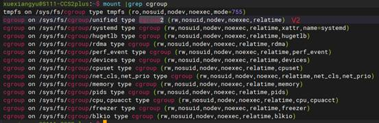
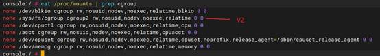

Linux cgroups（Control Groups，控制组）是一种Linux内核功能，用于限制、记录和隔离进程组（Process Groups）使用的物理资源（如CPU、内存、磁盘I/O等）。

## 应用场景

* Linux容器技术，如docker

  > --cpus=2 表示容器最多可以使用主机上两个 CPU
  >
  > ```
  > docker run -it --rm --cpus=2 u-stress:latest /bin/bash
  > ```
  >
  >  --cpuset-cpus="1"设置容器固定的运行在 CPU 1 上
  >
  > ```
  > docker run -it --rm --cpuset-cpus="1" u-stress:latest /bin/bash
  > ```

  这里的cpuset就是cgroups的一个子功能。

* 资源管理和性能优化。

  * 设置程序使用的CPU权重、 CPU 调度优先级
  * 限制进程组可以使用的 CPU 时间
  * 限制内存使用量
  * 限制磁盘 I/O 带宽
  * 限制网络带宽
  * 统计 CPU 使用时间
  * 统计内存、磁盘 I/O、网络的使用情况
  * 挂起和恢复进程组
  * 隔离命名空间
  * 动态调整资源限制，避免某个进程过度消耗资源影响其他进程
  * ...

## 主要组成部分

* **控制器（Controllers、subsystem）**： 控制器是cgroups的核心组成部分，每个控制器负责管理特定类型的资源。常见的控制器包括：
  * **cpu**：控制CPU资源的分配和限制。
  * **cpuacct**: 生成cgroup task使用的CPU资源使用报告
  * **cpuset**: 在多核系统上，为cgroups中的任务分配单独的CPU和内存节点
  * **memory**：限制进程的内存使用。
  * **blkio**：控制块设备I/O的权重和限速。
  * **devices**：限制访问设备的权限。
  * **net_cls**：为网络流量标记控制组，用于流量控制和调度。
  * **freezer**：冻结或恢复任务的执行状态
  * **perf_event**：允许使用 perf 工具监控 cgroups

* **层次结构（Hierarchy）**: 

  cgroups以层次结构的方式组织，所有 cgroup 组成一个**树形结构**。

  每个控制组可以包含子控制组。这种结构允许用户以层次方式分配资源，使得资源管理更加灵活。例如，可以为整个应用程序设置一个控制组，然后在其下为其中的每个子进程或线程创建子控制组。

* **进程组（Process Groups）**： 通过将进程的PID（进程ID）添加到特定的cgroup中，从而被纳入到某个控制组中，实现对其资源使用的控制。“组”是对进程的组织方式。每个组包含一个或多个进程。每个组拥有独立的资源限制和监控设置，或者继承上级的策略。

* **挂载点（Mount Points）**： cgroups的控制器通过文件系统挂载到特定的挂载点，通常是在`/sys/fs/cgroup`目录下。在挂载点下，可以访问和管理相关的cgroup属性和资源限制。

* **文件系统接口（Filesystem Interface）**： cgroups通过虚拟文件系统提供接口，用于设置和查看资源限制。用户可以通过操作相应的文件来进行配置。例如，可以向`/sys/fs/cgroup/memory/mygroup/memory.limit_in_bytes`写入值以限制内存使用。

对于开发者来说，重点关注的是**文件系统接口**，因为开发时直接和它打交道，并需要查阅接口文档。

但是需要先理解其它组成部分，才能做好开发。

## 源代码分布

`/kernel/cgroup/` 这个目录包含了cgroup的核心实现代码，如cgroup的创建、管理、层级结构等基础功能。

各个子系统的实现：

- CPU子系统: `/kernel/sched/`
- 内存子系统: `/mm/memcontrol.c`
- I/O子系统: `/block/blk-cgroup.c`
- 设备控制: `/security/device_cgroup.c`
- 网络分类: `/net/core/netclassid_cgroup.c`
- Freezer子系统: `/kernel/cgroup/freezer.c`

头文件：

  `/include/linux/cgroup-defs.h`

  `/include/linux/cgroup.h`

文档：

 `/Documentation/cgroup-v1/`

  `/Documentation/cgroup-v2.txt`

当然不同Linux Kernel 版本，存在一定差异。

## 版本差异

cgroup 有 v1 和 v2 两个版本，使用上差异比较大。

* cgroups V1： 为了提供灵活性，允许进程可以属于多个hierarchy的不同group。这种多hierarchy增加了代码的复杂度和理解困难，导致Cgroup在内核的实现一直比较混乱，受到很多人的诟病，有人甚至认为想应该将其从内核移出。

  一方面，跟踪进程所有controller变得复杂；另外，因为controller可能属于不同的hierarchy，各个controller之间也很难协同工作（例如：正是由于memcg与blkio没有协作，导致buffer io的throttle一直到内核4.2才实现）。

  在实际使用中，通常是每个hierarchy一个controller。

* cgroup V2: 基于过去的经验，开发了cgroup V2, 采用了一种更加统一的资源限制方法，简化了配置，使用更加简单。只有一个挂载点。同时有些方面功能做了增强，例如包含线程模式，支持线程粒度的资源控制。

* 当前并没有放弃cgroup V1。cgroup v2 支持的 controller 是 cgroup v1 的子集
* 某些控制器在cgroup v1中可用，但在cgroup v2中可能已经重命名、改进或被移除

以Linux kernel 4.4为例，持的cgroup controller，cgroup v1有12个：

```
blkio、cpu、cpuacct、cpuset、devices、freezer、memory、net_cls、perf_event、hugetlb、pids、net_prio
```

cgroup v2 支持的controller，总计6个：

```
cpu、memory、io、pid、rdma、perf_event
```


本人调查了我公司各个项目（日产、丰田，高通、ATC，涵盖android 9 ~ 14），发现都是同时启用了cgroups V1和cgroup V2。对于PC端，Ubuntu 24.04之前也是混用V1和V2。将来或许会完全用V2。

下图是ubuntu18：



第二行是V2，其它都是V1。

（注意cgroup v2 是单一层级树，只有一个挂载点；cgroup v1 根据控制器类型，每个控制器挂载到不同位置）

 

下图是CCS5.0 ，高通6155平台：



同样可以看到V1依然在大量使用，所以眼下V1和V2都需要研究。

同时存在V1和V2时，有一些规则：

* cgroup v1 和 cgroup v2 可以同时使用
* 但一个 controller 不能既在 cgroup v1 中使用又在 cgroup v2 中使用。即：你可以cpuset、memory用cgroup v1, freezer用cgroups V2； 但不能freezer即用V1又用V2。

## 控制器规范

遵循特定的结构规范（structural constraints），可以选择性地 针对一个 cgroup 启用或禁用某些控制器。

控制器的所有行为都是 hierarchical 的：

* 子控制组会继承父控制组的资源限制。如果一个 cgroup 启用了某个控制器，那这个 cgroup 的 sub-hierarchy 中所有进程都会受控制。
* 子控制组可以覆盖继承自父控制组的限制，为其设置不同的资源限制。这可以在动态调整资源分配时非常有用。
* 对具体控制器，继承可能存在一些限制，或更复杂的规则。例如，在`memory`控制器中，子控制组的内存限制不能超过父控制组的限制。如果父控制组限制了100MB的内存，子控制组最多只能设置100MB或更小的限制。
* 在同一个层次结构中，不同控制器的设置通常是独立的。
* 从cgroup v1迁移到cgroup v2的进程，并不会自动继承父控制组的某些配置和限制。需要手动进行相应的配置和调整。

## 使用方式

* 面向系统用户，cgroups 将控制组以虚拟文件系统的方式呈现（通常挂载在/sys/fs/cgroup/），展示出一个树形的文件目录，通过目录中文件接口来调整控制组以及涉及的 subsystem。

* 面向内核开发，cgroups 定义了一套内核 API，支持各种 subsystem 的接入。

接口文件的语法:

* 换行符分隔的值（每次 write 操作只允许写入一个值）

```
 VAL0\n
 VAL1\n
 ...
```

* 空格分隔的值（只读场景，或一次可写入多个值的场景）

```
 VAL0 VAL1 ...\n
```

* 扁平 key 类型 （flat keyed，每行一个 key value 对）

```
 KEY0 VAL0\n
 KEY1 VAL1\n
 ...
```

* 嵌套 key 类型（nested keyed，每行一个 Key value 对，其中 value 中又包含 subkey/subvalue）

```
KEY0 SUB_KEY0=VAL00 SUB_KEY1=VAL01...
KEY1 SUB_KEY0=VAL10 SUB_KEY1=VAL11...
...
```


 ## 参考资料

https://www.kernel.org/doc/Documentation/cgroup-v1/cgroups.txt
中文翻译：https://www.cnblogs.com/hellokitty2/p/14227678.html

https://www.kernel.org/doc/html/v5.10/admin-guide/cgroup-v2.html