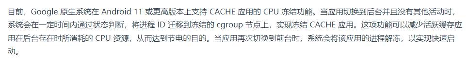
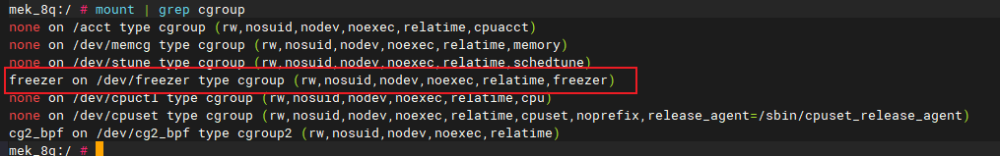
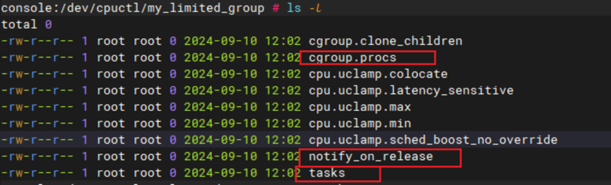
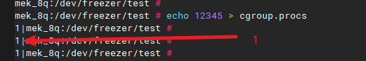
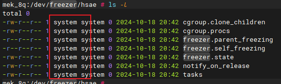

在CCS2.0上面操作。

1. 查看支持的controller：

```shell
mek_8q:/ # cat /proc/cgroups                                                   
#subsys_name    hierarchy       num_cgroups     enabled
cpuset  6       6       1
cpu     5       1       1
cpuacct 1       144     1
schedtune       3       5       1
blkio   0       1       1
memory  2       3       1
devices 0       1       1
freezer 4       1       1
perf_event      0       1       1
hugetlb 0       1       1
pids    0       1       1
debug   0       1       1
```

可以看到ccs2.0（安卓9）是支持freezer的。有关资料称：谷歌直到android 11 才支持，指的是安卓系统到11才使用这个功能。



2. 查看进程的 cgroup 信息：` cat /proc/$PID/cgroup `,比如init进程id是1：

```shell
mek_8q:/ # cat /proc/1/cgroup   
6:cpuset:/
5:cpu:/
3:schedtune:/
2:memory:/
1:cpuacct:/
0::/
```

v2 对应的行永远是 `0::$PATH` 格式，其它是V1, 每个 hierarchy 一行。

 

3. 查看当前已经启用的controller：

```shell
mek_8q:/ # mount | grep cgroup
none on /acct type cgroup (rw,nosuid,nodev,noexec,relatime,cpuacct)
none on /dev/memcg type cgroup (rw,nosuid,nodev,noexec,relatime,memory)
none on /dev/stune type cgroup (rw,nosuid,nodev,noexec,relatime,schedtune)
none on /dev/cpuctl type cgroup (rw,nosuid,nodev,noexec,relatime,cpu)
none on /dev/cpuset type cgroup (rw,nosuid,nodev,noexec,relatime,cpuset,noprefix,release_agent=/sbin/cpuset_release_agent)
cg2_bpf on /dev/cg2_bpf type cgroup2 (rw,nosuid,nodev,noexec,relatime)
```

4. 启用freezer controller

   cgroups 的使用方式是，先mount到一个虚拟文件系统，这个文件系统的文件就是与用户空间的接口。通过读写文件来调整和控制group。

   通过前面的操作，我们知道ccs2.0的内核支持freezer，但是mount显示这个功能并没有启用，因此执行以下命令：

```shell
mek_8q:/ # mount -t cgroup -ofreezer freezer /dev/freezer
mek_8q:/ # mount | grep cgroup
none on /acct type cgroup (rw,nosuid,nodev,noexec,relatime,cpuacct)
none on /dev/memcg type cgroup (rw,nosuid,nodev,noexec,relatime,memory)
none on /dev/stune type cgroup (rw,nosuid,nodev,noexec,relatime,schedtune)
freezer on /dev/freezer type cgroup (rw,nosuid,nodev,noexec,relatime,freezer)
none on /dev/cpuctl type cgroup (rw,nosuid,nodev,noexec,relatime,cpu)
none on /dev/cpuset type cgroup (rw,nosuid,nodev,noexec,relatime,cpuset,noprefix,release_agent=/sbin/cpuset_release_agent)
cg2_bpf on /dev/cg2_bpf type cgroup2 (rw,nosuid,nodev,noexec,relatime)
```



这显然是cgroup V1。


5. cgroup的接口文件

   

   不同的controller，不同版本（V1或V2）接口文件不一样，但是上图框起来的文件是共通的。

   * tasks： 把线程ID（tid）写入tasks文件，那么这个线程就加入了此cgroup。
   * cgroup.procs：把线程组ID写入此文件。线程组id就是进程id。当pid写入cgroup.procs，该进程的所有线程都会加入到tasks。
   * notify_on_release 标志：用于配置当cgroup中的最后一个任务退出时是否触发释放通知。该文件的内容为 1 时，当 cgroup 退出时（不再包含任何进程和子 cgroup），将调用 release_agent 里面配置的命令。
   * cgroup.clone_children：这个文件只对 cpuset subsystem 有影响，当该文件的内容为 1 时，新创建的 cgroup 将会继承父 cgroup 的配置
   * release_agent：里面包含了 cgroup 退出时将会执行的命令。这个文件只会存在于 root cgroup 下面。

   每个子系统在此基础上，添加自己的文件接口。

   

6. 写入

   往接口文件里写入数据，标准使用echo指令。这些文件不是普通文件，你不能用vim打开编辑。

   例如：

   ```
   # 把进程111添加到当前目录代表的控制组
   echo 111 > cgroup.procs
   ```

   可能有人会想到，对于普通文件，`echo xxx > file` 表示清空file，并写入xxx。追加应该使用双箭头：`echo 111 >> cgroup.procs`。

   然而cgroup fs下的不是普通文件，使用单箭头。

   如果当前不存在pid=111的进程，这行指令返回异常：

   

   另外注意一下权限问题。当然权限可以是root、system或其它用户都行，但是如果像下图这样，用户所有者是system：

   

   那么也许你会理所当然的认为，只要有rw标志，system就可以写。

   然而实际情况是：

   * root用户具有最高权限，当然可以读写文件没问题。
   * root和system以外的用户不具备写权限，这也符合常识。

   * 但system用户**不具有完整的写权限**，具体：
     * `freezer.`开头的几个文件是有权限写入的
     * 但是cgroup.procs、tasks这几个文件，也只有当目标进程同为system时，才能成功写入

   也就是说，除外root 账号,用户只能操作属于自己的进程，不能操作其他用户的进程，否则群魔乱舞，谁都能创建控制组并操控其它进程了。

   如果进程111的user刚好是system，那么echo 111 > cgroup.procs写入成功，如果不是system，拒绝写入。

   所以最好是，始终以root身份运行。

   （目前我不清楚这个权限限制是不是安卓独有）

   

7. 移除进程

   通过`echo 111 > cgroup.procs`把pid 111写入了cgroup.procs，那么怎么从cgroup.procs移除呢？

   PC端Linux可以安装一些管理cgroup的三方工具。对于android，没有额外的工具，只能使用原始命令直接操作底层。那么我可以直接说：没有命令可以直接从cgroup.procs中移除一个pid。

   首先我们要理解下面几点：

   * 在一颗 cgroup 树里面，一个进程必须要属于一个 cgroup。
     所以不能凭空从一个 cgroup 里面删除一个进程，只能将一个进程从一个cgroup 移到另一个 cgroup
   * 新创建的子进程将会自动加入父进程所在的 cgroup。

   所以，直接从`/dev/freezer/test/cgroup.procs`删除pid本来就是不符合逻辑的。

   当你在android shell里运行一个进程时（假设pid=111）

   * 系统自动将111加到了根路径的cgroup.procs，也就是/dev/freezer/cgroup.procs
   * 然后当你执行`echo 111 > ./test/cgroup.procs`后，111从根路径的cgroup.procs转移到了test/cgroup.procs。

   所以很明显，所谓移除，只要再次将111写入根路径的cgroup.procs即可。如果对根路径，没有权限，也可以创建一个新的组，把进程写入

   

   演示：

   ```shell
   mek_8q:/dev/freezer/0 # mkdir ../1
   mek_8q:/dev/freezer/0 # cd ../1
   mek_8q:/dev/freezer/1 # cat ../0/cgroup.procs                                  
   5057
   mek_8q:/dev/freezer/1 # cat cgroup.procs                                       
   mek_8q:/dev/freezer/1 # echo 5057 > cgroup.procs
   mek_8q:/dev/freezer/1 # cat ../0/cgroup.procs    
   mek_8q:/dev/freezer/1 # cat cgroup.procs                                       
   5057
   mek_8q:/dev/freezer/1 #
   
   ```

   8. 挂载
   
      cgroup v2只有一个挂载点。对于cgroup v1，语法为:
   
      ```shell
      mount -t cgroup -o subsystems name /dev/cgroup/name
      ```
   
      - 其中 subsystems 表示需要挂载的 cgroups 子系统
      - /dev/cgroup/name 表示挂载点（一般为具体目录）
   
   9. 卸载
   
      ```shell
      umount /dev/cgroup/name
      ```
   
   10. 创建层级目录
   
       用mkdir在父 cgroup创建一个子目录即可。目录下会自动生成接口文件。
   
   11. 删除
   
       删除对应目录即可。如果有多层 cgroup 则需要先删除子 cgroup，否则会报Device or resource busy。
   
       