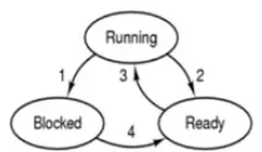
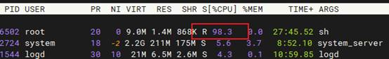
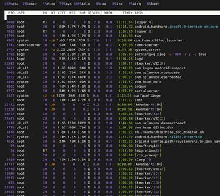
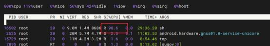
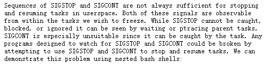

本节和cgroups没关系，但作为冻结机制的关联知识，有必要一起了解下。

安卓基于linux，linux内核有冻结的机制。回顾操作系统原理，我们知道进程包括三种基本状态：



对于linux系统，可以使用SIGSTOP 和 SIGCONT 信号停止和恢复一个进程。通过kill –STOP，把进程状态设置为阻塞挂起。kill -CONT命令恢复。

 

**实验【**基于CCS 2.0+,安卓9**】**

1. 执行死循环：while :;do :;done&



CPU 100%，进程状态是R。

 

  S：等待态
 ​ T：停止态
 ​ R：运行态
 ​ Z：僵尸态

2. 执行 kill -STOP 16502



执行top，看不到此进程。表明已经不占用CPU。查看进程状态：

```shell
mek_8q:/ # ps -p 16502 -o pid,stat,cmd
 PID STAT CMD
16502 T   sh
```

状态已经变成T

 

3. 恢复，执行kill -CONT 16502

```shell
mek_8q:/ # kill -CONT 16502
mek_8q:/ # ps -p 16502 -o pid,stat,cmd
 PID STAT CMD
16502 R   sh
```




 利用这种方法，可以实现进程的挂起、恢复，但是存在一些不足：



（这段文字来自https://www.kernel.org/doc/Documentation/cgroup-v1/freezer-subsystem.txt）。

解释一下这段话意思：

存在一些场景，使得SIGSTOP 和 SIGCONT 信号不能停止和恢复任务。这两种信号都可以被我们想要冻结的任务观察到。虽然 SIGSTOP 不能被捕获、阻塞或忽略，但它可以被正在等待或使用 ptrace 的父任务看到。SIGCONT可以被任务捕获。任何设计用来监视 SIGSTOP 和 SIGCONT 的程序可能会因为尝试使用 SIGSTOP 和 SIGCONT 来停止和恢复任务而被破坏。

我们来执行一段脚本，在一个shell里面开一个子shell：

```shell  
$ echo $$
 16644
$ bash
$ echo $$
 16690
```


然后再开一个不相干的shell窗口,执行：

```shell
    $ kill -SIGSTOP 16690
    $ kill -SIGCONT 16690
```


16690 退出，然后导致 16644 也退出。

这种情况发生是因为 bash 可以观察到这两种信号，并选择如何响应它们。

相比之下，cgroup 冻结器使用内核冻结器代码来防止冻结/解冻循环对被冻结的任务可见。

因此我们通过cgroup来实现功能。

 