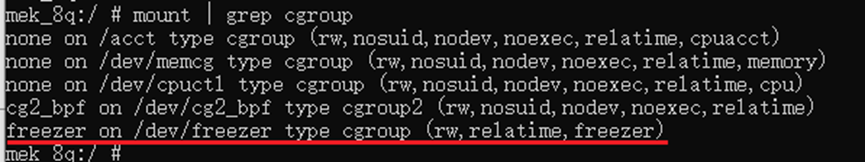
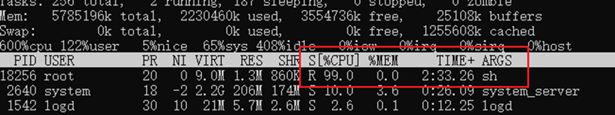
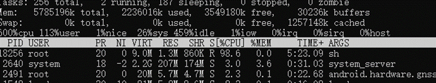

基于CCS2.0，安卓版本是 Android 9 。以freezer-subsystem为例，演示冻结进程。

1．挂载

```shell
mek_8q:/ # cd dev
mek_8q:/dev # mkdir freezer
mek_8q:/dev # mount -t cgroup -ofreezer freezer /dev/freezer 
```




2. 查看虚拟文件接口

  ```shell
  mek_8q:/dev/freezer # mkdir 0 
  mek_8q:/dev/freezer # cd 0
  mek_8q:/dev/freezer/0 # ls
  cgroup.clone_children freezer.parent_freezing freezer.state     tasks 
  cgroup.procs          freezer.self_freezing   notify_on_release 
  ```

  通过往freezer.state文件里写入，来控制任务。

3. 模拟一个高负载程序，通过脚本：

  ```shell
  mek_8q:/dev/freezer/0 # while :;do :;done&
  [1] 18256
  ```

  此时18256进程的CPU是100%。

  

4. 冻结这个进程，先把它配置到tasks

  ```shell
  mek_8q:/dev/freezer/0 # echo 18256 > tasks                                     
  mek_8q:/dev/freezer/0 # cat freezer.state                                      
  THAWED
  ```

  往freezer.state里写入FROZEN

  ```shell
  mek_8q:/dev/freezer/0 # echo FROZEN > freezer.state
  ```

  `top -p 18256`可以看到进程的cpu占用是0。

5. 解冻

```
mek_8q:/dev/freezer/0 # echo THAWED > freezer.state
```

​	