## /proc/sys/kernel/的文件

* sched_child_runs_first
* sched_deadline_period_max_us
* sched_deadline_period_min_us
* sched_boost
* sched_pelt_multiplier
* sched_energy_aware
* sched_rr_timeslice_ms
* sched_rt_period_us
* sched_rt_runtime_us
* sched_util_clamp_max和sched_util_clamp_min
* sched_util_clamp_min_rt_default

### sched_child_runs_first

`/proc/sys/kernel/sched_child_runs_first`是Linux内核中的一个配置文件，它用于控制调度器如何处理新创建的进程（即子进程）与它们的父进程之间的关系。

#### 功能说明：

- **sched_child_runs_first**：这个文件的值决定了当一个新进程（子进程）被创建时，调度器是否优先给予这个子进程CPU时间片。如果设置为1，表示子进程在创建后会立即运行，直到它自己决定放弃CPU时间片或被其他进程抢占。如果设置为0，则子进程会按照常规的调度策略运行。

#### 使用场景：

- **调试和测试**：在某些调试或测试场景中，可能需要观察子进程的行为，这时可以通过设置`sched_child_runs_first`来确保子进程能够立即运行。
- **特定应用需求**：某些特定应用可能需要在子进程创建后立即执行某些操作，这时可以通过调整这个参数来满足需求。

#### 值的设置：

- **0**：默认值，子进程按照常规调度策略运行。
- **1**：子进程在创建后会立即运行。

#### 访问和修改：

你可以通过以下命令查看当前的设置：

```bash
cat /proc/sys/kernel/sched_child_runs_first
```

要修改这个值，可以使用以下命令：

```bash
echo 1 > /proc/sys/kernel/sched_child_runs_first
```

或者

```bash
echo 0 > /proc/sys/kernel/sched_child_runs_first
```

请注意，这个设置可能会影响系统的调度策略和性能，因此建议在了解其影响的情况下进行调整。通常，这个文件的默认值是0，即子进程按照常规的调度策略运行。

#### 影响

- 当设置为1时，新创建的子进程会立即运行，直到它主动放弃CPU时间片或被其他进程抢占。这可能会导致某些进程长时间占用CPU，从而影响其他进程的调度和执行，特别是在多任务环境中。
- 如果设置为0，子进程会按照常规的调度策略运行，这有助于更公平地分配CPU资源。

### sched_deadline_period_max_us

`/proc/sys/kernel/sched_deadline_period_max_us` 是 Linux 内核中的一个调度参数，它定义了调度器在调度实时进程时的最大时间片（以微秒为单位）。这个参数主要用于控制实时进程的调度策略，确保实时任务能够获得足够的 CPU 时间来满足其时间约束。

#### 功能说明：

- **sched_deadline_period_max_us**：这个参数的值决定了调度器在调度实时进程时，每个调度周期的最大时间长度。单位是微秒（us）。

#### 使用场景：

- **实时任务**：对于需要严格时间保证的任务（如音频、视频处理或某些工业控制应用），这个参数可以确保这些任务在每个调度周期内都能获得一定的 CPU 时间，从而满足实时性要求。

#### 影响：

1. **实时性保证**：

- 增加这个值可以提高实时任务的调度频率，从而提高任务的响应时间。这对于需要高实时性的应用是有益的。

1. **系统负载**：

- 增加这个值可能会导致系统负载增加，因为调度器需要更频繁地进行调度决策。这可能会影响其他非实时任务的调度和执行。

1. **资源分配**：

- 调整这个值可以影响实时任务与其他任务之间的资源分配。如果设置得过高，可能会减少非实时任务的 CPU 时间，从而影响它们的性能。

1. **系统稳定性**：

- 适当调整这个值可以帮助平衡实时任务和非实时任务之间的资源需求，从而提高系统的稳定性和响应性。

#### 访问和修改：

你可以通过以下命令查看当前的设置：

```bash
cat /proc/sys/kernel/sched_deadline_period_max_us
```

要修改这个值，可以使用以下命令：

```bash
echo 值 > /proc/sys/kernel/sched_deadline_period_max_us
```

例如：

```bash
echo 500000 > /proc/sys/kernel/sched_deadline_period_max_us
```

这会将调度周期的最大时间片设置为500000微秒（即500毫秒）。

#### 注意：

- 调整这个参数可能会对系统的整体性能和稳定性产生影响，特别是在高负载或多任务环境中。建议在了解其影响的情况下进行调整，并在必要时进行测试和监控。
- 这个参数主要针对实时任务和实时调度策略，对于一般的非实时任务，其影响可能不明显。
- 通常，`sched_deadline_period_min_us` 和 `sched_deadline_period_max_us` 一起使用，以确保实时任务在每个调度周期内都能获得一定的 CPU 时间，同时避免过度调度导致的系统负载增加。

通过合理配置这些参数，可以更好地满足实时任务的时间约束，同时保持系统的整体性能和稳定性。


### sched_deadline_period_min_us

`/proc/sys/kernel/sched_deadline_period_min_us` 是 Linux 内核中的一个参数，它与调度器的实时调度特性有关。这个参数定义了调度器在调度实时进程时的最小时间片（以微秒为单位）。具体来说，它控制了调度器在调度实时进程时，每个时间片的最小持续时间。

#### 功能说明：

- **sched_deadline_period_min_us**：这个参数的值决定了调度器在调度实时进程时，每个调度周期的最小时间长度。单位是微秒（us）。

#### 使用场景：

- **实时任务**：对于需要严格时间保证的任务（如音频、视频处理或某些工业控制应用），这个参数可以确保这些任务在每个调度周期内都能获得一定的CPU时间，从而满足实时性要求。

#### 影响：

1. **实时性保证**：

- 增加这个值可以提高实时任务的调度频率，从而提高任务的响应时间。这对于需要高实时性的应用是有益的。

1. **系统负载**：

- 增加这个值可能会导致系统负载增加，因为调度器需要更频繁地进行调度决策。这可能会影响其他非实时任务的调度和执行。

1. **资源分配**：

- 调整这个值可以影响实时任务与其他任务之间的资源分配。如果设置得过高，可能会减少非实时任务的CPU时间，从而影响它们的性能。

1. **系统稳定性**：

- 适当调整这个值可以帮助平衡实时任务和非实时任务之间的资源需求，从而提高系统的稳定性和响应性。

1. **调试和测试**：

- 在调试和测试期间，调整这个值可以帮助开发者观察和评估实时任务的调度行为和性能。

#### 访问和修改：

你可以通过以下命令查看当前的设置：

```bash
cat /proc/sys/kernel/sched_deadline_period_min_us
```

要修改这个值，可以使用以下命令：

```bash
echo 值 > /proc/sys/kernel/sched_deadline_period_min_us
```

例如：

```bash
echo 100000 > /proc/sys/kernel/sched_deadline_period_min_us
```

这会将调度周期的最小时间片设置为100000微秒（即100毫秒）。

#### 注意：

- 调整这个参数可能会对系统的整体性能和稳定性产生影响，特别是在高负载或多任务环境中。建议在了解其影响的情况下进行调整，并在必要时进行测试和监控。
- 这个参数主要针对实时任务和实时调度策略，对于一般的非实时任务，其影响可能不明显。


### sched_boost

`/proc/sys/kernel/sched_boost` 是 Linux 系统中用于控制调度器行为的一个文件，主要通过影响任务的放置（Task placement）来进行性能提升（boost）。以下是其作用及影响的详细说明：

1. **作用**：

- `/proc/sys/kernel/sched_boost` 主要通过影响任务的放置来提升系统性能。它属于高通（QTI）的 EAS（Energy Aware Scheduling）的一部分。默认情况下，任务会被分配到负载最轻的 CPU 上，如果有多个 CPU 负载相同，则会分配到系统中容量最大的 CPU 上。
- 可以通过设置该节点或调用内核函数 `sched_set_boost()` 来进行调度提升，并在分配任务时忽略对能源消耗的考虑。

1. **影响**：

- **功耗**：如果 `/proc/sys/kernel/sched_boost` 设置异常，可能会导致系统功耗上升。例如，一直处于提升状态可能会导致所有场景的功耗增加。

- 任务迁移

  ：在不同的提升模式下，任务迁移策略会有所不同。例如：

  - **Full throttle（全速）**：通过核心控制（core control）和频率聚合（freq aggregation），将所有 CPU 都进行 unisolation，并将任务尽可能放在大核运行。
  - **Conservative（保守）**：仅让 top-app 和 foreground 组进行任务放置提升，提高任务迁移的门槛，只有负载较大的任务才会进行迁移。
  - **Restrained（受限）**：通过频率聚合放大负载计算，触发提升频率或迁移，但仍遵循基本的 EAS（Energy Aware Scheduling）。

1. **设置方法**：

- 通过修改 `/proc/sys/kernel/sched_boost` 文件的值或调用 `sched_set_boost()` 函数来设置调度提升。一旦设置后，必须显式写入 0 来关闭提升。
- 支持多个应用同时调用设置，系统会选择提升等级最高的生效，当所有应用都关闭提升时，提升才会真正失效。

1. **提升等级**：

- ```
  /proc/sys/kernel/sched_boost
  ```

   

  有四个等级：

  - **0**：关闭提升
  - **1**：Full throttle（全速）
  - **2**：Conservative（保守）
  - **3**：Restrained（受限）

1. **实现机制**：

- 在内核中，通过调用 `_sched_set_boost()` 函数来设置提升。该函数会根据类型参数（type）判断是否启用或禁用提升，并更新系统的有效提升类型。
- 设置提升策略时，会调用 `set_boost_policy()` 函数来体现任务是否需要进行向上迁移（up migrate）。

通过合理配置 `/proc/sys/kernel/sched_boost`，可以在需要时提升系统性能，但也要注意其对功耗和任务迁移的影响。


### sched_pelt_multiplier

`sched_pelt_multiplier` 是 Linux 内核调度器中的一个参数，用于控制 PELT（Proportional Integral Load Tracking）算法的响应速度。以下是其作用及影响的详细说明：

1. **作用**：

- `sched_pelt_multiplier` 允许用户设置一个时钟乘数，以加速 PELT 的上升和下降过程，类似于使用更快的半衰期。默认值为 x1，也可以设置为 x2 或 x4。
- 具体来说：
  - x1：32ms 半衰期
  - x2：16ms 半衰期
  - x4：8ms 半衰期

1. **影响**：

- **响应时间**：通过缩短 PELT 的半衰期，可以提高调度器对系统负载变化的响应速度，从而改善任务的响应时间。这对于需要快速响应的显示管道任务（如高刷新率的显示任务）尤其重要。使用较短的 PELT 半衰期可以提高显示任务的最小和平均帧率（FPS），并提高某些基准测试（如 PCMark 网络浏览）的得分。
- **能耗**：虽然缩短 PELT 半衰期可以提高响应时间和性能，但也可能会增加能耗。这是因为更快的响应速度可能会使 CPU 更频繁地调整其频率，从而消耗更多的能量。
- **稳定性**：PELT 半衰期必须大于或等于调度周期。较短的半衰期可能会影响 PELT 的稳定性，尤其是在多核设备上。例如，如果调度周期为 24ms，使用 16ms 或 8ms 的 PELT 半衰期可能会违反这一要求。
- **任务迁移**：使用较短的 PELT 半衰期可能会影响任务迁移策略。调度器会根据 PELT 信号来决定任务是否需要迁移到其他 CPU。较短的半衰期可能会导致任务迁移更加频繁，从而影响系统的整体性能。

1. **实现机制**：

- 在内核中，通过引入一个新的时钟 `rq->clock_task_mult` 来实现 `sched_pelt_multiplier`。这个时钟位于 `rq->clock_task` 和 `rq->clock_pelt` 之间，通过左移时间来实现较短的 PELT 半衰期。
- 通过修改 `/proc/sys/kernel/sched_pelt_multiplier` 文件的值或调用相应的内核函数来设置 PELT 乘数。设置后，调度器会根据新的乘数来调整 PELT 的响应速度。

1. **潜在问题**：

- **PELT 稳定性要求**：PELT 半衰期必须大于或等于调度周期。使用较短的半衰期可能会违反这一要求，从而影响 PELT 的稳定性。
- **PELT 历史值**：在运行时更改 PELT 乘数会导致 PELT 历史值变得不准确，从而影响基于 PELT 的决策。这可能会在 PELT 乘数转换期间导致错误的调度决策。

通过合理配置 `sched_pelt_multiplier`，可以在需要快速响应的场景中提高系统性能，但也需要权衡能耗和稳定性的影响。


### sched_energy_aware

`sched_energy_aware` 是 Linux 内核调度器中的一个功能，称为能量感知调度（Energy Aware Scheduling，EAS）。以下是其作用及影响的详细说明：

1. **作用**：

- **能量优化**：EAS 使调度器能够预测其决策对 CPU 能量消耗的影响。它依赖于 CPU 的能量模型（Energy Model，EM）来为每个任务选择一个能效高、对吞吐量影响最小的 CPU 。
- **异构 CPU 支持**：EAS 仅在异构 CPU 拓扑（如 Arm big.LITTLE）上运行，因为这是通过调度实现节能潜力最大的地方 。
- **调度决策**：当调度器决定任务应该在哪个 CPU 上运行时（在唤醒期间），能量模型用于在多个良好的 CPU 候选项之间进行选择，并选择预测能够在不损害系统吞吐量的情况下产生最佳能量消耗的 CPU 。

1. **影响**：

- **性能与能耗平衡**：EAS 的目标是在保持良好性能的同时，最小化能量消耗。它通过调度任务到能效更高的 CPU 上来实现这一点 。
- **任务迁移**：EAS 会评估任务迁移到不同 CPU 上的能量消耗，并选择能量消耗最低的迁移方案。例如，将任务从一个小核迁移到一个大核上，尽管大核的功耗更高，但可能会因为整体系统负载的优化而更节能 。
- **调度策略**：EAS 改变了 CFS 任务分配给 CPU 的方式，使得调度器在选择任务运行的 CPU 时，不仅考虑任务的负载，还考虑能量消耗 。

1. **实现机制**：

- **能量模型**：EAS 使用的能量模型不是由调度器维护的，而是由一个专门的框架维护。该框架提供了平台的功耗表，调度器在构建或重建调度域时使用这些信息 。
- **调度域重建**：调度器在构建或重建调度域时，需要重新构建调度域以启动 EAS。这需要系统中每个“性能域”的功耗表 。
- **过载识别**：EAS 会检测 CPU 的利用率，并在 CPU 被过度利用时（超过 80% 的算力）禁用 EAS，以避免影响系统性能 。

1. **依赖与要求**：

- **异构 CPU 拓扑**：EAS 仅支持具有不对称 CPU 拓扑的平台，如 Arm big.LITTLE。这是因为在这种情况下，通过调度来节约能量的潜力最大 。
- **能量模型**：平台必须提供功耗表给能量模型框架，以便 EAS 能够启动 。
- **调度利用信号**：EAS 需要频率不变和 CPU 不变的 PELT 信号，这些信号可以通过架构定义的回调函数提供 。

1. **示例**：

- 考虑一个有两个独立性能域的平台，每个性能域包含 2 个 CPU。CPU0 和 CPU1 是小核，CPU2 和 CPU3 是大核。调度器需要决定将任务 P 放在哪个 CPU 上。通过 EAS，调度器会评估任务 P 在不同 CPU 上运行的能量消耗，并选择最节能的方案 。

通过合理配置和使用 EAS，可以在保持系统性能的同时，显著降低能耗，特别是在异构 CPU 系统中。


### sched_rr_timeslice_ms

`sched_rr_timeslice_ms` 是 Linux 内核调度器中的一个参数，用于控制实时调度类（Real-Time Scheduling Class）的任务的时间片（timeslice）。以下是其作用及影响的详细说明：

1. **作用**：

- `sched_rr_timeslice_ms` 定义了实时调度类任务在被抢占之前可以运行的时间片长度，单位为毫秒（ms）。
- 实时调度类任务是指那些具有较高优先级，需要尽快执行的任务。这些任务通常用于需要快速响应的系统，如实时控制和多媒体处理。

1. **影响**：

- **任务响应时间**：通过设置合适的时间片长度，可以确保实时任务能够及时获得 CPU 资源，从而减少任务的响应时间。
- **系统负载**：如果时间片设置过长，可能会导致低优先级任务的响应时间增加，影响系统的整体性能。相反，如果时间片设置过短，可能会导致频繁的上下文切换，增加系统的负载。

1. **调度策略**：

- 在实时调度类中，任务按照固定的时间片轮转执行。当一个任务的时间片耗尽时，调度器会将其放回运行队列的末尾，并选择下一个任务执行。
- 这种调度策略确保了所有实时任务都能公平地获得 CPU 资源，避免了某些任务长时间占用 CPU 而影响其他任务的执行。

1. **设置方法**：

- 可以通过修改 `/proc/sys/kernel/sched_rr_timeslice_ms` 文件的值来设置实时调度类的时间片长度。例如：

  ```bash
  echo 20 > /proc/sys/kernel/sched_rr_timeslice_ms
  ```

  这将设置实时调度类的时间片为 20 毫秒。

1. **依赖与要求**：

- 使用 `sched_rr_timeslice_ms` 需要系统支持实时调度类。大多数现代 Linux 内核都支持这种调度策略。

1. **示例**：

- 假设你有一个需要快速响应的实时任务，你希望它能够每 10 毫秒执行一次。你可以通过设置 `sched_rr_timeslice_ms` 为 10 来实现：

  ```bash
  echo 10 > /proc/sys/kernel/sched_rr_timeslice_ms
  ```

通过合理配置 `sched_rr_timeslice_ms`，可以确保实时任务能够及时获得 CPU 资源，从而提高系统的响应速度和实时性。然而，也需要权衡系统的整体负载和性能，避免过度的上下文切换和资源竞争。


### sched_rt_period_us

`sched_rt_period_us` 是 Linux 内核调度器中的一个参数，它的作用是为实时调度类（Real-Time Scheduling Class）的任务设定一个调度周期。以下是其详细的作用和影响：

1. **定义调度周期**：

- `sched_rt_period_us` 指定了实时任务的调度周期，单位为微秒（us）。这意味着调度器会在这个周期内重新调度实时任务，确保它们能够按照预定的时间间隔运行。

1. **保证任务的实时性**：

- 对于需要严格时间保证的实时任务，如音频/视频处理、工业控制等，`sched_rt_period_us` 确保这些任务能够在每个周期开始时获得 CPU 资源，从而满足实时性要求。

1. **调度策略**：

- 在实时调度类中，任务通常按照固定周期执行。调度器会在每个周期结束时重新调度这些任务，或者在更高优先级的任务出现时进行抢占。

1. **影响系统性能**：

- 设置较短的调度周期可以提高任务的响应速度，但可能会导致系统负载增加，因为需要更频繁地进行任务调度和上下文切换。
- 设置较长的调度周期可以减少调度频率，降低系统负载，但可能会影响任务的实时性。

1. **配置方法**：

- 可以通过修改 `/proc/sys/kernel/sched_rt_period_us` 文件的值来设置实时调度类的调度周期。例如：

  ```bash
  echo 10000 > /proc/sys/kernel/sched_rt_period_us
  ```

  这将设置实时调度类的调度周期为 10000 微秒（10 毫秒）。

1. **依赖与要求**：

- 使用 `sched_rt_period_us` 需要系统支持实时调度类（如 SCHED_FIFO 或 SCHED_RR）。大多数现代 Linux 内核都支持这种调度策略。

1. **示例**：

- 如果你有一个需要每 10 毫秒执行一次的实时任务，你可以通过设置 `sched_rt_period_us` 为 10000 来实现：

  ```bash
  echo 10000 > /proc/sys/kernel/sched_rt_period_us
  ```

通过合理配置 `sched_rt_period_us`，可以确保实时任务能够按照预定的周期获得 CPU 资源，从而提高系统的响应速度和实时性。然而，也需要权衡系统的整体负载和性能，避免过度的上下文切换和资源竞争。

需要注意的是，`sched_rt_period_us` 参数在某些内核版本中可能不直接存在，或者其行为和名称可能有所不同。在这种情况下，可以通过查看内核文档或使用 `sysctl` 命令来获取更多信息。


### sched_rt_runtime_us

`sched_rt_runtime_us` 是 Linux 内核调度器中的一个参数，用于控制实时调度类任务的运行时间。以下是其详细的作用和影响：

1. **定义运行时间**：

- `sched_rt_runtime_us` 指定了在每个调度周期内，实时任务可以运行的时间长度，单位为微秒（us）。这个参数确保了实时任务在每个周期内获得一定的 CPU 时间。

1. **调度周期**：

- 与 `sched_rt_period_us` 配合使用，后者定义了调度周期的长度。例如，如果 `sched_rt_period_us` 为 1000000（1秒），则 `sched_rt_runtime_us` 可以设置为 950000（950毫秒），这意味着实时任务在每个周期内可以运行 950 毫秒，剩余的 50 毫秒留给其他任务。

1. **带宽控制**：

- `sched_rt_runtime_us` 通过限制实时任务的运行时间来控制其带宽。这有助于防止实时任务占用过多的 CPU 资源，从而影响系统的整体性能。

1. **系统性能影响**：

- 设置较短的 `sched_rt_runtime_us` 值可以增加实时任务的调度频率，但可能会导致系统负载增加，因为需要更频繁地进行任务调度和上下文切换。相反，设置较长的值可以减少调度频率，但可能会影响实时任务的响应时间。

1. **配置方法**：

- 可以通过修改 `/proc/sys/kernel/sched_rt_runtime_us` 文件的值来设置实时任务的运行时间。例如：

  ```bash
  echo 950000 > /proc/sys/kernel/sched_rt_runtime_us
  ```

  这将设置实时任务的运行时间为 950000 微秒（950 毫秒）。

1. **默认行为**：

- 默认情况下，`sched_rt_runtime_us` 的值为 950000（0.95 秒），这意味着实时任务在每个周期内可以运行 95% 的时间，剩余 5% 的时间留给其他任务。

1. **禁用带宽限制**：

- 将 `sched_rt_runtime_us` 设置为 -1 可以禁用对实时任务的带宽限制，使得实时任务可以无限制地运行。

1. **多核处理器**：

- 在多核处理器系统中，每个 CPU 可以独立地执行实时任务。通过设置 `sched_rt_runtime_us`，可以确保每个 CPU 上的实时任务都按照预定的带宽运行。

通过合理配置 `sched_rt_runtime_us`，可以确保实时任务在每个周期内获得必要的 CPU 时间，从而提高系统的响应速度和实时性。同时，也需要权衡系统的整体负载和性能，避免过度的上下文切换和资源竞争。


### sched_util_clamp_max和sched_util_clamp_min

`sched_util_clamp_max` 和 `sched_util_clamp_min` 是 Linux 内核调度器中的两个参数，它们用于控制调度器在计算任务的 CPU 利用率时的上下限。以下是这两个参数的作用和影响：

1. **作用**：

- `sched_util_clamp_max`：设置 CPU 利用率的最大限制。当任务的 CPU 利用率超过这个值时，调度器会减少其 CPU 时间，以避免任务占用过多的 CPU 资源。
- `sched_util_clamp_min`：设置 CPU 利用率的最小限制。当任务的 CPU 利用率低于这个值时，调度器会增加其 CPU 时间，以确保任务能够获得足够的 CPU 资源。

1. **影响**：

- **任务调度**：通过限制任务的 CPU 利用率，调度器可以更公平地分配 CPU 资源，避免某些任务长时间占用 CPU 而影响其他任务的执行。
- **系统性能**：合理设置这些参数可以提高系统的整体性能，确保关键任务能够获得足够的 CPU 时间，同时避免资源浪费。

1. **调度策略**：

- 在 CFS（完全公平调度器）中，任务的 CPU 利用率是通过其运行时间与权重的比值来计算的。`sched_util_clamp_max` 和 `sched_util_clamp_min` 可以影响调度器对任务 CPU 利用率的计算和调整。

1. **配置方法**：

- 可以通过修改 `/proc/sys/kernel/sched_util_clamp_max` 和 `/proc/sys/kernel/sched_util_clamp_min` 文件的值来设置这些参数。例如：

  ```bash
  echo 80 > /proc/sys/kernel/sched_util_clamp_max
  echo 10 > /proc/sys/kernel/sched_util_clamp_min
  ```

  这将设置 CPU 利用率的最大限制为 80%，最小限制为 10%。

1. **默认行为**：

- 默认情况下，这些参数可能没有明确的值，或者由内核根据系统配置自动调整。具体的默认值可能因内核版本和配置而有所不同。

1. **使用场景**：

- 在多任务环境中，特别是需要确保关键任务能够获得足够 CPU 资源的场景下，合理设置这些参数可以提高系统的性能和响应速度。

1. **注意事项**：

- 设置过高的最大利用率限制可能会导致某些任务长时间占用 CPU，影响其他任务的执行。设置过低的最小利用率限制可能会导致任务无法获得足够的 CPU 时间，影响其性能。

通过合理配置 `sched_util_clamp_max` 和 `sched_util_clamp_min`，可以更好地控制任务的 CPU 利用率，从而优化系统的调度策略和整体性能。


### sched_util_clamp_min_rt_default

`sched_util_clamp_min_rt_default` 是 Linux 内核中的一个调度参数，用于控制实时进程的最小运行时间。这个参数确保了即使在系统负载较高的情况下，实时进程也能获得必要的 CPU 时间。

#### 详细解释：

1. **实时进程**：实时进程是指那些需要在确定的时间内完成特定任务的进程，通常对响应时间和执行时间有严格的要求。
2. **最小运行时间**：`sched_util_clamp_min_rt_default` 参数定义了实时进程在每个调度周期内至少可以运行的时间（以微秒为单位）。这有助于保证实时进程在高负载情况下仍能获得足够的 CPU 时间。
3. **作用**：在系统负载较高时，普通进程可能会占用较多的 CPU 资源，从而影响实时进程的执行。通过设置这个参数，可以确保实时进程在每个调度周期内至少获得一定的运行时间，从而减少因系统负载高而造成的实时性问题。
4. **设置方法**：这个参数通常是通过内核的配置文件（如 `/proc/sys/kernel/sched_util_clamp_min_rt_default`）进行设置的。用户可以通过修改这个文件的值来调整参数。
5. **影响**：适当调整这个参数可以帮助提高实时进程的响应性和可靠性，特别是在需要严格时间控制的应用中（如嵌入式系统、实时控制系统）。

#### 示例：

在 Linux 系统中，可以通过以下方式查看或修改 `sched_util_clamp_min_rt_default` 参数：

```bash
# 查看当前值
cat /proc/sys/kernel/sched_util_clamp_min_rt_default

# 修改参数值
echo 50000 > /proc/sys/kernel/sched_util_clamp_min_rt_default
```

在这个示例中，将 `sched_util_clamp_min_rt_default` 的值设置为 50000 微秒，意味着实时进程在每个调度周期内至少可以运行 50000 微秒。

#### 注意：

- 修改内核参数可能会影响系统的整体性能和稳定性，因此在进行调整时需要谨慎。
- 这个参数的默认值和具体效果可能会因不同的 Linux 发行版和内核版本而有所不同。

## CPU Freq的sysfs接口

> 补充： 在 Hypervisor 架构中运行的 QNX + Android 体系中，Android 作为虚拟机实例运行,可能无法使用 CPU 频率调节功能。先检查系统环境是否支持。
>
> 这种情况下，/sys/devices/system/cpu/cpufreq目录是空的。

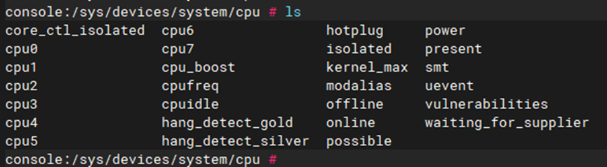

* online代表目前正在工作的cpu，offline代表目前被关掉的cpu，present则表示主板上已经安装的cpu

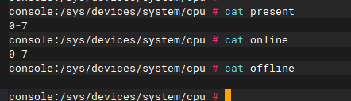

​         6155是2+6，共8个核心，所以看到编号是0-7。

* /sys/devices/system/cpu/cpu*目录*

  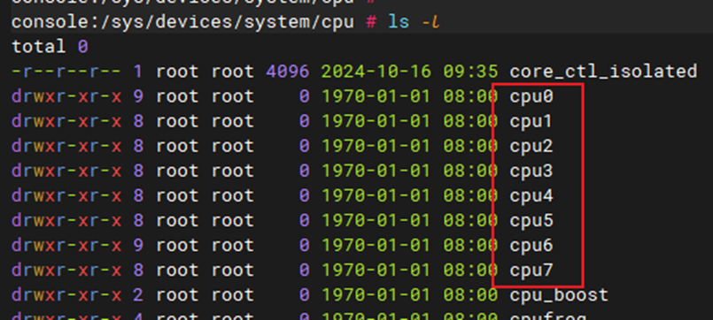

  sys/devices/system/cpu/cpufreq/policy*目录

  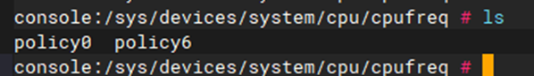

  `cpu*`目录每个代表一个CPU核心，里面的数值，代表这个CPU核心的参数。

  在cpu6目录里修改，影响的不仅仅是cpu6。通过affected_cpus查看到关联的cpus：

  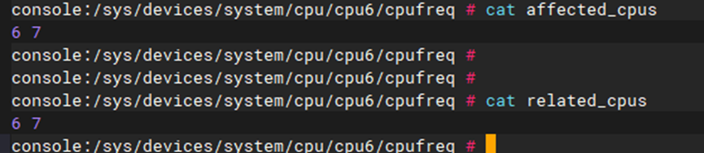

  cpu6-7可能都会变。所以我们应该通过policy*目录来调整cpu策略。

  `policy*`是相同CPU核心的集群，所以小核集群到一个policy, 中核集群到一个policy，大核集群到一个policy。比如上图，CPU架构是6小核+2大核，policy0里面修改参数影响CPU0~CPU5，在policy6里面修改影响CPU6、CPU7。

  通过我手上的机器实测确认，所有小核的频率都是一样的，所有大核的频率也都是一样的。也就是实际情况是，一组CPU共享一个频率调节器。你只能一起修改这组cpu的频率，不能修改单个cpu的频率。

  所有我们后面只在policy*目录下调整参数。

* policy*目录里的文件

  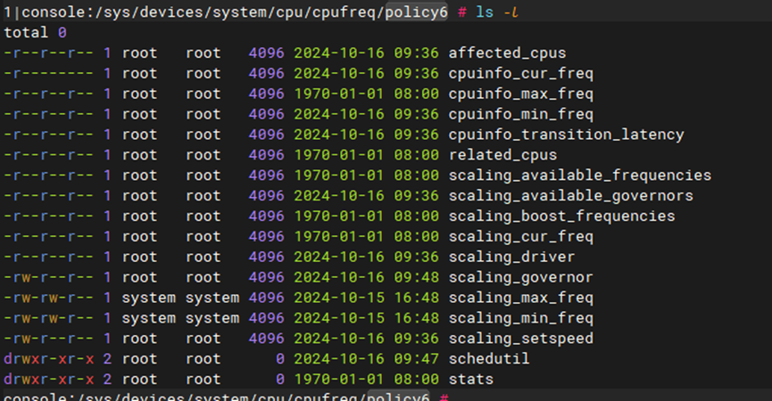

  分成两类：

  * 前缀是cpuinfo_

    代表的是cpu硬件上支持的频率

  * 前缀是scaling_

    内核设置的或认为的数值

​	通常情况下应该是相等的，或仅有微小差异。cpuinfo_*因为要从硬件上获取，所以更新频率比scaling_*低。

cpuinfo_cur_freq：cpu当前正在运行的频率
cpuinfo_max_freq：处理器能够运行的最高工作频率 （单位: 千赫兹）
cpuinfo_min_freq：处理器能够运行的最低工作频率 （单位: 千赫兹）

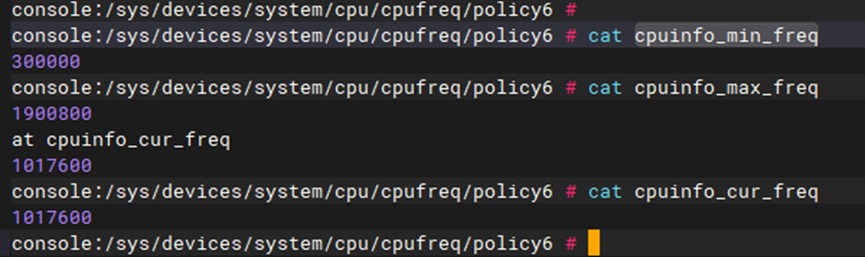

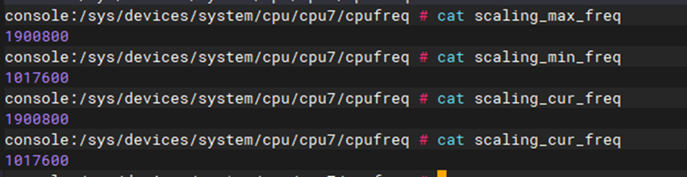

可以看到cur_freg在变化，这是因为我们采用了schedutil的调频方式。

 

scaling_available_frequencies输出当前软件支持的频率值：

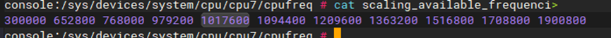

scaling_available_governors输出当前可供选择的频率调节策略：


* performance：性能模式，cpu以最高频率运行

* powersave：节能模式，省电，将频率设置为最低值

* userspace：自定义模式，由用户空间传入频率值

* ondemand：智能降频模式，比较激进的调频方式, 当负载超过80%时，会将cpu的频率调到最高。否则就会按负载比例调节频率。特点是负载升高时能快速升频，负载降低时也会较快的降频。因此其可能导致cpu频繁进行升降频操作，造成性能抖动。

* conservative：权衡模式，相对于ondemand，其调频方式更加柔和。它当负载超过80%时会以5%的幅度升频，而只有当负载低于20%时，才会以5%的幅度降频。因此其调频幅度较平滑，降频时留有足够的缓冲。副作用是cpu频率对负载的跟踪不够及时，特别是降频流程比较保守。 

* schedutil: 将调度器的负载值用作cpu调频依据,而不是上面两种由cpufreq模块自己计算。cpu调频更加准确，而且还减少了cpufreq governor的负载计算流程，提高调频效率。

无视ondemand、conservative，尽量用schedutil调频。


cpuinfo_transition_latency：处理器在两个不同频率之间切换时所需要的时间 （单位： 纳秒）

scaling_driver：该CPU正在使用何种cpufreq 调度器。

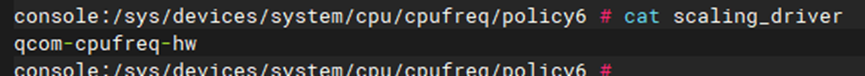

scaling_max_freq/ scaling_min_freq: 当前policy的上下限 （单位: 千赫兹）需要注意的是，当改变cpu policy时，需要首先设置scaling_max_freq, 然后才是scaling_min_freq。

scaling_governor和scaling_setspeed: 根据scaling_available_governors的输出，设置当前处理器的governor类型。通过echo指令，如：

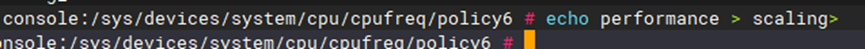

然后可以观察到两个大核的频率固定在最大值，不会调频：

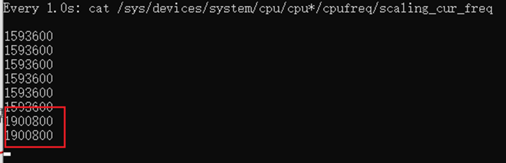

如果设置为userspace，那么可以通过往scaling_setspeed文件写入，设置cpu工作主频率到某一个指定值。当然这个值必须是scaling_available_frequencies支持的。

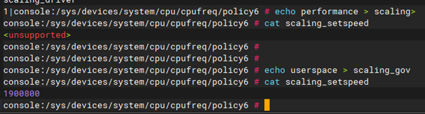

文件权限：

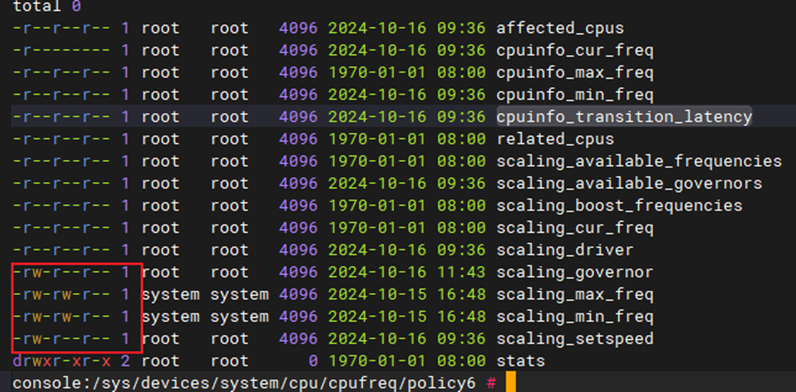

由此可知scaling_governor和scaling_setspeed、scaling_max_freq、scaling_min_freq是可写的。scaling_governor和scaling_setspeed前面已经演示过。


写入scaling_max_freq、scaling_min_freq，可以限制cpu的最大最小频率。比如：

```shell
echo 1209600 > scaling_max_freq,
echo 652800 > scaling_min_freq
```

在此基础上，

1. 如果设置scaling_governor为performance，

   通过读取cpuinfo_cur_freq，发现频率固定在1209600。

2. 如果设置scaling_governor为schedutil，

   则频率在652800和1209600之间浮动。这样做没什么意义，仅仅为了演示理论。

