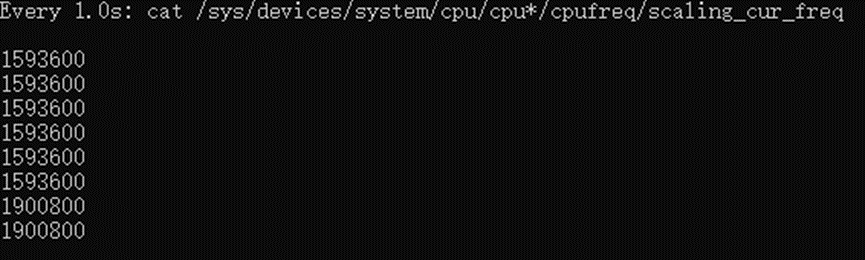
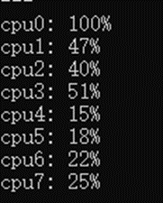
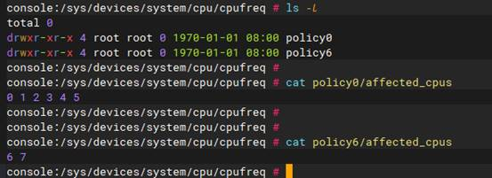
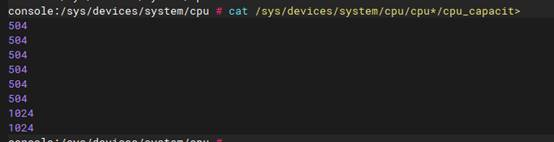
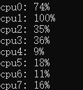
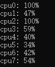
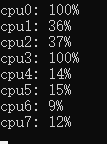
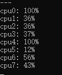

## 查看CPU频率

指令

```shell
watch -n 1 "cat /sys/devices/system/cpu/cpu*/cpufreq/scaling_cur_freq"
```

每秒更新一次，每个CPU核心的频率



## 查看每个核心的使用率

top只能看每个进程的占用。在ubuntu上，执行top，按“1”可以看到每个cpu的百分比。

但是安卓上不支持。所以我自己写了一个脚本：

```shell
# 保存为cpu_usage.sh
ldifs="$IFS"
IFS=$'\n'
get_cpu_usage() {
    prev_total=0
    prev_idle=0

    while true; do
        cpu_stats=$(cat /proc/stat | grep "^cpu")
        total=0
        idle=0

        index=-1;
        for cpu in $cpu_stats; do
            IFS=' '
            fields=(`echo $cpu | tr ' '`)
            IFS=$'\n'

            if [ "${fields[0]}" != "cpu" ]; then
                index=$((index+1))

                user=${fields[1]}
                nice=${fields[2]}
                system=${fields[3]}
                idle=${fields[4]}
                iowait=${fields[5]}
                irq=${fields[6]}
                softirq=${fields[7]}

                total=$((user + nice + system + idle + iowait + irq + softirq))

                diff_total=$((total - prev_total[index]))
                diff_idle=$((idle - prev_idle[index]))

                usage=$(( (1000 * (diff_total - diff_idle) / diff_total + 5) / 10 ))

                echo "${fields[0]}: $usage%"

                prev_total[index]=$total
                prev_idle[index]=$idle
            fi
        done
        sleep 1
        echo "---"
    done
}

get_cpu_usage

IFS="$oldifs"

```

执行效果如下：



## 判断进程在哪个核心上

1. `ps -ef -o psr,user,pid,ppid,vsz,rss,name`

   psr表示该进程当前运行的 CPU 核心编号

2. `cat /proc/<PID>/stat | awk '{print $39}'`

## 判断大小核

根据前面一篇背景知识，有一下方法可以判断cpu大小核。

1. 读取/sys/devices/system/cpu/cpu*/cpuinfo_max_freq文件，根据频率判断，大核的频率高。

   这种判断大小核的方法不靠谱，因为cpu可能会降频，大核的频率可能比小核心更低。后面我会演示一遍。

2. 查看 CPU 策略

   /sys/devices/system/cpu/cpufreq/ 目录下有 policy0, policy4 等文件夹,这些通常代表不同的 CPU 集群。

   以高通6155为例：

   

    `0~5`是小核，集群到policy0。`6-7`是大核，集群到policy6。当然也有可能0~5是大核，但是基于你已经知道6155的架构是2+6，那么显然6-7是大核。

   

3. 查看 CPU Capacity

4. Android 系统中的 CPU Capacity 文件可以提供每个 CPU 核心的相对计算能力:

   `cat  /sys/devices/system/cpu/cpu*/cpu_capacity`

   

   数值大的是大核。

## 绑定核心、亲和性

CPU亲和性，表示其倾向于在特定的核心上运行，但不是保证它一直在那个核心上。大多数情况下，调度器会尊重这个设置，尽量将线程保持在指定的核心上。如果有极端需求，要求100% 在指定核心上执行，可能需要考虑使用实时操作系统或更专业的解决方案。

查看线程的CPU亲和性（当前运行在哪个cpu上）：

```shell
taskset -p 454                   

pid 454's current affinity mask: 3f
```

3f二进制是00111111，从右往左，对应CPU编号`0-6`, 所以进程454可能会运行在CPU 0-6核心上。

### 设置

```shell
taskset -ap ff 18761                                                           <
pid 18761's current affinity mask: 1
pid 18761's new affinity mask: ff
pid 18772's current affinity mask: 1
pid 18772's new affinity mask: ff
pid 18773's current affinity mask: 1
pid 18773's new affinity mask: ff
pid 18774's current affinity mask: 1
```

-ap设置进程18761的所有线程。-p只设置18761线程。

在 CPU 核心 0 上启动 `vlc` 程序，使用以下命令:

```
$ taskset 0x1 vlc
```

### 实例

开发一个APP。为了能知道运行在哪个CPU Core，写一个死循环，让APP占用100%。

运行app，查询到进程号是18761.

执行`taskset -ap 1 18761`，观察cpu使用率：


 

执行`taskset -ap 2 18761 `



 

执行`taskset -ap 4 18761`：



4就是0100，因此cpu2是100%。

 

接着执行`taskset -ap 8 18761`：



 

执行`taskset -ap 10 18761`



十六进制10翻译成二进制是00010000,1对应cpu4.

### sched_setaffinity函数

上面是通过taskset命令。代码里可以使用sched_setaffinity函数。参考https://juejin.cn/post/7391160093566517288

