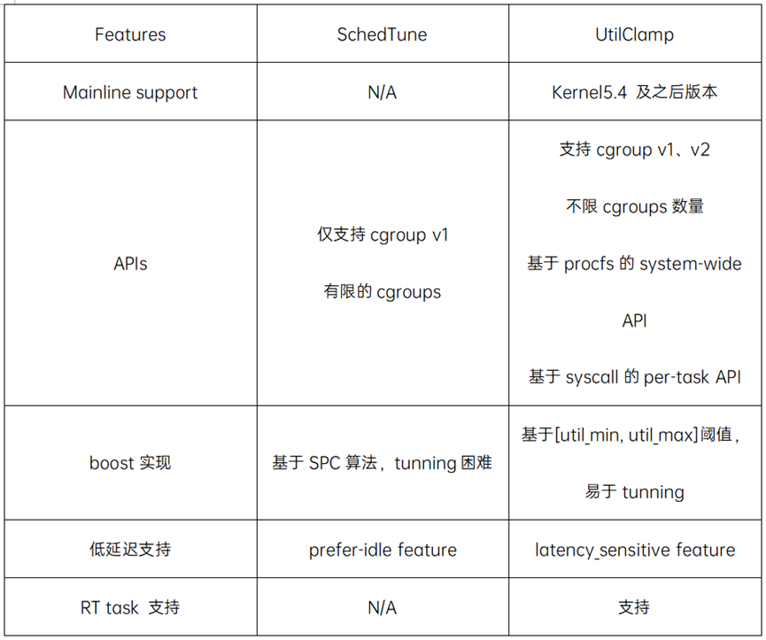
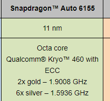
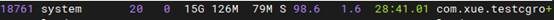
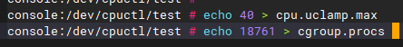
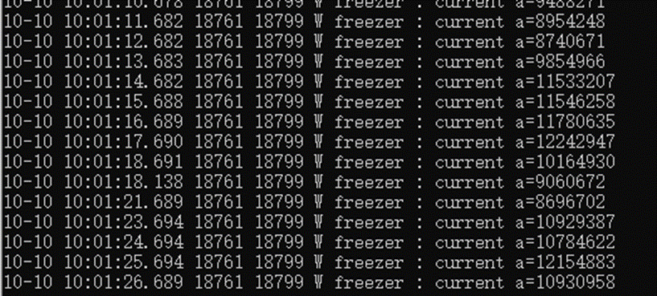
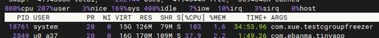
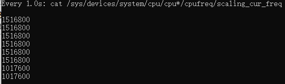
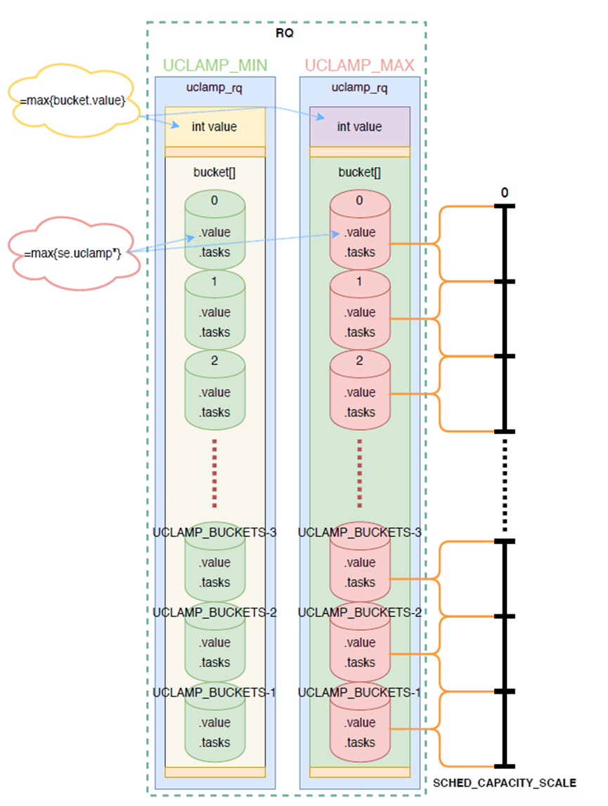

在前面篇幅中，已经讲过了设置CPU频率的方法。可以做到：

* CPU以最大频率和功耗运行
* CPU以最低频率和功耗运行
* 智能调节
* 手动指定一个频率

本节，我们用cgroup cpuctl控制器，控制特定进程的调度优先级。在多任务或资源竞争的环境中，为不同的任务分配不同的资源，确保系统的响应性和稳定性。

从效果上看，会间接地影响CPU频率、进程的CPU占用率。和我们在前面直接指定CPU调度策略相比，这是一种间接性的、综合的、非精确的影响。

## 名词

**rq**指CPU的运行队列。

每个 CPU 都有自己的运行队列（Run Queue, rq），用于描述在此 CPU 上所运行的所有进程，其队列包含三个运行队列，Deadline 运行队列 dl_rq、实时任务运行队列 rt_rq 和 CFS 运行队列 csf_rq，其中 csf_rq 是用红黑树来描述的，按 vruntime 大小来排序的，最左侧的叶子节点，就是下次会被调度的任务。

这几种调度类是有优先级的，优先级如下：Deadline > Realtime > Fair，这意味着 Linux 选择下一个任务执行的时候，会按照此优先级顺序进行选择，也就是说先从 dl_rq 里选择任务，然后从 rt_rq 里选择任务，最后从 csf_rq 里选择任务。因此，实时任务总是会比普通任务优先被执行。

## 利用率夹紧(Utilization Clamping)

Android Kernel 5.4以前，存在一个schedtune feature，也提供了与uclamp类似的功能。

schedtune与uclamp都是由ARM公司的Patrick Bellasi主导开发，uclamp作为schedtune的替代方案，弥补了schedtune种种不足，使得uclamp最终合入mainline kernel。



## clamp的用户空间接口

*  system-wide API

proc/sys/kernel/sched_util_clamp_min

proc/sys/kernel/sched_util_clamp_max

全局设置值，用于限制per-task_group值和per-task值，使之不超过全局设置值，取值范围0 - SCHED_CAPACITY_SCALE。

* cgroup based API

cpu.uclamp.max

cpu.uclamp.min

基于cgroup实现的per-task group值，实现对相同性能/功耗需求的一组task的控制，该设置值会限制组内各个任务的per-task值。取值范围0.00 - 100.00，格式为两位小数精度的百分比值。

* per-task API

通过sched_setattr系统调用，每个任务都可以自主的设置各自的uclamp_min和uclamp_max，以满足自身的性能/功耗需求，但是该设置值会受制于cgroup设置值和系统全局设置值，取值范围0 - SCHED_CAPACITY_SCALE。

 

用户通过uclamp机制可以向内核调度器提供task相关信息辅助调度器更好的执行调度任务，使得对频率的调整更加合理、对核心的选择更加贴合任务的性质，最终使得整个系统在性能和功耗上均能实现收益。


## CCS5.0实现

下面在5.0上写一个demo测试此功能

新建android项目，Activity里添加如下代码：

```java
new Thread(new Runnable() {
    @Override
    public void run() {
        long a = 0;
        long time = SystemClock.elapsedRealtime();
        while(true) {
            a++;
            if(SystemClock.elapsedRealtime() - time > 1000) {
                Log.w(TAG, "current a=" + a);
                a = 0;
                time = SystemClock.elapsedRealtime();
            }
        }
    }
}).start();

```

这段代码，每隔1s打印一次a的值，a的值表示这1s内能循环多少次, 以此反映CPU的性能。

 默认情况下：

```
10-10 09:57:37.474 18761 18799 W freezer : current a=14774125
10-10 09:57:38.474 18761 18799 W freezer : current a=14882930
10-10 09:57:39.475 18761 18799 W freezer : current a=14825363
10-10 09:57:40.478 18761 18799 W freezer : current a=14810440
10-10 09:57:41.477 18761 18799 W freezer : current a=14833928
10-10 09:57:42.479 18761 18799 W freezer : current a=14767705

```

输出是比较稳定的。

CPU频率：


芯片是高通6155，2大核6小核心。



显然输出的19开头两个是大核心，其它是小核心。多运行几次，输出是比较稳定的。

执行TOP指令：



该应用的CPU使用率是100%，符合预期。

然后执行



18761是测试应用的进程号。



肉眼可见每秒循环的次数变少了，预示CPU性能的下降。而且变得起伏不定。也不是简单的40%。

占用率依然是100%：



 此时没有其它高负载程序和18761竞争，这表明CPU的某个核心依然把全部调度时间给了18761。

通过前面的watch命令，发现CPU性能下降是CPU的频率降低了：



一开始我误以为设置cpu.uclamp.max可以控制进程的CPU占用率，即CPU分配多少资源给这个进程。

后来才知道，不会直接影响CPU占用率，上面的例子永远是100%。而是限制进程可以使用的 CPU 性能或频率（CPU降频）。这一点很多资料没说清楚。

## **桶化算法**

那么我们就有一个疑惑，一个CPU核心上运行了多个进程或线程，如果每个进程的uclamp.max 不一样，CPU怎样表现？因为CPU分片执行各个线程，绝对不可能频繁变换CPU性能的。而且上面例子为什么不是40%？

内核实现上使用桶化算法，示意图：



我直接从https://www.cnblogs.com/pengdonglin137/p/17895638.html把文字复制过来：

为了在尝试决定任务入队/出队时的有效 uclamp 值时减少搜索空间，整个利用率范围被划分为 N 个桶，其中 N 通过设置 CONFIG_UCLAMP_BUCKETS_COUNT 在编译时配置，默认设置为 5。

rq 为每个 uclamp_id 可调参数设置了一个桶：[UCLAMP_MIN, UCLAMP_MAX]。

每个桶的范围为 1024/N。例如，默认值为 5 时，将有 5 个桶，每个桶将覆盖以下范围：

| DELTA = round_closest(1024/5)  = 204.8  = 205 |
| --------------------------------------------- |
|                                               |
| 桶 0: [0:204]                                 |
| 桶 1: [205:409]                               |
| 桶 2: [410:614]                               |
| 桶 3: [615:819]                               |
| 桶 4: [820:1024]                              |

当任务 p 具有以下可调参数时：

|      | p->uclamp[UCLAMP_MIN] = 300  |
| ---- | ---------------------------- |
|      | p->uclamp[UCLAMP_MAX] = 1024 |

被入队到 rq 时，将为 UCLAMP_MIN 增加桶 1，为 UCLAMP_MAX 增加桶 4，以反映 rq 中有一个在此范围内的任务。

然后，rq 会跟踪每个 uclamp_id 的当前有效 uclamp 值。

当任务 p 入队时，rq 的值变为：

|      | *//* *更新桶逻辑在此处*                                      |
| ---- | ------------------------------------------------------------ |
|      | rq->uclamp[UCLAMP_MIN] = max(rq->uclamp[UCLAMP_MIN],  p->uclamp[UCLAMP_MIN]) |
|      | *//* *对 UCLAMP_MAX 重复*                                    |

类似地，当 p 出队时，rq 的值变为：

|      | *//* *更新桶逻辑在此处*                                      |
| ---- | ------------------------------------------------------------ |
|      | rq->uclamp[UCLAMP_MIN] = search_top_bucket_for_highest_value() |
|      | *//* *对 UCLAMP_MAX 重复*                                    |

当所有桶都为空时，rq 的 uclamp 值将重置为系统默认值。有关默认值的详细信息，请参见第 3.4 节。

**最大聚合**

Util clamp 被调整以满足需要最高性能点的任务的请求。

当多个任务附加到同一个 rq 时，util clamp 必须确保需要最高性能点的任务得到它，即使有另一个任务不需要或被禁止达到这一点。

例如，如果有多个任务附加到一个 rq，具有以下值：

|      | p0->uclamp[UCLAMP_MIN] = 300 |
| ---- | ---------------------------- |
|      | p0->uclamp[UCLAMP_MAX] = 900 |
|      |                              |
|      | p1->uclamp[UCLAMP_MIN] = 500 |
|      | p1->uclamp[UCLAMP_MAX] = 500 |

假设 p0 和 p1 都入队到同一个 rq，则 UCLAMP_MIN 和 UCLAMP_MAX 都变为：

|      | rq->uclamp[UCLAMP_MIN] = max(300, 500) = 500 |
| ---- | -------------------------------------------- |
|      | rq->uclamp[UCLAMP_MAX] = max(900, 500) = 900 |

正如我们将在第 5.1 节中看到的，这种最大聚合是在使用 util clamp 时的一个限制之一，特别是对于用户空间希望节省电力的 UCLAMP_MAX 提示。


CPU cgroup 控制器中有两个与 uclamp 相关的值：

·     cpu.uclamp.min

·     cpu.uclamp.max

当一个任务附加到 CPU 控制器时，其 uclamp 值将受到以下影响：

·     cpu.uclamp.min 是 cgroup v2 文档第 3-3 节中描述的一种保护机制。

·     如果任务的 uclamp_min 值低于 cpu.uclamp.min，则任务将继承 cgroup cpu.uclamp.min 的值。

·     在 cgroup 层次结构中，有效的 cpu.uclamp.min 是 (child, parent) 的最大值。

·     cpu.uclamp.max 是 cgroup v2 文档第 3-2 节中描述的一种限制机制。

·     如果任务的 uclamp_max 值高于 cpu.uclamp.max，则任务将继承 cgroup cpu.uclamp.max 的值。

·     在 cgroup 层次结构中，有效的 cpu.uclamp.max 是 (child, parent) 的最小值。

 

## 结论：

第一，`cpu.uclamp.max` 是一个调度参数，限制了调度器在计算 CPU 权重时的行为，而不是直接控制CPU分配给某个进程的时间（即进程的CPU占用率）。即使设定了 `cpu.uclamp.max`，实际的 CPU 使用可能仍然依赖于进程的负载模式、调度策略等。

第二，进程真实的uclamp.max值受到多方面因素影响，不是你设置cpu.uclamp.max就行，因此要用好还是比较难的。
