有时一个第三方的APP，在后台跑到100%，导致用户操作卡顿。我们又不能直接把它禁用或者冻结。

这时可以通过cgroup cpu控制器，告诉调度器，只给这个进程20%的时间片。强行把占用率控制在20%，剩余的性能就可以给其它程序了。

通过两种方法：

* cpu.cfs_*接口

  许是安卓的内核某些配置没有打开，有部分特性没有完全启用；亦或者可能谷歌改造、阉割了内核功能。总之该接口安卓上面不支持。

  在ubuntu上面完成示例。

* cpu.shares接口

  安卓支持，我会给出安卓上面的示例。

两种方法的区别：

1. `cpu.shares` 是一个相对值，根据多个进程组（Cgroup）的比例来确定。默认值是 1024 。如果你创建了两个cgroup，一个cpu.shares=500，另一个cpu.shares=1000。因为比例是1:2，所以一个获取33%，一个获取66%。

   而cpu.cfs_*指定的是绝对值。`cpu.cfs_period_us`设置时间周期的长度（单位为微秒），在此时间段内进行调度和计算。cfs_quota_us用来配置一个时间周期长度内，Cgroup 可以使用的最大 CPU 时间。（单位为微秒）

2. cpu.shares是动态的，`cpu.cfs_`是静态的。`cpu.cfs_*`对特定进程组进行精确的、严格的 CPU 使用限制，确保它不超过某个百分比；而`cpu.shares`，即使理论上，只有20%，如果此时没有其它高负载程序，CPU依然会智能的把资源给这个程序。所以使用cpu.shares，占用率仍然可能会很高，而用`cpu.cfs_*`，一旦你限定了20%，那么就一定不会超过20%，只会更低。

3. 假如一开始，cgroup A和cgroup B，cpu.shares比例是1:1，那个A和B的CPU使用率都是50%。后来添加了一个新的cgroup C，那么就变成A：B：C=1:1:1，所以A和B的使用率变成33%。问题是我完全没有改过A和B的配置，我也没办法知道后面会有哪些其它的cgroup加入。整个过程都是被动受影响。所以用cpu.shares是没法精确的控制CPU使用率的。

4. cpu.cfs_* 适合那些需要长期稳定资源分配的应用。要在多个进程或服务之间相对公平地分配 CPU 时间，则使用 `cpu.shares`。

5. 两者可以结合使用。


## 实例

### cgroup V1，基于ubuntu

找一台cgroup cpu是V1的Ubuntu服务器。低版本的Ubuntu都是V1,最新版本是V2。 

先查看是否支持

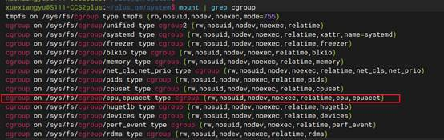

进入/sys/fs/cgroup/cpu目录：


用cpu.cfs_period_us & cpu.cfs_quota_us实现。

> 1s=1000ms (毫秒, millisecond)
>
> 1ms=1000μs(微秒，microsecond)
>
> 1μs=1000nm(纳秒，nanosecond)

cfs_period_us用来配置时间周期长度，cfs_quota_us用来配置当前cgroup在设置的周期长度内所能使用的CPU时间数。

单位都是微秒（us），cfs_period_us的取值范围为1毫秒（ms）到1秒（s），cfs_quota_us的取值大于1ms即可，如果cfs_quota_us的值为-1（默认值），表示不受cpu时间的限制。

#### 测试一

1. 执行while :;do :;done&

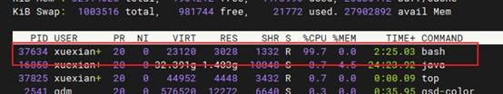

2. 创建了一个 cpu 子系统叫 test: `mkdir test`,先查看当前值：

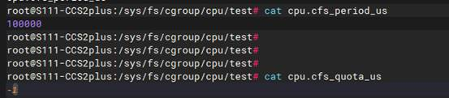

因为权限原因要切到su。

3. 执行指令：

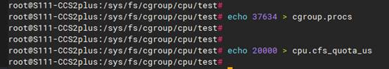

然后观察top：

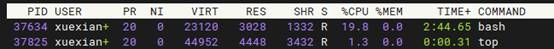

可以看到百分比变成了20%，表示设置生效。

#### 测试二

写一个C++程序，里面创建5个线程，每个线程都是死循环模拟满负载运行：

```c++
#include <iostream>
#include <thread>
#include <chrono>

void worker_thread(int id) {
  std::cout << "Thread " << id << " starting." << std::endl;
  while (true) {
  }
  std::cout << "Thread " << id << " finished." << std::endl;
}

int main() {
  const int num_threads = 5;
  std::thread threads[num_threads];
  // 创建线程
  for (int i = 0; i < num_threads; ++i) {
    threads[i] = std::thread(worker_thread, i);
  }
  // 等待所有线程完成
  for (int i = 0; i < num_threads; ++i) {
    threads[i].join();
  }
  std::cout << "All threads finished." << std::endl;
  return 0;
}
```

Top -H：

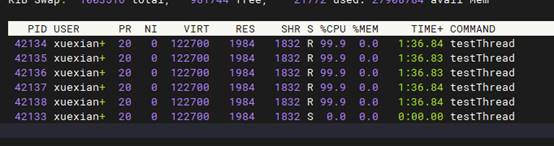

CPU 0%的是主线程号即进程号。

1. 执行echo 42133 > cgroup.procs

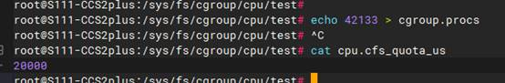

2. 观察到top变成：

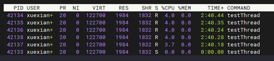

也就是所有子线程的占用加起来是20%

3. 只限制某个线程是20%

重新执行程序，

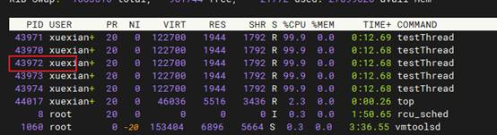

以43972为例，

线程号写入tasks文件而不是cgroup.procs

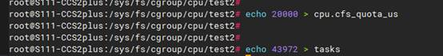

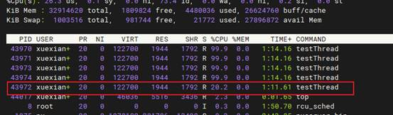

4. 设置CPU调度器给第一个线程分配10%，第二个20%，第三个30%，依次类推
   1. 在/sys/fs/cgroup/cpu/test目录创建5个子目录：
   
      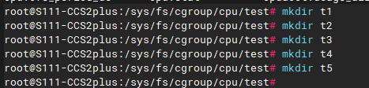
   
   2. 执行：
   
      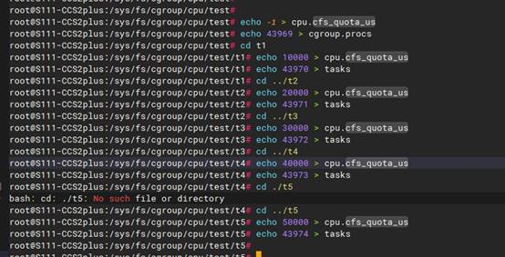
   
   3. 观察top

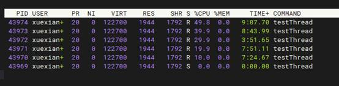

符合预期。

### cgroup V2，基于ubuntu

最新版本的Ubuntu已经完全使用了cgroup V2:

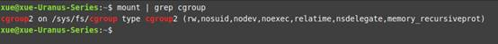

 

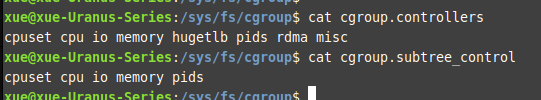

 如果subtree_control里没有cpu，执行：

```shell
echo "+cpu" > /sys/fs/cgroup/cgroup.subtree_control
```

在 cgroups v2 中，我们使用 `cpu.max` 文件来设置 CPU 限制。格式为 "max bandwidth quota period"。例如，要限制到 50% CPU 使用率：

```shell
echo "50000 100000" > /sys/fs/cgroup/mygroup/cpu.max
```

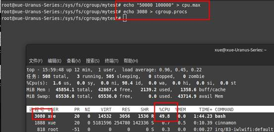

### cpu.shares，android9，ccs2.0

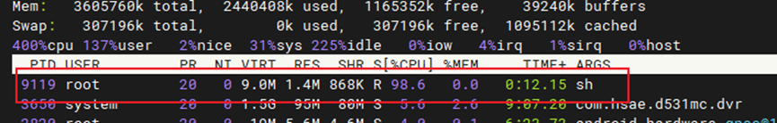

进程9119，占用100%。当这个进程启动后，会自动把进程号加到/dev/cpuctl/cgroup.procs

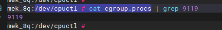

把这个进程移到test组里：

```shell
mek_8q:/dev/cpuctl # mkdir test
mek_8q:/dev/cpuctl/test # echo 9119 > cgroup.procs
```

默认cpu.shares是1024

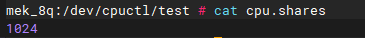

再创建一个程序

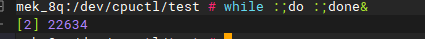

 

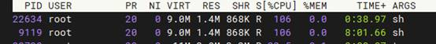

 

把新的进程加到test2组里：

```shell
mek_8q:/dev/cpuctl/test2 # echo 22634 > cgroup.procs
```

此时两个进程的占用依然都是100%。

我们通过taskset指令让两个进程在同一个CPU核心上面运行，这样CPU占用都会变成50%。（因为cpu.shares都是1024）

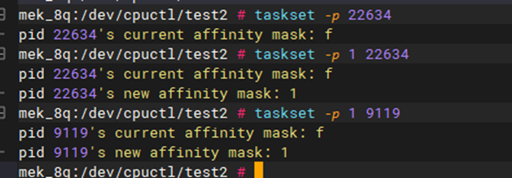

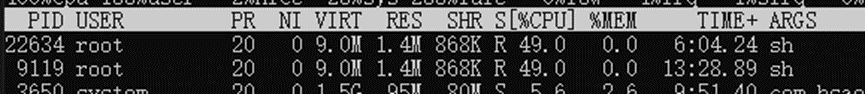

下面我们让占用率变成30%和70%：

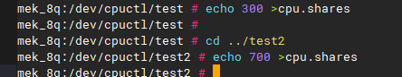

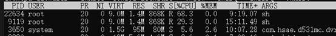

 

 

