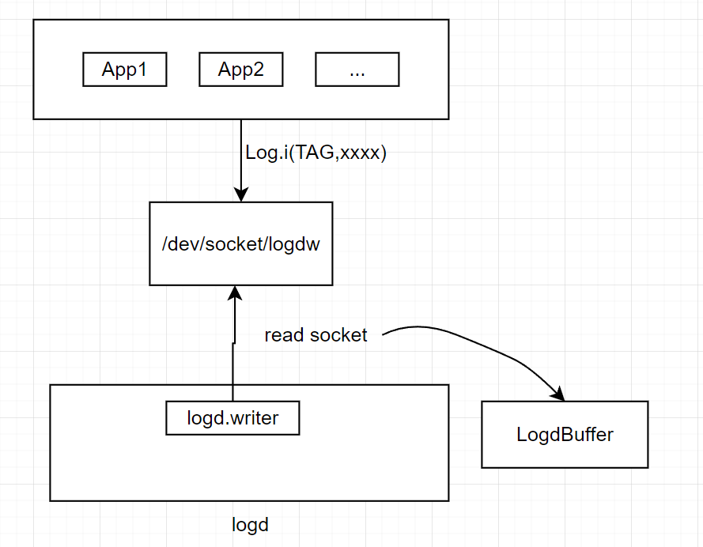
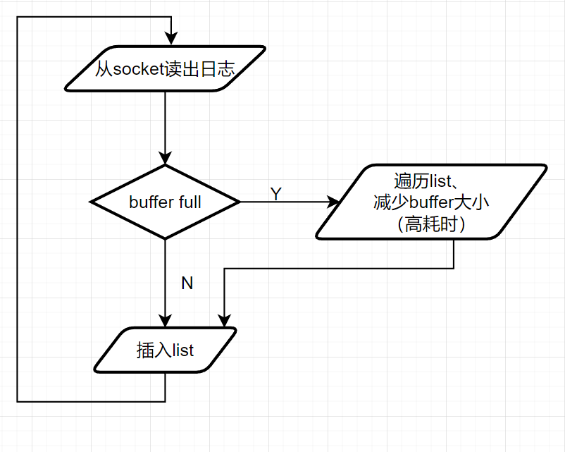
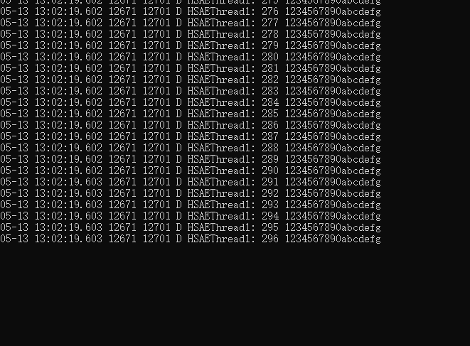
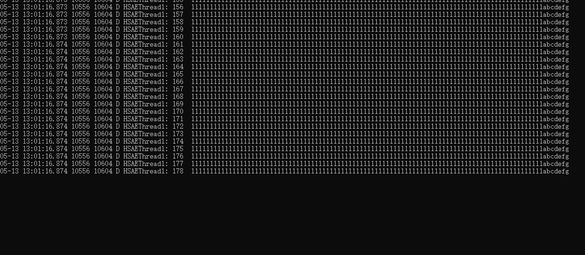

CCS5.0、H60A均存在丢日志问题，分析如下：

日志写入的流程：



我们发现logd的buffer满后，就会丢日志，同时logd CPU占用为100%，CPU 100%的时间段和丢日志的时间段是重合的。

将logd buffer调大，只是保证“开机后不丢日志的时间”长一点，一旦buffer满，仍然会丢，而且丢失量更大。

经分析，丢日志发生在套接字“/dev/socket/logdw”。

往buffer写日志的流程如下：



从这里可以看出，logd.writer线程不是一直读“/dev/socket/logdw”，而是从“/dev/socket/logdw”读一条，后续经过一系列插入、删除的流程，处理完毕后，才回到开头继续从“/dev/socket/logdw”读下一条日志。此时各个应用还在不停往这个socket里写入。

基于UDP的socket：

```
service logd /system/bin/logd
    socket logd stream 0666 logd logd
    socket logdr seqpacket 0666 logd logd
    socket logdw dgram+passcred 0222 logd logd
```

队列长度

```
console:/dev/socket # cat  /proc/sys/net/unix/max_dgram_qlen                   
600
```

`max_dgram_qlen` 的值表示每个Unix域套接字的数据包队列的最大长度。当你使用UDP类型的Unix域套接字进行通信时，这个参数决定了在数据包被接收之前可以缓存的最大数据包数量。

此处数据包队列最多可以缓存600个数据包。如果队列已满，新的数据包将被丢弃。

我们系统日志量比较大，而prune是一个比较耗时的操作，经常会阻塞logd.writer线程，这就导致socket只写不读，很快超过队列最大长度，从而后续日志全部丢弃。

随便提一下，虽然/proc/sys/net/unix/max_dgram_qlen 值是600，而我实测下来，socket缓存里最多只能容纳296条。大约是600的一半样子。

如果一行日志比较长，则更少，只有100多条，后面的全部丢弃，直到logd重新开始读取一些数据，把socket队列空出来。

测试手法：

1. LogListener里在`recvmsg(socket_, &hdr, 0);`前面，添加:

   ```c++
   #include <android-base/properties.h>
   using android::base::GetBoolProperty;
   using android::base::GetProperty;
   using android::base::SetProperty;
   //添加
   bool pauseLog = GetBoolProperty("log.pause", false);
       while (pauseLog) {
           usleep(1000 * 1000); // 休眠1秒，usleep的参数是以微秒为单位
           pauseLog = GetBoolProperty("log.pause", false);
       }
   ```

   自定义系统属性log.pause，控制logd是否工作。

   （不要用start logd && stop logd,因为这会完全停止logd进程，释放socket）

   

2. 执行`setprop persist.log.tag S `,关闭全部系统日志，只打开我们测试的TAG：`setprop persist.log.tag.HSAEThread1 V`。

3. 写一个app，循环写日志

   ```java
   long count = 0;
                   while (count < 1000) {
   //                    try {
   //                        Thread.sleep(10);
                           count++;
                           Log.d("HSAEThread1", count + " 1234567890abcdefg");
   //                    } catch (InterruptedException e) {
   //                        e.printStackTrace();
   //                    }
                   }
   ```

   

4. 清一下日志，或`stop logd&start logd`重新启动服务。先执行`setprop  log.pause true`,这样会在logd读日志的地方暂停住。

5. 然后执行测试app，写入1000条日志。

6. 执行`setprop  log.pause false`，观察logcat输出

7. 我们发现，只输出count从1到296。这就表明后面704条在socket上面被丢弃。

把`Thread.sleep(10);`注释或放开，对测试结果没观察到影响。

证据：



如果一行日志长一点，则更少：



## liblog日志

这种情况，丢日志会产生liblog日志，生成liblog日志发生在app进程，下面表示699进程和741进程各丢了4条和1条数据。

```
06-11 15:15:33.439   699   699 I liblog  : 4
06-11 15:15:33.538   741 28191 I liblog  : 1
```

app输出这条日志，是在下次打印正常日志时。假如最后一条日志丢失，后续也没有新的日志产生，那么这条不会打印，用户不知道丢失了日志。

还是用上面的例子，界面点button会打印1000行日志。先设置log.pause为true，界面点button。

观察到控制台无输出。

然后log.pause设为false。

观察输出，还是没有liblog信息。再次点击button，输出日志，`liblog  : 701`。


这行日志的原理是，应用端的liblog.so调用writev往socket写入，失败返回EAGAIN就把本地静态dropped变量加1。

```c++
// logd_writer.cpp

// The write below could be lost, but will never block.
// EAGAIN occurs if logd is overloaded, other errors indicate that something went wrong with
// the connection, so we reset it and try again.
ret = TEMP_FAILURE_RETRY(writev(logd_socket, newVec, i));
if (ret < 0 && errno != EAGAIN) {
LogdConnect();

ret = TEMP_FAILURE_RETRY(writev(logd_socket, newVec, i));
}

if (ret < 0) {
ret = -errno;
}

if (ret > (ssize_t)sizeof(header)) {
  ret -= sizeof(header);
} else if (ret < 0) {
    atomic_fetch_add_explicit(&dropped, 1, memory_order_relaxed);
    if (logId == LOG_ID_SECURITY) {
      atomic_fetch_add_explicit(&droppedSecurity, 1, memory_order_relaxed);
    }
}
```

另外，我们的xlog日志系统里，搜索不到liblog，原因是，xlog没有正确format events事件日志。搜不到liblog可以搜索[1006],  1006是该事件对应的id。

已修复xlog的这个bug：

```c++
+std::unique_ptr<EventTagMap, decltype(&android_closeEventTagMap)> event_tag_map_{
+    nullptr, &android_closeEventTagMap};
+bool has_opened_event_tag_map_ = false;

-                err = android_log_processBinaryLogBuffer(&log_msg.entry, &entry, nullptr, buffer, sizeof(buffer));
+                if (!event_tag_map_ && !has_opened_event_tag_map_) {
+                    event_tag_map_.reset(android_openEventTagMap(nullptr));
+                    has_opened_event_tag_map_ = true;
+                }
+                err = android_log_processBinaryLogBuffer(&log_msg.entry, &entry, event_tag_map_.get(), buffer, sizeof(buffer));

```


## 对策措施：

1. 最好是从源头上，优化日志数量。现在情况是，有时在几毫秒内，就写入几百条数据。一分钟几万条日志，肯定扛不住。

2. 分析logd.write线程有哪些耗时操作。

   1. 往logd buffer插入日志时，并不是直接插入到队列末尾，而是比较日志时间，如果时间小于队列尾最后一条记录，会有个往前追溯的过程。这可能会导致耗时。

      经测试，几乎不怎么会触发这个往前遍历list的过程。姑且忽略。

   2. prune函数。一旦buffer size是否大于预设size，会在prune函数里执行一段非常复杂的逻辑，来把队列删掉一部分，减小buffer大小。当我们把buffer size设置为50M或200M时，这里耗时有时长达几十秒、甚至几分钟。

      因此，我们把prune里的复杂逻辑全部删除，只是简单的把队列开头一部分丢弃。这样修改后，同样能够释放buffer，保证不超过预设buffer max size。prune函数的执行时间大大降低。

      经测试，丢日志现象得到很大的改进。

      但是，把原生的大段逻辑删除后，是否会带来其它问题，是未知的。

   3. 日志的来源，除了“/dev/socket/logdw”，还有一些其它通道，比如selinux audit。没有具体仔细研究。是否可以把一些不需要的关掉？

      我认为这部分日志，数量本来就很少，影响微乎其微。事实上，安卓原生代码打印的日志也很少，几秒上万行全是我们的应用同事打的。大头是IPC、CarService、Custom API、gnss这些。