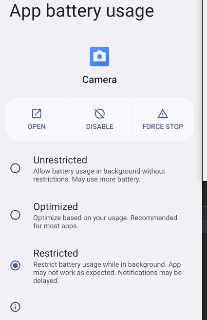
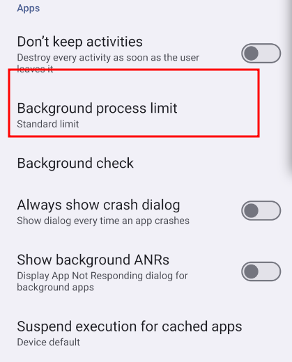

## 限制应用的后台活动.



* **无限制**：允许所有后台工作，这可能会消耗更多电量。
* **优化（默认）**：根据用户与应用互动的方式，优化应用执行后台工作的能力。
* **受限**：完全禁止应用在后台运行。应用可能无法正常运行。接收通知会有延时。

### App battery usage的实现

三种模式，UNRESTRICTED、OPTIMIZED、RESTRICTED

* `MODE_UNRESTRICTED = AppOpsManager.MODE_ALLOWED + allowListed`
* `MODE_OPTIMIZED = AppOpsManager.MODE_ALLOWED + !allowListed`
* `MODE_RESTRICTED = AppOpsManager.MODE_IGNORED + !allowListed`

设置AppOpsManager MODE_ALLOWED :

```java
/**
uid: 目标app的uid，普通应用的uid从10000开始
packageName： 目标app的包名
mode： AppOpsManager.MODE_ALLOWED or AppOpsManager.MODE_IGNORED
*/
public void setForceAppStandby(int uid, String packageName, int mode) { 
    //是否安卓O之前的app
    final boolean isPreOApp = isPreOApp(packageName);
    if (isPreOApp) {
        mAppOpsManager.setMode(AppOpsManager.OP_RUN_IN_BACKGROUND, uid, packageName, mode);
    }
    // Control whether app could run jobs in the background
    mAppOpsManager.setMode(AppOpsManager.OP_RUN_ANY_IN_BACKGROUND, uid, packageName, mode);

    //操作存数据库
    ThreadUtils.postOnBackgroundThread(() -> {
        final BatteryDatabaseManager batteryDatabaseManager = BatteryDatabaseManager
                .getInstance(mContext);
        if (mode == AppOpsManager.MODE_IGNORED) {
            batteryDatabaseManager.insertAction(AnomalyDatabaseHelper.ActionType.RESTRICTION,
                    uid, packageName, System.currentTimeMillis());
        } else if (mode == AppOpsManager.MODE_ALLOWED) {
            batteryDatabaseManager.deleteAction(AnomalyDatabaseHelper.ActionType.RESTRICTION,
                    uid, packageName);
        }
    });
}
```

allowListed的设置：

```
mDeviceIdleService = IDeviceIdleController.Stub.asInterface(
                ServiceManager.getService(DEVICE_IDLE_SERVICE));
//allowListed=true
public void addApp(String pkg) {
    try {
        mDeviceIdleService.addPowerSaveWhitelistApp(pkg);
        mAllowlistedApps.add(pkg);
    } catch (RemoteException e) {
        Log.w(TAG, "Unable to reach IDeviceIdleController", e);
    }
}
//allowListed=false
public void removeApp(String pkg) {
    try {
        mDeviceIdleService.removePowerSaveWhitelistApp(pkg);
        mAllowlistedApps.remove(pkg);
    } catch (RemoteException e) {
        Log.w(TAG, "Unable to reach IDeviceIdleController", e);
    }
}

```

DeviceIdleController是从 Android 6.0（API 级别 23）开始引入的, 与`PowerManagerService`、`ActivityManagerService`等其他系统服务协同工作，实现管理应用在设备未连接至电源时的行为方式，为用户延长电池寿命。


原生设置里实现此功能的入口位置：

```java
// 1. aosp/packages/apps/Settings/src/com/android/settings/fuelgauge/AdvancedPowerUsageDetail.java
public void onRadioButtonClicked(SelectorWithWidgetPreference selected) {
    final String selectedKey = selected.getKey();
    updatePreferenceState(mUnrestrictedPreference, selectedKey);
    updatePreferenceState(mOptimizePreference, selectedKey);
    updatePreferenceState(mRestrictedPreference, selectedKey);
    mBatteryOptimizeUtils.setAppUsageState(getSelectedPreference(), Action.APPLY);
}
```

## 限制后台进程数量

参考开发者选项里



### 实现

AMS里提供了setProcessLimit接口，一行代码即可：

```
/**
 * -1: Standard limit
 * 0: No Background processes
 * 1: At most 1 process
 * 2: At most 2 processes
 * 3: At most 3 processes
 * 4: At most 4 processes
 */
getActivityManagerService().setProcessLimit(limit);
```


## 省电模式

省电模式下会限制应用的后台活动、降低设备的性能、降低网络活动等。

```
// PowerManagerService.java 提供了设置省电模式的接口
context.getSystemService(PowerManager.class).setPowerSaveModeEnabled(enable)
```


## 杀后台

**一般来说，系统杀进程有两种方法，这两个方法都通过 ActivityManagerService 提供：**

- killBackgroundProcesses；
- forceStopPackage。

一般用方法二。因为方法二清理更彻底。

其它方法如Process.killProcess不推荐使用。