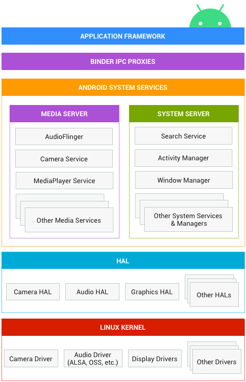
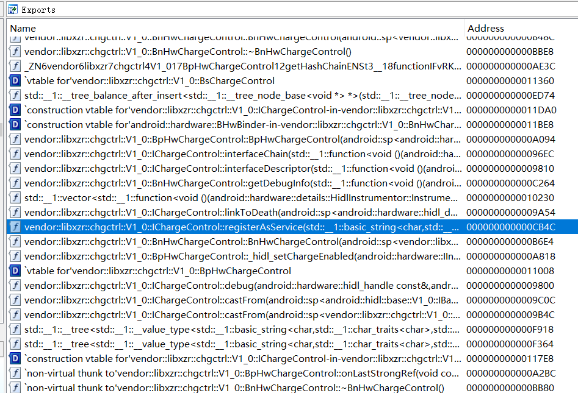
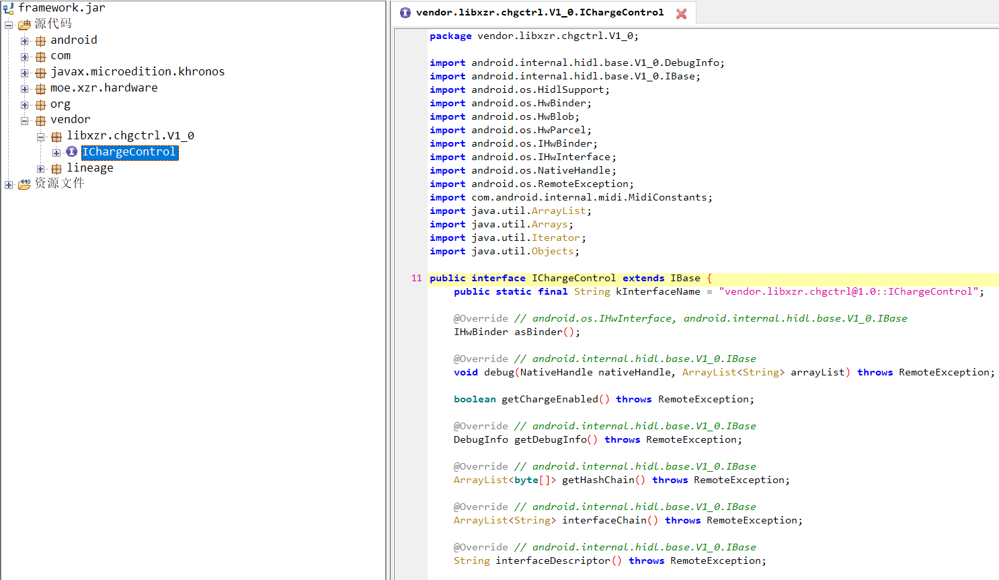

# 前言

这篇文章不讨论binder，不讨论底层通信方式，不讨论HAL的内部方法
只基于安卓11讨论，HAL是如何被创建的，用户空间该如何实现相关接口

# 前情提要

## 什么是HAL



HAL是安卓系统中的一层，向上为framework提供统一的接口，向下对接内核节点，与内核驱动程序进行交互与通信
HAL存在的意义在于，使针对不同设备的复杂逻辑能够从common的framework层中抽离，从而降低框架代码和设备代码之间的耦合性，使得android框架能够更容易的覆盖更多的设备

比如，不同的设备可能具有不同的面板，不同的面板有不同的驱动，不同的驱动有不同的节点定义
因此，“双击亮屏”这一功能的状态传递方式在不同设备上就有很大区别

而PowerHAL的引入使得这一区别成为了编译PowerHAL时的一个参数

```
ifneq ($(TARGET_TAP_TO_WAKE_NODE),)
    LOCAL_CFLAGS += -DTAP_TO_WAKE_NODE=\"$(TARGET_TAP_TO_WAKE_NODE)\"
endif
```

而用户空间修改双击亮屏的状态，只需调用HAL的`setMode(Mode type, bool enabled)`函数即可
而对HAL的调用，则可以写死在系统框架中

## 旧版HAL

旧版HAL指Android 8.0以前的HAL
此时的HAL主要实现的是代码上的规范化，但是从运行方式上来看，此时的HAL是一个一个的so库，与框架的通信通过`dlopen`进行，本质上HAL和framework运行在一个进程
这也就意味着，当framework中相关的api跟随安卓版本更新发生变化的时候，hal必须要修改并重新编译，而这一过程需要由厂商完成，费时费力，使得众多老旧设备更新安卓版本十分困难

因此安卓8.0实现了模块化的`Project Treble`架构，将属于厂商的东西和属于安卓框架的东西完全解耦，属于框架的内容位于`/system`分区，而属于厂商的内容被移动到了`/vendor`分区，并且HAL的实现也发生了翻天覆地的变化

## Project Treble

在理想的`Project Treble`架构下，Framework进程不需要像上面一样使用`dlopen`加载厂商的共享库，而是使用binder进行ipc通信，框架与HAL运行在不同的进程之中（当然这也意味着HAL要作为一个进程，一直在运行，等待来自框架的调用）

而这种ipc通信，建立在预定义的接口上，而这种接口是具有版本信息的，高版本的Android依然可以为低版本的接口提供支持
同时，厂商在编译这些vendor HAL及其相关共享库时的**依赖库**也需要进行稳定，以确保版本兼容性

- 而这些**依赖库**中的一部分，保持着严格的ABI稳定性和向下兼容性（指跨安卓版本也保持稳定），作为`LL-NDK`库被放置在`/system/lib(64)`
- 还有一部分库，被称为`vndk-core`库，它们可能随安卓版本发生ABI的变化。当需要向下兼容对应不同版本的vendor组件时，低版本库的prebuilt会被复制并放置在`/system/lib(64)/vndk*`下，vendor组件调用vndk下的库旧版副本，而框架组件则调用`/system/lib(64)`下的新版库。也就是说，相同的库可能存在两份，框架层和厂商组件调用不同的副本。这些库的旧版副本可以在如`platform/prebuilts/vndk/v29/arm64/arch-arm-armv8-a/shared/vndk-core`的目录下找到
- 另一部分库，被称为`vndk-sp`库，它们服务于“同进程HAL”。这种HAL大概是为了性能考虑，采用的是和旧版一样的`dlopen`直通架构，无需进行ipc通信。也就是说，它们需要直接`dlopen` vendor组件，而vendor组件又可以依赖框架中的低版本库，也就是说，这类库需要做到：两个不同版本的库同时被加载到框架进程中而不发生冲突。这类库的样本可以在如`platform/prebuilts/vndk/v29/arm64/arch-arm-armv8-a/shared/vndk-sp`的目录下找到

综合上面几点，`Project Treble`架构为框架提供了稳定的接口，为厂商的组件提供了稳定的ABI，从而实现了系统组件与厂商组件的解耦

而这种，系统组件向厂商组件发起ipc调用时的接口，就可以由HIDL描述~~（也可以由AIDL描述，安卓11已经在向AIDL迁移了）~~

## HIDL

HIDL是一种“硬件接口描述语言”，此处不赘述语法以及工作原理啥的，有兴趣去看谷歌的文档

HIDL的生成产物是多样的，对外可以生成基于不同语言的实现端模板，对内可以产生中间通信所需代码以及在不同语言环境下的接口
在实际使用时，HIDL会被编译成so库，作为通信的桥梁。也就是说，HAL的本体和中间通信的HIDL分属两个不同的二进制文件
同时，在java层和c++层都会提供可调用的“头文件”，以方便通信过程的进行

# 来写个HIDL HAL

接下来就来实现一个简单的HIDL HAL，此处不研究那些中间生成的用于通信的产物，因为单纯对于HAL开发与使用，它们的可见度是很低的

## Permissive SELinux

安卓系统在正常运行时，都会启动这个名为SELinux的保护机制，以防止某些非法程序对系统的破坏
这个保护机制会阻止新HAL的通信以及操作，但是可以通过修改BoardConfig来禁用它

```
BOARD_KERNEL_CMDLINE += androidboot.selinux=permissive
```

注意：这个操作只在userdebug或者eng版上生效

对于一个正经的系统，应该在HAL完成后写一些新的SEPolicy来使SELinux也正常工作，此处就省略了

## 编写HIDL

这里的接口指的是框架层向HAL可以发起哪些调用，HAL又可以向框架返回什么东西，就像一个函数一样。在两个不同进程之间建立通信的渠道

### 项目中的位置

一般来说，这种接口都会被放在`platform/hardware/interfaces`、`platform/hardware/xxxx/interfaces`、`platform/vendor/xxx/interfaces`目录下，但其实，放哪里是无所谓的，毕竟编译需要的Android.bp文件放哪儿都能被读取和生效

### 命名与目录结构

HIDL的命名一般遵守一定的规范
一般而言，安卓系统原生的接口会被命名为`android.xxx@x.x`，比如`android.hardware.power@1.0`

而自定义的/厂商的HIDL会被命名为`vendor.xxx@x.x`，比如`vendor.lineage.touch@1.0`、`vendor.oneplus.engnative.engineer@1.0`

当然，符合直觉的搞法是，把`vendor.xxx@x.x`的东西都放在`platform/vendor`里，但是实际上，压根没有人规定要这么干，因为，名称与目录之间的映射关系是可以自定义的

```
hidl-gen`工具是这样定义这种映射关系的：指定一个根目录，再指定一个对应的根命名
比如吧，我指定`platform/hardware/a/b/c/interfaces`为根目录，再指定`vendor.d`为根命名
那么，`vendor.d.e.f@g.h`这个HIDL就会对应到目录`platform/hardware/a/b/c/interfaces/d/e/f/g.h
```

接下来，我会详细阐释这种根目录与根命名机制的实际使用方法

### 搭建HIDL目录

#### 首先，决定好打算把某一种类的HIDL放在哪里

比如，我决定把`vendor.libxzr`这种前缀的HIDL放在`platform/hardware/libxzr/interfaces`下面
那么，进入这个文件夹，创建`Android.bp`文件，输入内容

```
hidl_package_root {
    name: "vendor.libxzr",
    path: "hardware/libxzr/interfaces",
}
```

这是上面所说的 根目录与根命名 的声明
这是在告诉编译系统：“如果你在寻找`vendor.libxzr`开头的hidl，请来这个目录下寻找”
可能你会问：诶，为什么不把hidl的名称写在对应的hidl的Android.bp文件里呢？因为，那个Android.bp文件都是根据这种目录结构自动生成的，压根不用动手
如果没有上面的这种`hidl_package_root`定义，编译在启动时就会失败，因为编译HIDL的时候需要调用`hidl-gen`工具生成上层接口之类的各种东西，而它们是需要指定 根目录与根命名 的

#### 然后，决定好你要写什么HIDL，叫什么，版本是什么

嗯，比如我想写一个充电控制相关的控制接口，就叫`vendor.libxzr.chgctrl@1.0`好了
相信你看到了上面的映射规则，我们已经定义过了 根目录与根命名 ，此时这个命名按照规则将会映射到目录`platform/hardware/libxzr/interfaces/chgctrl/1.0`，那么我们就创建这个目录，准备写HIDL本体

#### 创建自动bp生成工具

这一步是可选的，下面也会教你直接用命令生成每个HIDL对应的Android.bp文件
但是，假如，你的目录下有很多很多的子目录，里面有很多很多的hidl，那么，这一招就可能会很有用

在你的HIDL的根目录下创建文件`update-makefiles.sh` （就是和那个声明根目录与根命名的Android.bp在同一个地方）
填入以下内容
~~（文件格式可以去`platform/hardware/interfaces`下面抄）~~

```
#!/bin/bash

source $ANDROID_BUILD_TOP/system/tools/hidl/update-makefiles-helper.sh

do_makefiles_update \
  "<根命名>:<根目录>"
```

比如

```
#!/bin/bash

source $ANDROID_BUILD_TOP/system/tools/hidl/update-makefiles-helper.sh

do_makefiles_update \
  "vendor.libxzr:hardware/libxzr/interfaces"
```

保存，记得给上可执行权限
这个文件的用途将会在稍后介绍

### 写HIDL本体

嗯，一个系统有多个HIDL，一个HIDL下可以有多个接口，一个接口下可以有多个方法，懂了吧？

语法啥的，不解释，省略了，有兴趣去看谷歌的文档~~（最方便的实际上是从现有的HIDL缝合一下）~~

那么，我打算把这个接口叫做`IChargeControl`，提供两个方法`getChargeEnabled`和`setChargeEnabled`，方法签名大概就像下面这样

```
bool getChargeEnabled();
bool setChargeEnabled(bool enabled);
```

那么，缝合成HIDL大概就是这样
文件名：`IChargeControl.hal`

```
package vendor.libxzr.chgctrl@1.0;

interface IChargeControl {
    getChargeEnabled() generates (bool enabled);
    setChargeEnabled(bool enabled) generates (bool rc);
};
```

这里只牵扯到了基本数据类型，因此看起来非常简单。但是实际上，HIDL中可以定义更多复杂的数据类型，这些还得去看看谷歌的文档，缝合没那么容易了

### 生成HIDL对应的`Android.bp`文件

我们在上面写过一个用来指定根目录与根命名的`Android.bp`文件，现在这个文件和那个不同，是属于每个HIDL模块的编译命令

嗯，如果你有乖乖的进行了`创建自动bp生成工具`这一步的话，现在只需要

```
. build/envsetup.sh
lunch <你的设备>
m hidl-gen
./<你的HIDL根目录路径>/update-makefiles.sh
```

然后你大概就会看到例如这样的信息

```
libxzr@libxzr-virtual-machine:~/pe$ ./hardware/libxzr/interfaces/update-makefiles.sh 
Updating makefiles for vendor.libxzr in /home/libxzr/pe/hardware/libxzr/interfaces.
Updating vendor.libxzr.chgctrl@1.0
```

再回去看，东西应该已经生成好了...

```
libxzr@libxzr-virtual-machine:~/pe$ cat hardware/libxzr/interfaces/chgctrl/1.0/Android.bp 
// This file is autogenerated by hidl-gen -Landroidbp.

hidl_interface {
    name: "vendor.libxzr.chgctrl@1.0",
    root: "vendor.libxzr",
    system_ext_specific: true,
    srcs: [
        "IChargeControl.hal",
    ],
    interfaces: [
        "android.hidl.base@1.0",
    ],
    gen_java: true,
}
```

没错，`This file is autogenerated by hidl-gen -Landroidbp.`

你也可以手动操作hidl-gen命令来生成，把上面那条操作脚本的换成
`hidl-gen -L androidbp -r <根命名>:<根目录> <HIDL的完整名称>`
比如
`hidl-gen -L androidbp -r vendor.libxzr:hardware/libxzr/interfaces/ vendor.libxzr.chgctrl@1.0`
回去再去看，Android.bp文件就已经生成完成了
（执行这条命令的时候无需在对应目录里，因为它会根据条件判断目录）

### 最后的目录结构

仅供参考

```
hardware/libxzr/
└── interfaces
    ├── Android.bp
    ├── chgctrl
    │   └── 1.0
    │       ├── Android.bp
    │       └── IChargeControl.hal
    └── update-makefiles.sh
```

## 编写HAL本体以及相关配置

上面也说过了，HAL和HIDL是两个不同的东西，分别编译成两个二进制文件
HIDL负责通信，HAL则专心进行功能实现

嗯，HAL其实也可以部分的通过`hidl-gen`生成

### 生成HAL的接口继承（作为HAL的基本框架）

在上面的环境下（指envsetup并且hidl-gen已经编译）
输入
`hidl-gen -o <输出目录> -L c++-impl -r <根命名>:<根目录> <HIDL的完整名称>`
比如
`hidl-gen -o output -L c++-impl -r vendor.libxzr:hardware/libxzr/interfaces/ vendor.libxzr.chgctrl@1.0`
就可以得到写HAL的基本文件

```
libxzr@libxzr-virtual-machine:~/pe$ cat output/ChargeControl.cpp 
// FIXME: your file license if you have one

#include "ChargeControl.h"

namespace vendor::libxzr::chgctrl::implementation {

// Methods from ::vendor::libxzr::chgctrl::V1_0::IChargeControl follow.
Return<bool> ChargeControl::getChargeEnabled() {
    // TODO implement
    return bool {};
}

Return<bool> ChargeControl::setChargeEnabled(bool enabled) {
    // TODO implement
    return bool {};
}


// Methods from ::android::hidl::base::V1_0::IBase follow.

//IChargeControl* HIDL_FETCH_IChargeControl(const char* /* name */) {
    //return new ChargeControl();
//}
//
}  // namespace vendor::libxzr::chgctrl::implementation
libxzr@libxzr-virtual-machine:~/pe$ cat output/ChargeControl.h
// FIXME: your file license if you have one

#pragma once

#include <vendor/libxzr/chgctrl/1.0/IChargeControl.h>
#include <hidl/MQDescriptor.h>
#include <hidl/Status.h>

namespace vendor::libxzr::chgctrl::implementation {

using ::android::hardware::hidl_array;
using ::android::hardware::hidl_memory;
using ::android::hardware::hidl_string;
using ::android::hardware::hidl_vec;
using ::android::hardware::Return;
using ::android::hardware::Void;
using ::android::sp;

struct ChargeControl : public V1_0::IChargeControl {
    // Methods from ::vendor::libxzr::chgctrl::V1_0::IChargeControl follow.
    Return<bool> getChargeEnabled() override;
    Return<bool> setChargeEnabled(bool enabled) override;

    // Methods from ::android::hidl::base::V1_0::IBase follow.

};

// FIXME: most likely delete, this is only for passthrough implementations
// extern "C" IChargeControl* HIDL_FETCH_IChargeControl(const char* name);

}  // namespace vendor::libxzr::chgctrl::implementation
```

接着里面的东西继续写，就可以把方法实现好啦

### 生成HAL的`Android.bp`文件

嗯，这次是HAL的专属blueprint

```
hidl-gen -o <输出目录> -L androidbp-impl -r <根命名>:<根目录> <HIDL的完整名称>
libxzr@libxzr-virtual-machine:~/pe$ cat output/Android.bp 
// FIXME: your file license if you have one

cc_library_shared {
    // FIXME: this should only be -impl for a passthrough hal.
    // In most cases, to convert this to a binderized implementation, you should:
    // - change '-impl' to '-service' here and make it a cc_binary instead of a
    //   cc_library_shared.
    // - add a *.rc file for this module.
    // - delete HIDL_FETCH_I* functions.
    // - call configureRpcThreadpool and registerAsService on the instance.
    // You may also want to append '-impl/-service' with a specific identifier like
    // '-vendor' or '-<hardware identifier>' etc to distinguish it.
    name: "vendor.libxzr.chgctrl@1.0-impl",
    relative_install_path: "hw",
    // FIXME: this should be 'vendor: true' for modules that will eventually be
    // on AOSP.
    proprietary: true,
    srcs: [
        "ChargeControl.cpp",
    ],
    shared_libs: [
        "libhidlbase",
        "libutils",
        "vendor.libxzr.chgctrl@1.0",
    ],
}
```

不过这个bp真的非常非常的简陋，需要大改，比如根据它的注释给HAL一个合理的命名，还有指定`vintf_fragments`和`init_rc`之类的以及增加service本体的编译，嗯，下面再说吧

### 注册HAL——service本体

前情提要中已经说到，Project Treble 后的 HAL是以独立进程的方式运行，也就是说，它一直在后台运行着等待着来自框架的呼唤

而它要运行，就要有main函数吧？它能被呼唤，就要向某些东西注册吧？它能一直运行，总得是个能休眠的死循环吧？

也就是说，继承接口的方法是完全不够的，还需要对HAL进行注册与激活

于是，我们就新建`service.cpp` ~~（其实也可以写在上面那个文件里，不过如果有多个接口的话，还是新建一个文件比较清爽）~~

然后，从谷歌的文档里抄一点代码缝合一下，搞定这个服务的注册

```
#define LOG_TAG "charge-control-hal"

#include <android-base/logging.h>
#include <binder/ProcessState.h>
#include <hidl/HidlTransportSupport.h>
#include "ChargeControl.h"

using vendor::libxzr::chgctrl::V1_0::IChargeControl;
using vendor::libxzr::chgctrl::implementation::ChargeControl;

int main() {
    android::sp<IChargeControl> service = new ChargeControl();

    android::hardware::configureRpcThreadpool(1, true);

    if (service->registerAsService() != android::OK) {
        LOG(ERROR) << "Cannot register chgctrl HAL service.";
        return 1;
    }

    LOG(INFO) << "chgctrl HAL service ready.";

    android::hardware::joinRpcThreadpool();

    LOG(ERROR) << "chgctrl HAL service failed to join thread pool.";
    return 1;
}
```

其中，`android::sp`是一个`Strong Pointer`，是一种安卓特有的智能指针，大概可以对应到Java的强引用？详见[AOSP源码](https://cs.android.com/android/platform/superproject/+/44cb9346e1fb3dbe945b20e0c182b8eb4c7de372:system/core/libutils/include/utils/StrongPointer.h)

`configureRpcThreadpool`则是对线程池中的线程数量进行设置，详见[AOSP源码](https://cs.android.com/android/platform/superproject/+/44cb9346e1fb3dbe945b20e0c182b8eb4c7de372:system/libhidl/transport/include/hidl/HidlTransportSupport.h;l=30)

`registerAsService`是可以传一个`const std::string&`作为参数的，表示的是`这个 继承了接口的对象的 名字`，嗯没错就是给对象取个别名，留空则会传入默认值`default`，这个值会在接下来的清单注册中用到

最后`joinRpcThreadpool`方法将会阻断，只要加入线程池成功，这个main函数也将会永不结束

你可能会好奇，诶，上面使用的命名空间是哪里来的？`registerAsService`这个方法我又没定义，为啥在`ChargeControl`这个类里（因为这个类继承了`IChargeControl`接口）
这些东西属于上面所说的HIDL对内的生成产物，后面我会提到这些东西的生成方式，到时候就可以看个明白了

### 注册HAL——清单文件

#### 清单文件

清单文件是属于vintf的内容，此处只做简单阐释，因为展开讲的话也有不少内容

需要知道的是：当一个服务被请求时，框架会去查找清单文件

当清单不存在时，服务无法注册，系统也无法调用服务

系统调用时：

```
hwservicemanager: getTransport: Cannot find entry vendor.libxzr.chgctrl@1.0::IChargeControl/default in either framework or device manifest.
```

服务注册时：

```
08-27 11:42:29.223     0     0 I init    : starting service 'vendor.chgctrl-hal-1-0'...
08-27 11:42:29.252   607   607 I hwservicemanager: getTransport: Cannot find entry vendor.libxzr.chgctrl@1.0::IChargeControl/default in either framework or device manifest.
08-27 11:42:29.252  7240  7240 E HidlServiceManagement: Service vendor.libxzr.chgctrl@1.0::IChargeControl/default must be in VINTF manifest in order to register/get.
```

如果init中未声明`oneshot`，服务会持续尝试启动，导致log spam

当清单存在而服务不存在时，系统会去尝试唤醒服务

```
08-27 11:42:15.920  6977  6977 W HidlServiceManagement: Waited one second for vendor.libxzr.chgctrl@1.0::IChargeControl/default
08-27 11:42:15.920   607   607 I hwservicemanager: Since vendor.libxzr.chgctrl@1.0::IChargeControl/default is not registered, trying to start it as a lazy HAL.
```

这可能导致相关程序甚至是系统界面未响应

**所以，要么服务和清单全在，要么全不在，留一个总是会出问题**

在清单中声明服务有两种方式，一种是将HAL的声明加入到BoardConfig中声明的`manifest.xml`文件

```
DEVICE_MANIFEST_FILE := $(COMMON_PATH)/manifest.xml
```

另一种，（似乎是安卓11才引入？），是使用`vintf_fragments`，制作一个清单碎片，效果和在`manifest.xml`中声明没有区别

一般而言，有源码的HIDL都会使用清单碎片的方式，而一些连HIDL都需要prebuilt的HAL，则会将声明放在`manifest.xml`当中

清单声明采用下述格式
（这里采用碎片方式）
文件名：`vendor.libxzr.chgctrl@1.0-service.oneplus_kona.xml`

```
<manifest version="1.0" type="device">
    <hal format="hidl">
        <name>vendor.libxzr.chgctrl</name>
        <transport>hwbinder</transport>
        <version>1.0</version>
        <interface>
            <name>IChargeControl</name>
            <instance>default</instance>
        </interface>
    </hal>
</manifest>
```

`name`指定了HIDL的名称，也就是HIDL完整名字里@前面的部分
`transport`指定了通信方式，对于这种使用binder进行ipc通信的hidl hal，使用的都是`hwbinder`。前情提要中所说的同进程直通hal，使用的是`passthrough`
`version`指定了HIDL的版本，也就是HIDL完整名字里@后面的部分
`interface`的`name`指定了接口的名称，`instance`则指定了`这个 继承了接口的对象的 名字`，也就是上文所说的那个
当一个HIDL存在多个接口时，可以指定多个`<interface>`，但是，至今我还没见过指定多个`instance`的，也许HAL在向系统注册的时候真的可以给出多个具有不同别名的 `继承了接口的对象` 呢？

服务在清单中的声明其实还有另一种方式，这是一种特殊的，完全限定的方式，最简形式如下

```
<hal>
    <name>vendor.libxzr.chgctrl</name>
    <transport>hwbinder</transport>
    <fqname>@1.0::IChargeControl/default</fqname>
</hal>
```

使用了`fqname`属性同时限定死接口+对象名+版本号
这种形式起到的声明效果，和之前那种相同

#### 兼容性矩阵

众所周知，vintf的组成，除了清单，还有兼容性矩阵的部分
虽说内容很多我不想展开，但是还是得提一嘴，因为这里可能会牵扯到vintf检查时的编译错误

```
checkvintf E 09-02 21:24:43 1128862 1128862 check_vintf.cpp:554] files are incompatible: The following instances are in the device manifest but not specified in framework compatibility matrix:
checkvintf E 09-02 21:24:43 1128862 1128862 check_vintf.cpp:554]     vendor.libxzr.chgctrl@1.0::IChargeControl/default
```

vintf中的清单+兼容性矩阵实际上描述的是一种供求关系
清单表示提供，兼容性矩阵表示需求

既然在清单中提供了服务，就应该在框架中指定需求以使供求匹配

框架中的兼容性矩阵位于`platform/hardware/interfaces/compatibility_matrices`

~~直接修改框架的内容不是一个好习惯~~ 其实是因为这里涉及到多版本以及向下兼容，还得解释半天
因此我们可以采用`device_framework_matrix`

```
DEVICE_FRAMEWORK_COMPATIBILITY_MATRIX_FILE := $(COMMON_PATH)/device_framework_matrix.xml
```

这东西，相当于是框架兼容性矩阵在device tree中的一个碎片，在第三方系统的hacking中我们一般会把一些官方系统的轮子或者第三方系统的自定义接口声明放在这里，以满足vintf检查

一个基本的声明，很简单，和清单也很像

```
<hal format="hidl" optional="true">
    <name>vendor.libxzr.chgctrl</name>
    <version>1.0</version>
    <interface>
        <name>IChargeControl</name>
        <instance>default</instance>
    </interface>
</hal>
```

兼容性矩阵主要还是为了满足兼容性检查的需求，并不像清单那样，删掉就会影响服务的注册

### 启动HAL——init.rc

#### 自动触发

即使配置了清单，写了main函数，但是压根就没人去主动执行这个HAL，它自然也起不来
位于特定目录下的`*.rc`文件，会被系统自动扫描和执行，因此我们可以利用它来启动HAL

init.rc本身也是一个非常庞大的体系，展开介绍也会有巨大的篇幅，此处简单带过

要想启动我们的HAL，可以创建这样一个rc文件
文件名：`vendor.libxzr.chgctrl@1.0-service.oneplus_kona.rc`

```
service vendor.chgctrl-hal-1-0 /vendor/bin/hw/vendor.libxzr.chgctrl@1.0-service.oneplus_kona
    class hal
    user system
    group system
```

`class`指定了它该随哪个组一起启动
`user`和`group`则是它具有的权限级别
如果它需要操控一些内核节点，那个节点可能需要提前被`chown`才能被正常写入

在HAL对应的`Android.bp`中，我们可以使用`init_rc`属性来指定这个HAL使用的rc文件
`init_rc: ["vendor.libxzr.chgctrl@1.0-service.oneplus_kona.rc"],`

之后，这个init_rc文件就会自动跟随HAL被编译到`/vendor/etc/init`中 （前提这是个vendor hal）
`/vendor/etc/init`下的文件会在开机时自动被扫描和import，其它目录下的文件（比如`/vendor/etc/init/hw`）则需要手动使用`import`语句进行导入 （大概是为了规范启动顺序）

#### 条件触发（早）

这个应该自己去翻谷歌的源码和文档，但是挺有用的，提一嘴

init.rc文件支持在某些条件下执行某些代码，使用的是`on`语句

比如调整一个节点的权限

```
on boot
    chown system system /sys/devices/platform/soc/soc:tri_state_key/hall_data_calib
    chown system system /mnt/vendor/persist/engineermode/tri_state_hall_data
```

其中，`boot`是写死在init中的启动阶段，有哪些启动阶段可以参看[文档](https://cs.android.com/android/platform/superproject/+/44cb9346e1fb3dbe945b20e0c182b8eb4c7de372:system/core/init/README.md;l=407)

上面这段话的意思是，当init触发`boot`这个启动阶段时，执行下列代码（4空格缩进）
至于init.rc的语法，和bash还是不一样的，建议参看各路教程

手动触发不代表写在任何rc文件里都能手动触发，同样的，它也需要位于类似`/vendor/etc/init`的自动扫描 + import路径中，否则需要手动import rc文件
它可以和service位于同一个rc文件中

#### 条件触发（晚）

上面所说的那些，写死在init中的启动阶段，实际上都非常的早，甚至早于开机动画
也就是说，一个服务如果需要与framework进行交互，那么必须要晚于framework启动
此时我们可以使用`on property`，指定在某个prop被设置时触发

比如

```
on property:sys.boot_completed=1
    chown system system /sys/devices/platform/soc/soc:tri_state_key/hall_data_calib
    chown system system /mnt/vendor/persist/engineermode/tri_state_hall_data
```

这个prop会在框架启动完成时触发（按照正常感知其实就是开机动画结束的时候）
见[aosp源码](https://cs.android.com/android/platform/superproject/+/android-11.0.0_r39:frameworks/base/services/core/java/com/android/server/am/ActivityManagerService.java;l=5547)

#### 条件触发服务

这种操作一般在调试的时候可能用到，在系统早期启动的服务，日志都不太好抓到，如果能够延迟甚至手动触发一个服务，那可就太好了

```
on property:sys.boot_mycompleted=1
    chown system system /sys/devices/platform/soc/soc:tri_state_key/hall_data_calib
    chown system system /mnt/vendor/persist/engineermode/tri_state_hall_data

    start vendor.tri-state-key_daemon

service vendor.tri-state-key_daemon /vendor/bin/tri-state-key_daemon
    class late_start
    user system
    group system uhid
    disabled
```

想要条件触发服务不难，首先为service增加`disabled`属性，这会使得该服务不跟随`class`启动
然后，在指定条件下使用`start`语句，启动服务

如上面所示，如果我们想要启动这个服务，只需要`setprop sys.boot_mycompleted 1`即可

### 完善`Android.bp`

如上面所说，我们为这个HAL额外增加了清单碎片和init.rc文件，现在是时候完整的配置一下`Android.bp`文件了

```
cc_binary {
    name: "vendor.libxzr.chgctrl@1.0-service.oneplus_kona",
    init_rc: ["vendor.libxzr.chgctrl@1.0-service.oneplus_kona.rc"],
    vintf_fragments: ["vendor.libxzr.chgctrl@1.0-service.oneplus_kona.xml"],
    defaults: ["hidl_defaults"],
    relative_install_path: "hw",
    srcs: [
        "ChargeControl.cpp",
        "service.cpp",
    ],
    shared_libs: [
        "libbase",
        "libbinder",
        "libhidlbase",
        "libutils",
        "vendor.libxzr.chgctrl@1.0",
    ],
    proprietary: true,
}
```

和之前系统生成的那个相比，变化还是蛮大的

首先是`name`属性，它表示编译出的二进制文件名，也表示编译系统中的模块名称
它是HAL的名字，一般而言，为了整洁易懂，我们在HIDL的名字后面加上`-service`或者`-impl`（直通hal？）来表示使用这个HIDL接口的HAL。如果这个HAL具有很强的device特性（比如只能在这几款设备上正常工作），那么我们会将这个HAL在device tree中编译，并在命名中加上类似`.<品牌>_<平台>`这样的后缀以方便区分，同时也避免与通用HAL的命名冲突

```
init_rc`属性，声明要和hal一起输送的rc文件
`vintf_fragments`属性，声明要和hal一起输送的清单文件
`relative_install_path`，表示这个hal应该被安装的`/<分区>/bin/hw`，其实安装到`/<分区>/bin`也没啥关系，改一改rc就好了
`srcs`新增了注册服务的那个cpp
`shared_libs`增加了`libbase`用于打印日志，`libbinder`用于评估进程状态
`proprietary`声明这个模块应该被安装到`/vendor`而非`/system
```

对应这个`Android.bp`，此时的目录结构是这样的

```
<到HAL位置的路径>
├── Android.bp
├── ChargeControl.cpp
├── ChargeControl.h
├── service.cpp
├── vendor.libxzr.chgctrl@1.0-service.oneplus_kona.rc
└── vendor.libxzr.chgctrl@1.0-service.oneplus_kona.xml
```

### 这个HAL，该放在哪里？

没错，那个关键的`<到HAL位置的路径>`还没指定呢

放哪里其实是无所谓的，只要能被安卓编译系统找到就行
一般而言有以下几个位置
`platform/device/**/`
`platform/hardware/**/`
`platform/hardware/**/interfaces/<HIDL位置>/<继承了接口的对象的 名字 比如：default>`
甚至还有
`platform/vendor/**/`
`platform/vendor/**/interfaces/<HIDL位置>/<继承了接口的对象的 名字 比如：default>`

device specific的HAL肯定是要放在device下面的，别的就无所谓啦

### 真的编译

去你的device.mk里，把HAL加上

```
PRODUCT_PACKAGES += \
    vendor.libxzr.chgctrl@1.0-service.oneplus_kona
```

注意一下有没有把HAL放在了某个[soong namespace](https://blog.xzr.moe/archives/97/)里导致编译系统搜索不到

建议编译完去vendor里相关目录看看，hal有没有在那里了

至此，HIDL和HAL的编译和配置就已经全部完成了，接下来，看看Java层的东西

# 从框架层调用HAL

接下来将会介绍如何在框架层调用HIDL接口，向HAL发起调用并获取返回值

## Java静态库的安装

之前提到过，HIDL对内生成的产物包含了中间通信组件，想要通过HIDL与HAL通信，使用这些中间通信产物是不可或缺的
而静态库的含义在于，要把库的内容编译到目标当中，而不是去别的地方找库

只要HIDL存在于项目中，根命名与根目录设置过，那么，无需任何额外操作，在中间通信静态库被需要时，会自动生成，无论HIDL本体（指生成的那个so文件）是否被编译
这么设计的意义在于——无论是否编译HIDL以及对应的HAL，框架层都不会出现因此而缺失组件，造成编译错误

安装静态库的方法非常简单，也有相关的命名约定，格式为

```
static_libs: [ "<HIDL名称>-V<HIDL版本>-java", ],
```

比如

```
static_libs: [ "vendor.libxzr.chgctrl-V1.0-java", ],
```

### 一点点示例

#### 在设置应用中使用静态库

```
platform/packages/apps/Settings/Android.bp
......
android_library {
    name: "Settings-core",
    ......

    static_libs: [
        ......
        "vendor.libxzr.chgctrl-V1.0-java",
    ],
    ......
}
......
```

#### 在主框架中使用静态库

```
platform/frameworks/base/Android.bp
......
java_library {
    name: "framework-internal-utils",
    static_libs: [
        ......
        "vendor.libxzr.chgctrl-V1.0-java",
    ],
    ......
}
......
```

## 获取接口对象实例

在向HIDL发起具体调用之前，首先要获取那个之前在HAL中注册过的接口对象的实例

```
import <HAL名称>.V<版本号的下划线形式，如1_0>.<接口名>

<接口名> <接口对象>;

    <某个函数>() {
        try {
            <接口对象> = <接口名>.getService(true);
        } catch (NoSuchElementException| RemoteException e) {
            //获取服务失败
        }
    }
```

比如

```
package moe.xzr.hardware;

import android.util.Log;
import android.os.RemoteException;
import java.util.NoSuchElementException;
import vendor.libxzr.chgctrl.V1_0.IChargeControl;

public final class ChargeManager {
    private static final String TAG = "ChargeManager";
    private IChargeControl mChargeControl;

    public ChargeManager() {
        try {
            mChargeControl = IChargeControl.getService(true);
        } catch (NoSuchElementException| RemoteException e) {
            Log.e(TAG, "Unable to get ChargeManager service");
        }
    }
}
```

`getService`是接口的一个静态方法，接口本体包含在之前引入的那个静态库中，库的内容将会在稍后看到
`getService`中传入的`boolean`代表：如果服务不存在，是否持续尝试启动服务。当清单存在而服务不存在时，这会造成这行代码被阻塞
`getService`还有另一种形式，

```
public static IChargeControl getService(String serviceName, boolean retry) throws android.os.RemoteException
```

可以传入一个`serviceName`，也就是之前HAL中注册的时候可选传入的那个`这个 继承了接口的对象的 名字`，如果不传入，默认为`default`和HAL那边的默认情况是匹配的，这也就解释了清单文件里那么多`default`的来源

## 调用接口对象

这就简单了，像调方法一样直接调用就是了，ipc通信啥的都会在内部完成

比如

```
try {
    return mChargeControl.getChargeEnabled();
} catch (RemoteException e) {
    Log.e(TAG, "Unable to get charge status");
}
```

注意用一个try catch罩起来

对接口的一调用，就相当于对HAL里面的方法进行了一次调用，传参和返回值都会通过binder ipc自动完成

到此，框架层对HAL的简单调用就全部结束了，接下来大概介绍你调的接口，用的类，怎么才能看到，里面又有什么

# 中间产物与编译方式

这里将会简单介绍一下那些用来进行中间通信的组件（HIDL对内产物），以及它们的编译方式

## HIDL本体（so库）

使用类似如下命令可以生成这个产物

```
hidl-gen -o output -L c++ -r vendor.libxzr:hardware/libxzr/interfaces/ vendor.libxzr.chgctrl@1.0
output/
└── vendor
    └── libxzr
        └── chgctrl
            └── 1.0
                ├── BnHwChargeControl.h
                ├── BpHwChargeControl.h
                ├── BsChargeControl.h
                ├── ChargeControlAll.cpp
                ├── IChargeControl.h
                └── IHwChargeControl.h
```

里面的内容，包含了binder的调用与消息收发等众多复杂过程

以之前看到的注册服务方法为例

```
__attribute__ ((warn_unused_result))::android::status_t registerAsService(const std::string &serviceName="default");

::android::status_t IChargeControl::registerAsService(const std::string &serviceName) {
    return ::android::hardware::details::registerAsServiceInternal(this, serviceName);
}
```

**在这里，你也可以看到HAL中引入的头文件在哪里，命名空间为啥叫那样，为什么接口叫这个名字**

```
IChargeControl.h
namespace vendor {
namespace libxzr {
namespace chgctrl {
namespace V1_0 {

struct IChargeControl : public ::android::hidl::base::V1_0::IBase {
```

这些文件，最终会被编译为`/vendor/lib(64)/vendor.libxzr.chgctrl@1.0.so`，作为被HAL调用的通信库



## Java层的通信部分

```
hidl-gen -o output -L java -r vendor.libxzr:hardware/libxzr/interfaces/ vendor.libxzr.chgctrl@1.0
output/
└── vendor
    └── libxzr
        └── chgctrl
            └── V1_0
                └── IChargeControl.java
```

不同于c++层会独立编译成一个so库，java层则是会以静态库的方式打包到目标当中去

这目录结构，解释了import的包名为啥这么奇怪了吧？

同样的，这里面包含了大量binder ipc通信相关的方法

再来看看我们获取服务的那个静态方法

```
    public static IChargeControl getService(String serviceName, boolean retry) throws android.os.RemoteException {
        return IChargeControl.asInterface(android.os.HwBinder.getService("vendor.libxzr.chgctrl@1.0::IChargeControl", serviceName, retry));
    }

    /**
     * Calls getService("default",retry).
     */
    public static IChargeControl getService(boolean retry) throws android.os.RemoteException {
        return getService("default", retry);
    }
```

它会被打包到目标当中



# 后记

结束了，这下总算是搞清楚HAL该怎么用了
但是，binder还没开始呢