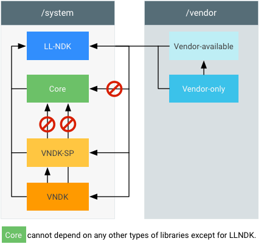
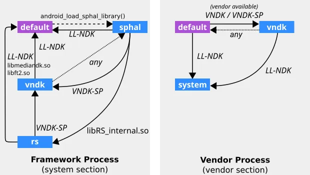
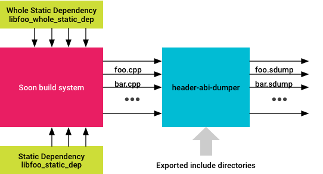

https://zhuanlan.zhihu.com/p/521771593


架构设计中如何管理导出的API，及其控制组件依赖关系是一个非常重要的工作。如何显式的标注和控制一个组件（包/库等）可以被外部访问和使用，是一个值得注意的设计话题。结合Android系统，我们看看它使用了那些技术来实现这个目标。

## 1 C/C++编写的库

Android中有非常多库（如libc.so）使用C/C++编写，这些系统库被很多模块进行使用。Android系统是如何管理这些库可以被谁使用，库中那些API可以被导出的？

### 1.1 --version_script配置脚本文件控制那些API函数可以被导出

在很多库中我们可以看到定义了map.txt文件，如

```text
bionic/libc/libc.map.txt
bionic/libc/libstdc++.map.txt
system/logging/liblog/liblog.map.txt
```

这些map文件在Android.bp中被使用，如

```text
 version_script: "liblog.map.txt",
```

在Android的构建系统中，version_script被传递给lld衔接器：

```text
" -Wl,--version_script," + 配置
```

另外一种方式是，编译的时候可以使用：

```text
1 cflags: ["-fvisibility=hidden"]
2 add __attribute__ ((visibility("default")) to the functions you want to make visible.
```

### 1.2 使用namespace机制配置使用scope

Android架构发展了很多年，包括ndk兼容性，apex模块架构，Treble架构的约束，对系统中c/c++库的使用scope给出了明确的规则。首先是编译上区分各种用途的库类型，运行时通过namespace机制限制库的scope。

- ndk库：可以被三方应用编写c/c++ jni代码引用的库，发布到ndk里面，系统中模块构建方式：

```text
//例如packages/modules/NeuralNetworks/runtime/Android.bp
ndk_library {
    name: "libneuralnetworks",
    symbol_file: "libneuralnetworks.map.txt",
    // Android O-MR1
    first_version: "27",
}
可以在out/soong/ndk/platforms/xxx目录中找到对应库
```

- vndk库：Android提供给vendor分区bin使用的库

```text
// Android.bp
cc_library {
    ...
    vendor_available: true,
    vndk: {
        enabled: true,
    },
   ...
}
// 安卓11之后预制在 /apex/com.android.vndk.vXX/目录
```

- ll-ndk库：预制在system分区，可以被vendor分区bin使用

```text
// Android.bp中 
   llndk: {
        symbol_file: "libc.map.txt",
        export_headers_as_system: true,
        export_preprocessed_headers: ["include"],
        export_llndk_headers: ["libc_llndk_headers"],
    },
系统中目前的库llndk库：
prebuilts/vndk/v30/arm64/configs/llndk.libraries.txt
```

- vendor可行库：会单独编译放到vendor/lib{64}一份， vendor: true或者vendor_available: true

```text
// 不能配置vndk标记
cc_library {
    ...
    vendor_available: true,
   ...
}
```

- recovery可行库：会单独编译放到recovery分区一份，recovery: true或者recovery_available: true



运行时候，通过namespace机制进行scope限制，namespace机制是比较复杂的，可以参考如下衔接：

[Linker Namespace | Android Open Source Projectsource.android.com/devices/architecture/vndk/linker-namespace](https://source.android.google.cn/docs/core/architecture/vndk/linker-namespace?hl=zh-cn)

> the linker namespace mechanism provides the flexibility so that some shared libraries can be exported by a linker namespace and used by another linker namespace. These exported shared libraries can become application programming interfaces that are public to other programs while hiding their implementation details within their linker namespaces.

现在namespace产生的配置文件是通过init启动的linkerconfig产生的，linkerconfig文件在linker里面使用。

```text
system/linkerconfig/
system/core/rootdir/init.rc
//控制常驻进程，native进程linker里面使用
bionic/linker/linker.cpp

// 控制APP应用能够使用的库的，配置在classloader使用
art/libnativeloader/public_libraries.cpp
```

理解linker namespace可以用图去理解：namespaces (graph vertexes) and several fallback links between namespaces (graph arcs)，如：



https://source.android.google.cn/devices/architecture/vndk/linker-namespace

### 1.3 stub库使用

Android.bp里面可以定义： Generate stubs to make this library accessible to APEXes.

```text
cc_library_shared {
 ...
   stubs: {
    
   }
 ...
}

// stubs属性
build/soong/cc/library.go
// Generate stubs to make this library accessible to APEXes.
--- compileStubLibrary
```

### 1.4 header_abi_checker

可以在编译的时候库监控是否有abi变化，导致兼容性问题。

```text
    header_abi_checker: {
        enabled: true,
        symbol_file: "libnetd_resolv.map.txt",
    },
```

## 2 Java库

Java代码API定义和实现基本在一起，编译的时候可以产生静态库（包括了全部代码实现）和动态库（只有接口

Stub，实现在设备上）。

### 2.1 静态库

Android静态库包括传统的jar，还有自定义的aar格式，也是目前主要静态包发布格式。

```text
系统中aar编译: 
android_library {
}
系统中jar编译,class文件，不产生dex文件
java_library_static {
}
```

静态库一般直接被嵌入到使用方包里面，相对简单，不在讨论。

### 2.2 动态库

编译方式：java_library，主要是把java编译成dex的jar包。

### 2.2 SDK库

https://source.android.google.cn/docs/core/architecture/java-library?hl=zh-cn

The`java_sdk_library`implements optional SDK APIs for use by apps。主要适合use library场景。

```text
java_sdk_library {

}
```

### 2.3 droidstubs

> A stubs source module (of `droidstubs` module type) - consumes the implementation source and outputs a set of stub sources along with the API specification file.
> // How stubs are generated:
> // raw source files --(metalava)--> stub source files --(javac)--> stub jar files

主要通过metalava从源代码产生stub文件，产生stub文件可以作为java_library/java_sdk_library输入等。

```text
可以参考：
frameworks/base/StubLibraries.bp
```

### 2.4 hidden api机制

除了编译的时候通过metalava去掉代码实现，只保留api声明外，在运行态的时候通过在ART虚拟机中增加hidden api机制，防止应用调用非公共接口（现在国内有一些绕过的方法，不在讨论）

[Restrictions on non-SDK interfaces | Android Developers](https://developer.android.google.cn/guide/app-compatibility/restrictions-non-sdk-interfaces?hl=zh-cn)

主要针对"@*hide*"标记的函数

## 3 Android通用机制

### 3.1 使用visibility: 配置库可以被那些模块使用

现在Android为每个模块配置了一些可见性，编译的时候仅允许指定目录才可以使用对应的库，如art/build/Android.bp

```text
art_module_art_global_defaults {
     // This is the default visibility for the //art package, but we repeat it
    // here so that it gets merged with other visibility rules in modules
    // extending these defaults.
    visibility: ["//art:__subpackages__"]
 ...
}
```

## 4 总结

当我们定义一个库的时候要考虑：

- 库的public API是什么，然后API需要通过version机制进行控制
- 库的scope是什么？运行的时候可以被谁使用？
- 库的visibility是什么？编译的时候可以被谁使用？
- 库的部署位置是什么？都放到那些分区？

参考：

[ABI 稳定性 | Android 开源项目 | Android Open Source Project](source.android.google.cn/devices/architecture/vndk/abi-stability?hl=zh-cn)


[https://source.android.google.cn/devices/architecture/vndk/linker-namespacesource.android.com/devices/architecture/vndk/linker-namespace]