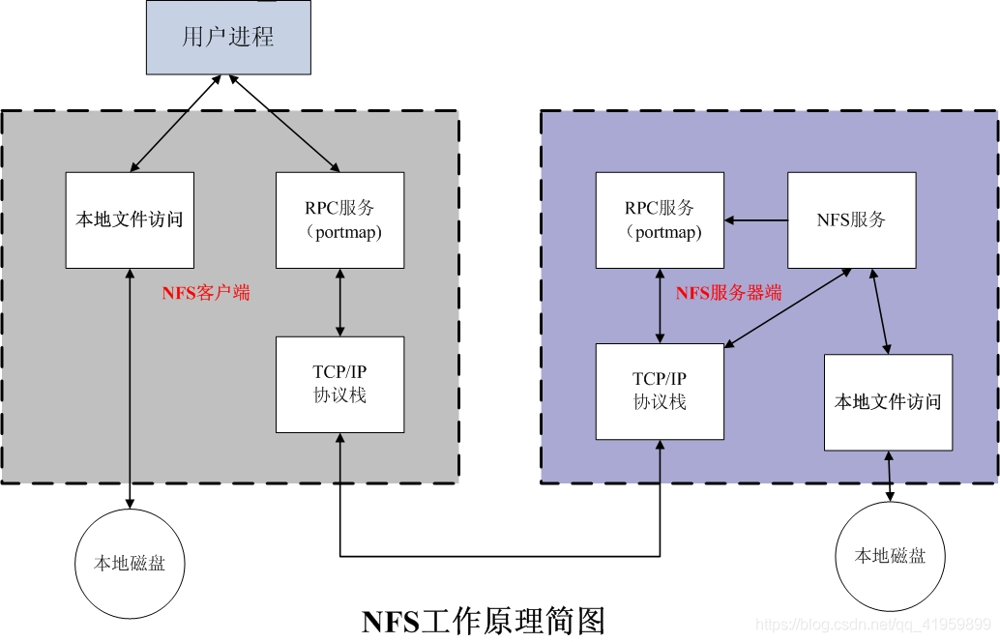

## 概念

NFS就是Network File System的缩写，它的功能是把网络上的文件挂载到本地文件系统，就像访问本地文件一样。

## 工作原理




## QNX打开nfs服务

首先，先在ubuntu上面搭建nfs。比较简单，过程略。我的目的是，在QNX上面添加配置文件（/etc/netconfig）时，可以参考ubuntu上面的配置文件（因为ubuntu是按照工具包时自动生成的）。

依赖两个可执行文件：nfsd、rpcbind。

rpcbind服务是将RPC程序/版本号映射为TCP和UDP端口号。仅当rpcbind在服务器上运行时，客户端才能进行RPC调用。nfsd是nfs守护程序。

我们在CCU的板子上开发，先用pidin确认两个服务是否存在。对于CCU项目，这两个文件是没有打包进系统的，需要手动上传到系统bin目录。文件路径：

```
qnx700/target/qnx7/aarch64le/usr/sbin/nfsd
qnx700/target/qnx7/aarch64le/usr/sbin/rpcbind
```

另外两个也一起添加进来(非必须，有助于调试)：

```shell
qnx700/target/qnx7/aarch64le/usr/bin/showmount
qnx700/target/qnx7/aarch64le/usr/bin/rpcinfo
```

前面两个是`/usr/sbin`,后面两个是`/usr/bin`,保持路径不变。

拖到车机里后执行`chmod +x nfsd`赋予可执行权限。四个文件都要。

### 配置

rpcbind服务的运行需要用到`/etc/netconfig`网络配置文件;

nfsd需要读取/etc/exports文件。

前面在ubuntu上面开通nfs的时候，是安装的工具包自动帮我们把一些配置文件弄好了。在qnx上面，需要我们自己来写。直接从ubuntu上面粘贴过来。

`/etc/netconfig`:

```shell
#
# The network configuration file. This file is currently only used in
# conjunction with the TI-RPC code in the libtirpc library.
#
# Entries consist of:
#
#       <network_id> <semantics> <flags> <protofamily> <protoname> \
#               <device> <nametoaddr_libs>
#
# The <device> and <nametoaddr_libs> fields are always empty in this
# implementation.
#
udp        tpi_clts      v     inet     udp     -       -
tcp        tpi_cots_ord  v     inet     tcp     -       -
udp6       tpi_clts      v     inet6    udp     -       -
tcp6       tpi_cots_ord  v     inet6    tcp     -       -
rawip      tpi_raw       -     inet      -      -       -
local      tpi_cots_ord  -     loopback  -      -       -
unix       tpi_cots_ord  -     loopback  -      -       -
```


在`/etc/services`中添加两行：

```shell
sunrpc		111/tcp		portmapper	# RPC 4.0 portmapper
sunrpc		111/udp		portmapper
```

CCU已经有这两行，所以不需要加。

官网（http://www.qnx.com/developers/docs/7.0.0/#com.qnx.doc.neutrino.utilities/topic/r/rpcbind.html）要求添加:

```shell
sunrpc          111/tcp         rpcbind portmap
sunrpc          111/udp         rpcbind portmap
```

实测好像差别不大，什么意思也不清楚。


`/etc/exports`添加：

```shell
/usr/testnfs 192.168.1.3
```

192.168.1.3是这台车机android的ip地址。testnfs是自己新建的。

重启，先后运行rpcbind和nfsd：

```shell
# mkdir /usr/testnfs
#
# rpcbind -L 
rpcbind: Cannot bind `local': Permission denied
rpcbind: Failed to open /var/run/rpcbind.sock: Permission denied
# 
# nfsd -t
```

检查：

```shell
# rpcinfo -p 192.168.1.1
   program vers proto   port  service
    100000    4   tcp    111
    100000    3   tcp    111
    100000    2   tcp    111
    100000    4   udp    111
    100000    3   udp    111
    100000    2   udp    111
    100005    1   udp   2049
    100003    2   udp   2049
    100005    3   udp   2049
    100003    3   udp   2049
    100005    1   tcp   2049
    100003    2   tcp   2049
    100005    3   tcp   2049
    100003    3   tcp   2049

# showmount -e 192.168.1.1
Exports list on 192.168.1.1:
/usr/testnfs                       192.168.1.3 
```

从命令看，qnx端的nfs服务已经开通。下面是android端挂载：

```shell
msmnile_gvmq:/mnt # mount -t nfs 192.168.1.1:/usr/testnfs /mnt/nfs
mount: '192.168.1.2:/usr/testnfs'->'/mnt/nfs': No such device

msmnile_gvmq:/ $ cat /proc/filesystems | grep nfs
nodev   functionfs
```

所以CCU的android不支持nfs文件系统。到内核源码看一下：

```shell
CCU@S052-Code:~/ccu_aosp_dev/lagvm/LINUX/android/kernel/msm-5.4/fs$ ls -l | grep nfs
drwxrwxr-x 2 CCU CCU   4096 10月 19  2022 kernfs
drwxrwxr-x 5 CCU CCU   4096 10月 19  2022 nfs
drwxrwxr-x 2 CCU CCU   4096 10月 19  2022 nfs_common
drwxrwxr-x 2 CCU CCU   4096 10月 19  2022 nfsd
```

nfs是客户端，nfsd是服务端。所以代码里是有的，推测可能是内核的开关没有打开。打开nfs的Makefile:

```makefile
# SPDX-License-Identifier: GPL-2.0
# 
# Makefile for the Linux nfs filesystem routines.
#

obj-$(CONFIG_NFS_FS) += nfs.o

CFLAGS_nfstrace.o += -I$(src)
nfs-y                   := client.o dir.o file.o getroot.o inode.o super.o \
                           io.o direct.o pagelist.o read.o symlink.o unlink.o \
                           write.o namespace.o mount_clnt.o nfstrace.o \
                           export.o sysfs.o
nfs-$(CONFIG_ROOT_NFS)  += nfsroot.o
nfs-$(CONFIG_SYSCTL)    += sysctl.o
nfs-$(CONFIG_NFS_FSCACHE) += fscache.o fscache-index.o
...
```

进入`~/ccu_aosp_dev/lagvm/LINUX/android/kernel/msm-5.4/arch/arm64/configs/vendor`, 找到gen3auto_debug.config、gen3auto_GKI.config、gen3auto_QGKI.config三个文件，在任意一个里面把CONFIG_NFS_FS加进去：

```
CONFIG_EDAC_KRYO_ARM64_PANIC_ON_CE=y
CONFIG_AUDITSYSCALL=y
CONFIG_NL80211_TESTMODE=y
CONFIG_NFS_FS=y       <--------我新增的
CONFIG_NFSD=y         <--------我新增的
```

CONFIG_NFSD是后面把安卓作为server端才要加的。这里顺便一起完事。

重新编译后mount还是不行。有待分析...

## 后续思路

1. 在PC上挂载QNX的NFS目录，验证QNX端服务开发正确。

   --------因为没法把QNX和Ubuntu搞到一个局域网里，所以不好做。

2. 推测还是config文件没有配置好，但是应该怎么弄没头绪，也不知道从哪找相关资料；网上找到一个`fuse-nfs`的开源项目，借助fuse绕过在内核里做修改。后面可以考虑试一下把它移植到安卓里面来，用它来挂载nfs。

