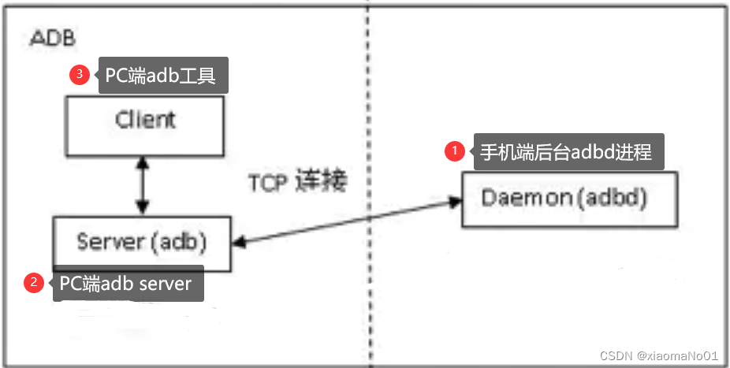
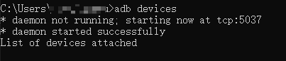

1.adb工作原理说明

adb命令是调试控制手机过程中用的比较多工具。adb是一个C/S架构的应用程序，主要由三部分组成：

**(1)、运行在电脑端的adb client程序**

在电脑终端中执行adb --help可以查看当前支持的adb命令。当在命令行执行程序**adb**相关命令的时候,**adb**程序尝试连接到主机上的ADB服务器，如果找不到ADB服务器,**adb**程序自动启动一个ADB服务器。ADB服务器启动之后会和手机设备的adbd后台服务进程建立连接后。adb client就可以向ADB servcer发送服务请求；

**(2)、运行在PC端的adb server**

ADB Server是运行在主机上的一个后台进程。它的作用在于检测USB端口监听设备的连接和拔除。ADB Server还需要将adb client的请求通过tcp连接方式转发送到对应手机设备的adbd进程上去处理。

**(3)、运行在设备端的常驻进程adb daemon**

手机系统中的程序**adbd**作为一个后台进程在Android设备系统中运行。它的作用是连接PC端的ADB服务器,接收PC端ADB 服务转发过来的命令请求并进行处理。比如处理apk 安装和卸载等请求。

**adb整体架构如下图所示:**



* 本地电脑上没有adb server时，使用adb命令时，会自动启动一个ADB服务器。

  

  相当于执行adb start-server

* 如果本地设定了ADB_SERVER_SOCKET环境变量，如：

  ```
  # linux
  export ADB_SERVER_SOCKET=tcp:192.168.22.24:5037
  # or
  # windows
  set ADB_SERVER_SOCKET=tcp:192.168.22.24:5037
  ```

  则adb client连接到IP为192.168.22.24的电脑上。远程电脑不会自动启动adb  server,需要你手动先在22.24上面启动。

* 在远程PC上启动adb server 用命令：

  ```
  adb server nodaemon -a
  # 如果PC上已经运行了adb server,需要先kill
  adb kill-server
  adb server nodaemon -a
  # or
  adb kill-server & adb server nodaemon -a
  ```

  注意要加nodaemon和 -a，否则adb server不会监听网络上的adb,只listen localhost。

  adb start-server启动的就是daemon方式，所以adb start-server不会监听all network，adb client无法连接这个机器。

  （相关应用见安卓调试的几篇）