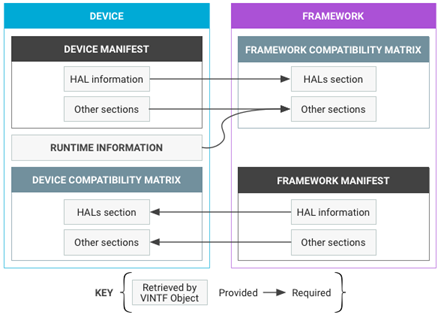
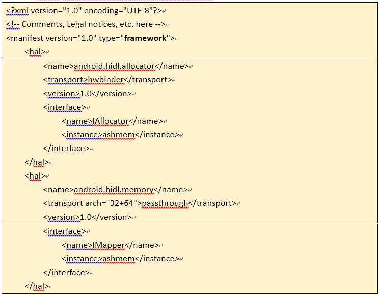
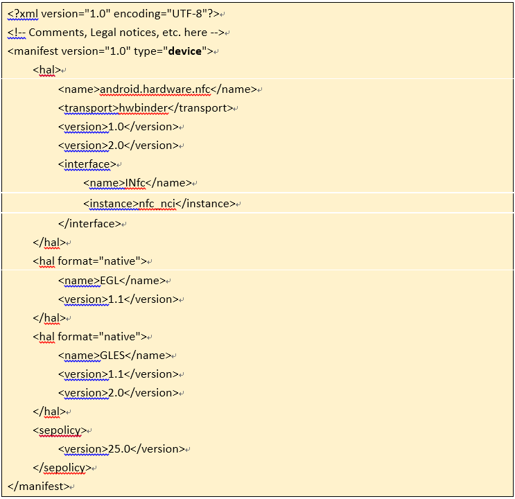
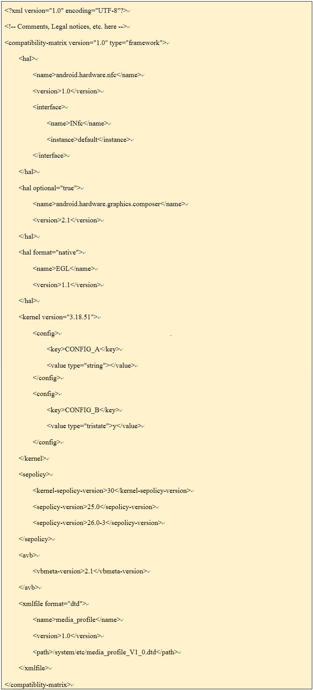
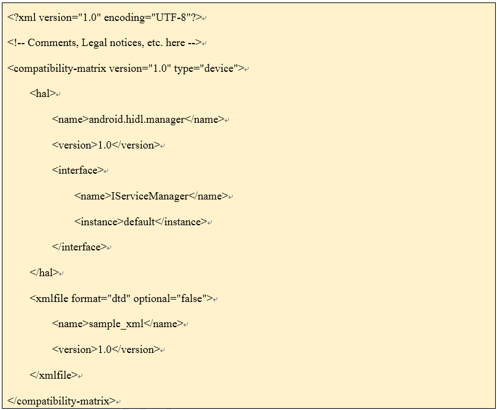

VINTF简介

 2018年3月22日 1,791次阅读 来源: [你身边的那个TA](https://www.jianshu.com/p/a9ea323f892c)

# 一、概述

VINTF指的是Vendor Interface object，是android 8.0分离system和vendor分区的机制之一，用来检查system和vendor依赖是否匹配。

Framework(system)和Device(vendor)匹配的框架如下：

Manifest 描述了提供给对方的feature， Matrix 描述了需要对方提供的feature。Manifest 和 Matrix 在OTA升级前会进行匹配检查，以确保framework和device是兼容的。总的来说，manifest是提供端，matrix是需求端。

# 二、manifest

## 2.1 framework manifest 

Framework manifest文件是由Google手动生成的。它在aosp源码的路径是system/libhidl/manifest.xml，在具体设备上的路径是/system/manifest.xml。

## 2.2 Device manifest举例

Device manifest文件是和具体设备相关的。它在aosp源码路径是device/${VENDOR}/${DEVICE}/manifest.xml，在具体设备上的路径是/vendor/manifest.xml。

## 2.3 Manifest语法格式

**manifest.version** 必选的，Manifest的版本号

**manifest.type** 必选的，Manifest的类型。如：device或framework

**manifest.hal** 可选的，可以存在多个。代表一个HAL（HIDL或native）

**manifest.hal.format** 可选的，值可以是hidl（默认）或native，分别代表HIDL和native HALs

**manifest.hal.name** 必选的，HAL的合规包名。多个hal可以用同一个名字。比如：

android.hardware.camera (HIDL HAL)

GLES (native HAL, 只有名字)

**manifest.hal.transport** 当manifest.hal.format的值是hidl时，就是必选的，否则不必存在。申明了当这个包的接口被service manager查询时将使用何种transport方式。值可以是：

hwbinder: binderized mode、passthrough: passthrough mode

**manifest.hal.transport.arch** 当manifest.hal.transport的值是passthrough时，就是必选的，否则不必存在。描述了passthrough service提供的bit mode。值可以是：

32: 32-bit mode、64: 64-bit mode、32+64: both

**manifest.hal.version** 必选的，可以多个。hal的版本号。格式是MAJOR.MINOR。涉及的有以下路径：

hardware/interfaces

vendor/${VENDOR}/interfaces

framework/hardware/interfaces

system/hardware/interfaces

一个manifest.hal项中可以有多个version，它们由不同的major号加上唯一的minor号来区分。比如，3.1和3.2不可以同时存在，但1.0和3.4可以。

**manifest.hal.interface** 必选的，可以多个但不能重复。申明了包中的一个含实例的接口。hal标签里可以有多个interface，但是名字不能重复

**manifest.hal.interface.name** 必选的，interface的名字

**manifest.hal.interface.instance** 必选的，可以多个，接口的实例名。一个接口可以有多个实例，但它们不能重复

**manifest.sepolicy** 必选的，包含所有sepolicy关联的项

**manifest.sepolicy.version** 如果是devicemanifest就是必须的，sepolicy的版本号。格式是SDK_INT.PLAT_INT.

# 三、Compatibility Matrices

## 3.1 Framework compatibility matrix

Framework compatibility matrix描述的是framework对 device的需求。这个matrix文件是和Android Framework Image（system.img）关联的。Framework compatibility matrix的这些需要被device manifest支持。

## 3.2 Device compatibility matrix

Device compatibility matrix描述了device对framework的需求。

## 3.3 Compatibilty matrix语法规则

**compatibility-matrix.version** 必选的，compatibility matrix版本号。

**compatibility-matrix.type** 必选的，”device”、”framework”

**compatibility-matrix.hal** 可选的，并且可存在多个，列出了一个被compatibility matrix依赖的HAL（HIDL或native）。HAL项通过元素来区分；可以出现多个同名的HAL项（隐含and的逻辑关系）

**compatibility-matrix.hal.format** 可选的，值可以是：”hidl”、”native”

**compatibility-matrix.hal.optional** 可选的，默认值是false。申明此hal是否是可选的。如果标记为可选的，如果存在就调用，反之也不强制需求

**compatibility-matrix.hal.name** 必选的，hal的完整包名。

**compatibility-matrix.hal.version** 必选的，可以存在多个但不能重复，需求的hal的版本号范围

**compatibility-matrix.hal.interface** 可选的，可以多个，一个需求的此HAL提供的接口列表

**compatibility-matrix.hal.interface.name** 必选的，接口名称

**compatibility-matrix.hal.interface.instance** 可选的，可以存在多个，一个需求的此接口的实例列表

**compatibility-matrix.kernel.version** 必选的，kernel版本号，格式是{版本号}.{major-revision}.{minor-revision}。版本号和major revision必须匹配，minor revision定义了framework需求的最小的kernel LTS版本号

**compatibility-matrix.kernel.config** 可选的，可多个，列出了kernerl版本必须匹配的所有config item，每个config item都是一个key-value组合，config item通过key来区分。

**compatibility-matrix.kernel.config.key** 必选的，config item的key值。起始字串是CONFIG_

**compatibility-matrix.kernel.config.value** 必选的，config item的value值。根据value的类型有不同的格式：

String 省略引号

Int 可以是10进制或16进制（必须以0x或0X开头）。被看作是64位整型

Range 格式是[int]-[int], e.g. 10-20。可以是16进制（必须以0x或0X开头）。两个边界值必须是无符号64位整型

Tristate 符合是y，m和n

**compatibility-matrix.kernel.config.value.type** 必选的，config item的value值类型，可以是string，int，range和tristate

**compatibility-matrix.sepolicy** 必选的，包含所有sepolicy关联的项。只在framework compatibility matrix中出现。

**compatibility-matrix.sepolicy.sepolicy-version** 必选的，可以存在多个，描述了需求的sepolicy的版本号范围。

**compatibility-matrix.sepolicy.kernel-sepolicy-version** 必选的，申明需求的policydb版本号

**compatibility-matrix.avb.vbmeta-version** 可选的，只出现在framework compatibility

matrix中，申明了签名system.img的AVB版本号

# 四、运行时数据

有些需求的信息是在运行时搜集的。通过接口

::android::vintf::VintfObject::GetRuntimeInfo()，信息包括以下：

**Kernel****信息**：

/proc/config.gz. 压缩过的kernel配置，需要在运行时被转化成一个可查询的对象

/proc/version. 系统调用uname()的到的信息

/proc/cpuinfo. 格式可能根据32位和64位而有所不同

policydb version

/sys/fs/selinux/policyvers (假设selinuxfs加载在/sys/fs/selinux).

Libselinux的security_policyvers() 接口返回结果是一样的

**Static Libavb version****：**

bootloader system property：ro.boot.vbmeta.avb_version

init/fs_mgr system property：ro.boot.avb_version

# 五、查询接口

VINTF Object是系统API，提供给hwservicemanager、OTA升级服务、CTS DeviceInfo等模块调用以便获取信息用以匹配。

C++ 查询API位于system/libvintf/VintfObject.cpp中的android::vintf::VintfObject

Java 查询API位于frameworks/base/core/java/android/os/VintfObject.java 中的android.os.VintfObject

# 六、匹配规则

略。

# 七、常见问题

1、差异化

不同工程提供的feature不同，需要差异化配置。可以在各自feature的mk中通过 DEVICE_MANIFEST_FILE 来申明和该feature相关的 manifest.xml，编译时候会收集所有mk中的DEVICE_MANIFEST_FILE组合成一个完整的manifest.xml。