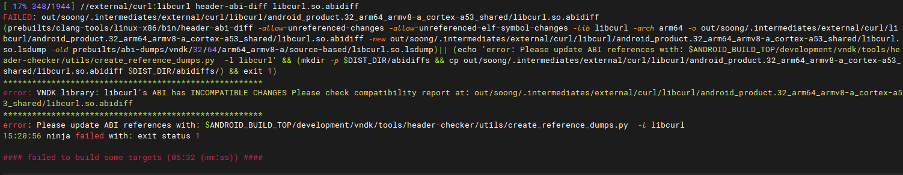

问题：

安全的需求，对源码扫描后发现libcurl存在很多漏洞。并提供了CVE编号。

实际操作发现这些漏洞的修复是在很多版本上，没法直接合入项目的代码。

有些可以自己看代码，比较，把更新合进去。有些因代码差异过大，无法合。

于是直接将项目源码里的libcurl更新到了8.4.0。然后编译报错：

```shell
[ 35% 868/2473] //external/curl:libcurl header-abi-diff libcurl.so.abidiff
FAILED: out/soong/.intermediates/external/curl/libcurl/android_product.32_arm64_armv8-a_cortex-a53_shared/libcurl.so.abidiff
(prebuilts/clang-tools/linux-x86/bin/header-abi-diff -allow-unreferenced-changes -allow-unreferenced-elf-symbol-changes -lib libcurl -arch arm64 -o out/soong/.intermediates/external/curl/libcurl/android_product.32_arm64_armv8-a_cortex-a53_shared/libcurl.so.abidiff -new out/soong/.intermediates/external/curl/libcurl/android_product.32_arm64_armv8-a_cortex-a53_shared/libcurl.so.lsdump -old prebuilts/abi-dumps/vndk/32/64/arm64_armv8-a/source-based/libcurl.so.lsdump)|| (echo 'error: Please update ABI references with: $ANDROID_BUILD_TOP/development/vndk/tools/header-checker/utils/create_reference_dumps.py  -l libcurl' && (mkdir -p $DIST_DIR/abidiffs && cp out/soong/.intermediates/external/curl/libcurl/android_product.32_arm64_armv8-a_cortex-a53_shared/libcurl.so.abidiff $DIST_DIR/abidiffs/) && exit 1)
******************************************************
error: VNDK library: libcurl's ABI has INCOMPATIBLE CHANGES Please check compatibility report at: out/soong/.intermediates/external/curl/libcurl/android_product.32_arm64_armv8-a_cortex-a53_shared/libcurl.so.abidiff
******************************************************
error: Please update ABI references with: $ANDROID_BUILD_TOP/development/vndk/tools/header-checker/utils/create_reference_dumps.py  -l libcurl
15:08:11 ninja failed with: exit status 1
```



解决方法：

方法一： 代码中搜索，发现 development/vndk/tools/header-checker/header-abi-diff/src 中的 header_abi_diff.cpp 报出的错误。错误提示如下：

```c
if (should_emit_warning_message) {
  llvm::errs() << "******************************************************\n"
               << error_or_warning_str
               << "VNDK library: "
               << lib_name
               << "'s ABI has "
               << status_str
               << unreferenced_change_str
               << " Please check compatiblity report at : "
               << compatibility_report << "\n"
               << "******************************************************\n";
} 
```

于是，直接修改代码，让里面的 main 直接返回 `abi_util::CompatibilityStatusIR::Compatible;` 然后重新编译这个文件，覆盖到代码中的检查库。全编译。通过！！

改动如下：

```cpp
--- a/development/vndk/tools/header-checker/header-abi-diff/src/header_abi_diff.cpp
+++ b/development/vndk/tools/header-checker/header-abi-diff/src/header_abi_diff.cpp
@@ -182,21 +182,21 @@ int main(int argc, const char **argv) {
   bool should_emit_warning_message = ShouldEmitWarningMessage(status);
 
   if (should_emit_warning_message) {
-    llvm::errs() << "******************************************************\n"
-                 << error_or_warning_str
-                 << "VNDK library: "
-                 << lib_name
-                 << "'s ABI has "
-                 << status_str
-                 << unreferenced_change_str
-                 << " Please check compatiblity report at : "
-                 << compatibility_report << "\n"
-                 << "******************************************************\n";
+//    llvm::errs() << "******************************************************\n"
+//                 << error_or_warning_str
+//                 << "VNDK library: "
+//                 << lib_name
+//                 << "'s ABI has "
+//                 << status_str
+//                 << unreferenced_change_str
+//                 << " Please check compatiblity report at : "
+//                 << compatibility_report << "\n"
+//                 << "******************************************************\n";
   }
 
-  if (!advice_only && should_emit_warning_message) {
-    return status;
-  }

```

重新编译 development/vndk/tools/header-checker，编译命令如下:

```
mmm  development/vndk/tools/header-checker/ -j32
```

复制 out/host/linux-x86/bin/header-abi-diff 到 prebuilts/clang-tools/linux-x86/bin 中覆盖：

`cp out/host/linux-x86/bin/header-abi-diff prebuilts/clang-tools/linux-x86/bin/header-abi-diff`


方法二:

按照报错提示，执行：

```shell
$ANDROID_BUILD_TOP/development/vndk/tools/header-checker/utils/create_reference_dumps.py  -l libcurl -product vnd_ac8025_hsae
```

需要注意的是，要加上product参数。product是在lunch里选的。

编译完后，在prebuilts/abi-dumps/vndk目录生成新的问题：

```shell
xue@fcn36vvlb5sjbwm:~/toyota_24mm_dev/source/android/prebuilts/abi-dumps/vndk$ git status
HEAD detached at 6f1ca3a
Changes not staged for commit:
  (use "git add/rm <file>..." to update what will be committed)
  (use "git checkout -- <file>..." to discard changes in working directory)

        modified:   32/64/arm64_armv8-a/source-based/libcurl.so.lsdump
        deleted:    32/64/arm_armv7-a-neon/source-based/libcurl.so.lsdump
        modified:   32/64/arm_armv8-a/source-based/libcurl.so.lsdump
```

把它commit提交。其他人sync下来不需要再次执行“create_reference_dumps.py”。