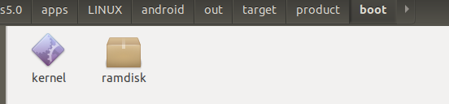

生成boot.img使用mkbootimg，解包对应的是unpack_bootimg。但是好像整编时，这个工具没有编出来。我们源码位置：

```groovy
//system/tools/mkbootimg/Android.bp
python_binary_host {
    name: "unpack_bootimg",
    defaults: ["mkbootimg_defaults"],
    srcs: [
        "unpack_bootimg.py",
    ],
}
```

源码是`unpack_bootimg.py`，于是找到了不编译这个工具的方法:

```shell
mkdir boot
<aosp>/system/tools/mkbootimg/unpack_bootimg.py --boot_img boot.img --out boot
```

在boot目录下得到两个文件：



接下来解压ramdisk：

```shell
$ file ramdisk 
ramdisk: gzip compressed data, from Unix

#ramdisk是一个gzip文件，用ungzip解压
$ mv ramdisk ramdisk.gz
$ gunzip -k ramdisk.gz 
$ ls
kernel  ramdisk  ramdisk.gz

$ file ramdisk
ramdisk: ASCII cpio archive (SVR4 with no CRC)
```

得到的ramdisk是一个cpio文件。所以使用cpio来提取ramdisk中的内容。

```shell
mkdir ramdisk_dir
cd ramdisk_dir
cpio -idmv < ../ramdisk
```

ramdisk_dir目录下得到ramdisk里的文件。
