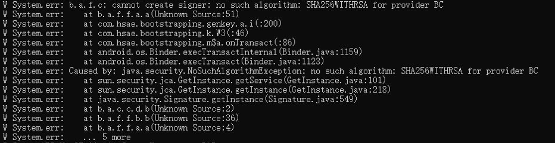

报错信息如下：



1. 诡异之处在于，我自己从来没遇到过，但是其他同事经常给我反馈这个问题。日志只有这点信息，自己又不能复现，出现问题全随运气。只能靠猜。

2. 开始怀疑是跑到系统自带的BC库里去了。因为安卓自己集成了BC的一个精简集合。这个精简的BC库是不全的，所以找不到。高版本的安卓对包名做了重命名，原来的包名是“org.bouncycastle.jce”，安卓重命名的是“com.android.org.bouncycastle.jce”。利用这一点，把provider的className打出来，做了验证，最终证明跟它无关。因为有次打的是“com.android.org.bouncycastle.jce”，但是没报错；有次打的是“org.bouncycastle.jce”却报错了。

3. 后来想了想，这台机器如果报错，那么每次都报错，重启没用。然后我用自己编apk的install进去再试就好了。所以触发异常的条件是，用源码整编烧录的不行，自己install或push的可以。

4. 不管是烧录还是install，安装过程应该是一样的。所以，是app本身不一样。集成过程是这样的：
    1. 用gradle编译出apk，这一点和自己用android studio编译是一样的，studio也是用gradle来编，只不过服务器上是执行命令，studio是GUI点一下，归根到底也是执行gradle命令。

   2. apk拷贝到源码的packages/app目录，然后Android.mk里`include $(BUILD_PREBUILT`来编。

5. 所以是不是BUILD_PREBUILT会对apk做什么手脚？通过反编译，发现烧录apk是混淆过的，自己AS run的是未混淆的。但是后来了解到，BUILD_PREBUILT不会做混淆。apk拷贝过去就是混淆过的。

6. 所以回到gradle编译这里，应该还是服务器的gradle编出来的和studio不一样。于是立马想到，服务器编的是release版本，studio编的是debug版本。

7. 于是我把studio界面build variant选择release，果然异常又出现了。

8. 看一下release和debug的差异：

    ```groovy
        buildTypes {
            release {
                minifyEnabled true
                debuggable true
                testCoverageEnabled false
                zipAlignEnabled true
                proguardFiles getDefaultProguardFile('proguard-android.txt'), 'proguard-rules.pro'
                signingConfig signingConfigs.config
            }
            debug {
                minifyEnabled false
                debuggable true
                testCoverageEnabled false
                zipAlignEnabled true
                proguardFiles getDefaultProguardFile('proguard-android.txt'), 'proguard-rules.pro'
                multiDexKeepProguard file('multidex-config.pro')
                signingConfig signingConfigs.config
    
            }
        }
    ```

    release的minifyEnabled是打开的，debug是关闭的。把release的minifyEnabled也关闭可解决这个问题，但是不符合项目要求。要求是必须加混淆的。

    9. 所以最终对策是配置混淆文件'proguard-rules.pro'，加了一行：

       ```
       -keep class org.bouncycastle.** { *; }
       ```

       这样不会混淆bouncycastle库，也不会精简bouncycastle库里面用不到的class了。

    

    项目上之前说过，三方库不混淆，是我之前没听进去大意了。

    