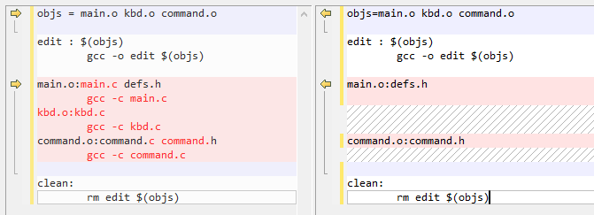

## makefile

### 基础语法规则  

```makefile
target ... : prerequisites ...
	command
```

* target   可以是目标文件，也可以是伪目标
* prerequisites  是要生成那个 target 所需要的文件或目标 ，即指明依赖关系   
* ...三个点表示可以有多个target或prerequisites
* command 是 执行的命令 ，任意的 Shell 命令  
* command前面必须是制表符tab,不能是空格。因为肉眼看不出空格和tab的区别，所以需要额外注意.

举例：

```makefile
edit : main.o kbd.o command.o 
	gcc -o edit main.o kbd.o command.o

main.o:main.c defs.h
	gcc -c main.c
kbd.o:kbd.c
	gcc -c kbd.c
command.o:command.c command.h
	gcc -c command.c
	
clean:
	rm edit main.o kbd.o command.o
```

执行过程：

1. 输入 make 命令  

2. 在当前目录下找名字叫“ Makefile”或“ makefile”的文件 。如果是“GNU make”，查找顺序是“GNUmakefile”，“makefile”、“Makefile”。

   或者通过-f指定要执行的makefile文件，如`make -f ./dir/Makefile`

3. 找到文件中的第一个目标文件（ target），  上面的例子中就是“ edit”这个文件，把这个文件作为最终的目标文件 。

4. 如果 edit 文件不存在，或是 edit 所依赖的后面的 .o 文件的文件修改时间要比 edit
   这个文件新，那么，他就会执行后面所定义的命令来生成 edit 这个文件   

5. 对于 edit 所依赖的.o 文件（main.o kbd.o command.o），递归前面的过程。也就是说，  edit 所依赖的.o 文件，.o文件又依赖一系列.c和.h文件，一旦源码文件的文件修改时间比.o文件更新，就会重新生成.o文件，然后再重新生成edit文件。

由上可知，

1. 已经执行过完整构建的项目，如果只改了少量文件，再次构建时，只编译改动部分，提高了效率。
2. 执行make命令不会运行clean目标。命令“make clean” 来清除所有的目标文件 。 

### 使用变量  

```makefile
objs = main.o kbd.o command.o

edit : $(objs)
        gcc -o edit $(objs)

main.o:main.c defs.h
        gcc -c main.c
kbd.o:kbd.c
        gcc -c kbd.c
command.o:command.c command.h
        gcc -c command.c
        
clean:
        rm edit main.o kbd.o command.o
```

### 自动推导  

GNU 的 make 可以自动推导文件以及文件依赖关系后面的命令  。

```makefile
objs=main.o kbd.o command.o
  
edit : $(objs)
        gcc -o edit $(objs)

main.o:defs.h

command.o:command.h

clean:
        rm edit $(objs)
```

和原来的对比下区别：



1. 根据目标文件默认推导出依赖的文件，main.o推导出依赖main.c，所以`main.o:main.c defs.h`删掉main.c, **不能**推导出依赖defs.h，所以保留defs.h
2. 推导出对应的基本编译命令，kbd.o的命令为`gcc -c kbd.c`; 所以原来的命令行删除了。main.o和command.o同理。

尽量不要使用这个特性，因为虽然简化了makefile文件，但是理解难度增大了。

### .PHONY

在clean上面加一行`.PHONY:clean`

```makefile
objs=main.o kbd.o command.o
  
edit : $(objs)
        gcc -o edit $(objs)

main.o:defs.h

command.o:command.h

.PHONY:clean
clean:
        rm edit $(objs)
```

.PHONY 显式的表示 clean 是一个“伪目标”  ,也就是，前面的edit、main.o等都是要生成的文件；而clean不是真实存在的文件，仅仅是一个标签，目的是可以通过执行make clean来清除输出文件。

如果不用.PHONY 显式指明，那么“伪目标”的取名不能和文件名重名 （因为一旦同名，就不是伪目标了）。如果用了“ .PHONY”  ，就等于向 make 说明，不管是否有这个文件，这个目标就是“伪目标”。  

clean请放在末尾。如果放到开头，就会成为`make`默认的目标。

下面举一个伪目标放在开头的例子。

前面的示例中，edit是最终的生成文件。有时我要生成的可执行文件不止一个，我想敲一个make，把所以可执行文件都生成，那么可以像下面这样写：

```makefile
all : prog1 prog2 prog3
.PHONY : all clean

prog1 : prog1.o utils.o
	gcc -o prog1 prog1.o utils.o
......省略后续代码
```

我们把all放在开头，那么make执行的实际是“make all”，而all依赖`prog1 prog2 prog3`,所以这三个文件都会生成。

### include  关键字  

Makefile 使用 include 关键字可以把别的 Makefile 包含进来，被包含的文件会原模原样的放在当前文件的包含位置。

include 前面可以有一些空字符，但是绝不能是[Tab]键开始。  

```makefile
include foo.make a.mk b.mk c.mk e.mk f.mk
```

由于include只是原样的把文本放在包含的位置，所以显而易见的是，被include的几个文件和外面的Makefile，如果有重复的target，会产生冲突,提示一个警告，like this:

```shell
Makefile:15: 警告：覆盖关于目标“xxx”的配方
Makefile:13: 警告：忽略关于目标“xxx”的旧配方
```

所以你要组织好，哪些独立出来放到单独的mk文件里。你可以把一些自定义的函数、声明变量放到mk里。

另外，include不是给你组织大型项目的多个模块的,多个模块的话，如果用include包含到一个总的，不可避免会有重复名称的target。多模块怎样组织，见下一节内容。

这个用来被其它Makefile包含的文件，虽然也是Makefile，但是命名一般以mk作为后缀，比如安卓的构建脚本“Android.mk”。

> 做过Android OS开发的同学此时应该已经明白，Android.mk里面常见的：
>
> include $(CLEAR_VARS)、include $(BUILD_MULTI_PREBUILT)、include $(BUILD_PACKAGE)等，其实就是include一个mk文件。下面证实它：
>
> ```makefile
> #Android.mk内容，任意源码下的目录
> $(info CLEAR_VARS=$(CLEAR_VARS))
> 
> $(info BUILD_MULTI_PREBUILT=$(BUILD_MULTI_PREBUILT))
> 
> $(info BUILD_PACKAGE=$(BUILD_PACKAGE))
> ```
>
> source build/envsetup.sh并且lunch后，到这个Android.mk目录下执行mm,输出日志很长，其中有：
>
> ```shell
> CLEAR_VARS=build/make/core/clear_vars.mk
> BUILD_MULTI_PREBUILT=build/make/core/multi_prebuilt.mk
> BUILD_PACKAGE=build/make/core/package.mk
> ```

### 嵌套

有时我们把整个项目分成不同的模块，每个模块都有它自己的Makefile，然后在外面一个总控的 Makefile里面调用子模块的Makefile：

```makefile
subsystem:
	cd subdir && $(MAKE)
#等价
subsystem:
	$(MAKE) -C subdir
```

subsystem是子模块的生成物，也是外面这个makefile依赖的文件。

举例：

```shell
work@ubuntu-cts:~/makefile/05$ tree
.
├── lib
│   ├── hello.c
│   ├── hello.h
│   └── Makefile
├── main.c
└── Makefile
```

外面的main.c调用printHello函数。这个函数是hello.c提供的。现在我要把hello.c编译成静态库，供main.c使用。整个编译过程like this：

```text
hello.c ---> hello.o ---> hello.a ---|
                                     |
             main.c ---> hello.o ----|-----> 可执行程序
```

代码如下：

```c
// lib/hello.c
#include <stdio.h>
void printHello(){
    printf("Hello\n");
}

// lib/hello.h
#ifndef FILE_HELLO_
    #define FILE_HELLO_
    #ifdef __cplusplus  
    extern "C" {
    #endif
        void printHello();  
    #ifdef __cplusplus  
    }  
    #endif  
#endif

// main.c
#include "hello.h"

int main(){
        printHello();
}
```

编静态库的Makefile：

```makefile
.PHONY: all
all: libhello.a

libhello.a:hello.o
        ar rcs libhello.a hello.o

hello.o:hello.c hello.h
        gcc -c hello.c -o hello.o

clean:
        rm -rf *.a *.o
```

外面的makefile:

```makefile
.PHONY:all

all: edit

edit: main.c libhello.a
        gcc main.c -I lib -L lib -l hello -o edit

libhello.a:
        cd lib && $(MAKE) 
        #或者
        #$(MAKE) -C lib
clean:
        rm edit $(objs) && $(MAKE) -C lib clean
```

解读一下：

* edit: main.c libhello.a ： edit这个最终可执行程序的生成，依赖mainc.c文件和 libhello.a这个目标。

* gcc main.c -I（大小的 i，表示include的目录，gcc到这个目录寻找头文件 ） lib -L(大写L，库的路径) lib -l（小写的L，库的名称） hello -o edit，注意静态库是libXXX.a的格式，只要写XXX就行,GCC会自动加上前缀和后缀。

* 然后在libhello.a这个目录里调用子模块的Makefile：`$(MAKE) -C lib` 或`cd lib && $(MAKE) `

  make命令参数：

  | 命令    |              用法               |
  | ------- | :-----------------------------: |
  | -C dir  |   读入指定目录下面的makefile    |
  | -f file | 读入当前目录下的le文件为makeile |
  | -i      |      忽略所有命令执行错误       |
  | -i dir  |  指定被包含的makefile所在目录   |

* clean任务，既要clean自己的，也要调用子模块的clean。

* ar 是 Linux 的一个备份压缩命令，它可以将多个文件打包成一个备份文件（也叫归档文件），也可以从备份文件中提取成员文件。ar 命令最常见的用法是将目标文件打包为静态链接库： `ar rcs 静态库文件的名字 目标文件列表`。对参数的说明：

  * 参数 r 用来替换库中已有的目标文件，或者加入新的目标文件。
  * 参数 c 表示创建一个库。不管库否存在，都将创建。
  * 参数 s 用来创建目标文件索引，这在创建较大的库时能提高速度。


### 前面加-

还是以上面的示例为例，执行make clean 可能会报错：

```shell
work@ubuntu-cts:~/makefile/03$ make clean    
rm edit main.o kbd.o command.o
rm: 无法删除 'edit': 没有那个文件或目录
rm: 无法删除 'kbd.o': 没有那个文件或目录
make: *** [Makefile:12：clean] 错误 1
```

那是因为没有目标文件，rm命令报错，然后就终止了。

对策是rm前面加一道“-”：

```makefile
.PHONY:clean
clean:
        -rm edit $(objs)
```

然后执行make clean

```shell
work@ubuntu-cts:~/makefile/03$ make clean
rm edit main.o kbd.o command.o
rm: 无法删除 'edit': 没有那个文件或目录
rm: 无法删除 'main.o': 没有那个文件或目录
rm: 无法删除 'kbd.o': 没有那个文件或目录
rm: 无法删除 'command.o': 没有那个文件或目录
make: [Makefile:12：clean] 错误 1 (已忽略）
```

错误信息当然还是会打印出来，但是会忽略错误，不会影响后面的执行。

上面那个include的例子，如果被include的文件有一个无法读取或者没找到，make 会生成一条警告信息，但不会马上出现致命错误。它会继续载入其它的文件，一旦完成 makefile 的读取， make 会再重试这些没有找到或不能读取的文件，如果还是不行， make 才会出现一条致命信息。  

那么同理，如果不想理会这些无法读取的文件，可以在 include 前加一个减号“ -”。  

### 预定义变量

$* 　　不包含扩展名的目标文件名称。

$+ 　　所有的依赖文件，以空格分开，并以出现的先后为序，可能包含重复的依赖文件。

$< 　　第一个依赖文件的名称。

$? 　　所有的依赖文件，以空格分开，这些依赖文件的修改日期比目标的创建日期晚。

$@ 　 目标的完整名称。

$^ 　　所有的依赖文件，以空格分开，不包含重复的依赖文件。

$%     如果目标是归档成员，则该变量表示目标的归档成员名称。


现在利用预定义变量继续简化前面的代码

```makefile
objs=main.o kbd.o command.o
edit : $(objs) 
        gcc -o $@ $?

main.o:main.c defs.h
        gcc -c $<
kbd.o:kbd.c
        gcc -c $<
command.o:command.c command.h
        gcc -c $<

clean:
        rm edit $(objs)
```

第三行，`gcc -o $@ $?`, "$@"表示“目标的完整名称”，"$?"是以空格分开的所有的依赖文件，因此`gcc -o $@ $?`实际上就是“gcc -o edit main.o kbd.o command.o” 


假设main.o不依赖defs.h, command.o不依赖command.h，还可以继续优化：

```makefile
objs=main.o kbd.o command.o
edit : $(objs) 
        gcc -o $@ $?

%.o:%.c
        gcc -c -o $@ $<

clean:
        rm edit $(objs)
```

“ %”的意思是匹配零或若干字符 。中间两行的意思是给当前路径找到的所有c文件，生成类型下面的脚本：

```makefile
xxx.o:xxx.c
        gcc -c -o xxx.o xxx.c
```

这种叫做“模式规则”，相当于自己定义了.o文件到.c文件的自动推导。当然，.o到.c是makefile默认就有的，上面中间的一块其实是不需要的。但是假设我们希望中间产物不是.o，而是其他后缀，就需要这样写了。

执行如下：

```shell
work@ubuntu-cts:~/makefile/04$ make
gcc -c -o main.o main.c
gcc -c -o kbd.o kbd.c
gcc -c -o command.o command.c
gcc -o edit main.o kbd.o command.o
```

> 默认执行make时，命令行会打印出来。可以在命令前面加@，表示当前命令不显示。
>
> ```makefile
> objs=main.o kbd.o command.o
> edit : $(objs)
>         @gcc -o $@ $?
> 
> %.o:%.c
>         @gcc -c -o $@ $<
>         
> clean:
>         rm edit $(objs)
> ```
>
> 执行如下：
>
> ```shell
> work@ubuntu-cts:~/makefile/04$ ls
> command.c  command.h  defs.h  kbd.c  main.c  Makefile
> work@ubuntu-cts:~/makefile/04$ make
> work@ubuntu-cts:~/makefile/04$ ls
> command.c  command.h  command.o  defs.h  edit  kbd.c  kbd.o  main.c  main.o  Makefile
> work@ubuntu-cts:~/makefile/04$ 
> ```
>
> 可以看到命令不会打印出来。


### 调试打印方法

```makefile
$(info “here add the debug info”)
#注,info信息,不打印信息所在行号

$(warning “here add the debug info”)

$(error “error: this will stop the compile”)
#打印error信息，会停止当前makefile的编译
```

我们接着前面的例子，添加两条打印信息：

```makefile
objs=main.o kbd.o command.o
edit : $(objs)
        @gcc -o $@ $?

%.o:%.c
        @gcc -c -o $@ $<
        
clean:
        $(info "info txt")
        $(warning waring text)
        rm edit $(objs)
```

执行make clean:

```shell
work@ubuntu-cts:~/makefile/04$ make clean
"info txt"
Makefile:10: waring text
rm edit main.o kbd.o command.o
```

我们发现：

* 信息不要加引号，引号会当做普通字符串一起打印出来
* info类不打印信息所在行号，warning会打印所在行。

把warining改成error，发现过程会终止：

```shell
work@ubuntu-cts:~/makefile/04$ make clean
"info txt"
Makefile:10: *** waring text。 停止。
```

### 后缀

**SUFFIXES**保存 默认的后缀列表 。

```shell
work@ubuntu-cts:~/makefile$ cat Makefile 
$(info $(SUFFIXES))
work@ubuntu-cts:~/makefile$ make
.out .a .ln .o .c .cc .C .cpp .p .f .F .m .r .y .l .ym .yl .s .S .mod .sym .def .h .info .dvi .tex .texinfo .texi .txinfo .w .ch .web .sh .elc .el
make: *** 无目标。 停止。
```

由此看到默认的后缀列表是：.out .a .ln .o .c .cc .C .cpp .p .f .F .m .r .y .l .ym .yl .s .S .mod .sym .def .h .info .dvi .tex .texinfo .texi .txinfo .w .ch .web .sh .elc .el。并且这里面蕴含了自动推导的一系列规则，比如从.c文件到.o文件。

那如果我们要定义自己的后缀呢，并且自动推导呢？

前面已经介绍了“模式规则”，就是用来做这个的。还有一个比较老式的定义隐含规则的方法 ，称为后缀规则。模式规则更强更清晰，会逐步地取代后缀规则。下面介绍”后缀规则“。

既然SUFFIXES是变量，那就可以改变。但是我们不要改变变量"SUFFIXE"的值  ，而是用伪目标".SUFFIXES"来定义自己的后缀。  

```makefile
objs=main.g kbd.g command.g
edit : $(objs)
        gcc -o $@ $?

.SUFFIXES:       # 删除默认的后缀
.SUFFIXES:  .g .c       # 定义自己的后缀


.c.g:            #相当于模式规则"%g : %c"，但是伪目标.SUFFIXES只与后缀规则配合，不能用于模式规则
        gcc -c -o $@ $< 

clean:
        rm edit $(objs)
```

执行如下：

```shell
work@ubuntu-cts:~/makefile/05$ make
gcc -c -o main.g main.c
gcc -c -o kbd.g kbd.c
gcc -c -o command.g command.c
gcc -o edit main.g kbd.g command.g
work@ubuntu-cts:~/makefile/05$ 
work@ubuntu-cts:~/makefile/05$ ls
command.c  command.g  command.h  defs.h  edit  kbd.c  kbd.g  main.c  main.g  Makefile
```

下面显示几个错误示范.

1. 将.SUFFIXES删除

```makefile
objs=main.g kbd.g command.g
edit : $(objs)
        gcc -o $@ $?

#.SUFFIXES:       # 删除默认的后缀
#.SUFFIXES:  .g .c       # 定义自己的后缀


.c.g:            #相当于模式规则"%g : %c"，但是伪目标.SUFFIXES只与后缀规则配合，不能用于模式规则
        gcc -c -o $@ $< 

clean:
        rm edit $(objs)
```

执行错误：

```shell
work@ubuntu-cts:~/makefile/05$ make 
make: *** 没有规则可制作目标“main.g”，由“edit” 需求。 停止。
```

因为没有.g这个后缀。

2. 

```makefile
objs=main.g kbd.g command.g
edit : $(objs)
        gcc -o $@ $?

.SUFFIXES:       # 删除默认的后缀
.SUFFIXES:  .g .c       # 定义自己的后缀
$(info $(SUFFIXES))
SUFFIXES := .aa
$(info $(SUFFIXES))

.c.g:            #相当于模式规则"%g : %c"，但是伪目标.SUFFIXES只与后缀规则配合，不能用于模式规则
        gcc -c -o $@ $< 

clean:
        rm edit $(objs)
```

```shell
work@ubuntu-cts:~/makefile/05$ make
.out .a .ln .o .c .cc .C .cpp .p .f .F .m .r .y .l .ym .yl .s .S .mod .sym .def .h .info .dvi .tex .texinfo .texi .txinfo .w .ch .web .sh .elc .el
.aa
make: “edit”已是最新。
```

可见用伪目标定义后缀不会改变SUFFIXES的值，直接给SUFFIXES赋值会改变。所以前面说用`.SUFFIXES`配合双后缀规则。当然更好的是用模式规则，后缀规则仅仅为了兼容老版本的makefile。

### VPATH、vpath

之前列举的例子，所有的源文件基本上都是存放在与 Makefile 相同的目录下。如果需要的文件是存在于不同的路径下，在编译的时候要去怎么办呢。

现在我把.c文件放到src目录，头文件放到include目录：

```shell
work@ubuntu-cts:~/makefile/06$ tree
.
├── include
│   ├── command.h
│   └── defs.h
├── Makefile
└── src
    ├── command.c
    ├── kbd.c
    └── main.c
```

makefile脚本：

```makefile
objs=main.o kbd.o command.o
edit : $(objs)
        gcc -o edit $(objs)

main.o:main.c defs.h
        gcc -c $< -Iinclude
kbd.o:kbd.c
        gcc -c $< -Iinclude
command.o:command.c command.h
        gcc -c $< -Iinclude
        
clean:
        rm edit main.o kbd.o command.o
VPATH = src:include #冒号分隔，也可以用空格
```

执行：

```shell
work@ubuntu-cts:~/makefile/06$ make        
gcc -c src/main.c -Iinclude
gcc -c src/kbd.c -Iinclude
gcc -c src/command.c -Iinclude
gcc -o edit main.o kbd.o command.o
```

一个初学者常见的错误是这样写：

```makefile
...
main.o:main.c defs.h
        gcc -c main.c -Iinclude #正确应该是 gcc -c $< -Iinclude
```

报错信息：

```shell
work@ubuntu-cts:~/makefile/06$ make
gcc -c main.c -Iinclude
gcc: error: main.c: 没有那个文件或目录
gcc: fatal error: no input files
compilation terminated.
make: *** [Makefile:6：main.o] 错误 1
```

我们分析下，VPATH是makefile里的，而这里把命令“gcc -c main.c -Iinclude”写死了。所以gcc执行的命令就是“gcc -c main.c -Iinclude”，而gcc命令显然不知道什么VPATH，所以找不到main.c文件。

而如果用“$<”，则先由makefile在当前目录和VPATH目录找到main.c文件，然后将"$<"展开成“src/main.c”，这样执行的命令是"gcc -c src/main.c -Iinclude"。


比VPATH更好的是使用vpath（全小写）。“ VPATH”  是makefile里的特殊变量，而vpath是一个关键字 ，不是变量。vpath可以为符合模式`<pattern>`的文件指定搜索目录。

vpath的使用方法有三种：  

1. `vpath <pattern> <directories> ` 

   为符合模式`<pattern>`的文件指定搜索目录`<directories>`。  

2. `vpath <pattern> ` 

   清除符合模式`<pattern>`的文件的搜索目录  

3. vpath  

   清除所有已设置pattern和directory。  

上面的例子从VPATH改到vpath：

```makefile
objs=main.o kbd.o command.o
edit : $(objs) 
        gcc -o edit $(objs)

main.o:main.c defs.h
        gcc -c $< -Iinclude
kbd.o:kbd.c
        gcc -c $< -Iinclude
command.o:command.c command.h
        gcc -c $< -Iinclude

clean:
        rm edit main.o kbd.o command.o

vpath %.h include
vpath %.c src
```

可以看到vpath比VPATH更加精细灵活。

### :=、= 以及+=、?=

“ =”  和“:=”都是赋值，但是有区别。

1. "="赋值，这种形式是以递归的形式展开变量，及被赋值的变量只有在被引用（使用）时，才会展开，及延迟展开（不常用）

2. ":="赋值，这种形式是直接展开式赋值。

```shell
work@ubuntu-cts:~/makefile$ cat Makefile 
foo = $(bar)
bar = $(ugh)

all:
        @echo all $(foo)

$(info $(foo))
ugh = Haha

$(info $(foo))

work@ubuntu-cts:~/makefile/test$ make

Haha
all Haha

```

第一个$(info $(foo))打印空，第二个打印Haha。我们来分析下。

makefile从上往下解析代码，第一行是 foo = $(bar) ，但是不会展开；第二行bar = $(ugh)，同样不会展开。然后 $(info $(foo)) ，这里引用变量foo了，将它展开，foo = $(bar)，bar又是$(ugh)，而ugh没有定义，是空的。因此这里打印空。

接着ugh = Haha，然后打印$(foo)，展开，foo=$(bar)=$(ugh)=Haha，所以打印Haha。


如果用“:=”，则按照代码顺序直接展开，就像大部分高级编程语言的赋值那样：

```makefile
foo := $(bar)  #bar还没定义，所以foo赋值为空
bar := $(ugh)

all:
        @echo all $(foo)

$(info $(foo))
ugh = Haha

$(info $(foo))
```

```shell
work@ubuntu-cts:~/makefile/test$ make


all
```


 =并不常用，有时用=会带来无限递归问题：

```makefile
foo = $(bar)
bar = $(foo)

all:
        @echo all $(foo)
```

```shell
work@ubuntu-cts:~/makefile/test$ make
Makefile:1: *** 递归变量“foo”（最终将会）引用自身。 停止。
```

改成:=就没这些问题。

### 空格

我们知道makefile会忽略一些空格。比如：

```makefile
foo =                  #后面好多空格
  
all:
        @echo "all$(foo)all"
```

输出：allall

你看”foo =            “后面敲再多空格都没用，就如同foo=a与foo      =     a是一样的。

但是只要等号后面有内容，末尾的空格就是有效的：

```makefile
foo =     F    

all:
        @echo "all$(foo)all"
```

F后面有4个空格,等号前后的空格依然跳过：

```shell
work@ubuntu-cts:~/makefile/test$ make
allF    all
```

所以你要拼接路径时，一定要注意后面是否有空格：

```shell
work@ubuntu-cts:~/makefile/test$ cat Makefile 
dir:=/foo/bar  
file:=$(dir)/file

all:
        @echo $(file)
work@ubuntu-cts:~/makefile/test$ make
/foo/bar /file
```

这里一不小心拼接好的路径中间多了两个空格。为了防止出现这种意外，可以在后面加注释：

```shell
work@ubuntu-cts:~/makefile/test$ cat Makefile 
dir:=/foo/bar#注释 
file:=$(dir)/file

all:
        @echo $(file)
work@ubuntu-cts:~/makefile/test$ make
/foo/bar/file
```

这里"#号"和"bar"中间一定不要有空格。这样就能肉眼确定后面不会多出空格了。

回到“foo =     F”，如果F前面的空格也想一起赋给foo，可以这样：

```shell
work@ubuntu-cts:~/makefile/test$ cat Makefile 
bar:=
foo =   $(bar)     F     #end

all:
                @echo "all$(foo)all"
work@ubuntu-cts:~/makefile/test$ make
all     F     all
```

bar是空的，foo的值是从$(bar)开始，#号结束。

理解了意思后，方法是灵活的。如果想给foo赋值为一个空格，也可以这样：`foo = $(bar) $(bar)`。


+=表示追加到变量后面：

```shell
work@ubuntu-cts:~/makefile/test$ cat Makefile 
foo    :=    a
foo    +=    b

all:
        @echo $(foo)
work@ubuntu-cts:~/makefile/test$ make
a b
```

从例子看出，追加时会自动补一个空格。

+=有一个很绕人的特性：

对于"foo+=xxx"这样的语句，如果foo变量之前没有定义过，那么，“ +=”会自动变成“ =”，如果前面有foo变量定义，那么“ +=”会继承于前次foo操作的赋值符。如果前一次的是“ :=”，那么“ +=”会以“ :=”作为其赋值符  。

举例说明：

1. foo前面没有定义

```shell
work@ubuntu-cts:~/makefile/test$ cat Makefile 
bar:=a

#foo前面没有定义
foo += $(bar)# +=自动变成=，而不是:=
bar=c

all:
        @echo $(foo)
work@ubuntu-cts:~/makefile/test$ 
work@ubuntu-cts:~/makefile/test$ make
c
```

2. foo前面有定义，前次操作是:=

   ```shell
   work@ubuntu-cts:~/makefile/test$ cat Makefile 
   foo:=#foo有定义，且赋值是:=
   bar:=a
   
   #foo前面有定义
   foo += $(bar) #前次赋值操作是 :=,所以$(bar)直接展开
   bar=c
   
   all:
           @echo $(foo)
   work@ubuntu-cts:~/makefile/test$ make
   a
   ```

   

3. foo前面有定义，前次foo赋值是=

   ```shell
   work@ubuntu-cts:~/makefile/test$ cat Makefile 
   foo=#foo有定义，且赋值是=
   bar:=a
   
   #foo前面有定义
   foo += $(bar) #前次操作是 =,所以$(bar)在调用时才展开
   bar=c
   
   all:
           @echo $(foo)
   work@ubuntu-cts:~/makefile/test$ make
   c
   ```

### 条件判断  

使用条件判断，可以让 make 根据运行时的不同情况选择不同的执行分支。  

#### ifeq和ifneq

```makefile
foo: $(objects)
ifeq ($(CC),gcc)
	$(CC) -o foo $(objects) $(libs_for_gcc)
else
	$(CC) -o foo $(objects) $(normal_libs)
endif
```

在这个示例中，判断变量“ $(CC)”值，如果是gcc编译器，执行命令，如果是其它编译器，执行另外一个命令。

还有一个“ifneq”，表示“if not equal”,跟ifeq相反。使用方法完全一样，只是一个判断true，一个判断false。

#### ifdef和ifndef

ifdef即“if defined”，判断是否定义了某个变量（实际上是，测试一个变量是否有值）

```shell
#--------示例一
work@ubuntu-cts:~/makefile$ cat Makefile 
foo:=   
ifdef foo
val := yes
else
val := no
endif

all:
        $(info $(val))
work@ubuntu-cts:~/makefile$ make
no
#这里foo是空，所以走else。

#--------示例二
work@ubuntu-cts:~/makefile$ cat Makefile 
bar =
foo := $(bar)
ifdef foo
val := yes
else
val := no
endif

all:
        $(info $(val))
work@ubuntu-cts:~/makefile$ make
no
#本质和“示例一”一样。这里foo是$(bar),bar是空的，所以走else。

#--------示例三
work@ubuntu-cts:~/makefile$ cat Makefile 
bar =
foo:= $(bar) $(bar)
ifdef foo
val := yes
else
val := no
endif

all:
        $(info $(val))
work@ubuntu-cts:~/makefile$ make
yes
#这里foo是一个空格，有值，所以ifdef foo为真，走if。

#--------示例四
work@ubuntu-cts:~/makefile$ cat Makefile 
bar =
foo = $(bar)
ifdef foo
val := yes
else
val := no
endif

all:
        $(info $(val))
work@ubuntu-cts:~/makefile$ make
yes
#和“示例二”的区别仅在于foo:=改成了foo=,结果是走if段。也就是说，ifdef 只测试一个变量是否有值，并不会把变量扩展到当前位置

#--------示例五
bar =
foo = $(bar)
$(info foo=$(foo))

ifdef foo
val := yes
else
val := no
endif

$(info $(val))
work@ubuntu-cts:~/makefile$ make
foo=
yes
#$(info foo=$(foo))处会将$(foo)展开，然后打印foo是空的；接着ifdef foo，判断foo是$(bar)，这里不会展开$(bar)，而是直接认为foo是有值的，执行true。

#--------示例六
work@ubuntu-cts:~/makefile$ cat Makefile 
foo = aaa

ifdef $(foo)
val := yes
else
val := no
endif

$(info $(val))


work@ubuntu-cts:~/makefile$ make
no
# foo的值是aaa，所以ifdef $(foo)就是ifdef aaa,而我们并没有定义aaa这个变量，所以走else。
```

ifndef  就不多说了，和“ ifdef”相反。  


### 预定义函数

make解释器中提供了许多的预定义函数，预定义函数的调用方法：

```makefile
var := $(func_name arg1,arg2,...)
```

前面调试打印日志，就是调用的预定义的info、warning、error函数。

arg1,arg2   中间不要有空格，因为空格会作为参数值的一部分。比如“arg1,  arg2”，那么参数二实际传入的是“  arg2”。

#### 字符串处理函数  

##### 字符串替换--subst 

```text
$(subst <from>,<to>,<text>)
 名称：字符串替换函数——subst。
 功能：把字串<text>中的<from>字符串替换成<to>。
 返回：函数返回被替换过后的字符串。
 示例：
	$(subst ee,EE,feet on the street)，
	把“ feet on the street”中的“ ee”替换成“ EE”，返回结果是“fEEt on the strEEt”。
```

##### 模式字符串替换--patsubst  

```text
$(patsubst <pattern>,<replacement>,<text>)
名称：模式字符串替换函数——patsubst
功能：subst的升级版本，支持模式pattern。查找<text>中的单词（单词以“空格”、“ Tab”或“回车”“换行”分隔）是否符合模式<pattern>，如果匹配的话，则以<replacement>替换。这里， <pattern>可以包括通配符“%”，表示任意长度的字串。如果<replacement>中也包含“%”，那么， <replacement>中的这个“%”将是<pattern>中的那个“%”所代表的字串。 （可以用“\”来转义，以“\%”来表示真实含义的“%”字符）
示例：
$(patsubst %.c,%.o,x.c.c bar.c)
把字串“ x.c.c bar.c”符合模式[%.c]的单词替换成[%.o]，返回结果是“x.c.o bar.o”
```

##### 去空格 --strip  

```text
$(strip <string>)
名称：去空格函数——strip。
功能：去掉<string>字串中开头和结尾的空字符。
返回：返回被去掉空格的字符串值。
示例：
$(strip a b c )
把字串“ a b c ”去到开头和结尾的空格，结果是“a b c”。
```

##### 查找字符串--findstring  

```text
$(findstring <find>,<in>)
名称：查找字符串函数——findstring。
功能：在字串<in>中查找<find>字串。
返回：如果找到，那么返回<find>，否则返回空字符串。
示例：
$(findstring a,a b c)
$(findstring a,b c)
第一个函数返回“ a”字符串，第二个返回“”字符串（空字符串）
```

##### 过滤--filter  

```textg
$(filter <pattern...>,<text>)
名称：过滤函数——filter。
功能：以<pattern>模式过滤<text>字符串中的单词，保留符合模式<pattern>的单词。可
以有多个模式。
返回：返回符合模式<pattern>的字串。
示例：
sources := foo.c bar.c baz.s ugh.h
foo: $(sources)
cc $(filter %.c %.s,$(sources)) -o foo
$(filter %.c %.s,$(sources))返回的值是“foo.c bar.c baz.s”。
```

##### 反过滤——filter-out  

```text
$(filter-out <pattern...>,<text>)
名称：反过滤函数——filter-out。
功能：以<pattern>模式过滤<text>字符串中的单词，去除符合模式<pattern>的单词。可
以有多个模式。
返回：返回不符合模式<pattern>的字串。
示例：
objects=main1.o foo.o main2.o bar.o
mains=main1.o main2.o
$(filter-out $(mains),$(objects)) 返回值是“foo.o bar.o”
```

##### 单词排序--sort

```text
$(sort <list>)
名称：排序函数——sort。
功能：给字符串<list>中的单词排序（升序）。
返回：返回排序后的字符串。
示例： $(sort foo bar lose)返回“ bar foo lose” 。
备注： sort 函数会去掉<list>中相同的单词。
```

##### 取单词——word  

```shell
$(word <n>,<text>)
名称：取单词函数——word。
功能：取字符串<text>中第<n>个单词。（从一开始）
返回：返回字符串<text>中第<n>个单词。如果<n>比<text>中的单词数要大，那么返回
空字符串。
示例： $(word 2, foo bar baz)返回值是“bar”。
```

##### 取单词串——wordlist

```shell
$(wordlist <s>,<e>,<text>)
名称：取单词串函数——wordlist。
功能：从字符串<text>中取从<s>开始到<e>的单词串。 <s>和<e>是一个数字。
返回：返回字符串<text>中从<s>到<e>的单词字串。如果<s>比<text>中的单词数要大，
那么返回空字符串。如果<e>大于<text>的单词数，那么返回从<s>开始，到<text>结束的单
词串。
示例： $(wordlist 2, 3, foo bar baz)返回值是“bar baz”。
```

##### 单词个数统计——words

```shell
$(words <text>)
名称：单词个数统计函数——words。
功能：统计<text>中字符串中的单词个数。
返回：返回<text>中的单词数。
示例： $(words, foo bar baz)返回值是“ 3”。
备注：如果我们要 取<text>中最后的一个 单词，我们 可以这样： $(word $(words
<text>),<text>)。
```

##### 取首单词——firstword

```shell
$(firstword <text>)
名称：首单词函数——firstword。
功能：取字符串<text>中的第一个单词。
返回：返回字符串<text>的第一个单词。
示例： $(firstword foo bar)返回值是“foo”。
备注：这个函数可以用 word 函数来实现： $(word 1,<text>)。
```

##### 取末尾单词——lastword

```shell
$(lastword <text>)
名称：首单词函数——lastword。
功能：<text>用空格隔开，取最后一个单词。
返回：返回字符串<text>的最后一个单词。
示例： $(firstword foo bar)返回值是“bar”。
备注：这个函数可以通过组合 word和words 函数来实现： $(word $(words text),text)，但是lastword更简洁，性能也更好。
```


##### 连接函数——join

```shell
$(join <list1>,<list2>)
名称：连接函数——join。
功能：把<list2>中的单词对应地加到<list1>的单词后面。如果<list1>的单词个数要比
<list2>的多，那么， <list1>中的多出来的单词将保持原样。如果<list2>的单词个数要比<list1>
多，那么， <list2>多出来的单词将被复制到<list2>中。
返回：返回连接过后的字符串。
示例： $(join aaa bbb , 111 222 333)返回值是“ aaa111 bbb222 333”。
```


#### 文件名操作函数

##### 获取目录部分——dir

```shell
$(dir <names...>)
名称：取目录函数——dir。
功能：从文件名序列<names>中取出目录部分。目录部分是指最后一个反斜杠（“ /”）之
前的部分。如果没有反斜杠，那么返回“ ./”。
返回：返回文件名序列<names>的目录部分。
示例： $(dir src/foo.c hacks)返回值是“ src/ ./”。
```

##### 获取文件部分——notdir

```shell
$(notdir <names...>)
名称：取文件函数——notdir。
功能：从文件名序列<names>中取出非目录部分。非目录部分是指最后一个反斜杠（“ /”）
之后的部分。
返回：返回文件名序列<names>的非目录部分。
示例： $(notdir src/foo.c hacks)返回值是“ foo.c hacks”。
```

##### 取文件后缀——suffix

```shell
$(suffix <names...>)
名称：取后缀函数——suffix。
功能：从文件名序列<names>中取出各个文件名的后缀。
返回：返回文件名序列<names>的后缀序列，如果文件没有后缀，则返回空字串。
示例： $(suffix src/foo.c src-1.0/bar.c hacks)返回值是“ .c .c”。
```

##### 取文件前缀——basename

```shell
$(basename <names...>)
名称：取前缀函数——basename。
功能：从文件名序列<names>中取出各个文件名的前缀部分。
返回：返回文件名序列<names>的前缀序列，如果文件没有前缀，则返回空字串。
示例： $(basename src/foo.c src-1.0/bar.c hacks)返回值是“ src/foo src-1.0/bar hacks”。
```

##### 加后缀函数——addsuffix

```shell
$(addsuffix <suffix>,<names...>)
名称：加后缀函数——addsuffix。
功能：把后缀<suffix>加到<names>中的每个单词后面。
返回：返回加过后缀的文件名序列。
示例： $(addsuffix .c,foo bar)返回值是“ foo.c bar.c”。
```

##### 加前缀函数——addprefix

```shell
$(addprefix <prefix>,<names...>)
名称：加前缀函数——addprefix。
功能：把前缀<prefix>加到<names>中的每个单词后面。
返回：返回加过前缀的文件名序列。
示例： $(addprefix src/,foo bar)返回值是“ src/foo src/bar”。
```

##### 获取匹配模式文件名——wildcard

```shell
$(wildcard  pattern)
名称：获取匹配模式文件名函数——wildcard。
功能：列出当前目录下所有符合模式“pattern”格式的文件名，空格分割。
返回：空格分割的、存在当前目录下的所有符合模式“pattern”的文件名。
说明：“pattern”使用shell可识别的通配符，包括“?”（单字符）、“*”（多字符）等。
示例： $(wildcard *.c)返回值为当前目录下所有.c源文件列表。
```

##### 获取规范的绝对路径——realpath

```shell
$(realpath  names ...)
For each file name in  names return the canonical absolute name. A canonical name does not contain any  . or  .. components, nor any repeated path separators ( /) or symlinks. In case of a failure the empty string is returned. Consult the  realpath(3) documentation for a list of possible failure causes. 
```

##### 获取绝对路径——abspath

```shell
$(abspath  names ...)
For each file name in  names return an absolute name that does not contain any  . or  .. components, nor any repeated path separators ( /). Note that, in contrast to realpath function,  abspath does not resolve symlinks and does not require the file names to refer to an existing file or directory. Use the  wildcard function to test for existence.
```


#### foreach函数

```makefile
$(foreach var list command)
```

var：局部变量
list：列表，空格隔开，每一次取一个值赋值为变量var
command：对var变量进行操作，每次操作结果都会以空格隔开连起来，最后返回空格隔开连起来的结果。
不妨和java的foreach语法做个对比。java的语法是：

```java
for (Type val : list) {
    System.out.print(val + " ");
}
```

那么java的val相当于makefile的val，list还相当于list。command相当于大括号里的内容。区别是，java的foreach本身不会有返回值。更严谨一点，java模拟makefile 的foreach功能，应该是这样写：

```java
String foreach(String val， List list) {
    String tmp = "";
    for (String e : list) {
   		tmp += command(e) + " ";
	}
    return tmp.trim();
}
```

举个例子:

```makefile
names := a b c d
files := $(foreach n,$(names),$(n).o)
```

这个例子中，$(names)中的单词是a b c d,挨个取出。先取出a赋给n, 然后执行“$(n).o”，结果是a.o；接着取b赋给n，执行“$(n).o”，执行结果是b.o;然后c.o、d.o；最后这四个结果连起来，返回值是“ a.o b.o c.o d.o”。

#### 条件函数

##### if 函数  

很像 GNU 的 make 所支持的条件语句——ifeq（参见前面的章节）， if 函数的语
法是：

```makefile
$(if <condition>,<then-part>)
或是
$(if <condition>,<then-part>,<else-part>  
```

如果表达式"`<condition>`"的返回值是非空字符串  ，那么就是true，执行“`<then-part>`”部分；如果返回值是空字符串，那么就是false，执行else-part部分。

如果判断条件是假，而又没有else-part, 那么整个函数返回空字串 。

##### or 函数

```makefile
$(or condition1 ,condition2 , condition3 ...)
```

The `or` function provides a “short-circuiting” OR operation. Each argument is expanded, in order. If an argument expands to a non-empty string the processing stops and the result of the expansion is that string. If, after all arguments are expanded, all of them are false (empty), then the result of the expansion is the empty string. 

##### and函数 

```makefile
$(and condition1 ,condition2 , condition3 ...)
```

The `and` function provides a “short-circuiting” AND operation. Each argument is expanded, in order. If an argument expands to an empty string the processing stops and the result of the expansion is the empty string. If all arguments expand to a non-empty string then the result of the expansion is the expansion of the last argument.

#### call 函数&define 关键字

在makefile中，通过`define`关键字实现自定义函数，自定义的函数不能像预定义函数那样调用，而是通过call 函数调用。

用define定义一个名为foo的函数：

```makefile
define foo 
  echo "Hi,function $(0), my name is $(1), he is $(2)"
endef

all:
        $(call foo, tom, jim)
```

执行：

```shell
work@ubuntu-cts:~/makefile$ make
echo "Hi,function foo, my name is  tom, he is  jim"
Hi,function foo, my name is  tom, he is  jim
```

函数体内，$(0)表示函数名，$(1)表示第一个参数，以此类推。

另外提一下，ifdef对应的结尾是endif；define对应的结尾是endef。

自定义函数的本质是多行变量。请看代码：

```makefile
foo = echo "Hi,function $(0), my name is $(1), he is $(2)"

all:
        $(call foo, tom, jim)
```

foo只是普通变量，依然能调用：

```shell
echo "Hi,function foo, my name is  tom, he is  jim"
Hi,function foo, my name is  tom, he is  jim
```

这佐证了：

- makefile中**不支持**真正意义上的自定义函数
- 自定义函数的本质是多行变量，不是真正的函数
- call函数就是把变量的值当做命令来执行。
- 这就解释了为什么自定义函数的调用方法不能直接像内置函数那样用$(fun par...)方式。

**Note**

不小心把foo=写成foo:=, 执行结果变成了：

```makefile
work@ubuntu-cts:~/makefile$ make
echo "Hi,function , my name is , he is "
Hi,function , my name is , he is
```

发现$(1)、$(2)不能接收参数了。其实前面说过“=”和“:=”的区别，应该能理解。使用“:=”的话，读取makefile是，已经将$(1)展开了，这时还没有真正调用，不存在$(1)，所以直接把$(1)换成空了，foo的值是“echo "Hi,function , my name is , he is “”

所以，虽然我们知道define计算定义变量，但是为了避免这种失误，也为了更规范和容易理解，请用define定义函数。


既然define只是定义变量，函数名就是变量，那么理论上应该也能对函数名用$(xxx)。例子改一下：

```makefile
define foo 
  echo "Hi,function $(0), my name is $(1), he is $(2)"
endef

all:
        echo $(foo)
```

执行make：

```shell
work@ubuntu-cts:~/makefile/eval$ make
echo   echo "Hi,function , my name is , he is "
echo Hi,function , my name is , he is
```

第一行echo   echo "Hi,function , my name is , he is "是命令，第二行是这个命令执行后的输出。

到这里，我估计call函数其实就是展开变量，$(call var)和$(var)差不多，只是多了展开参数，即将$(var)文本里的$0展开替换成var，$1替换成第一个参数。$(call var)返回的值即是替换参数后的文本本身。

```shell
work@ubuntu-cts:~/makefile/eval$ cat Makefile 
define foo 
echo "Hi,function $(0), my name is $(1), he is $(2)"
echo "Hi222222,function $(0), my name is $(1), he is $(2)"
endef

$(info $(call foo))

work@ubuntu-cts:~/makefile/eval$ make
echo "Hi,function foo, my name is , he is "
echo "Hi222222,function foo, my name is , he is "
#可以看到打印的是函数内容文本

#---------------------------------------
#把$(info $(call foo))换成$(call foo)：
work@ubuntu-cts:~/makefile/eval$ cat Makefile 
define foo 
echo "Hi,function $(0), my name is $(1), he is $(2)"
echo "Hi222222,function $(0), my name is $(1), he is $(2)"
endef

$(call foo)
work@ubuntu-cts:~/makefile/eval$ make
Makefile:6: *** 缺失分隔符。 停止。
#很明显，$(call foo)替换成foo的内容即echo指令后，makefile不认识echo，因为shell命令必须作为target的command。

```

但是$(call foo)并**不是**展开文本放在原来的位置作为Makefile文本的一部分。看下面的例子：

```makefile
define foo 
all:
        echo "Hi,function $(0), my name is $(1), he is $(2)"
        echo "Hi222222,function $(0), my name is $(1), he is $(2)"
endef

$(call foo)
```

执行make：

```shell
work@ubuntu-cts:~/makefile/eval$ make
make: *** 没有规则可制作目标“echo”，由“all” 需求。 停止
```

假如我想把foo的内容作为Makefile的文本，应该用eval函数。

#### eval函数

接着上节结尾，把例子改下：

```makefile
define foo 
all:
        echo "Hi,function $(0), my name is $(1), he is $(2)"
        echo "Hi222222,function $(0), my name is $(1), he is $(2)"
endef

$(eval $(call foo,tom,jim))
```

只是在$(call foo,tom,jim)外面包了一个eval函数，执行：

```shell
work@ubuntu-cts:~/makefile/eval$ make
echo "Hi,function foo, my name is tom, he is jim"
Hi,function foo, my name is tom, he is jim
echo "Hi222222,function foo, my name is tom, he is jim"
Hi222222,function foo, my name is tom, he is jim
```

函数“eval”对它的参数进行展开，展开的结果作为Makefile的一部分，make可以对展开内容进行语法解析。展开的结果可以包含一个新变量、目标、隐含规则或者是明确规则等。

许多编程语言都有eval函数，作用是把一段字符串当做代码来执行。Makefile里的eval意思也差不多。

another例子：

```makefile
pointer = sec_pointer

define foo
var := 123
arg := $1
$$($1) := ooooo
$$(info var=$(var))
endef

$(info foo=$(call foo,     pointer))
```

首先$(1)展开成“     pointer”，然后“$(     pointer) := ooooo”会继续展开，变成“value:= ooooo”（因为pointer变量的值是value）。为了避免，这里我使用“$$”，这样实际结果是`$(pointer):=`而不是`value:=`。

执行：

```shell
work@ubuntu-cts:~/makefile/eval$ make --warn-undefined-variables
Makefile:10: 警告：未定义的变量“var”
foo=var := 123
arg :=      pointer
$(     pointer) := ooooo
$(info var=)
make: *** 无目标。 停止。
```

我们发现foo方法体内的`$$(info var=$(var))`这一行变成了`$(info var=)`。这表明，至少在call foo时，`var := 123`不会执行。输出一个警告：未定义的变量“var”。

末尾添加一行：

```makefile
pointer = sec_pointer

define foo
var := 123
arg := $1
$$($1) := ooooo
$$(info var=$(var))
endef

$(info foo=$(call foo,     pointer))

$(call foo,pointer)

$(info end)
```

执行make：

```shell
work@ubuntu-cts:~/makefile/eval$ make --warn-undefined-variables
Makefile:10: 警告：未定义的变量“var”
foo=var := 123
arg :=      pointer
$(     pointer) := ooooo
$(info var=)
Makefile:12: 警告：未定义的变量“var”
Makefile:12: *** 空变量名。 停止
```

$(info end)没有打印，为什么`$(call foo,pointer)`这一行会报“ 空变量名”然后终止执行？没搞清楚，把它赋给其它变量就没事：

```makefile
pointer = sec_pointer

define foo
var := 123
arg := $1
$$($1) := ooooo
$$(info var=$(var))
endef

$(info foo=$(call foo,     pointer))

txt = $(call foo,pointer)
$(info var=$(var),sec_pointer=$(sec_pointer))
$(info end)
```

执行：

```shell
work@ubuntu-cts:~/makefile/eval$ make --warn-undefined-variables
Makefile:10: 警告：未定义的变量“var”
foo=var := 123
arg :=      pointer
$(     pointer) := ooooo
$(info var=)
Makefile:13: 警告：未定义的变量“var”
Makefile:13: 警告：未定义的变量“sec_pointer”
var=,sec_pointer=
end
make: *** 无目标。 停止。
```

我们发现var和sec_pointer都是空的。然后加上eval后：

```makefile
pointer = sec_pointer

define foo
var := 123
arg := $1
$$($1) := ooooo
$$(info var=$(var))
endef

$(info foo=$(call foo,     pointer))

$(eval $(call foo,pointer))
$(info var=$(var),sec_pointer=$(sec_pointer))
$(info end)
```

var和sec_pointer有值了：

```shell
work@ubuntu-cts:~/makefile/eval$ make --warn-undefined-variables
Makefile:10: 警告：未定义的变量“var”
foo=var := 123
arg :=      pointer
$(     pointer) := ooooo
$(info var=)
Makefile:12: 警告：未定义的变量“var”
var=
var=123,sec_pointer=ooooo
end
make: *** 无目标。 停止。
```

这表明加上eval后，$(call foo,pointer)的结果当做代码执行过了。

#### origin 函数

origin 函数只是告诉你你的这个变量是哪里来的,返回值有:  

* “ undefined”
  		如果`<variable>`从来没有定义过， origin 函数返回这个值“ undefined”。
* “ default”
  		如果`<variable>`是一个默认的定义，比如“ CC”这个变量，这种变量我们将在后面讲
  述。
* “ environment”
  		如果`<variable>`是一个环境变量，并且当 Makefile 被执行时，“ -e”参数没有被打开。
* “ file”
  		如果`<variable>`这个变量被定义在 Makefile 中。
* “ command line”
  		如果`<variable>`这个变量是被命令行定义的。
* “ override”
  		如果`<variable>`是被 override 指示符重新定义的。
* “ automatic”
  		如果`<variable>`是一个命令运行中的自动化变量。关于自动化变量将在后面讲述  

#### shell 函数  

shell 函数把执行操作系统命令后的输出作为函数返回 。

```makefile
contents := $(shell cat foo)
files := $(shell echo *.c)
```

这个函数会新生成一个 Shell 程序来执行命令,所以大量使用会影响其运行性能。特别是 Makefile 的隐晦的规则可能会让你的 shell 函数执行的次数比你想像的多得多。

### 内置变量

`make -p`可以看到所有的系统内置变量。比如，CURDIR代表当前目录。

甚至能看到内置的隐含规则：

```shell
make -p > file
vi file

...
%.o: %.c
#  要执行的配方 (内置)：
        $(COMPILE.c) $(OUTPUT_OPTION) $<
```


