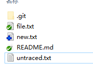
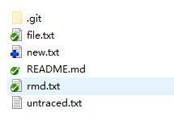
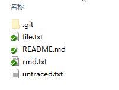

- `git checkout -- .`: 仅从索引区(index)拷贝到工作区(work-tree)
- `git checkout HEAD -- .`: 拷贝，从：HEAD --> index  --> work-tree
- `git reset --mixed`: 从HEAD里重置索引，也就是索引区将和HEAD一致。不动工作区。
- `git reset --hard`: 重置，从：HEAD --> index  --> work-tree

这里困惑的是`git checkout HEAD -- .`和`git reset --hard`有什么区别。

拷贝和重置的区别在于，假如index里面有个文件“new.txt"，但是这个文件没有提交。也就是index有new.txt，而HEAD没有new.txt。那么checkout是把HEAD里面有的替换掉index，HEAD里没有new.txt也就不改变index里的new.txt文件。

而reset会把index整体盖掉，new.txt也就没了。

举例：

new.txt 已经add,但是没commit。

untraced.txt 没有add，也就是没有纳入git跟踪。

另外还有一个rmd.txt，已经commit，然后我删除了，但是”删除“这个动作还没提交。

然后我执行“git checkout HEAD -- .”:

rmd.txt从仓库里恢复出来了。new.txt还是加入index未提交的状态。

回到初始状态。改成执行“git reset --hard” :

同样，rmd.txt恢复出来了。但是new.txt文件没了。因为new.txt没提交，仓库HEAD没有这个文件，所以index被重置后没有这个文件