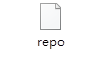
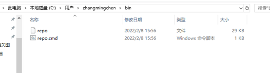
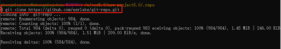
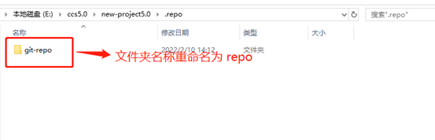
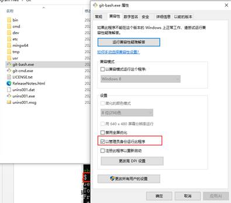
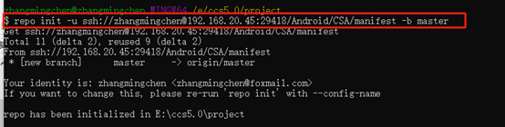
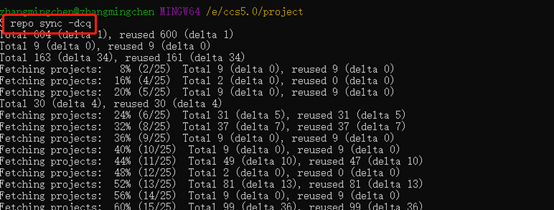
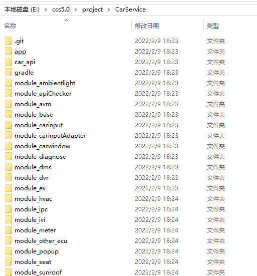

1. 安装Python-2.7.18（我们用的repo不是谷歌的repo，而是使用github上面别人为例适配windows改过的，所以Python就用这个版本）

2. 在用户空间手动创建 bin目录并添加

   repo.cmd不需要

   4，创建工程文件夹project并在当前文件夹下创建.repo文件夹。在该目录下下载repo工具

   

   下载完成后 下载的文件夹重命名为 repo

    

   

   5. 打开gitbash目录，将git-bash.exe改为管理员权限

   

    

   6.在project目录下打开git命令行执行：

   repo init -u ssh://xxxx@192.168.20.45:29418/Android/CSA/manifest -b master 

   改成自己项目的路径，后面的--repo-url=ssh://xxx 不需要了。

   

   7. （可选）如果不需要下载所有代码，打开.repo\manifests\default.xml，将不需要下载的仓库删掉。

   8. 接着执行 repo sync –dcq 同步代码 

   

   最终在project目录下载成功所有的carservice代码，可以直接导入工程进行开发。

    

   