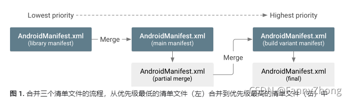

*productFlavors*主要是用来做多渠道打包, 有了它我们可以用同一套代码创建不同的产品。

使用方法举例：

```groovy
//放在android{}里面
flavorDimensions "store" //same as getFlavorDimensionList().add('store')
productFlavors {
    mcu//给MCU测试can信号的版本
    fota//给fota联调的版本
    main//正常发布版本
}
sourceSets{
    mcu {
        java.srcDirs = ["src/mcu/java"]
        manifest.srcFile "src/mcu/AndroidManifest.xml"
    }
    fota {
        java.srcDirs = ["src/fota/java"]
        manifest.srcFile "src/fota/AndroidManifest.xml"
    }
}
```

* productFlavors一定要指定一个flavorDimensions。这里写完整了应该是:

  ```groovy
  flavorDimensions "store"
  productFlavors {
      mcu{
          dimension "store"
      }
      ...
  }
  ```

  

* sourceSets给每个productFlavors配置资源的路径。可以指定java源码、manifest、jni、lib、res等目录

* 这个例子，mcu这个产品对应的代码就放在src/mcu/，路径的名字和product名字是一样的（都叫mcu）。所以可以省略sourceSets。即，上面sourceSets的代码块可以删掉。可以理解为，productFlavors叫XXX的产品，默认路径就放在src/XXX, 无需配置。（你看我上面main就没有指定）

* 指定mcu的java路径是“java.srcDirs = ["src/mcu/java"]”，实际上会和main做合并。即，main为主，mcu和fota这两个产品里面只放增量。对于AndroidManifest.xml，安卓apk里面只有一个AndroidManifest.xml，所以会把内容合并。有个合并优先级：

  

  关于怎么合并的更多细节，参考：https://blog.csdn.net/FannyZhong/article/details/120828984

* 假如某个库或jar包只给某个product用，这样：

  ```groovy
  dependencies {
      //所有都能用
      implementation files('libs/gson-2.7.jar')
  	//只给mcu这个product用
      mcuImplementation 'androidx.recyclerview:recyclerview:1.1.0'
  
      //只给test目录下的代码用（即Junit单元测试）
      testImplementation 'junit:junit:4.13.2'
      //只给androidTest目录
      androidTestImplementation 'androidx.test.ext:junit:1.1.3'
  }
  ```

  