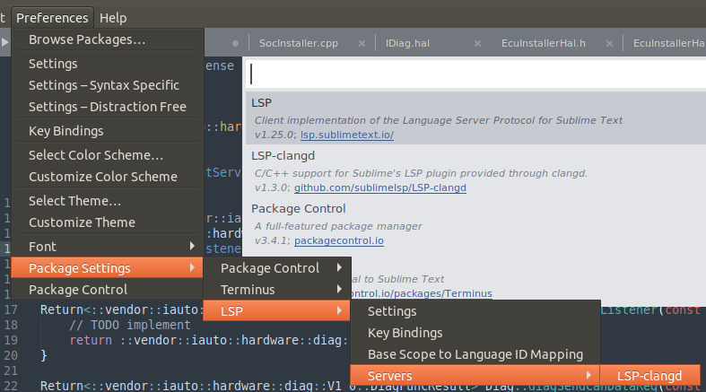

直接把aosp目录拖到sublime里即可。当然只是看，不支持语法分析、智能提示，不适合用它开发。

一般安卓里开发C++用vscode或clion，跳转、提示、debug、格式化都支持，很完善了，前面几篇也介绍了步骤。

之所以偶尔用sublime是习惯问题，把整个aosp目录拖到sublime，颜值高，性能好（vscode是只导入了一个项目。当然也可以拖入整个aosp。本来sublime和vscode就都是文本编辑器，通过插件提供一定的开发支持。vscode的ide属性略强一点，所以成为开发者的主流，sublime更像一个轻便的文本编辑器）。

sublime也可以配C++插件，下面介绍步骤。这个步骤，除了插件和vscode 不同外，其余亦适用于vscode。

实际上，安卓源码里有介绍，`build\soong\docs`里面，clion.md 这篇是导入clion的，其实就是生产cmakelist。我们导入vscode就是在它的基础上由cmake生成`compile_commands.json`。

另外一篇`compdb.md`指导生成全部项目的compile_commands.json。我们把整个aosp拖到sublime里的话，可以借鉴这个。需要提的是，整个aosp的compile_commands.json很大，导入后，几个小时CPU都处于高负载状态。这也是为什么前面介绍vscode时，我们不用compdb。

1. 打开soong开关

   ```bash
   $ export SOONG_GEN_COMPDB=1
   $ export SOONG_GEN_COMPDB_DEBUG=1
   ```

2. 整编(执行make)，或者执行`make nothing`

3. sublime里安装两个插件：LSP和LSP-clangd。

4. 打开cpp后，插件会自动下载clangd。

5. 配置一下compile_commands.json的位置

   

点进去配置页后，左边搜索“compile-commands-dir”,照着例子在右边写下compile_commands.json路径，应该是在out/soong/development/ide/compdb目录。

6. 左下角构建索引，需要几个小时。很卡。所以我不建议sublime里配置整个aosp。要么把sublime当做纯编辑器，只看，不需要跳转智能提示；要么，不用把整个aosp导入，只打开特定目录，如system、vendor、hardware。

## 参考资料

https://clangd.llvm.org/installation.html

http://aospxref.com/android-12.0.0_r3/xref/build/soong/docs/clion.md

http://aospxref.com/android-12.0.0_r3/xref/build/soong/docs/compdb.md

http://aospxref.com/android-12.0.0_r3/xref/tools/asuite/aidegen/README.md