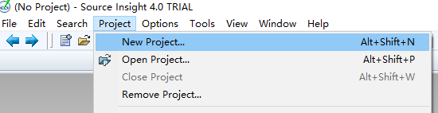
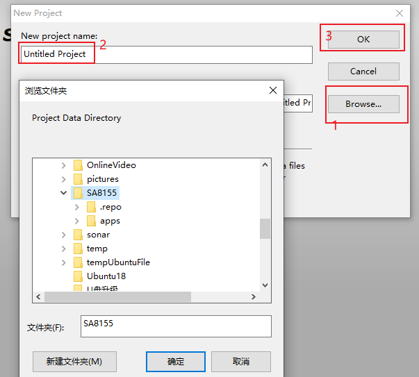

# Source Insight

缺点： 仅支持windows。linux上面虽然可以通过wine安装，但是终究不方便，也不知道是否稳定。

优点： 简单方便

1. 

2. 

# Android Studio

缺点： 对C++支持不好。不好debug C++

有点：对java支持非常好，分析、跳转非常准确。支持java代码debug。

```shell
source build/envsetup.sh
lunch [你的目标]
mmm development/tools/idegen/
sudo evelopment/tools/idegen/idegen.sh
```

这会生成android.ipr和android.iml两个文件。用Android Studio打开iml文件即可导入整个aosp。

> 因为aosp太庞大，全部导入非常卡顿。可以用notepad打开android.iml，把`isTestSource="false"`的全部删除，即我们不导入测试代码；然后，搜索excludeFolder，自己编辑这里的配置，把不关心的目录全部排出。主要是frameworks、system这些目录要保留，其它自己酌情。
>
> 接着还有个问题是，点击类名，会跳转到jar包，而不是源码。到最下面找到orderEntry，找到orderEntry type="sourceFolder"，移到所有orderEntry的最上面。

# CLion

优点

* 可以导入单个项目，也可以自己创建cmake文件把多个项目组合在一起

缺点

* 必须保证要导入的项目，能够在源码下编译通过，然后才能生成cmake文件。

相关文档见源码目录下的`build/soong/docs/clion.md`。或者在线浏览：http://aospxref.com/android-13.0.0_r3/raw/build/soong/docs/clion.md

导入方法如下：

```shell
$ export SOONG_GEN_CMAKEFILES=1
$ export SOONG_GEN_CMAKEFILES_DEBUG=1
$ make -j64 #生成全部的CMakeLists.txt
$ make frameworks/native/service/libs/ui #单编生成单个项目的CMakeLists.txt

```

生成的CMakeLists.txt在out/development/ide/clion/目录，找到，用clion打开即可。

# 使用AIDEGen

文档见`/tools/asuite/aidegen/README.md`,在线阅读：http://aospxref.com/android-13.0.0_r3/raw/tools/asuite/aidegen/README.md

也可参考前面的几篇笔记《vscode打开aosp源码.md》