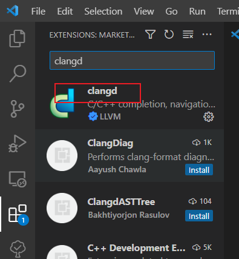

VS Code打开C++项目后，右下角会提示你安装几个C++的插件。但是使用一段时间发现，这个插件占用资源太大，动辄CPU一个核心100%或者IO占用100%。（我记不清是CPU还是硬盘百分百了。反正经常遇到，导致电脑卡顿，别的任务都做不了）

我打开的项目没几个cpp文件，按理不至于如此。但是我们的项目在AOSP里面，调用源码的其它模块，其它模块又调用其它模块。这样插件需要做的语法分析就非常大了。估计是这个原因。

听说不要用vs code推荐的那几个微软的插件，而是用安装`clangd`，性能好的多。具体如何我还没体验。

先把微软的C/C++插件卸了。

然后搜索clangd:



安装好后，如果你的电脑没有配置clangd软件，vscode里面会在右下角提示，点下载即可。

clangd下载在这个目录（windows）:

`C:\Users\xxxxxxyourname\AppData\Roaming\Code\User\globalStorage\llvm-vs-code-extensions.vscode-clangd\install\15.0.6\clangd_15.0.6`

配合`compile_commands.json`，够有效提高代码跳转、补全等功能。

clangd 如果没有指定 compile_commands.json 位置，会在工程路径下进行查找，如需单独指定可以添加以下配置项 `--compile-commands-dir=${workspaceFolder}/build/`

**优点**
占用系统资源确实比 C/C++ 少了很多，无论是 CPU 还是 内存的使用。（最重要）

**缺点**
操作相较于 C/C++ 确实也繁琐一点。

总结一下，就是对于大型项目来说，使用 clangd 能够明显降低系统资源的占用，能够减少出现系统卡顿的情况，不过使用门槛较高。C/C++ 更适合小项目的开发，使用起来更加便利，能够更好的进行调试。


## 如何生成`compile_commands.json`

### cmake工程

方法1、cmake工程生成 compile_commands.json 文件比较简单，定义 CMAKE_EXPORT_COMPILE_COMMANDS 即可。

```
cmake -DCMAKE_EXPORT_COMPILE_COMMANDS=1
```


方法2、在CMakeLists.txt中添加 set(CMAKE_EXPORT_COMPILE_COMMANDS ON) 也可以达到上面的效果。

### makefile工程

不过很多(旧的)工程都是用 makefile 来编译的，没有现成的选项生成 compile_commands.json 文件。 虽然也可以使用 ctags, gtags 等，但是跳转其实不是很准确。 我们可以通过 Bear 来生成，而且不需要改动代码。 具体Bear的安装这里就不赘述了，按照 官方文档 来即可。 安装之后，执行以下命令即可生成：

```
bear 编译命令 # 比如说 bear make
```


也就是在原有编译命令之前加上 bear 即可，一般都是 bear make 。 生成之后我们就可以愉快地享受更精准的跳转和补全了。
