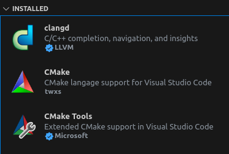

VS Code打开C++项目后，右下角会提示你安装几个C++的插件。但是使用一段时间发现，这个插件占用资源太大，动辄CPU一个核心100%或者IO占用100%。（我记不清是CPU还是硬盘百分百了。反正经常遇到，导致电脑卡顿，别的任务都做不了）

我打开的项目没几个cpp文件，按理不至于如此。但是我们的项目在AOSP里面，调用源码的其它模块，其它模块又调用其它模块。这样插件需要做的语法分析就非常大了。估计是这个原因。

听说不要用vs code推荐的那几个微软的插件，而是用安装`clangd`，性能好的多，据说代码补全等功能也好一些。具体如何我还没体验。

先把微软的C/C++插件卸了。然后就不是用aidegen命令生成项目配置文件（安卓AOSP里我们以前用aidegen命令生成c_cpp_properties.json，clangd不识别这个，这个微软的插件才用的）

然后搜索clangd:


安装好后，如果你的电脑没有配置clangd软件，vscode里面会在右下角提示，点下载即可。

clangd下载在这个目录（windows）:

`C:\Users\xxxxxxyourname\AppData\Roaming\Code\User\globalStorage\llvm-vs-code-extensions.vscode-clangd\install\15.0.6\clangd_15.0.6`

嫌这个路径太长，我们可以手动复制到/opt目录下。


clangd 需要配合`compile_commands.json`，才能够有效提高代码跳转、补全等功能。

如果没有指定 compile_commands.json 位置，会在工程路径下进行查找，如需单独指定可以添加以下配置项 `--compile-commands-dir=${workspaceFolder}/build/`。下面给出配置文件的参考：

```json
//文件位置：<workspace>/.vscode/settings.json
{
  "files.associations": {
    "iostream": "cpp",
    "intrinsics.h": "c",
    "ostream": "cpp",
    "vector": "cpp"
  },
  // 开启粘贴保存自动格式化
  "editor.formatOnPaste": true,
  "editor.formatOnSave": true,
  "editor.formatOnType": true,
  "C_Cpp.errorSquiggles": "Disabled",
  "C_Cpp.intelliSenseEngineFallback": "Disabled",
  "C_Cpp.intelliSenseEngine": "Disabled",
  "C_Cpp.autocomplete": "Disabled", // So you don't get autocomplete from both extensions.
  "clangd.path": "/usr/bin/clangd",
  // Clangd 运行参数(在终端/命令行输入 clangd --help-list-hidden 可查看更多)
  "clangd.arguments": [
    // 让 Clangd 生成更详细的日志
    "--log=verbose",
    // 输出的 JSON 文件更美观
    "--pretty",
    // 全局补全(输入时弹出的建议将会提供 CMakeLists.txt 里配置的所有文件中可能的符号，会自动补充头文件)
    "--all-scopes-completion",
    // 建议风格：打包(重载函数只会给出一个建议）
    // 相反可以设置为detailed
    "--completion-style=bundled",
    // 跨文件重命名变量
    "--cross-file-rename",
    // 允许补充头文件
    "--header-insertion=iwyu",
    // 输入建议中，已包含头文件的项与还未包含头文件的项会以圆点加以区分
    "--header-insertion-decorators",
    // 在后台自动分析文件(基于 complie_commands，我们用CMake生成)
    "--background-index",
    // 启用 Clang-Tidy 以提供「静态检查」
    "--clang-tidy",
    // Clang-Tidy 静态检查的参数，指出按照哪些规则进行静态检查，详情见「与按照官方文档配置好的 VSCode 相比拥有的优势」
    // 参数后部分的*表示通配符
    // 在参数前加入-，如-modernize-use-trailing-return-type，将会禁用某一规则
    "--clang-tidy-checks=cppcoreguidelines-*,performance-*,bugprone-*,portability-*,modernize-*,google-*",
    // 默认格式化风格: 谷歌开源项目代码指南
    // "--fallback-style=file",
    // 同时开启的任务数量
    "-j=2",
    // pch优化的位置(memory 或 disk，选择memory会增加内存开销，但会提升性能) 推荐在板子上使用disk
    "--pch-storage=disk",
    // 启用这项时，补全函数时，将会给参数提供占位符，键入后按 Tab 可以切换到下一占位符，乃至函数末
    // 我选择禁用
    "--function-arg-placeholders=false",
    // compelie_commands.json 文件的目录位置(相对于工作区，由于 CMake 生成的该文件默认在 build 文件夹中，故设置为 build)
    "--compile-commands-dir=${workspaceFolder}/build"
  ]
}
```

一般我们没有这么专业的要求，不需要配。把**compile_commands.json**放到工程路径下即可。


**优点**
占用系统资源确实比 C/C++ 少了很多，无论是 CPU 还是 内存的使用。（最重要）

**缺点**
对于AOSP，操作相较于 C/C++ 确实也繁琐一点，因为不能用aidegen。

总结一下，就是对于大型项目来说，使用 clangd 能够明显降低系统资源的占用，能够减少出现系统卡顿的情况，不过使用门槛较高。C/C++ 更适合小项目的开发，使用起来更加便利，能够更好的进行调试。


## 如何生成`compile_commands.json`

### cmake工程

方法1、cmake工程生成 compile_commands.json 文件比较简单，定义 CMAKE_EXPORT_COMPILE_COMMANDS 即可。

```
cmake -DCMAKE_EXPORT_COMPILE_COMMANDS=1
```


方法2、在CMakeLists.txt中添加 set(CMAKE_EXPORT_COMPILE_COMMANDS ON) 也可以达到上面的效果。

### makefile工程

不过很多(旧的)工程都是用 makefile 来编译的，没有现成的选项生成 compile_commands.json 文件。 虽然也可以使用 ctags, gtags 等，但是跳转其实不是很准确。 我们可以通过 Bear 来生成，而且不需要改动代码。 具体Bear的安装这里就不赘述了，按照 官方文档 来即可。 安装之后，执行以下命令即可生成：

```
bear 编译命令 # 比如说 bear make
```


也就是在原有编译命令之前加上 bear 即可，一般都是 bear make 。 生成之后我们就可以愉快地享受更精准的跳转和补全了。

### AOSP

#### 单个项目

先执行：

```
$ export SOONG_GEN_CMAKEFILES=1
$ export SOONG_GEN_CMAKEFILES_DEBUG=1
```

可以配置到.bashrc里，这样每次打开shell默认就有。

然后整编或单编后，会在out/development/ide/clion/目录生成CMakeLists.txt。然后用`cmake -DCMAKE_EXPORT_COMPILE_COMMANDS=1`生成compile_commands.json。

然后在项目源码目录的`.vscode/settings.json`配置：

```
{
    "clangd.arguments": [
        "--compile-commands-dir=build"
     ]
}
```

不过既然有CMakeLists.txt了，我们也可以直接通过CMake插件。

先安装cmake插件：




【可选步骤】

如果没有安装ninja，会把cmake转成makefile。我希望用ninja，因此安装ninja-build:

```
sudo apt install ninja-build
```

然后打开`cmake-tools-kits.json`文件，`vim ~/.local/share/CMakeTools/cmake-tools-kits.json`，添加:

```
xue@S111-CCS2plus:~/ft24mm/source/android$ vim ~/.local/share/CMakeTools/cmake-tools-kits.json
[
  {
    "name": "GCC 7.5.0 x86_64-linux-gnu",
    "compilers": {
      "C": "/usr/bin/gcc",
      "CXX": "/usr/bin/g++"
    },
    "isTrusted": true
  },{
    "name": "clang+llvm-18.1.4-x86_64-linux-gnu",
    "compilers": {
      "C": "/home/xuexiangyu/opt/llvm/bin/clang",
      "CXX": "/home/xuexiangyu/opt/llvm/bin/clang++"
    },
    "isTrusted": true
  },{
    "name": "android_cross_clang",
    "compilers": {
      "C": "/home/xuexiangyu/ft24mm/source/android/prebuilts/clang/host/linux-x86/clang-r416183b1/bin/clang",
      "CXX": "/home/xuexiangyu/ft24mm/source/android/prebuilts/clang/host/linux-x86/clang-r416183b1/bin/clang++"
    },
    "isTrusted": true
  }
]
```

之所以这步可选，是因为默认插件会自动搜索到。但是如果没有搜索到我们想用的编译器，就需要自己去加的。交叉编译工具一般是搜不到的。

【可选步骤-结束】


然后把CMakeLists.txt复制到打开的项目根目录下。vscode不像CLion那么强大，CMakeLists必须放在你打开的目录下，而Clion可以先打开CMakeLists，然后菜单里修改CMakeList source dir，所以CLion不需要把CMakeLists.txt拷贝过来。

如果vscode不拷贝CMakeLists，而是像CLion 那样，直接打开`out/development/ide/clion/`下包含CMakeLists的目录，然后再“Add Folder to workspace”(即vscode的Multi-root Workspaces，一个窗口打开多个folder，以.code-workspace作为workspace配置文件的后缀)。这也是不生效的，因为不会对别的folder生效。总而言之，必须把CMakeLists.txt放在folder根目录，至于是拷贝过来，还是软链接，都可以。

打开后，vscode应该会提示configure，点确定。或者随时可以从左侧导航视图选中CMakeLists.txt，右击：


然后就可以跳转了。

理论上也可以这样，ctrl+shift+p,选择CMake:Quick Start,然后选择生成的CMakeLists.txt。然后会生成`.vscode/settings.json`。


内容类似：

```
{
	"cmake.sourceDirectory":"xxxxx/xxx/xxx"//CMakeLists.txt的位置
}
```

理论上是行的，但是也许是插件bug，实测不会激活cmake插件，必须要在目录下有一个CMakeLists.txt文件，才能激活插件。你可以新建一个空的CMakeLists.txt。但是，这样明显繁琐了，还不如直接把CMakeLists.txt复制过来（或软链接，优点是当CMakeList内容有变化，不需要每次重新拷贝一次）。

#### 包含多个构建目标

有时一个项目，一个目录，包含了多个构建目标，比如以aosp/system/core/init为例，Android.bp里有“init_second_stage”、“libinit”、“init_first_stage_soong”等，另外还有一些用于测试的目标。这个目标都生成一个独立的CMakeLists.txt文件。我希望把这些整合在一起。

```cmake
//项目目录下新建CMakeLists.txt，添加内容
cmake_minimum_required(VERSION 3.5)
project(init)
set(ANDROID_ROOT /home/xue/ft24/source/android)
set(ANDROID_CMAKE_DIR ${ANDROID_ROOT}/out/development/ide/clion)

add_subdirectory(${ANDROID_CMAKE_DIR}/system/core/init/init_first_stage_soong-arm64-android build/init_first_stage_soong-arm64-android)
add_subdirectory(${ANDROID_CMAKE_DIR}/system/core/init/init_second_stage-arm64-android build/init_second_stage-arm64-android)
add_subdirectory(${ANDROID_CMAKE_DIR}/system/core/init/libinit-arm64-android build/libinit-arm64-android)
```

用这个文件代替前面说的软链接或拷贝。

注意add_subdirectory必须指定第二个参数（第二个参数表示build目录），因为每个目标，输出的文件都是很多重名的，你不能采取默认，让他们都输出到一个目录。

#### 多个项目

假如想一次打开多个项目，可以用code-workspace文件（手动创建文件，或者菜单，Add Folder to workspace, 然后保存）

1. 可以在源码的外面建一个工程的目录，用来放配置文件（避免污染源码，重拉代码这个配置也不会丢）

2. 以“/home/xue/ProjectVscode/system_core_init”为例，在目录下放code-workspace文件

   ```c++
   {
       // ctrl+H 替换代码路径为目标
       "folders": [
           {
               "name": "init",
               "path": "/home/xue/ft24/source/android/system/core/init"
           },
           {
               "name": "installerhal",
               "path": "/home/xue/ft24/source/android/vendor/iauto/proprietary/hardware/installerhal"
           },
           {
               "path": "/home/xue/ft24/source/android/system/memory/lmkd/"
           },
           {
               "path": "/home/xue/ft24/source/android/system/core/fs_mgr"
           }
       ]
   }
   
   ```

3. 但是CMakeLists.txt文件还是要放在各自folders的目录，放在system_core_init里面无效。即使把system_core_init本身也加到folders里，使得插件能激活，并且表面上解析了CMakeLists.txt，甚至能构建，但还是没用，语法解析、跳转的信息反馈不到vscode，因为作用不到别的folder。

4. 假如你把CMakeLists.txt放在system_core_init里面，打开这个目录，然后再此目录下新建软链接，指向源码路径。这样打开后是可以解析C++和跳转的。而且这样其实就不需要上面配置folders了。

   但是存在一个问题，vscode把软链接的路径和真实路径当做两个文件，在左侧导航栏，点击打开文件，使用的是软链接的路径，而跳转后，打开的是真实路径，导致同一个文件会打开两个tab。其中一个还不能识别语法。

5. “.code-workspace”文件支持配置cmake.sourceDirectory：

   ```
   {
       "settings": {
           "cmake.sourceDirectory": [
               "/home/xue/ft24/source/android/out/development/ide/clion/system/core/init/init_first_stage_soong-arm64-android",
               "/home/xue/ft24/source/android/out/development/ide/clion/system/core/init/init_second_stage-arm64-android",
               "/home/xue/ft24/source/android/out/development/ide/clion/system/core/init/libinit-arm64-android",
               "/home/xue/ft24/source/android/out/development/ide/clion/system/core/fs_mgr/libfs_mgr-arm64-android",
               "/home/xue/ft24/source/android/out/development/ide/clion/system/core/fs_mgr/libfstab-arm64-android",
               "/home/xue/ft24/source/android/out/development/ide/clion//system/core/fs_mgr/libfs_mgr_binder-arm64-android"
           ],
   	},
       "folders": [
           ...
       ]
   }
   ```

   不过这样写，sourceDirectory会作用到每个folder上面，而不是哪个CmakeLists作用给哪个folder。然后，测试下来，还是没用。也就是说，不管什么情形，用什么方法，终究还是得在每个folder里面放一个CMakeLists.txt。

6. 编写于2024年。不排除以后vscode以及cmake插件增强功能的可能。

### 脚本

遍历目录下所有CMakeLists.txt并生成compile_commands.json，合并到一起的脚本

```shell
# 这个脚本用于给安卓源码里的C++工程生成compile_commands.json
# 先设置：
# export SOONG_GEN_CMAKEFILES=1
# export SOONG_GEN_CMAKEFILES_DEBUG=1
# 然后整编代码或者编译需要导入工程的模块
# 假设待导入工程为: aosp_dir/**/projA,
# 假设使用VS Code作为IDE，
# 将本脚本放到: aosp_dir/**/projA/.vscode/
# 然后执行，会在aosp_dir/out/development/ide/clion/**/projA下面生成compile_commands.json文件
# 并创建符号链接：aosp_dir/**/projA/.vscode/compile_commands.json 指向真实的文件。
# 脚本会遍历projA下面的所有子构建项，并把子构建项的编译命令汇集在一个compile_commands.json里。

# 执行前，先安装jq: sudo apt install jq

WORK_DIR=$(cd $(dirname $0); pwd)
ANDROID_BUILD_TOP=/home/xue/toyota_24mm_dev/source/android #末尾不要有斜杠“/”

if [[ $WORK_DIR != $ANDROID_BUILD_TOP* ]]; then
    echo Do not support directory outside android root
    exit
fi
WORK_DIR_REAL=${WORK_DIR%/.vscode*} #去掉末尾/.vscode
echo workspacedir=$WORK_DIR_REAL
target_dir=$ANDROID_BUILD_TOP/out/development/ide/clion/${WORK_DIR_REAL#*$ANDROID_BUILD_TOP/}
echo target_dir=$target_dir

cd $target_dir
if [ $? -ne 0 ]; then
    echo "dir not exits"
    exit
fi
echo -e "\n\n"
for line in `find . -name CMakeLists.txt`
do
    if [[ "$line" == *"-arm64-android"* ]]
    then
        echo $line
        cmake -DCMAKE_EXPORT_COMPILE_COMMANDS=1 -DCMAKE_CXX_COMPILER=clang++ -DCMAKE_C_COMPILER=clang $line
    fi
done
# merge compile_commands to one file
# sudo apt install jq, if jq is not installed
jq -s 'map(.[])' `find . -name compile_commands.json` > compile_commands.json

rm $WORK_DIR/compile_commands.json
ln -s $target_dir/compile_commands.json $WORK_DIR/compile_commands.json 

```

将所有CMakeLists.txt合并的脚本

```shell
# use add_subdirectory to import all cmakelists into one file
# 举例：命令 ./combine_cmake.sh system/core/init, 会在system/core/init目录下生成cmakelists文件

function generageCMakeLists() {
    if [ $# == 0 ];then
        echo "未传参，需要传入相对于android根目录的路径"
        exit
    else
        if [ -z "$ANDROID_BUILD_TOP" ];then
            echo "先执行source build/envsetup.sh && lunch xxx"
            exit
        else
            projPath="$ANDROID_BUILD_TOP/$1"
            echo "project path=$projPath"
            if [ ! -e $projPath ];then
                echo "not exist: $projPath"
                exit
            fi

            clionDir=$ANDROID_BUILD_TOP/out/development/ide/clion
            cmakesDir="$ANDROID_BUILD_TOP/out/development/ide/clion/$1"
            if [ ! -e $cmakesDir ];then
                echo "not found: $cmakesDir"
                exit
            fi

            # 1. 
            cmakeFile="$projPath/CMakeLists.txt"
            echo "cmake_minimum_required(VERSION 3.5)" > $cmakeFile
            projName=$(basename "$projPath")
            echo -e "project($projName)\n" >> $cmakeFile

            # 2. 
            echo "set(ANDROID_ROOT $ANDROID_BUILD_TOP)" >> $cmakeFile
            echo -e "set(ANDROID_CMAKE_DIR \${ANDROID_ROOT}/out/development/ide/clion)\n" >> $cmakeFile
            echo -e "set(PROJ_CMAKE_DIR \${ANDROID_CMAKE_DIR}/$1)\n" >> $cmakeFile

            # 3.
            for line in `find $cmakesDir -name CMakeLists.txt`
            do
                if [[ "$line" == *"-arm64-android"* ]]
                then
                    echo $line
                    path=$(dirname $line)
                    path=${path/$cmakesDir/\${PROJ_CMAKE_DIR\}}
                    echo -e "add_subdirectory(${path} ${path}/build)" >> $cmakeFile
                fi
            done
        fi
    fi
}

generageCMakeLists "$1"

```

