利用VS Code的remote ssh插件，可以打开和编辑远程服务器上的代码，就好像打开的是本地文件夹。甚至可以远程断点。

像安卓的源码这种庞大的工程，下载的本地是很麻烦的，我们可以用它直接打开服务器的源码目录，在上面修改、编译。配置好后像这样：

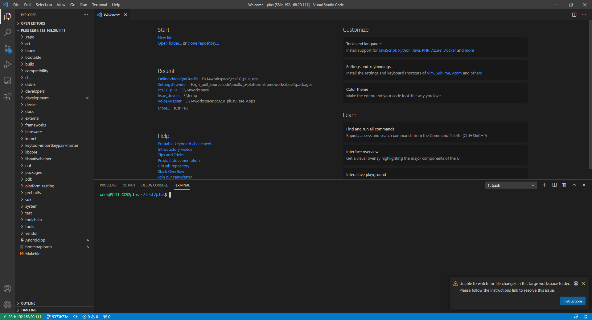


安装插件

Extension 里面输入Remote，出来的第一个应该就是Remote-SSH，安装即可。

安装好后，左边多出一个Remote Explorer, 切到Remote Explorer，点击 + 号，上面会弹出一个“Enter SSH Connection Command”:

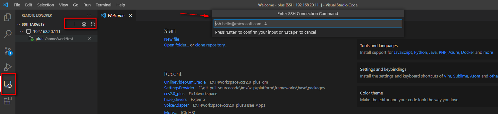

按照提示输入连接字符串：user@ip，比如我输入的是  androido@192.168.20.24。回车。


选择第一个 ~/.ssh/config，因为通常ssh的设置和秘钥都在这个目录下 :

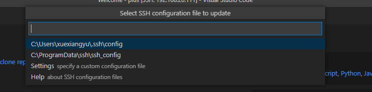

然后.ssh/config文件中会多出你刚添加的服务器：

```
//.ssh/config文件的内容：
Host 192.168.20.111
  HostName 192.168.20.111
  User work
  ForwardAgent yes
  IdentityFile C:\Users\xuexiangyu\.ssh\id_rsa-remote-ssh

---》20.24服务器的配置追加进来了，你可以仿照上面那个111服务器的语法，添加额外的配置。
Host 192.168.20.24
  HostName 192.168.20.24
  User androido


```

如果你要删除新加的服务器，直接打开config文件，删掉对应的文本，然后vs code界面左边 Remote Explorer 中就没有了。

连接服务器：

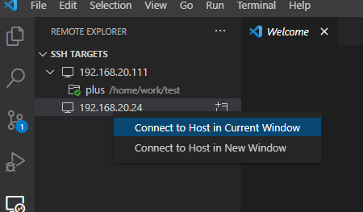

远程服务器是什么系统(这里我连接的是Ubuntu，所以选Linux)：

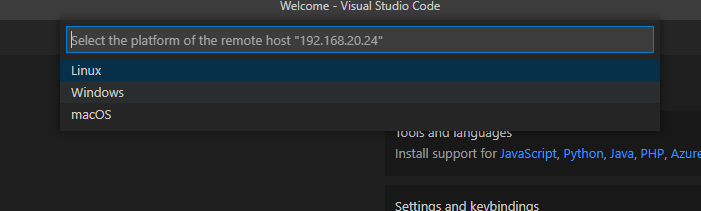

输入登录密码，回车：

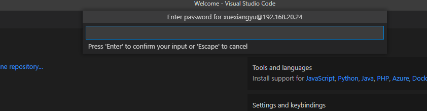


然后可能会卡一会儿，右下角提示：

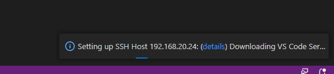

此时正在服务器端安装VS Code Server 。 

完成后我这边提示：

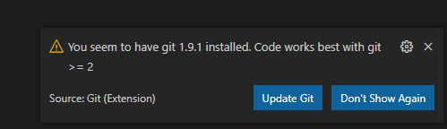

意思是服务器上的git版本太低。需要升级。因为服务器是公司专项人员负责维护的，我不好动，下面我换一个服务器继续演示。

服务器换成work@192.168.22.230，重复前面步骤到 “安装完VS Code Server”这一步。

打开代码工作目录：

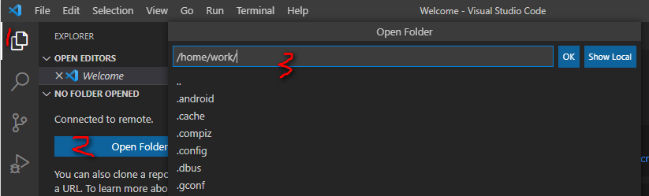

点击OK，然后按照提示输入密码，然后界面长这样：

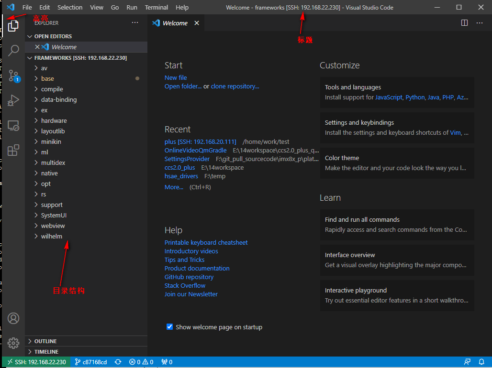

打开终端： 

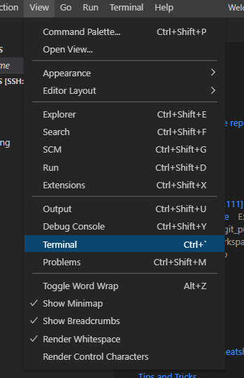


二 每次打开都需要输入密码，下面通过配置ssh的秘钥对，实现免密码登录。

1. 打开git bash，执行：ssh-keygen -t rsa -b 4096 -f "$HOME\.ssh\id_rsa-remote-ssh"

   因为我的.ssh目录下已经有了 id_rsa和id_rsa.pub文件，是git提交代码用的，所以上面的命令，加了 -f "$HOME\.ssh\id_rsa-remote-ssh"。否则会把原来的id_rsa文件覆盖掉，影响git。

   执行完后，.ssh目录产生一对文件，id_rsa-remote-ssh和id_rsa-remote-ssh.pub，前者是私钥，后者是公钥。

2. 接着执行 ssh-copy-id -i id_rsa-remote-ssh.pub work@192.168.22.230

   执行完后，你的远程服务器的~/.ssh目录下会多出一个authorized_keys文件。上面的命令其实就是把公钥的文本添加到authorized_keys文件的后面。

3.  打开本地的.ssh/config文件，host的配置添加一项 ： `IdentityFile C:\Users\yourname\.ssh\id_rsa-remote-ssh`,这里的id_rsa-remote-ssh是私钥。

4. 然后重写打开vs code, 你会发现直接打开了，不需要输入密码。

5. 这里我用ssh-keygen生成秘钥对，只是为了演示。其实因为我的.ssh目录下已经有了 id_rsa和id_rsa.pub文件，我完全可以直接用这两个文件，没有必要生成一对新的秘钥。

6. 报错提示“ERROR: @    WARNING: REMOTE HOST IDENTIFICATION HAS CHANGED!     @”。

   ssh会把每个你访问过计算机的公钥(public key)都记录在本地~/.ssh/known_hosts。当下次访问相同计算机时，OpenSSH会核对公钥。如果公钥不同，OpenSSH会发出警告， 避免你受到DNS Hijack之类的攻击。

   解决方案： （两个）

   1. 手动删除修改known_hsots里面的内容；【建议这个】
   2. 修改配置文件“~/.ssh/config”，加上这两行，重启服务器。
           StrictHostKeyChecking no
           UserKnownHostsFile /dev/null

常见问题：

经常会遇到公钥已经添加到authorized_keys文件里，还是无法免密登录的情况。一般是权限问题。原因在于ssh服务会检查文件权限码，如777这种，会被认为不安全，于是让你输密码。执行以下命令：

```
chmod g-w /home/your_user
chmod o-w /home/your_user
# 或
chmod 0755 /home/your_user

chmod 700 /home/your_user/.ssh
chmod 600 /home/your_user/.ssh/authorized_keys
```

或者找一台有效的机器对比一下，把authorized_keys文件的权限、用户及用户组，authorized_keys文件的父目录、祖父目录权限和所有者全改成一样的。一定会有效的。


远程插件：

当连接到远程时，你安装的插件是安装在远程的vs server,而不是本地。左边的插件栏显示上下两栏，并显示哪些是local的扩展，哪些是远程的扩展。

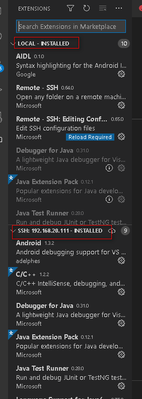