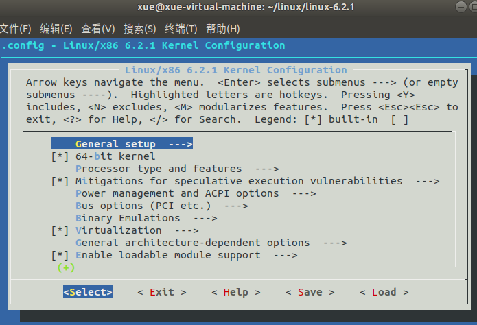

从 https://www.kernel.org/ 下载最新版本的内核，`linux-6.2.1.tar.xz`

系统： Ubuntu 18.04

空间要求：我连源码、编译中间产物、编译最终输出物，加一起，消耗了23G零几百兆。

内核安装到ubuntu系统又需要几个G。

## 准备工作

编译内核前需要先安装一些必备工具软件

```shell
sudo apt-get install libncurses5-dev libssl-dev build-essential openssl zlibc minizip  libidn11-dev libidn11 libelf-dev bc
```

执行`make menuconfig`报错：

```shell
xue@xue-virtual-machine:~/linux/linux-6.2.1$ make menuconfig
  LEX     scripts/kconfig/lexer.lex.c
/bin/sh: 1: flex: not found
scripts/Makefile.host:9: recipe for target 'scripts/kconfig/lexer.lex.c' failed
make[1]: *** [scripts/kconfig/lexer.lex.c] Error 127
Makefile:708: recipe for target 'menuconfig' failed
make: *** [menuconfig] Error 2
```

解决办法 ： 

```shell
sudo apt-get install flex
sudo apt-get install bison
```

## 配置

执行`make menuconfig`, 弹出配置界面：



menuconfig的作用是提供一个图像化的界面去配置内核，也就是修改.config文件。其实你直接去修改.config文件，不用menuconfig也是可以的。但是.config里的配置项太多了，靠人根本记不住，于是才有了menuconfig方便人们配置内核。

（芯片供应商提供的内核源码，都是配置好了的，所以不需要执行menuconfig。比如我们NXP的板子编译安卓源码时，没听说要menuconfig。但是配置文件还是有的，`arch/arm64/configs/android_car_defconfig`里面直接修改，相当于手工编辑.config）

* 选项后面有--->，说明里面还有子目录，按回车进入。退出则是移动箭头选择`<Exit>`,返回上一级。（或者连续按两次ESC）

* 上下移动光标，选择某一项，然后可以通过键盘按下“Y、N、M”设置是否选中这一项。选中的图标上方括号内显示一个星号。

   “Y、N、M”对应的意思如下：

* **< Y>**： 键盘按下模块驱动编译到内核中，启动时自动加载

* **< N>**： 空格:表示该功能不编译到内核中，即新的内核将不支持该功能。 

*  **<M**>：模块会被编译，但是不会被编译到内核中，只是生成.o文件，我们可以收集这些.o文件做到linux的文件系统中，然后用insmod实现动态加载。

配置好后，选择`Save`, 会在当前目录下生成`.config`文件。`.config`的内容格式如下(示例)：

```
CONFIG_CC_VERSION_TEXT="gcc (Ubuntu 7.5.0-3ubuntu1~18.04) 7.5.0"
CONFIG_CC_IS_GCC=y
CONFIG_GCC_VERSION=70500
CONFIG_CLANG_VERSION=0
CONFIG_AS_IS_GNU=y
CONFIG_AS_VERSION=23000
CONFIG_LD_IS_BFD=y
CONFIG_LD_VERSION=23000
CONFIG_LLD_VERSION=0
CONFIG_CC_CAN_LINK=y
CONFIG_CC_CAN_LINK_STATIC=y
CONFIG_CC_HAS_ASM_INLINE=y
CONFIG_CC_HAS_NO_PROFILE_FN_ATTR=y
CONFIG_PAHOLE_VERSION=0
CONFIG_IRQ_WORK=y
CONFIG_BUILDTIME_TABLE_SORT=y
CONFIG_THREAD_INFO_IN_TASK=y
```

关于menuconfig 、Kconfig的更多知识，这里不涉及。

> 现在面临一个问题，我们编译内核的目的是给我的Ubuntu升级内核。但是我不知道menuconf里面哪些需要选进去。
>
> 很简单，复制/boot/config-4.15.0-55-generic这个文件到源码目录作为.config文件。
>
> 我的ubuntu内核是5.4，对应文件是config-5.4.0-52-generic。到/boot目录看一下，一目了然。
>
> 然后行**make menuconfig**, 选“Load”,加载这个.config文件，保存。

## 编译

```shell
make -j4
```

或分别编译

```shell
make bzImage -j4
make modules -j4
```

检查是否生成了bzImage文件。因为电脑是x86_64架构，到arch/x86_64/boot目录下，有一个bzImage，但这是一个链接，指向arch/x86/boot/bzImage。到对应目录下检查，尤其注意文件修改时间是不是对的上。

## 安装

安装需要root权限，所以必须加sudo

```shell
sudo make modules_install
sudo make install //将自动修改GRUB配置文件
```

执行完成后到/boot目录，看到有initrd.img-6.2.1、System.map-6.2.1、vmlinuz-6.2.1文件。

/boot/grub/grub.cfg文件有更新，可以把原来的提前备份下，然后用diff工具看更新了哪些。

重启，重启后检查

```shell
xue@xue-virtual-machine:~$ uname -r
6.2.1
xue@xue-virtual-machine:~$ cat /proc/version 
Linux version 6.2.1 (xue@xue-virtual-machine) (gcc (Ubuntu 7.5.0-3ubuntu1~18.04) 7.5.0, GNU ld (GNU Binutils for Ubuntu) 2.30) #1 SMP PREEMPT_DYNAMIC Wed Mar  1 15:01:47 CST 2023
```

可以看到内核版本确实升级到了6.2.1。


本文是为了演示技术，如何仅仅是为了升级内核，大可不必下载代码编译，直接从官网下载内核的升级包deb文件。