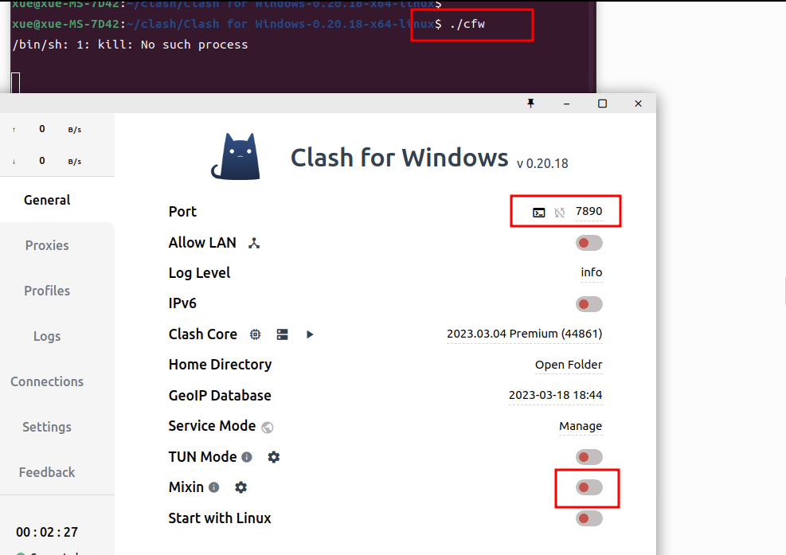

Clash是一款支持Windows、macOS、Android等多平台的代理软件, 支持ss/v2raylTrojan等，类Surge配置，macOS/Windows/Android上都已经有了图形界面，且召唤师已经支持ss/v2ray/Trojan的Clash订阅，使用起来已经非常简单，十分推荐使用。

clash有三种ClashForWindows、ClashForLinux和clashforandroid三个主要的分支

> ClashForWindows指的是带GUI界面的clash软件。而不是指windows系统专用，Linux同样能用。
>
> ClashForWindows的地址是：https://github.com/Fndroid/clash_for_windows_pkg/releases，对于Ubuntu系统，我们就下载Clash.for.Windows-0.xx.xx-x64-linux.tar.gz  这个文件。
>
> 如果你不喜欢界面，就从 https://github.com/Dreamacro/clash/releases 下载 clash-linux-amd64-vxxx.gz  。下载下来后，解压是一个单个文件，chmod +x , 然后shell下面运行。首次运行会先下载 config.yaml、Country.mmdb 等文件，需要等一会。下载的文件位于：~/.config/clash目录。结束后控制台会打印ip和端口，不出意外应该是http://127.0.0.1:7890/。接下来还有一堆配置，本文不述。
>
> ClashForWindows大小有70几兆，clash linux只有3M~4M。但是配置和命令行非我所长，所以宁可多等一会。

为了简单，我使用带GUI的。将Clash for Windows-0.20.18-x64-linux解压，执行`./cfw`, 启动界面：

Ubuntu系统的设置里面网络-VPN-网络代理改成手动，把http://127.0.0.1:7890/这个ip和端口设置到http代理和https代理。profiles里面订阅好后，proxies里选一个节点，然后回到General，点开Mixin。完成。
