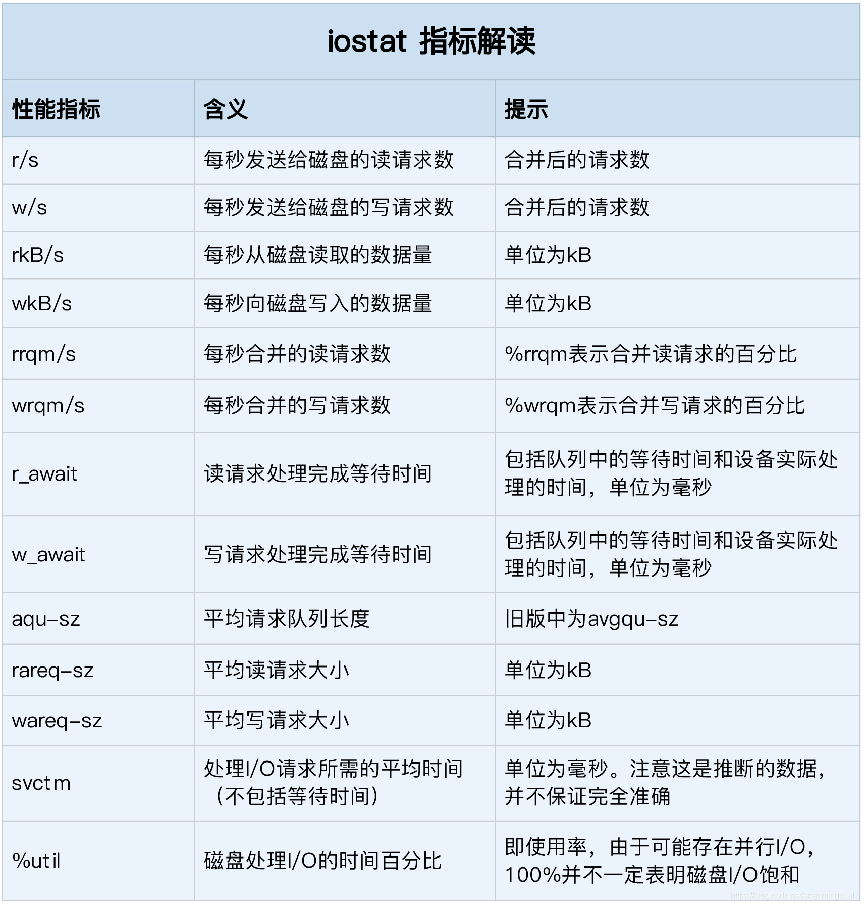
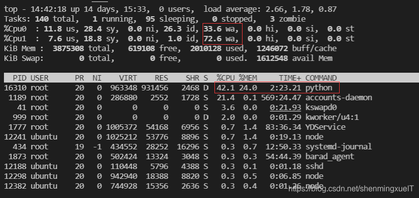
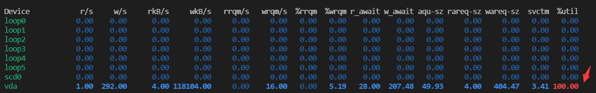
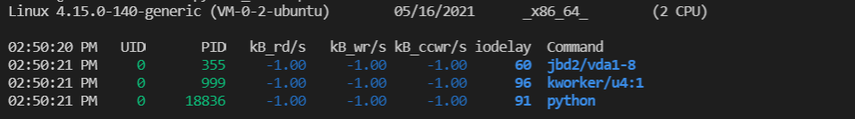

https://blog.csdn.net/shenmingxueIT/article/details/116890614

# Linux 磁盘性能优化 ——磁盘性能及高I/O排查

文章目录

* 磁盘容量查看：df
* 如何衡量磁盘性能
* 每块磁盘使用观测：iostat
* 进程io观测：pidstat、iotop
* 案例分析
* 参考文献

作者邮箱：2107810343@qq.com
时间：2021/05/16 14:39
实现环境：Linux
系统：ubuntu 18.04
CPU：2核
内存大小：4G

## 磁盘容量查看：df
对于一个磁盘来说，最常见的性能问题就是磁盘空间不足，所以我们先介绍如何查看Linux的磁盘容量，在命令行输入以下命令：

```shell
# -h表示讲输出内容转换为GB（或其他诸如MB）为单位，默认是字节数
ubuntu@VM-0-2-ubuntu:~/python_file$ df -h
```

```shell
Filesystem      Size  Used Avail Use% Mounted on
udev            1.9G     0  1.9G   0% /dev
tmpfs           379M  6.9M  372M   2% /run
/dev/vda1        50G   19G   29G  41% /
tmpfs           1.9G   24K  1.9G   1% /dev/shm
tmpfs           5.0M     0  5.0M   0% /run/lock
tmpfs           1.9G     0  1.9G   0% /sys/fs/cgroup
/dev/loop0       62M   62M     0 100% /snap/core20/975
/dev/loop2       85M   85M     0 100% /snap/protobuf/52
/dev/loop3       33M   33M     0 100% /snap/snapd/11588
tmpfs           379M     0  379M   0% /run/user/500
/dev/loop4       33M   33M     0 100% /snap/snapd/11841
overlay          50G   19G   29G  41% /var/lib/docker/overlay2/1dc4a0a89413f9af8da6bf84f78f980b248ef588f0ec7b316ec0d7bc74545cf7/merged
```


有些时候，我们可能遇见明明我们磁盘还有空间，但是就是空间不足的问题，因为我们的索引文件也占了一部分容量，用 -i 参数查看索引所占大小：

```shell
ubuntu@VM-0-2-ubuntu:~/python_file$ df -i -h
Filesystem     Inodes IUsed IFree IUse% Mounted on
udev             466K   399  465K    1% /dev
tmpfs            474K  2.1K  471K    1% /run
/dev/vda1        3.2M  229K  3.0M    8% /
tmpfs            474K     7  474K    1% /dev/shm
tmpfs            474K     4  474K    1% /run/lock
tmpfs            474K    18  474K    1% /sys/fs/cgroup
/dev/loop0        12K   12K     0  100% /snap/core20/975
/dev/loop2        157   157     0  100% /snap/protobuf/52
/dev/loop3        474   474     0  100% /snap/snapd/11588
tmpfs            474K    74  473K    1% /run/user/500
/dev/loop4        474   474     0  100% /snap/snapd/11841
overlay          3.2M  229K  3.0M    8% /var/lib/docker/overlay2/1dc4a0a89413f9af8da6bf84f78f980b248ef588f0ec7b316ec0d7bc74545cf7/merged
```


## 如何衡量磁盘性能
磁盘常见的性能指标主要由以下五个：

* 使用率：指磁盘处理I/O的时间百分比。

* 饱和度：指磁盘处理I/O的繁忙程度。

* IOPS：指每秒的I/O请求数。

* 吞吐量：指每秒I/O请求大小。

* 响应时间：指I/O从发出到收到响应的间隔时间。

要观测这些性能指标就需要借助一些工具：诸如iostat，pidstat等。

## 每块磁盘使用观测：iostat
在命令行中敲击如下命令：

```shell
# -d -x 表示显示所有磁盘I/O的指标
ubuntu@VM-0-2-ubuntu:~/python_file$ iostat -d -x 1

Linux 4.15.0-140-generic (VM-0-2-ubuntu)        05/16/2021      _x86_64_        (2 CPU)

Device            r/s     w/s     rkB/s     wkB/s   rrqm/s   wrqm/s  %rrqm  %wrqm r_await w_await aqu-sz rareq-sz wareq-sz  svctm  %util
loop0            0.00    0.00      0.00      0.00     0.00     0.00   0.00   0.00    0.73    0.00   0.00     1.90     0.00   0.04   0.00
loop1            0.00    0.00      0.00      0.00     0.00     0.00   0.00   0.00    4.20    0.00   0.00     8.12     0.00   0.00   0.00
loop2            0.00    0.00      0.00      0.00     0.00     0.00   0.00   0.00    3.59    0.00   0.00    18.16     0.00   0.28   0.00
loop3            0.03    0.00      0.03      0.00     0.00     0.00   0.00   0.00    0.80    0.00   0.00     1.01     0.00   0.03   0.00
loop4            0.01    0.00      0.01      0.00     0.00     0.00   0.00   0.00    0.31    0.00   0.00     1.04     0.00   0.01   0.00
loop5            0.00    0.00      0.00      0.00     0.00     0.00   0.00   0.00    0.00    0.00   0.00     2.50     0.00   0.00   0.00
scd0             0.00    0.00      0.00      0.00     0.00     0.00   0.00   0.00    0.26    0.00   0.00     5.27     0.00   0.24   0.00
vda              0.48    8.76     15.28     93.19     0.00     3.51   0.03  28.59    1.98    2.07   0.02    32.11    10.64   0.21   0.19
```


iostat提供了非常丰富的性能指标，除了第一行是有关机器的信息，后面各列的具体解释如下：



其中我们主要关注以下几行的指标：

* %util：磁盘I/O使用率

* r/s + w/s：IOPS

* rkB/s + wkB/s：吞吐量

* r_await + w_await：响应时间

## 进程io观测：pidstat、iotop
  刚刚的 iostat 只能观察每个磁盘大概的一个I/O 情况，如果我们想要观察进程所占的磁盘I/O情况就需要用到 pidstat 工具：

```shell
# -d表示查看磁盘情况
ubuntu@VM-0-2-ubuntu:~/python_file$ pidstat -d 1

Linux 4.15.0-140-generic (VM-0-2-ubuntu)        05/16/2021      _x86_64_        (2 CPU)

02:25:11 PM   UID       PID   kB_rd/s   kB_wr/s kB_ccwr/s iodelay  Command

```


由于目前机器没有运行消耗磁盘IO的程序，所以这里没有打印，不过我们还是要关注这几列：

* UID：用户id

* PID：进程id

* kB_wr/s：每秒写请求数据大小

* kB_wr/s：每秒读取数据大小

* kB_ccwr/s：每秒取消的写请求数据大小

* iodelay：块IO延迟，包括等待同步块IO和换入块IO结束的时间，但是为时间周期

除了 pidstat 可以查看磁盘IO信息之外，我们还可以使用 iotop 命令查看， iotop 可以对进程的磁盘IO使用情况进行排序：

```shell
ubuntu@VM-0-2-ubuntu:~/python_file$ sudo iotop
Total DISK READ :       0.00 B/s | Total DISK WRITE :      19.23 K/s
Actual DISK READ:       0.00 B/s | Actual DISK WRITE:      57.70 K/s

  TID  PRIO  USER     DISK READ  DISK WRITE  SWAPIN     IO>    COMMAND                                                                                      
  355 be/3 root        0.00 B/s    0.00 B/s  0.00 %  0.25 % [jbd2/vda1-8]
11845 be/4 root        0.00 B/s    0.00 B/s  0.00 %  0.01 % [kworker/u4:0]
  434 be/3 root        0.00 B/s   19.23 K/s  0.00 %  0.00 % systemd-journald

```

前两行分别表示，进程的磁盘读写大小总数和磁盘真实读写大小。因为缓存、缓冲区、IO合并等因素的影响，他们可能并不相同。

## 案例分析
下面我们通过倪朋飞老师介绍的一个案例来捋一下磁盘性能排查的思路：

首先，我们在中断运行以下命令：

```shell
ubuntu@VM-0-2-ubuntu:~/python_file$ docker run -v /tmp:/tmp --name=app -itd feisky/logapp

```

这个会启动倪朋飞老师打包好的一个docker程序，然后我们在中断运行ps命令，查看程序是否启动成功：

```shell
ubuntu@VM-0-2-ubuntu:~/python_file$ ps -ef | grep /app.py
```

如果出现以下打印，说明程序成功运行：

```shell
root     16310 16283 46 14:36 pts/0    00:00:13 python /app.py
ubuntu   16456 12437  0 14:37 pts/5    00:00:00 grep /app.py
```

然后我们可以先用top，查看当前系统的 CPU 和内存使用情况，然后再用其他工具进行排查：



我们可以看到，CPU1 的iowait使用率非常高，可以判定正在运行IO密集型程序，而下面占用42.1%的python程序无疑是个怀疑对象。

我们现在再使用 iostat 命令查看当前的整体I/O情况：

```shell
ubuntu@VM-0-2-ubuntu:~/python_file$ iostat -x -d 1
```




可以看到，磁盘vad的IO使用率已经高达100%，形成了IO饱和。我们现在就用 pidstat 命令查看导致此情况发生的元凶是哪个进程：

```shell
ubuntu@VM-0-2-ubuntu:~/python_file$ pidstat -d 1
```



可以看到现在运行了三个线程，其中kworker 和jdb2都是用来保证文件系统基本功能的内核线程，剩下一个python进程无疑就是元凶。

接下来，我们使用 strace 来看看python进程到底在干什么：

```shell
ubuntu@VM-0-2-ubuntu:~/python_file$ sudo strace -p 18836

strace: Process 18836 attached
mmap(NULL, 393220096, PROT_READ|PROT_WRITE, MAP_PRIVATE|MAP_ANONYMOUS, -1, 0) = 0x7f158636f000
mremap(0x7f158636f000, 393220096, 314576896, MREMAP_MAYMOVE) = 0x7f158636f000
munmap(0x7f159da70000, 314576896)       = 0
lseek(3, 0, SEEK_END)                   = 943718535
lseek(3, 0, SEEK_CUR)                   = 943718535
munmap(0x7f158636f000, 314576896)       = 0
close(3)                                = 0
stat("/tmp/logtest.txt.1", {st_mode=S_IFREG|0644, st_size=943718535, ...}) = 0
unlink("/tmp/logtest.txt.1")            = 0
stat("/tmp/logtest.txt", {st_mode=S_IFREG|0644, st_size=943718535, ...}) = 0
rename("/tmp/logtest.txt", "/tmp/logtest.txt.1") = 0
open("/tmp/logtest.txt", O_WRONLY|O_CREAT|O_APPEND|O_CLOEXEC, 0666) = 3
fcntl(3, F_SETFD, FD_CLOEXEC)           = 0
fstat(3, {st_mode=S_IFREG|0644, st_size=0, ...}) = 0
lseek(3, 0, SEEK_END)                   = 0
ioctl(3, TIOCGWINSZ, 0x7fffba4e6cb0)    = -1 ENOTTY (Inappropriate ioctl for device)
lseek(3, 0, SEEK_CUR)                   = 0
ioctl(3, TIOCGWINSZ, 0x7fffba4e6bd0)    = -1 ENOTTY (Inappropriate ioctl for device)
lseek(3, 0, SEEK_CUR)                   = 0
mmap(NULL, 314576896, PROT_READ|PROT_WRITE, MAP_PRIVATE|MAP_ANONYMOUS, -1, 0) = 0x7f159da70000
mmap(NULL, 314576896, PROT_READ|PROT_WRITE, MAP_PRIVATE|MAP_ANONYMOUS, -1, 0) = 0x7f158ae6f000
write(3, "2021-05-16 06:53:28,950 - __main"..., 314572844) = 314572844

```


重点关注最后一行，python进程向文件描述符为3的文件疯狂的写入大小为300MB的文件，这也是导致我们高磁盘IO的元凶！

我们再用` lsof `工具来看一下这个元凶又在向哪个文件中写数据呢：

```shell
ubuntu@VM-0-2-ubuntu:~/python_file$ sudo lsof -p 18836
COMMAND   PID USER   FD   TYPE DEVICE  SIZE/OFF    NODE NAME
python  18836 root  cwd    DIR   0,51      4096 2630212 /
python  18836 root  rtd    DIR   0,51      4096 2630212 /
python  18836 root  txt    REG   0,51     28016 2624992 /usr/local/bin/python3.7
python  18836 root  mem    REG  252,1           2624992 /usr/local/bin/python3.7 (stat: No such file or directory)
...... # 省略部分无用信息
python  18836 root    0u   CHR  136,0       0t0       3 /dev/pts/0
python  18836 root    1u   CHR  136,0       0t0       3 /dev/pts/0
python  18836 root    2u   CHR  136,0       0t0       3 /dev/pts/0
python  18836 root    3w   REG  252,1 186933248  411519 /tmp/logtest.txt

```


最后一行告诉我们，`/tmp/logtest.txt`文件就是承载元凶数据的文件。找到了元凶，我们就可以去查看对应的源代码了，至此，排查成功！

参考文献
[1] 倪朋飞.Linux性能优化实战.极客时间