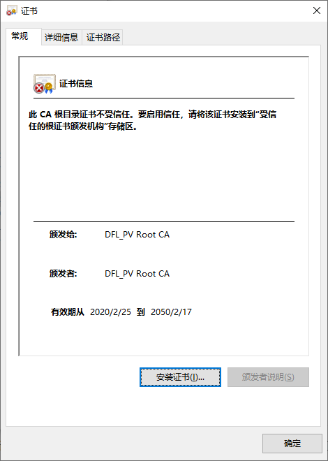
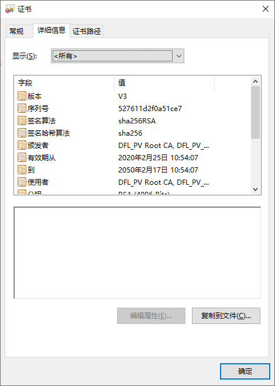

## 生成秘钥对（RSA算法，公钥和私钥）

```java
// 生成KeyPair
private KeyPair generateKeyPair() throws NoSuchAlgorithmException, NoSuchProviderException {
   KeyPairGenerator keyPairGenerator = KeyPairGenerator.getInstance("RSA");
   // 加密规格为128/256位   ===> 1024/2048
   keyPairGenerator.initialize(2048, new SecureRandom());
   return keyPairGenerator.genKeyPair();
}
```

这里不能使用AndroidKeyStore，因为后面的流程中，我需要拿到私钥文本。而AndroidKeyStore安全性相当高，拿不到私钥明文。

## 生成CSR文件，即**证书签名申请(Certificate Signing Request)**

这是提交给**证书颁发机构(CA)**的。CA会根据CSR，生成一个证书给你。在这个过程中，CA会：

1） **先用hash算法对明文信息进行第一次加密**得到**摘要1**

2） 在用CA机构自己的**私钥**对**摘要1**进行**第二次加密得到签名**

明文信息包括签发机构CA、证书的有效时间、扩展信息、域名、申请证书的机构、申请者(服务器server)的公钥。

生成CSR的代码：

```java
/**
 * 创建 PKCS#10 请求 (CSR)
 * 后续将csr(Certificate Signing Request,证书请求文件)提供给日产服务器进行签名.
 * 服务器作为 CA 对其进行签名，返回一个 PKCS#7(带有签名的 PKCS#10 和 CA 的证书).
 * BS的第一步即下载此证书
 * @param keyPair
 * @return
 * @throws Exception
 */
public String generatePKCS10(KeyPair keyPair) throws Exception {
   // 证书签名算法
   String sigAlg = "SHA256withRSA";
   // 各种基本信息
   String daid = Utils.getSN();
   String params = "CN=" + daid + ",OU=A-IVI LGE,O=LGE,C=CN";

   // CN和公钥
   PKCS10CertificationRequestBuilder p10Builder = new JcaPKCS10CertificationRequestBuilder(
           new X500Name(params), keyPair.getPublic());
   // 签名算法
   JcaContentSignerBuilder csBuilder = new JcaContentSignerBuilder(sigAlg);
   csBuilder.setProvider(new BouncyCastleProvider());

   ContentSigner signer = csBuilder.build(keyPair.getPrivate());
   // 生成PKCS10的二进制编码格式(ber/der)
   PKCS10CertificationRequest p10 = p10Builder.build(signer);

   //将二进制格式转换为证书格式(csr)
   PemObject pemObject = new PemObject("CERTIFICATE REQUEST", p10.getEncoded());
   StringWriter str = new StringWriter();
   JcaPEMWriter jcaPEMWriter = new JcaPEMWriter(str);
   jcaPEMWriter.writeObject(pemObject);
   jcaPEMWriter.close();
   str.close();
   // base64便于网络传输
   return str.toString();
}
```

生成的CSR内容像这样：

```
-----BEGIN CERTIFICATE REQUEST-----
MIICjzCCAXcCAQAwSjEZMBcGA1UEAwwQTkg0MlRBMjIwMTAxMDAwMTESMBAGA1UE
CwwJQS1JVkkgTEdFMQwwCgYDVQQKDANMR0UxCzAJBgNVBAYTAkNOMIIBIjANBgkq
hkiG9w0BAQEFAAOCAQ8AMIIBCgKCAQEA2h9IaNf8IKV0fI1BoKaaK7LgJaMKW9Ug
bkhuIpwZz9czaMXqXsj6YAEYeTqaVwoFsVH6+YhgVBai3jRRRNX1G3CIchIC5zX+
bwe4VB6/wqTAuDXwVAPvkhpx9Xyh97DGE84d9BcEcxZ/Nx8W/kpFvkxsFzGCY/ie
08xYszKqJL3Dvy1Xt4kFroSbUUeAjWg8fDMFzGghYS6Zl9yMJRo38SlK/h4MZk3a
Q3zwmMIvYnQXrJvlJcsPZMFYpSiuShuowWrNeI9RbKIriQr3J6CXMDZursr7baQW
CrlaVwaXh0o0agowrgnyycbHUWXgQGXiFYCMvARCOehJR2ZdSkHQQQIDAQABoAAw
DQYJKoZIhvcNAQELBQADggEBAHFNun8mWwQsqMxzGXjEpDuedEgkB9To8AXP7U28
lAREITmC0HY7Abv9zQeOApUJ3n+OZJDLdemngv/gkhFLRBf26Jflfif4LlMmc7cQ
oawdl38cY2RRQ+zEz74cY0t94Qn8yv+FyCV3ixZlG/vTsDvu94JMXzwtvSZxmlir
uAGkOIXF/39UWn6Uj3muMMBP+MKuJle1gwu77VvYKnOfVAg7iliYZ4zNaYHOl5ZF
ax0unMe9sfK3DckAt0SkagqW2+b6xy9s1jwd35+1jdzg3NrOogTMhHc0wH2oYQfK
zrLDVgs7XMHHQF+QnbgqFqPSV6vhVqYunEBhEjNtH98Mq/c=
-----END CERTIFICATE REQUEST-----

```

CA 下发的内容长这样：

```
-----BEGIN CERTIFICATE-----
MIIENDCCAxygAwIBAgIIbuOQoBT0XhgwDQYJKoZIhvcNAQELBQAwNTELMAkGA1UE
BhMCQ04xEDAOBgNVBAoMB0RlbW9fQ0ExFDASBgNVBAMMC0RGTCBEZW1vIENBMB4X
DTIyMTIxNDAxMDYzMFoXDTM3MTEwNzAxMDYzMFowSzELMAkGA1UEBhMCQ04xITAf
BgNVBAoMGE5JU1NBTiBNT1RPUiBDT1JQT1JBVElPTjEZMBcGA1UEAwwQTkg0MlRB
MjIwMTAxMTE0MTCCASIwDQYJKoZIhvcNAQEBBQADggEPADCCAQoCggEBALAiC1u/
APtNVjEtH02QZFhTZIBGbBKr8jA/UJr3BgOK0fAywhjgLMLHJLzG7ETeZ0KcsC0H
EjApT7TbdU78XILP07PnM1sjBrN6AyxYj57ANkiOvwzWXBMQKjrPX4C9Z80CipbU
5tqCAGV7Eq/09+uoI3+6/GJU3+kkgPscWNLVtNr9a9U83MehHuW+EpL+iLU6k/dc
Wz2bwTs+uY3KCf350RLiH5wNEWEiACaBtLTt9ZfZUtTmKdwx8A92YcTldBnOkLDR
AECABeYCj83jrJOQ3nhxKS8XwXVbYIItGVOYctm1J0DfJb+Wt4x4YVXbG33+euR1
SjZGKPGwaB2JrKECAwEAAaOCATAwggEsMB8GA1UdIwQYMBaAFNOCE/235xMMYFty
xn+zIAEv5mbnMB0GA1UdDgQWBBQNGy9giGxlTiqJacDl5wPLvCArrTARBglghkgB
hvhCAQEEBAMCB4AwCwYDVR0PBAQDAgXgMFYGA1UdHwRPME0wS6BJoEeGRWh0dHA6
Ly90ZXN0Y3JsLmRvbmdmZW5nLW5pc3Nhbi5jb20uY24vQ1JML05pc3NhbkNvbm5l
Y3RlZENhci9jcmwwLmNybDBdBggrBgEFBQcBAQRRME8wTQYIKwYBBQUHMAGGQWh0
dHA6Ly90ZXN0Y3JsLmRvbmdmZW5nLW5pc3Nhbi5jb20uY24vb2NzcC9OaXNzYW50
ZXN0Q29ubmVjdGVkQ2FyMBMGA1UdJQQMMAoGCCsGAQUFBwMCMA0GCSqGSIb3DQEB
CwUAA4IBAQADzKlhH4xawqzPlIo5KeQ2mlrRgV3K33o1yVquBZVHtoxFVF5HIhLT
3IsDkvHFTPmV3QNB7RIh82I7KVD9P0D7JI1QUn+8YrqPYRQYdj0xAXtEOmjL+9j/
fY96nRPC2wUmCaLv6zE8EX9X1QJp+SAAkYfbMLOgTOT2SHDhFNQ96QT/jObJ81PG
kFp6zGPSSZF05sBdXgycaxtg/uAXCgYlGyezuPXd/7I9GFmP2+f3MnHzNZv/WHU0
Wq1F49JBTiwLeP/wTmwKiVXsZfubLZ2I3UhZjoJF/28VKuS2f7hPs98TeQCpspaH
N1OGvO8d0thahMNIO2ctCDPXPkbjVRfi
-----END CERTIFICATE-----
```

解析出来后，实质上内容是这样：

```
Certificate:
    Data:
        Version: 3 (0x2)
        Serial Number: 3768120595551816739 (0x344b0db7a0b30c23)
    Signature Algorithm: sha256WithRSAEncryption
        Issuer: C=CN, O=DFL_PV_CA, CN=DFL_PV Root CA
        Validity
            Not Before: Oct 15 17:53:41 2020 GMT
            Not After : Nov 25 02:31:56 2048 GMT
        Subject: C=CN, O=Demo_CA, CN=DFL Demo CA
        Subject Public Key Info:
            Public Key Algorithm: rsaEncryption
                Public-Key: (2048 bit)
                Modulus:
                    00:e4:16:77:01:35:e5:c2:be:ea:17:7b:19:9d:bc:
                    be:d7:26:e1:fc:3a:a1:2c:ff:4e:60:d3:df:1c:ba:
                    a2:59:60:15:b6:33:a8:b4:ac:82:fb:c8:63:b6:bc:
                    bd:26:e8:6f:24:16:d4:a6:6f:6c:03:74:72:e9:ff:
                    1a:09:df:93:4a:c3:28:f9:bf:5d:28:a9:3c:b8:bf:
                    f3:d8:81:c2:d4:5f:59:c1:a0:23:23:41:a9:e5:6e:
                    5c:26:ac:a1:41:31:af:fe:0f:49:a4:78:e5:18:1a:
                    e5:43:12:71:fb:ea:8e:14:e8:2e:93:e6:c5:96:78:
                    3a:a5:85:7d:cf:ee:09:57:68:62:8c:e3:71:78:ae:
                    a0:58:1e:e4:62:09:2f:48:48:89:04:61:31:86:c5:
                    99:38:fe:02:d7:2d:86:f3:a4:8e:54:27:aa:8b:39:
                    c2:bf:43:7e:96:f6:0b:ca:1d:18:09:f2:c5:84:b2:
                    c5:ce:b7:af:6e:e6:ef:80:ac:c6:bd:8f:2d:35:b3:
                    a4:44:28:19:fe:7a:13:cd:6d:d9:50:b7:e0:56:ed:
                    76:d3:4b:09:aa:fa:43:bf:30:35:f3:e6:f9:46:f2:
                    0c:f4:a7:c2:21:d5:bd:f9:c5:bb:5f:b3:49:c1:76:
                    3a:16:bb:ac:0a:8a:22:3a:18:97:18:1f:6a:32:48:
                    0c:67
                Exponent: 65537 (0x10001)
        X509v3 extensions:
            X509v3 Authority Key Identifier: 
                keyid:EE:1F:AC:B9:AB:63:25:DD:FD:8E:AF:49:FE:BC:0C:43:02:7A:67:FE

            X509v3 Subject Key Identifier: 
                D3:82:13:FD:B7:E7:13:0C:60:5B:72:C6:7F:B3:20:01:2F:E6:66:E7
            X509v3 Basic Constraints: 
                CA:TRUE
            X509v3 Key Usage: 
                Certificate Sign, CRL Sign
            X509v3 CRL Distribution Points: 

                Full Name:
                  URI:http://crl.dongfeng-nissan.com.cn/ARL/DFL_PVRootCA.crl

    Signature Algorithm: sha256WithRSAEncryption
         6e:86:2a:99:d9:4c:50:ff:04:a9:73:12:43:06:f5:af:39:0e:
         0b:b5:00:e6:e7:9c:74:28:4e:60:f9:28:76:19:8f:65:87:63:
         94:c9:66:2d:a5:cf:12:5d:90:13:43:b5:43:c5:c2:52:f0:d2:
         51:57:a9:bb:11:b4:78:76:c7:d0:5c:23:e2:e4:49:d9:24:c2:
         c0:ac:3c:34:eb:19:2b:3d:8e:37:0a:65:1c:4d:23:86:41:e1:
         66:7f:69:75:6e:94:90:47:23:72:4a:b2:bb:06:96:de:d5:5b:
         04:09:58:e9:f1:d4:93:b1:7f:f3:01:09:80:ae:56:f2:cc:84:
         44:ff:d0:ec:6b:a9:2a:1b:cf:26:a4:c6:ed:0a:9d:39:93:dd:
         e8:dc:76:c7:ba:d0:e8:52:40:c6:f9:c2:13:19:81:5b:76:44:
         07:0c:14:93:21:5f:d7:bf:3a:49:d4:1e:82:4f:66:50:bc:ec:
         a8:1e:9a:23:1a:c8:0f:83:1a:e1:06:9d:bb:d1:e1:e3:ec:a2:
         00:f5:6f:9d:39:4e:73:4f:4e:1e:b5:08:50:fb:3e:a5:34:15:
         59:39:0e:78:98:3b:51:ef:7e:43:9f:73:d4:8d:68:d5:4c:5a:
         94:61:c9:38:7f:8b:2c:65:ba:92:6f:35:ec:9d:0b:46:68:59:
         c9:ac:4c:38:4a:21:b6:91:06:61:a7:e9:04:8e:10:b9:b1:f9:
         d6:e5:fd:78:d1:bc:d2:90:a5:3a:ab:19:2d:81:a6:5a:bb:cd:
         a5:24:e1:d9:91:44:a0:01:e2:73:c4:94:e1:67:06:12:0c:b7:
         19:0a:e7:5f:a9:94:c3:1b:13:f2:4b:bd:42:68:c3:d6:52:e6:
         ce:bf:71:00:b9:66:fd:b3:38:1b:61:df:a7:c3:29:ee:17:5c:
         28:86:e1:10:15:ad:4d:5e:b6:7b:f8:59:61:b1:96:2e:a9:1e:
         38:e9:b9:c9:a1:db:6c:ff:49:ca:a8:c7:18:43:4f:3f:8c:bb:
         c1:7a:b5:d0:84:6b:53:a5:ea:a1:ae:78:c0:0e:b9:bb:00:20:
         5c:3f:68:05:37:2d:05:bb:10:85:82:51:c4:5d:dd:09:4c:28:
         e2:42:98:bb:6f:b1:9e:93:ac:da:83:ef:42:85:d0:b7:ab:d0:
         8f:06:d2:7e:e5:c6:31:4a:bd:37:aa:5d:8f:36:30:05:4d:5d:
         b6:c3:33:4c:06:a8:5c:5f:b0:c7:24:35:ae:e4:93:fc:e0:30:
         3d:88:6b:1e:71:6b:e4:e6:06:de:77:d1:6c:9b:8b:2e:9b:45:
         b7:29:39:04:3e:70:3f:a1:14:8e:d5:5b:50:93:21:95:db:68:
         cf:87:06:e9:e7:2c:9a:35

```

当然，我存储的是解析之前的那个base64格式的。然后解析是借助CertificateFactory类，用这段代码：

```java
byte[] bytes = MetazoneHelper.getInstance().readCertificate();//DNTC证书服务器颁发的证书原文，base64格式
ByteArrayInputStream bis = new ByteArrayInputStream(bytes);
CertificateFactory factory = CertificateFactory.getInstance("X.509");
Certificate cert = factory.generateCertificate(bis);//转成Certificate对象。
cert.toString();//toString即得上面的明文
```

## 使用证书进行双向认证

首先把CA颁发的证书保存在某个地方。

双向认证时，指定证书和私钥，代码如下：

```java
/**
 * 本地信任的服务器证书
 * @return
 * @throws KeyStoreException
 * @throws NoSuchAlgorithmException
 * @throws CertificateException
 * @throws IOException
 */
private static TrustManager[] createTrustManager() throws KeyStoreException, NoSuchAlgorithmException, CertificateException, IOException {
   KeyStore keyStore = KeyStore.getInstance(KeyStore.getDefaultType());
   String algorithm = TrustManagerFactory.getDefaultAlgorithm();
   TrustManagerFactory tmf = TrustManagerFactory.getInstance(algorithm);
   keyStore.load(null);
   CertificateFactory factory = CertificateFactory.getInstance("X.509");
   InputStream tsIn = BSService.mContext.getAssets().open(SERVER_CERT_PATH);
   //获取预置的DNTC证书对象
   Certificate cert = factory.generateCertificate(tsIn);
   String alias = "DNTC_CA";
   keyStore.setCertificateEntry(alias, cert);
   tmf.init(keyStore);
   return tmf.getTrustManagers();
}
private static KeyManager[] createKeyManager() throws KeyStoreException, CertificateException, IOException, NoSuchAlgorithmException, InvalidKeySpecException, UnrecoverableKeyException {
   KeyStore keyStore = KeyStore.getInstance(KeyStore.getDefaultType());
   keyStore.load(null);
   CertificateFactory factory = CertificateFactory.getInstance("X.509");
   //从Metazone读取到本地证书（由DNTC下发）
   byte[] bytes = MetazoneHelper.getInstance().readCertificate();
   ByteArrayInputStream bis = new ByteArrayInputStream(bytes);
   Certificate cert = factory.generateCertificate(bis);
   String alias = "HSAE_PUBLIC";
   keyStore.setCertificateEntry(alias, cert);

   //私钥
   GenKeyPair genKeyPair = new GenKeyPair();
   KeyPair keyPair = genKeyPair.loadKey();
   byte[] priKey = keyPair.getPrivate().getEncoded();
   KeyFactory keyFactory = KeyFactory.getInstance("RSA");
   PKCS8EncodedKeySpec keySpec = new PKCS8EncodedKeySpec(priKey);
   PrivateKey privateKey = keyFactory.generatePrivate(keySpec);
   keyStore.setKeyEntry("HSAE_PRIVATE", privateKey, null, new Certificate[]{cert});
   KeyManagerFactory keyManagerFactory = KeyManagerFactory.getInstance(KeyManagerFactory.getDefaultAlgorithm());
   keyManagerFactory.init(keyStore, null);

   return keyManagerFactory.getKeyManagers();
}
//如果只需要单向认证，用这个
private static SSLContext createSingleSSLContext(){
   try {
      SSLContext sslContext = SSLContext.getInstance("TLS");
      sslContext.init(null, createTrustManager(), null);
      return sslContext;
   } catch (CertificateException | NoSuchAlgorithmException | KeyStoreException | IOException | KeyManagementException e) {
      e.printStackTrace();
      Flow.getInstance(null).setMessage("DNTC CA异常");
   }
   return null;
}
//如果需要双向认证，用这个
public static SSLContext createBothSSLContext(){
   try {
      SSLContext sslContext = SSLContext.getInstance("TLS");
      sslContext.init(createKeyManager(), createTrustManager(), null);
      return sslContext;
   } catch (KeyStoreException | NoSuchAlgorithmException | CertificateException | IOException | KeyManagementException | UnrecoverableKeyException | InvalidKeySpecException e) {
      e.printStackTrace();
      Flow.getInstance(null).setMessage("证书异常");
   } catch (MetazoneException e){
      Logger.e(TAG, e.getMessage());
      Flow.getInstance(null).setMessage("metazone异常");
   }
   return null;
}

//https连接
mSSLContextBoth = createBothSSLContext();
SSLSocketFactory factory = mSSLContextSingle.getSocketFactory();
URL url = new URL(address);
httpsURLConnection = (HttpsURLConnection) url.openConnection();
httpsURLConnection.setSSLSocketFactory(factory);//指定factory即可。双向认证的内部过程交给系统库
//HostnameVerifier用来验证服务端证书与域名是否匹配。这是为了防止中间人攻击
httpsURLConnection.setHostnameVerifier(new HostnameVerifier() {
    @Override
    public boolean verify(String hostname, SSLSession session) {
        try {
            final Certificate[] certs = session.getPeerCertificates();
            final X509Certificate x509 = (X509Certificate) certs[0];
            Collection<List<?>> subjectAlternativeNames = x509.getSubjectAlternativeNames();
            for (List<?> list : subjectAlternativeNames) {
                Integer type = (Integer) list.get(0);
                if(type == 2) {//类型2表示dns name
                    String dnsName = (String)list.get(1);
                    boolean equals = TextUtils.equals(dnsName, hostname);
                    if(equals) return true;
                }
            }
            return false;
        } catch (final SSLException | CertificateParsingException ex) {
            Logger.e(TAG, ex);
            return false;
        }
    }
});
```

## 关于私钥的存储问题

如果使用AndroidKeyStore，私钥存在TEE，是非常安全的。但是这里AndroidKeyStore不能满足需求，因为不能使用。我需要自己存储私钥。

安全性的要求，

1. 不能存储私钥明文。因为明文存在硬盘介质上，就可以被别人提取出来。
2. 私钥只能自己获得，不能在应用进程之间传递。安卓的沙盒机制，无法dump内存，所以应用内部获取私钥是安全的，但是只要在进程间传递，就有被别人窃取的风险。
3. 使用完后，应及时把对应的内存清空。

所以必须加密存。采用AES对称加密算法。带来的问题是，AES加密秘钥决绝不能泄漏，意味着：

​		**AES密码不能明文写在代码里；也不能放在任何别人能访问到的地方。**

所以，我们使用AndroidKeyStore来生成AES秘钥，然后用它对RSA公私钥进行加密(只有私钥需要加密，公钥本来就是公开的)，存储在普通硬盘或flash上面。因为是加密的，别人提取到的是密文，保证安全性。

参考代码:

```java
/**
* 从存储的地方，还原一开始生成的KeyPair
*/
public KeyPair loadKey() {
   try {
      byte[] priEncrypt = MetazoneHelper.getInstance().readPrivateKey();//从存储的地方读取私钥。当然，是加密过的密文
      if (priEncrypt == null) {
         return null;
      }
      //解密，得到私钥明文
      byte[] pri = decryptBytes(priEncrypt);
      //下面三行，借助PKCS8EncodedKeySpec、KeyFactory两个类，将私钥文本转成PrivateKey对象
      PKCS8EncodedKeySpec keySpecPri = new PKCS8EncodedKeySpec(pri);
      KeyFactory keyFactory = KeyFactory.getInstance("RSA");
      PrivateKey privateKey = keyFactory.generatePrivate(keySpecPri);

      byte[] pub = MetazoneHelper.getInstance().readPublicKey();////从存储的地方读取公钥(未加密)
      if (pub == null) {
         return null;
      }
      //下面2行，借助X509EncodedKeySpec、KeyFactory两个类，将公钥文本转成PublicKey对象
      X509EncodedKeySpec pubKeySpec = new X509EncodedKeySpec(pub);
      PublicKey publicKey = keyFactory.generatePublic(pubKeySpec);
      KeyPair pair = new KeyPair(publicKey, privateKey);//然后创建KeyPair
      return pair;
   } catch (Throwable e){
      e.printStackTrace();
      Logger.e(TAG, e.getMessage());
      return null;
   }
}
/**
* 创建AES秘钥，要来对RSA私钥进行加解密
* 因为generateKey是随机的，即每次生成的都不一样，所以要先判断存在，否则会把前次生成的秘钥覆盖掉，也就没法解密了。
* 即只能generateKey一次。
*/
private SecretKey getOrCreateSecretKey(final String alias) throws NoSuchAlgorithmException,
           UnrecoverableEntryException, KeyStoreException, InvalidAlgorithmParameterException, NoSuchProviderException, CertificateException, IOException {
      KeyStore keyStore = KeyStore.getInstance("AndroidKeyStore");
      keyStore.load(null);
      KeyStore.SecretKeyEntry entry = (KeyStore.SecretKeyEntry) keyStore.getEntry(alias, null);//alias就是随便取个名字，保证应用内唯一
      if(entry == null) {
         //create
         return generateKey(alias);
      }else {
         //get
         return entry.getSecretKey();
      }
   }
/**
* 用AndroidKeyStore创建AES秘钥
*/
private SecretKey generateKey(final String alias) throws NoSuchAlgorithmException,
NoSuchProviderException, InvalidAlgorithmParameterException {
    final KeyGenerator keyGenerator = KeyGenerator
        .getInstance(KeyProperties.KEY_ALGORITHM_AES, "AndroidKeyStore");
    keyGenerator.init(new KeyGenParameterSpec.Builder(alias,
                                                      KeyProperties.PURPOSE_ENCRYPT | KeyProperties.PURPOSE_DECRYPT)
                      .setBlockModes(KeyProperties.BLOCK_MODE_GCM)
                      .setEncryptionPaddings(KeyProperties.ENCRYPTION_PADDING_NONE)
                      .setRandomizedEncryptionRequired(false)
                      .setKeySize(128)
                      .build());
    SecretKey secretKey = keyGenerator.generateKey();
    return secretKey;
}

/**
* AES/GCM/NoPadding加密
* GCM 要求提供一个向量（IV），但是IV是可以暴露的
* 前面generateKey里面调用了setRandomizedEncryptionRequired(false)，所以这里在代码里手动指定private byte[] iv = "123456789012".getBytes();
*
* 如果setRandomizedEncryptionRequired是true，则不能自己指定IV，必须由系统随机生成：
* iv = cipher.getIV();//把这个IV保存下来，后面解密要用到
*/
private byte[] encryptBytes(byte[] origin) throws NoSuchAlgorithmException,
NoSuchProviderException, NoSuchPaddingException, InvalidKeyException, IOException,
InvalidAlgorithmParameterException, BadPaddingException, IllegalBlockSizeException, UnrecoverableEntryException, KeyStoreException, CertificateException {
    final Cipher cipher = Cipher.getInstance("AES/GCM/NoPadding");
    SecretKey secretKey = getOrCreateSecretKey(alias_aes);
    GCMParameterSpec spec = new GCMParameterSpec(128, iv);////GCM需要初始化向量
    cipher.init(Cipher.ENCRYPT_MODE, secretKey, spec);
    return cipher.doFinal(origin);
}
/**
* AES/GCM/NoPadding解密
*/
private byte[] decryptBytes(byte[] code) throws NoSuchAlgorithmException,
NoSuchPaddingException, InvalidKeyException, IOException,
InvalidAlgorithmParameterException, BadPaddingException, IllegalBlockSizeException, UnrecoverableEntryException, KeyStoreException, CertificateException, LostAESKeyException {
    final Cipher cipher = Cipher.getInstance("AES/GCM/NoPadding");
    GCMParameterSpec spec = new GCMParameterSpec(128, iv);//IV 和加密那里用的IV要一致
    SecretKey secretKey = getSecretKey(alias_aes);
    if (secretKey == null) {
        //丢失了AES的秘钥，无法对bytes进行解密
        throw new LostAESKeyException("The AES key in AndroidKeyStore is missing!");
    }
    cipher.init(Cipher.DECRYPT_MODE, secretKey, spec);
    return cipher.doFinal(code);
}

   static class LostAESKeyException extends Exception{
      public LostAESKeyException(String message) {
         super(message);
      }
   }
```

有一些其它可参考的代码：

（演示了AES/ECB/NoPadding，使用BKS而不是AndroidKeyStore，需要自己保存密钥）

```
private String key = "1234567890abcdef";//必须16位
    KeyStore keyStore;

    /**
     * 把密钥保存到/data/data/packagexxx/files/
     */
    void saveKey(){
        try {
//          KeyStore keyStore = KeyStore.getInstance("AndroidKeyStore");//AndroidKeyStore不支持以下操作
            keyStore = KeyStore.getInstance(KeyStore.getDefaultType());//BKS
            keyStore.load(null);
            SecretKeySpec skeySpec = new SecretKeySpec(key.getBytes(), "AES");
            KeyStore.SecretKeyEntry secretKeyEntry = new KeyStore.SecretKeyEntry(skeySpec);
            keyStore.setEntry("my_aes_key2", secretKeyEntry, null);

            //指定保存的文件
            File filesDir = MainActivity.mContext.getFilesDir();
            File file = new File(filesDir, "output.txt");
            if(!file.exists()) {
                file.createNewFile();
            }
            FileOutputStream ff = new FileOutputStream(file);
            keyStore.store(ff, "12345678".toCharArray());//保存
        } catch (Exception e) {
            e.printStackTrace();
        }
    }

    /**
     * 从文件中读取出密钥。
     */
    SecretKey loadKey() {
        File filesDir = MainActivity.mContext.getFilesDir();
        File file = new File(filesDir, "output.txt");
        try {
            KeyStore keyStore = KeyStore.getInstance(KeyStore.getDefaultType());//BKS
            keyStore.load(new FileInputStream(file), "12345678".toCharArray());
            KeyStore.SecretKeyEntry entry = (KeyStore.SecretKeyEntry)keyStore.getEntry("my_aes_key2", null);
            SecretKey secretKey = entry.getSecretKey();
            System.out.println("key= " + new String(secretKey.getEncoded()));
            return secretKey;
        } catch (Exception e) {
            e.printStackTrace();
        }
        return null;
    }
    byte[] encryptText(final String textToEncrypt) {
        try {
            SecretKey secretKey = loadKey();
            Cipher cipher = Cipher.getInstance("AES/ECB/NoPadding");
            cipher.init(Cipher.ENCRYPT_MODE, secretKey);
            return cipher.doFinal(textToEncrypt.getBytes());
        } catch (Exception e) {
            e.printStackTrace();
        }
        return null;
    }
    String decryptText(final byte[] data) {
        try {
            SecretKey secretKey = loadKey();
            Cipher cipher = Cipher.getInstance("AES/ECB/NoPadding");
            cipher.init(Cipher.DECRYPT_MODE, secretKey);
            byte[] decryptData = cipher.doFinal(data);
            return new String(decryptData);
        } catch (Exception e) {
            e.printStackTrace();
        }
        return null;
    }
```

## 服务端的证书

本地需要预置服务器端的证书。https连接时，默认的单向认证需要验证证书（大致过程是，创建连接时，server把证书传给client，client与本地预置的做比对）。

服务器端的证书是线下给的，是一个cer文件。可以在windows上面直接双击打开：



关于那么是cer，本目录其它文章看。

安卓项目怎么用呢？前文createTrustManager()函数里已经有了，再贴一遍：

```
CertificateFactory factory = CertificateFactory.getInstance("X.509");
InputStream tsIn = mContext.getAssets().open(SERVER_CERT_PATH);//把cer文件放在assets目录
//获取预置的DNTC证书对象
Certificate cert = factory.generateCertificate(tsIn);
```

但是我们想预置到安卓系统里。作为系统内置的证书，https连接的时候不需要手动去设置证书（即无需调用setSSLSocketFactory）。

系统内置证书目录是在“/system/etc/security/cacerts”：

```
console:/system/etc/security/cacerts # ls
00673b5b.0  399e7759.0  60afe812.0  91739615.0  b7db1890.0  d59297b8.0
04f60c28.0  3a3b02ce.0  6187b673.0  9282e51c.0  b872f2b4.0  d7746a63.0
0d69c7e1.0  3ad48a91.0  63a2c897.0  9339512a.0  b936d1c6.0  da7377f6.0
10531352.0  3c58f906.0  67495436.0  9479c8c3.0  bc3f2570.0  dbc54cab.0
111e6273.0  3c6676aa.0  69105f4f.0  9576d26b.0  bd43e1dd.0  dbff3a01.0
12d55845.0  3c860d51.0  6b03dec0.0  95aff9e3.0  bdacca6f.0  dc99f41e.0
1dcd6f4c.0  3c899c73.0  75680d2e.0  9685a493.0  bf64f35b.0  dfc0fe80.0
1df5a75f.0  3c9a4d3b.0  76579174.0  9772ca32.0  c2c1704e.0  e442e424.0
1e1eab7c.0  3d441de8.0  7892ad52.0  985c1f52.0  c491639e.0  e48193cf.0
1e8e7201.0  3e7271e8.0  7999be0d.0  9d6523ce.0  c51c224c.0  e775ed2d.0
1eb37bdf.0  40dc992e.0  7a7c655d.0  9f533518.0  c559d742.0  e8651083.0
1f58a078.0  455f1b52.0  7a819ef2.0  a2c66da8.0  c7e2a638.0  ed39abd0.0
219d9499.0  48a195d8.0  7c302982.0  a3896b44.0  c907e29b.0  f013ecaf.0
23f4c490.0  4be590e0.0  7d453d8f.0  a7605362.0  c90bc37d.0  f0cd152c.0
27af790d.0  5046c355.0  81b9768f.0  a7d2cf64.0  cb156124.0  f459871d.0
2add47b6.0  524d9b43.0  82223c44.0  a81e292b.0  cb1c3204.0  facacbc6.0
2d9dafe4.0  52b525c7.0  85cde254.0  ab5346f4.0  ccc52f49.0  fb5fa911.0
2fa87019.0  583d0756.0  86212b19.0  ab59055e.0  cf701eeb.0  fd08c599.0
302904dd.0  5a250ea7.0  869fbf79.0  aeb67534.0  d06393bb.0  fde84897.0
304d27c3.0  5a3f0ff8.0  87753b0d.0  b0ed035a.0  d0cddf45.0
31188b5e.0  5acf816d.0  882de061.0  b0f3e76e.0  d16a5865.0
33ee480d.0  5cf9d536.0  88950faa.0  b1f22b4f.0  d18e9066.0
343eb6cb.0  5e4e69e7.0  89c02a45.0  b3fb433b.0  d41b5e2a.0
35105088.0  5f47b495.0  8d6437c3.0  b74d2bd5.0  d4c339cb.0
```

源码路径是在：

`<源码根路径>/system/ca-certificates/files`

所以只要把cer转成安卓里面这种.0的格式，放到files下面，提交即可。开发者自测的话就直接push到“/system/etc/security/cacerts”，然后chmod设置访问权限。

在ubuntu环境下，使用openssl工具:

1. openssl x509 -inform DER -in DFL_PV_Root_CA.cer  -out cacert.pem

   将格式从cer转成pem（cer是二进制，pem是base64）

   这一步不是必须的。

2. openssl x509 -inform PEM -subject_hash_old -in cacert.pem

   这是得到hash值，作为.0文件的文件名。日产的DFL_PV_Root_CA.cer，输出hash值是b1f22b4f，所以证书名就是b1f22b4f.0

   （或者`openssl x509 -inform DER -subject_hash_old -in DFL_PV_Root_CA.cer`是一样的。-inform DER或-inform PEM是告诉openssl，输入文件的格式是pem还是der(cer)）

   ```
   work@ubuntu-cts:~/cer$ openssl x509 -inform DER -subject_hash_old -in DFL_PV_Root_CA.cer
   b1f22b4f
   -----BEGIN CERTIFICATE-----
   MIIFVTCCAz2gAwIBAgIIUnYR0vClHOcwDQYJKoZIhvcNAQELBQAwOjELMAkGA1UE
   BhMCQ04xEjAQBgNVBAoMCURGTF9QVl9DQTEXMBUGA1UEAwwOREZMX1BWIFJvb3Qg
   Q0EwIBcNMjAwMjI1MDI1NDA3WhgPMjA1MDAyMTcwMjU0MDdaMDoxCzAJBgNVBAYT
   AkNOMRIwEAYDVQQKDAlERkxfUFZfQ0ExFzAVBgNVBAMMDkRGTF9QViBSb290IENB
   MIICIjANBgkqhkiG9w0BAQEFAAOCAg8AMIICCgKCAgEA3c8XxcukKbg1x0zRE4rq
   jANIs6cI2mcw7IbxrURsLzoYCPvPIqQUzQ+wSsyl9hRuy7YjkLZ8wkukinKpg3hI
   gZ++6HlDj0r992QQJ5lFtBccztathv4LzjN7/YbMNzBptbPDP2KN+FZwMy8LWSTn
   O2T0oOJTf+8eCGJ243QfrX+nfloYf6Ws0i5xdvABLsLuPl3xX6nodISlgTgSEvpT
   txI/CldMbuut1OuS4M/IDUZnrA+cGr16PXfijw3li9e+I7rS2uHSBIZP6Jm9tYQa
   3o8JLLNMoOd1mxBwkxamLsJxfbKjf/zo6MAjyusM8IZf9sk4M3jVHeLJM0lyJh2n
   zQPIXRrvlIJjE32xgnBzpGiJmno3BPZSCR51Qx+48soclBijJmyS31dLxzPPwopK
   rOaEaMsH+elh22TTar4/oF8S50HXk3FXfA96Gs54LEz+41ld8y84HkRCSyD5XaWh
   gzJT6Qo8O8JnMzRGmE0f5SBGCYs3dhES9+ouIb9r3KSE+BP8TFP091pe5OTewnrC
   leKHYAgiLYdGcpQNhWpCo6A2CanqbPTj1Hfi8U/dD8nitS3OWFk+ThJYkQQYoKVi
   RROcYR7JzM0rJbaJCd1y/cCBQRLA33LFCYxHokZlIIg58ywww7CTM/j3YgpNmncl
   5ZNY3eOSR8QUbE5tnxISym0CAwEAAaNdMFswHwYDVR0jBBgwFoAU7h+suatjJd39
   jq9J/rwMQwJ6Z/4wDAYDVR0TBAUwAwEB/zAdBgNVHQ4EFgQU7h+suatjJd39jq9J
   /rwMQwJ6Z/4wCwYDVR0PBAQDAgEGMA0GCSqGSIb3DQEBCwUAA4ICAQAvi6LJvu/e
   8rC6TUuhIPqGSkFxSiJoCU4p2dqUynguLWlMeM/PY73B6OwJeVVZJSQHR4/0EbKR
   0A+rf94UzSvGYNKk/KahzcN/ZJhldLxE6/4G1tL+dzReri21ywaCKdh4FMZrzMEL
   pBjQKWGB6ormTVakW3dA/FGc6Z68f5QJQI5S1hkiS4sK+L9oAjzWJPxmpspUia9m
   qbSxeHHwJY1DYdu0RUecabdZwWuHLGYbtP5p53opDICyebpyim2L+vT1p+fPSHN2
   GjQAmwH9R5NHgqfqrCB7u+cLP9T/EFXT83b+VkvLwLQtJCmX2yWiKOXp+7mFDxa5
   vr7RwPJWneqs3ISvtyd9nXKrOEGpeKW+M0FLUrw7WIC5KlO+rRgH4IM96WdJJLPj
   egTOizIWbbroJrXCLKw57/GUubf18SzKhTpQWB6kvjUSAkrmuquIuOakX0YGXbMm
   wCAfGkJy/72aUoRJhe7qtcfnWSshJPvY4djDH4GU+Ami0ah2lSLw5XdwYqMj754K
   ligGq3Uirk7lF2ZgVdR2GsSIFRISHWEJjKDI24vPEQjg+zYNHkrq5ADo6d9LLpXZ
   tCql7YyapOvvIUYtnBUBNfbIQI6GJPD3JxKHqc/3Gz/a+vJY3hANOgJ0bLIWLqnn
   uR9s7L8TKUWXP7EA9ghMTQ0zIZiBftXfsQ==
   -----END CERTIFICATE-----
   ```

   从-----BEGIN CERTIFICATE-----开始，后面的部分其实就是第一步pem文件的内容。

3. openssl x509 -inform DER -text -in DFL_PV_Root_CA.cer > b1f22b4f.0

   “b1f22b4f.0”这个名字上一步得到。生成文件后，打开看：

   ```
   work@ubuntu-cts:~/cer$ cat b1f22b4f.0 
   Certificate:
       Data:
           Version: 3 (0x2)
           Serial Number: 5941956356040105191 (0x527611d2f0a51ce7)
           Signature Algorithm: sha256WithRSAEncryption
           Issuer: C = CN, O = DFL_PV_CA, CN = DFL_PV Root CA
           Validity
               Not Before: Feb 25 02:54:07 2020 GMT
               Not After : Feb 17 02:54:07 2050 GMT
           Subject: C = CN, O = DFL_PV_CA, CN = DFL_PV Root CA
           Subject Public Key Info:
               Public Key Algorithm: rsaEncryption
                   RSA Public-Key: (4096 bit)
                   Modulus:
                       00:dd:cf:17:c5:cb:a4:29:b8:35:c7:4c:d1:13:8a:
                       ea:8c:03:48:b3:a7:08:da:67:30:ec:86:f1:ad:44:
                       6c:2f:3a:18:08:fb:cf:22:a4:14:cd:0f:b0:4a:cc:
                       a5:f6:14:6e:cb:b6:23:90:b6:7c:c2:4b:a4:8a:72:
                       a9:83:78:48:81:9f:be:e8:79:43:8f:4a:fd:f7:64:
                       10:27:99:45:b4:17:1c:ce:d6:ad:86:fe:0b:ce:33:
                       7b:fd:86:cc:37:30:69:b5:b3:c3:3f:62:8d:f8:56:
                       70:33:2f:0b:59:24:e7:3b:64:f4:a0:e2:53:7f:ef:
                       1e:08:62:76:e3:74:1f:ad:7f:a7:7e:5a:18:7f:a5:
                       ac:d2:2e:71:76:f0:01:2e:c2:ee:3e:5d:f1:5f:a9:
                       e8:74:84:a5:81:38:12:12:fa:53:b7:12:3f:0a:57:
                       4c:6e:eb:ad:d4:eb:92:e0:cf:c8:0d:46:67:ac:0f:
                       9c:1a:bd:7a:3d:77:e2:8f:0d:e5:8b:d7:be:23:ba:
                       d2:da:e1:d2:04:86:4f:e8:99:bd:b5:84:1a:de:8f:
                       09:2c:b3:4c:a0:e7:75:9b:10:70:93:16:a6:2e:c2:
                       71:7d:b2:a3:7f:fc:e8:e8:c0:23:ca:eb:0c:f0:86:
                       5f:f6:c9:38:33:78:d5:1d:e2:c9:33:49:72:26:1d:
                       a7:cd:03:c8:5d:1a:ef:94:82:63:13:7d:b1:82:70:
                       73:a4:68:89:9a:7a:37:04:f6:52:09:1e:75:43:1f:
                       b8:f2:ca:1c:94:18:a3:26:6c:92:df:57:4b:c7:33:
                       cf:c2:8a:4a:ac:e6:84:68:cb:07:f9:e9:61:db:64:
                       d3:6a:be:3f:a0:5f:12:e7:41:d7:93:71:57:7c:0f:
                       7a:1a:ce:78:2c:4c:fe:e3:59:5d:f3:2f:38:1e:44:
                       42:4b:20:f9:5d:a5:a1:83:32:53:e9:0a:3c:3b:c2:
                       67:33:34:46:98:4d:1f:e5:20:46:09:8b:37:76:11:
                       12:f7:ea:2e:21:bf:6b:dc:a4:84:f8:13:fc:4c:53:
                       f4:f7:5a:5e:e4:e4:de:c2:7a:c2:95:e2:87:60:08:
                       22:2d:87:46:72:94:0d:85:6a:42:a3:a0:36:09:a9:
                       ea:6c:f4:e3:d4:77:e2:f1:4f:dd:0f:c9:e2:b5:2d:
                       ce:58:59:3e:4e:12:58:91:04:18:a0:a5:62:45:13:
                       9c:61:1e:c9:cc:cd:2b:25:b6:89:09:dd:72:fd:c0:
                       81:41:12:c0:df:72:c5:09:8c:47:a2:46:65:20:88:
                       39:f3:2c:30:c3:b0:93:33:f8:f7:62:0a:4d:9a:77:
                       25:e5:93:58:dd:e3:92:47:c4:14:6c:4e:6d:9f:12:
                       12:ca:6d
                   Exponent: 65537 (0x10001)
           X509v3 extensions:
               X509v3 Authority Key Identifier: 
                   keyid:EE:1F:AC:B9:AB:63:25:DD:FD:8E:AF:49:FE:BC:0C:43:02:7A:67:FE
   
               X509v3 Basic Constraints: 
                   CA:TRUE
               X509v3 Subject Key Identifier: 
                   EE:1F:AC:B9:AB:63:25:DD:FD:8E:AF:49:FE:BC:0C:43:02:7A:67:FE
               X509v3 Key Usage: 
                   Certificate Sign, CRL Sign
       Signature Algorithm: sha256WithRSAEncryption
            2f:8b:a2:c9:be:ef:de:f2:b0:ba:4d:4b:a1:20:fa:86:4a:41:
            71:4a:22:68:09:4e:29:d9:da:94:ca:78:2e:2d:69:4c:78:cf:
            cf:63:bd:c1:e8:ec:09:79:55:59:25:24:07:47:8f:f4:11:b2:
            91:d0:0f:ab:7f:de:14:cd:2b:c6:60:d2:a4:fc:a6:a1:cd:c3:
            7f:64:98:65:74:bc:44:eb:fe:06:d6:d2:fe:77:34:5e:ae:2d:
            b5:cb:06:82:29:d8:78:14:c6:6b:cc:c1:0b:a4:18:d0:29:61:
            81:ea:8a:e6:4d:56:a4:5b:77:40:fc:51:9c:e9:9e:bc:7f:94:
            09:40:8e:52:d6:19:22:4b:8b:0a:f8:bf:68:02:3c:d6:24:fc:
            66:a6:ca:54:89:af:66:a9:b4:b1:78:71:f0:25:8d:43:61:db:
            b4:45:47:9c:69:b7:59:c1:6b:87:2c:66:1b:b4:fe:69:e7:7a:
            29:0c:80:b2:79:ba:72:8a:6d:8b:fa:f4:f5:a7:e7:cf:48:73:
            76:1a:34:00:9b:01:fd:47:93:47:82:a7:ea:ac:20:7b:bb:e7:
            0b:3f:d4:ff:10:55:d3:f3:76:fe:56:4b:cb:c0:b4:2d:24:29:
            97:db:25:a2:28:e5:e9:fb:b9:85:0f:16:b9:be:be:d1:c0:f2:
            56:9d:ea:ac:dc:84:af:b7:27:7d:9d:72:ab:38:41:a9:78:a5:
            be:33:41:4b:52:bc:3b:58:80:b9:2a:53:be:ad:18:07:e0:83:
            3d:e9:67:49:24:b3:e3:7a:04:ce:8b:32:16:6d:ba:e8:26:b5:
            c2:2c:ac:39:ef:f1:94:b9:b7:f5:f1:2c:ca:85:3a:50:58:1e:
            a4:be:35:12:02:4a:e6:ba:ab:88:b8:e6:a4:5f:46:06:5d:b3:
            26:c0:20:1f:1a:42:72:ff:bd:9a:52:84:49:85:ee:ea:b5:c7:
            e7:59:2b:21:24:fb:d8:e1:d8:c3:1f:81:94:f8:09:a2:d1:a8:
            76:95:22:f0:e5:77:70:62:a3:23:ef:9e:0a:96:28:06:ab:75:
            22:ae:4e:e5:17:66:60:55:d4:76:1a:c4:88:15:12:12:1d:61:
            09:8c:a0:c8:db:8b:cf:11:08:e0:fb:36:0d:1e:4a:ea:e4:00:
            e8:e9:df:4b:2e:95:d9:b4:2a:a5:ed:8c:9a:a4:eb:ef:21:46:
            2d:9c:15:01:35:f6:c8:40:8e:86:24:f0:f7:27:12:87:a9:cf:
            f7:1b:3f:da:fa:f2:58:de:10:0d:3a:02:74:6c:b2:16:2e:a9:
            e7:b9:1f:6c:ec:bf:13:29:45:97:3f:b1:00:f6:08:4c:4d:0d:
            33:21:98:81:7e:d5:df:b1
   -----BEGIN CERTIFICATE-----
   MIIFVTCCAz2gAwIBAgIIUnYR0vClHOcwDQYJKoZIhvcNAQELBQAwOjELMAkGA1UE
   BhMCQ04xEjAQBgNVBAoMCURGTF9QVl9DQTEXMBUGA1UEAwwOREZMX1BWIFJvb3Qg
   Q0EwIBcNMjAwMjI1MDI1NDA3WhgPMjA1MDAyMTcwMjU0MDdaMDoxCzAJBgNVBAYT
   AkNOMRIwEAYDVQQKDAlERkxfUFZfQ0ExFzAVBgNVBAMMDkRGTF9QViBSb290IENB
   MIICIjANBgkqhkiG9w0BAQEFAAOCAg8AMIICCgKCAgEA3c8XxcukKbg1x0zRE4rq
   jANIs6cI2mcw7IbxrURsLzoYCPvPIqQUzQ+wSsyl9hRuy7YjkLZ8wkukinKpg3hI
   gZ++6HlDj0r992QQJ5lFtBccztathv4LzjN7/YbMNzBptbPDP2KN+FZwMy8LWSTn
   O2T0oOJTf+8eCGJ243QfrX+nfloYf6Ws0i5xdvABLsLuPl3xX6nodISlgTgSEvpT
   txI/CldMbuut1OuS4M/IDUZnrA+cGr16PXfijw3li9e+I7rS2uHSBIZP6Jm9tYQa
   3o8JLLNMoOd1mxBwkxamLsJxfbKjf/zo6MAjyusM8IZf9sk4M3jVHeLJM0lyJh2n
   zQPIXRrvlIJjE32xgnBzpGiJmno3BPZSCR51Qx+48soclBijJmyS31dLxzPPwopK
   rOaEaMsH+elh22TTar4/oF8S50HXk3FXfA96Gs54LEz+41ld8y84HkRCSyD5XaWh
   gzJT6Qo8O8JnMzRGmE0f5SBGCYs3dhES9+ouIb9r3KSE+BP8TFP091pe5OTewnrC
   leKHYAgiLYdGcpQNhWpCo6A2CanqbPTj1Hfi8U/dD8nitS3OWFk+ThJYkQQYoKVi
   RROcYR7JzM0rJbaJCd1y/cCBQRLA33LFCYxHokZlIIg58ywww7CTM/j3YgpNmncl
   5ZNY3eOSR8QUbE5tnxISym0CAwEAAaNdMFswHwYDVR0jBBgwFoAU7h+suatjJd39
   jq9J/rwMQwJ6Z/4wDAYDVR0TBAUwAwEB/zAdBgNVHQ4EFgQU7h+suatjJd39jq9J
   /rwMQwJ6Z/4wCwYDVR0PBAQDAgEGMA0GCSqGSIb3DQEBCwUAA4ICAQAvi6LJvu/e
   8rC6TUuhIPqGSkFxSiJoCU4p2dqUynguLWlMeM/PY73B6OwJeVVZJSQHR4/0EbKR
   0A+rf94UzSvGYNKk/KahzcN/ZJhldLxE6/4G1tL+dzReri21ywaCKdh4FMZrzMEL
   pBjQKWGB6ormTVakW3dA/FGc6Z68f5QJQI5S1hkiS4sK+L9oAjzWJPxmpspUia9m
   qbSxeHHwJY1DYdu0RUecabdZwWuHLGYbtP5p53opDICyebpyim2L+vT1p+fPSHN2
   GjQAmwH9R5NHgqfqrCB7u+cLP9T/EFXT83b+VkvLwLQtJCmX2yWiKOXp+7mFDxa5
   vr7RwPJWneqs3ISvtyd9nXKrOEGpeKW+M0FLUrw7WIC5KlO+rRgH4IM96WdJJLPj
   egTOizIWbbroJrXCLKw57/GUubf18SzKhTpQWB6kvjUSAkrmuquIuOakX0YGXbMm
   wCAfGkJy/72aUoRJhe7qtcfnWSshJPvY4djDH4GU+Ami0ah2lSLw5XdwYqMj754K
   ligGq3Uirk7lF2ZgVdR2GsSIFRISHWEJjKDI24vPEQjg+zYNHkrq5ADo6d9LLpXZ
   tCql7YyapOvvIUYtnBUBNfbIQI6GJPD3JxKHqc/3Gz/a+vJY3hANOgJ0bLIWLqnn
   uR9s7L8TKUWXP7EA9ghMTQ0zIZiBftXfsQ==
   -----END CERTIFICATE-----
   ```

   

4. 所以其实就两个命令，一个计算出文件名，一个将cer转成.0文件。但是这个.0文件的内容，和cacerts目录的其它文件比较一下，发现base64是在下面，而cacerts里的其它文件base64那块是在最上面。经代码验证，直接push这个文件确实不行。需要手动吧-----BEGIN CERTIFICATE-----这一块挪到文件最前面。

5. 获取这个证书

   push到“/system/etc/security/cacerts”后，https是不需要设置证书的，系统默认就用这个路径下的证书。但是如果有时我们非要获取到证书的对象。第一可以“/system/etc/security/cacerts/b1f22b4f.0”读文件解析。这不推荐，普通app估计也不一定有访问这个目录的权限。

   以下是正确方法：

```java
import java.io.IOException;
import java.math.BigInteger;
import java.security.KeyStore;
import java.security.KeyStoreException;
import java.security.NoSuchAlgorithmException;
import java.security.cert.CertificateException;
import java.security.cert.X509Certificate;
import java.util.Enumeration;

public class CAStore {
    X509Certificate getCert() throws KeyStoreException, CertificateException, IOException, NoSuchAlgorithmException {
        //将目标证书序列号转为BigInteger，方便判断
        BigInteger serialNumber = new BigInteger("527611d2f0a51ce7", 16);
        KeyStore keyStore = KeyStore.getInstance("AndroidCAStore");
        keyStore.load(null, null);
        Enumeration<String> keyAliases = keyStore.aliases();
        while (keyAliases.hasMoreElements()) {
            String alias = keyAliases.nextElement();
            X509Certificate cert = (X509Certificate) keyStore.getCertificate(alias);
            //循环判断证书是否为目标证书
            if (serialNumber.equals(cert.getSerialNumber())) {
                //找到了对应序列号的证书,打印结果
                Log.i("AndroidCAStore", "DNTC cert found: " + serialNumber);
                return cert;
            }
        }
        return null;
    }
}
```

关于"527611d2f0a51ce7"，从上面的明文Serial Number部分得到。