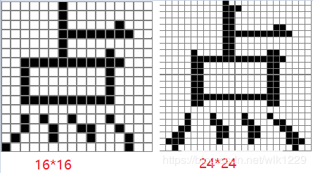
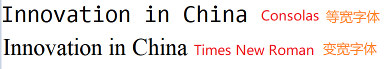
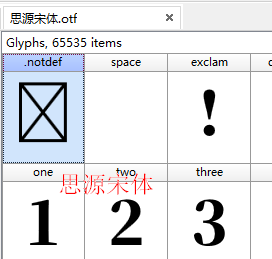
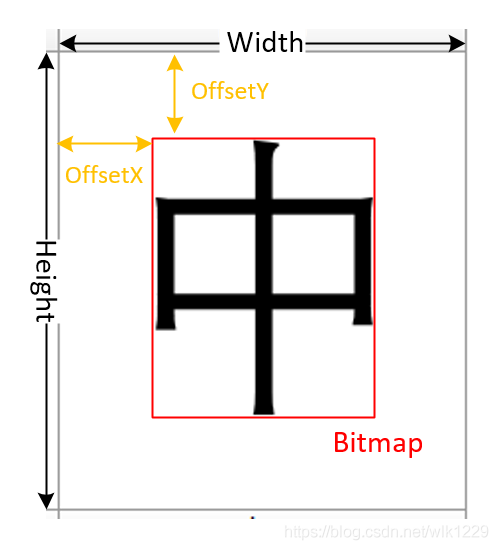
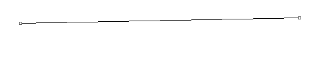
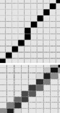
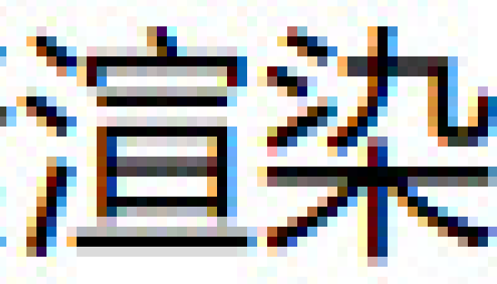

## 文字显示——字符与编码

尽管计算机的显示器上显示的文字，眼睛看到的是一个图形。但是对于计算机来说, 只能存储和处理二进制数据，处理图形符号并不容易，比方说，字母‘a’，计算机不能存储'a'这个形状，只能存一个数字97（字符a的ASCII码）。因此需要人为的制定一个映射关系，规定数字多少对应哪个字符，称为“编码”。关于“编码”的知识见“编码”这个目录下的笔记。

因为存储的是“编码”，当需要显示一个字符时，就需要有一张从编码到图形的映射表。这张表存储在字体文件中。常见的字体文件如 TTF、OTF 等。

> TTF（TrueTypeFont）是Apple公司和Microsoft公司共同推出的字体文件格式，随着windows的流行，已经变成最常用的一种字体文件表示方式。
>
> OpenType也叫Type 2字体，是由Microsoft和Adobe公司开发的另外一种字体格式。它也是一种轮廓字体，比TrueType更为强大，支持多个平台，支持很大的字符集, 可以说它是Type 1和TrueType的超集。OpenType标准还定义了OpenType文件名称的后缀名。包含TrueType字体的OpenType文件后缀名为.ttf，包含PostScript字体的文件后缀名为.OTF。

## 字体

根据字符从字体文件中取出对应的图片信息，而后显示。一个字符的显示形状不一定是固定的，比如中文有行书、楷体、宋体等。有的飘逸、有的端庄，但都能认出来是同一个字。所以，要支持多种字体的话，就需要多个字体文件。我们显示文字时，如果指定了字体文件，就从这个字体文件中获得文字的图形。

windows系统，字体文件放在"C:\Windows\Fonts"。

安卓，放在“/system/fonts”。

如今字体基本都是按照Unicode编码进行字符映射的，字符也是按照Unicode编码顺序排列的。尽管如此，可是字体中一般不会包含全部的Unicode字符，例如英文字体只会包含英文字符，中文字体不会包含一些特殊语言（韩语，日语）的字符。

### 字体类型

**点阵字体与轮廓字体**  类似于位图(标量图)和矢量图。最先的字体是点阵字体，用一个点阵上的点来描述字体。下图，分别是16x16和24x24点阵表示“点”字:

点阵字体很大的缺陷就是，对字体缩放会失真，特别是放大后能够明显看到一个个的点，显示效果很很差。

轮廓字解决字体不能缩放的问题，轮廓字体记录的是字体的轮廓，也就字体中每一笔的线条，由于记录的是线条，因此字体缩放时能够从新绘制线条计算字体图形，从而保证字体不会失真。

目前基本使用的都是轮廓字体。TrueType字体和Open Type字体都是轮廓字体。

### 等宽字体与变宽字体

等宽字体是在同一字号下ASCII字符的宽度都是同样，中文字符的宽度为两个英文字符的宽度，变宽字体在同一字号下字符宽度是不相等的。

变宽字体更适合阅读，符和人类的书写和阅读习惯；等宽字体很容易文字对齐，适合编程中代码的显示。

### **英文字体**

由于英文字符少，因此包含的字符不多，例如“Bell MT”字体只包含了243个字符。有些“英文字体”中包含了多种语言，例如”Arial“字体，其中包含了4503个字符，其没有包含中日韩语言，而是包含了许多其余语言和一些特殊符号的字符。

### **中文字体**

中文最先的编码是GB2312，GB2312中有6763个文字。有些中文字体只包含GB2312中的字符，这种字体通常包含七八千个字符，多出来的是英文字符和一些特殊符号。由于GB2312中不包含繁体文字编码，因此这种字体不支持繁体显示。

中文后面有了GBK编码，GBK中有23940个文字，如今不少中文字体都包含了GBK中的字符。包含GBK编码的中文字体字符个数在两万以上。由于GBK包含了简体和繁体文字，因此这种字体同时支持简体和繁体显示。虽然中文字体中包含的是GBK/GB2312中的字符，但文字是按照Unicode排列的。

### Google Noto字体

开源字体，能够无偿使用，该字体的目的在于用一种字体显示全部的语言。包含的字符比较多，通常都有六万多个，基本包含了Unicode第0平面的字符，经常使用的文字均可以显示。思源宋体就是Noto字体中的一种。

GitHub地址： https://github.com/googlefonts/noto-fonts

安卓里面就包含了Noto字体，可以显示世界各国的文字。见“/system/fonts”

## 字体中不存在的字符

字体中包含的字符是有限的，英文字体中可能不包含中文字符，中文字体中不包含日语等等。若是我用一个英文字体去显示中文时，由于字体中不包含中文，会发生什么状况呢？

**未定义字符**，字体文件中通常都包含了一个未定义字符，若是一个字符编码在字体文件中未定义，通常状况编码会映射到未定义字符。未定义字符为字体的第一个符号，编码为0，以下图展现了部分字体中的未定义字符：

## 编辑字体文件

软件FontCreator可以查看ttf中的每个字符，可以编辑。这是一个使用FontCreator的博客：https://blog.csdn.net/wlk1229/article/details/92424456。

## 编程中使用字体

在win32程序中可以通过函数CreateFont来使用字体。先安装字体到系统中，然后系统函数调用就行了。	在win32中还提供了一个函数GetTextExtentPoint32来获取字符串的宽度，因为在变宽字体中每个字符的宽度都可以不同，所以无法通过字符个数来计算字符串宽度。

其它平台（当然也包括windows），解析字体文件需要用到一个开源库[FreeType](https://www.freetype.org/)，通过这个库可以很容易的从字体文件中获取到字符的位图。比如安卓就用的FreeType。

FreeType是一个C语言的库，支持各个平台，其提供了CMake编译。使用也比较简单，这里给一个大致的步骤，详细的可以参考官方文档。
1. 调用FT_Init_FreeType初始化FreeType库
2. 调用FT_New_Face使用字体文件创建字体
3. 调用FT_Select_Charmap设置映射字符编码，默认字符编码是Unicode，通常不用设置，因为大部分字体只支持Unicode和一种Apple平台的老编码。
4. 调用FT_Set_Char_Size设置字符大小，设置字体大小时要设置字号和DPI，字号和平时用Word中字号类似，DPI是指显示设备像素密度，一般电脑显示器DPI在100左右，而手机在300左右，两者共同决定导出位图的大小。
5. 调用FT_Set_Transform设置字体的缩放旋转和排版位置。如果想自己控制排版位置，一般可以省略这个步骤。
6. 调用FT_Load_Char获取文字的位图信息，默认获取的是8位色深的位图，即每个字节代表一个像素。
7. 绘制位图就可以显示文字了。

参考链接：https://blog.csdn.net/wlk1229/article/details/92424456，作者提供了一个完整的demo：https://gitee.com/Kyle12/StudyProject/blob/master/FreeType/FreeTypeTest/SimpleGlyph/SimpleGlyph.cpp 。基于VS2017开发的。

### **文字边框和间距**

FreeType获取的位图是一张刚好包含文字的位图，不包含左右上下的空白信息。如果绘制文字时直接把每一张位图连接在一起，文字则会一个粘一个，正常显示的文字上下左右都会有一定的间距。

如上图外面的大矩形框是显示中字时需要的位置，内部红色框是FreeType获取的位图。为了正确显示文字，需要六个位置信息，图中的Height、Width、OffsetX、OffsetY以及位图的长宽。

这六个信息可以通过以下方式获得：
1. Height，当调用完FT_Set_Char_Size后，所有字符的高度都是一样的，在FT_Set_Char_Size设置文字大小后，可以通过fontFace->size->metrics.height/64获得，除以64说因为FreeType获取的字体高度单位的原因。
2. Width，当调用完FT_Load_Char后，可以通过fontFace->glyph->advance.x/64，也需要除以64。
3. OffsetX，当调用完FT_Load_Char后，为fontFace->glyph->metrics.horiBearingX/64。
4. OffsetY，当调用完FT_Load_Char后，为(fontFace->size->metrics.height + fontFace->size->metrics.descender - fontFace->glyph->metrics.horiBearingY)64。
5. Bitmap宽，当调用完FT_Load_Char后，为fontFace->glyph->bitmap.width。
6. Bitmap高，当调用完FT_Load_Char后，为fontFace->glyph->bitmap.rows。

## 平滑字体边缘

windows系统上面有一个字体平滑的功能，未开启字体平滑时，文字显示显示粗糙不清晰，如同点阵字体；开启后则饱满清晰，这个问题在低分辨率（PPI低）的屏幕下更加明显。

前面我们说过，点阵字体，通过一个个在矩阵中的点来描绘一个字体，放大会有锯齿。实际上显示器也相当于一个点阵，显示平行或者垂直的直线时，线段可以很直，但是显示斜线时就会出现锯齿，斜线看上去不直，如下图：

放大看：

原本是条直线，但是像素不是无限小的，所以某些地方必须要错开。

显示文字时，文字不是横平竖直，会有大量曲线，所以必然会遇到这种情况。当字比较小，像素比较低时，尤其明显。

目前来说字体平滑有两个技术，一个是**灰度渲染**，另一个是**次像素渲染**，灰度渲染平滑字体大部分手机操作系统中会使用，而次像素渲染一般用在PC电脑上。

灰度渲染技术是通过把一些像素填充为灰色，使直线看上去更平滑一点：

对于FreeType来说使用灰度平滑非常简单，因为像素可以通过RGBA表示，其中RGB为颜色，A为透明度，可以把RGB作为文字的颜色，而把FreeType获得的位图作为透明度A值，就可以实现灰度渲染平滑字体。

**次像素渲染**

win10上记事本文字截图，放大图片：

从图片中可以看到，文字放大以后边缘会出现彩色，实际上文字是黑色的，这是因为为了使得曲线更加平滑，系统会将曲线旁边的像素（次像素）设置成一个渐变色。

次像素渲染字体相比灰度渲染更加饱满一些，显示效果更好，但是会加重手机负担。次像素渲染主要是为PPI低的屏幕设计的，而现在的智能手机，PPI一般都在三四百以上，显示效果差不多。

## 相关开源库：

FreeType

官网：http://www.freetype.org/

源码下载：https://sourceforge.net/projects/freetype/files/freetype2/

FontForge：字体的开发工具

用于开发和编辑字体的开源工具，详见http://fontforge.sourceforge.net/

 文件结构的介绍及c的实现

http://www.codeproject.com/Articles/2293/Retrieving-font-name-from-TTF-file

字体编辑工具

FontCreator 