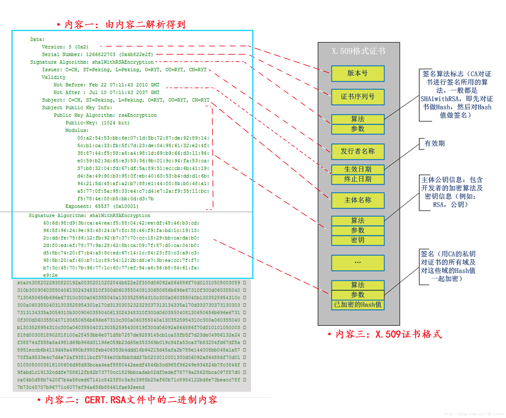

用安卓keystore生成证书，然后打印出来：

```java
public static KeyPair generateKeyPair() throws NoSuchAlgorithmException, NoSuchProviderException, InvalidAlgorithmParameterException, KeyStoreException {
        KeyPair keyPair = null;
        Calendar start = Calendar.getInstance();
        Calendar end = Calendar.getInstance();
        end.add(Calendar.YEAR, 60);
        KeyPairGenerator keyPairGenerator = KeyPairGenerator.getInstance("RSA", "AndroidKeyStore");
        keyPairGenerator.initialize(new KeyGenParameterSpec.Builder(alias, KeyProperties.PURPOSE_SIGN | KeyProperties.PURPOSE_ENCRYPT | KeyProperties.PURPOSE_DECRYPT)
                .setKeySize(2048)
                .setCertificateSubject(new X500Principal("CN=hsae"))
                .setUserAuthenticationRequired(false)
                .setDigests(KeyProperties.DIGEST_SHA256)
                .setCertificateNotBefore(start.getTime())
                .setCertificateNotAfter(end.getTime())
                .setSignaturePaddings(KeyProperties.SIGNATURE_PADDING_RSA_PKCS1)
                .setEncryptionPaddings(KeyProperties.ENCRYPTION_PADDING_RSA_PKCS1,KeyProperties.ENCRYPTION_PADDING_RSA_OAEP)
                .build());
        keyPair = keyPairGenerator.genKeyPair();

        return keyPair;
    }

public static String acquirePublic() throws KeyStoreException, CertificateException, IOException, NoSuchAlgorithmException, UnrecoverableEntryException {
        KeyStore keyStore = KeyStore.getInstance("AndroidKeyStore");
        keyStore.load(null);
        KeyStore.Entry entry = keyStore.getEntry(alias, null);
        if (entry instanceof KeyStore.PrivateKeyEntry)
        {
            KeyStore.PrivateKeyEntry privateEntry = (KeyStore.PrivateKeyEntry)entry;
            Certificate certificate = privateEntry.getCertificate();
            Log.d(TAG,"certificate:" + certificate.toString());//打印出证书
        }
        return "";
    }
```

toString那一行打印如下：

```
Certificate:
    Data:
        Version: 3 (0x2)
        Serial Number: 1 (0x1)
    Signature Algorithm: sha256WithRSAEncryption
        Issuer: CN=hsae
        Validity
            Not Before: Nov 17 03:51:58 2022 GMT
            Not After : Nov 17 03:51:58 2082 GMT
        Subject: CN=hsae
        Subject Public Key Info:
            Public Key Algorithm: rsaEncryption
                Public-Key: (2048 bit)
                Modulus:
                    00:d8:0a:16:60:56:86:92:d0:8f:d5:2d:53:14:9d:
                    b3:90:8c:f5:d5:eb:0f:06:9b:28:8c:85:b1:88:56:
                    6b:f2:e7:45:b2:5a:37:b9:45:b9:3b:aa:4f:62:d2:
                    32:ae:4a:9c:46:74:6d:fd:27:5c:91:ad:49:51:12:
                    d4:59:b6:9e:dd:07:d6:c9:45:5f:e4:9f:7a:dc:b8:
                    e6:1d:58:3a:7c:b0:cc:ea:93:c7:ce:ba:fb:3d:6b:
                    42:de:d5:53:f1:61:fd:85:19:dc:19:b7:d1:2b:36:
                    19:86:f7:2f:47:3e:a9:ab:09:f1:84:37:24:1e:e6:
                    63:91:ec:f3:b9:30:b2:da:6c:b6:6e:c7:06:ca:d6:
                    a9:b7:08:25:50:58:60:4f:8f:61:b5:1f:29:13:8a:
                    0d:64:2c:a2:4a:3e:52:bf:7c:55:a4:8c:82:83:31:
                    e7:8b:17:22:3e:3c:e0:27:a9:fd:87:0d:c2:b1:af:
                    d5:42:94:1e:3d:c0:8e:56:e6:aa:4f:4e:41:9a:05:
                    ad:19:07:72:84:cc:6f:23:97:8d:35:0c:2e:47:3d:
                    92:5b:76:22:78:f3:31:80:f6:e8:78:0c:35:78:0e:
                    db:55:0b:ce:e8:22:f8:eb:0b:b7:e7:72:a5:e5:4a:
                    62:1f:56:f8:e3:b3:23:75:a4:96:e6:bb:01:6c:e8:
                    ae:c3
                Exponent: 65537 (0x10001)
    Signature Algorithm: sha256WithRSAEncryption
         a6:31:f4:70:8c:5e:2e:88:4b:60:47:d6:df:97:c6:ee:59:24:
         b2:53:08:1e:e6:3e:b0:c1:0a:4d:6c:8b:20:c1:4f:6c:a9:fe:
         48:78:4f:14:04:4a:e5:bc:35:a9:83:fc:01:d9:66:4e:32:f1:
         b3:63:8d:dc:b4:46:f3:4a:1c:f7:c2:96:8d:95:01:9c:52:18:
         24:0c:90:54:0a:f5:48:bc:c8:b5:54:d5:17:32:1c:78:1c:92:
         9b:07:a0:14:fd:90:6f:01:25:4d:e8:65:61:a1:9b:4a:13:fa:
         af:90:ec:32:65:b9:a6:64:bf:62:a5:1e:aa:e3:c3:3c:37:87:
         e5:d1:5a:0a:32:29:5f:4c:e7:1f:be:f0:eb:17:45:8e:35:69:
         f6:ed:08:4e:5b:29:b1:8b:4e:ae:18:27:9e:7a:42:73:42:85:
         b5:d5:12:cf:99:d0:47:78:85:aa:c2:6d:43:ce:58:5b:c3:d7:
         9d:13:e1:2a:8c:51:49:c1:24:53:9d:99:de:f4:04:43:6e:15:
         f1:db:11:7f:67:af:ee:b1:30:92:8a:1c:83:d5:7f:b9:85:3d:
         45:fa:2d:3f:c5:4f:d2:df:35:03:ed:6b:43:c9:99:12:8b:1d:
         00:a1:c2:5f:ce:aa:5b:89:9e:6e:9d:6e:d9:b1:c9:0d:f6:9e:
         fd:2e:fd:b2

```

下面给出各部分含义的解释，绿框内：



细心的人可能会注意到，Public Key下面的公钥，用16进制表示，长度是257，多了一个字节。因为前面多了个“00”。把这个00去掉，才是公钥。