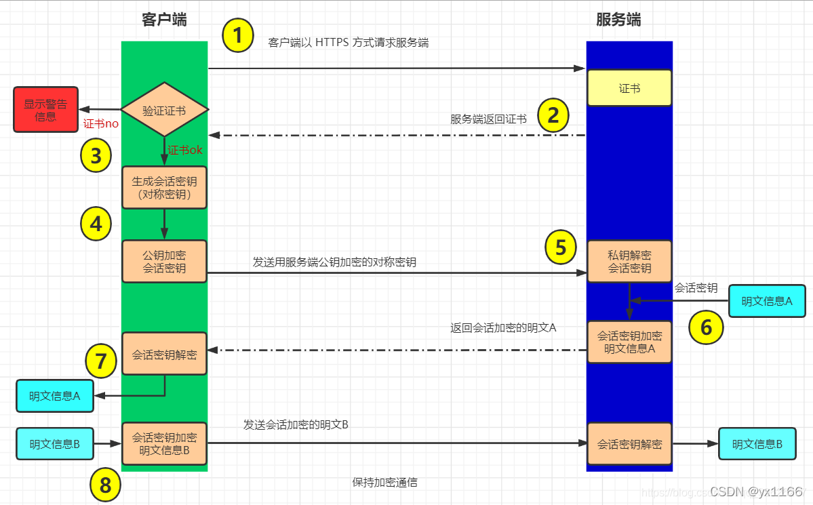

## 数字签名

1. 将一段报文发给其他人，有了保证接收方收到的数据和发送的一致，需要给出这段报文的摘要，连同摘要一起发过去。接收到报文后，计算一下摘要，和发过去的对比一下，如果一致，就表示收到的数据没问题。

   摘要算法有MD5、SHA256等，用哪个算法要么双方约定好，要么把算法名放到报文里一起发过去。

2. 如果在传输过程中，有人篡改了报文，然后计算出篡改后的数据的摘要，把传输的摘要值一起改了，发给接收者，那么接收方是感知不到的。

3. 所以我们需要对这个摘要做一个加密。发送方用私钥加密摘要信息，连同原报文一起发送给接收者。接收方用发送者的公钥（公钥是公开的）解密出摘要原文。接着再通过摘要算法校验原始报文。

4. 为什么这样就可以防止原始报文被篡改呢？假如攻击者篡改了报文，为了不被接收者感知，他需要计算出摘要，还需要对摘要进行加密。但是加密需要用到发送者的私钥，攻击者没有。攻击者只能用自己的私钥，如果他用自己的私钥，接收者收到后，用发送者的公钥是无法解密的，也就无法校验，于是就知道数据破坏了。

（公钥和私钥是匹配的，用公钥加密的数据，只能用私钥来解，反之，私钥加密的，只能用公钥来解。理论上，公钥确定了，那么私钥也就唯一确定了，但是人类目前的水平，无法根据公钥计算出私钥，所以除非你主动不暴露，否则没人知道你的私钥）

将该报文摘要值用发送者的私人密钥加密，产生的报文即称**数字签名**。用公钥解密签名称为**验证签名**。

只有持有私钥的用户可以生成签名，而由于公钥的公开性，所有用户都可以验证签名。

## 数字证书

前面介绍的方法仍然存在漏洞。接收者要用发送者的公钥来解密，但是接收者能保证他用的一定是发送者的公钥吗？假如攻击者偷偷把发送者的公钥换成了自己的公钥，那么他就能篡改原始报文，而接收者发现不了。

首先，接收者是怎么拿到发送者的公钥的。一种是线下方法，这种方式是比较安全的，攻击者要能访问接收者的电脑，才能偷偷替换公钥。

现实中，不可能总是线下提供公钥。世界上有上亿个网站，难道你每访问一个新的网站，就要通过线下途径去拿它的公钥吗？所以一般来说，公钥是两者交流数据时，发过来的。可以随着报文一起发过来，也可以在发送报文之前，先把公钥发过来。（一个例子是，访问https网站的握手流程，可以自行百度学习一下）

这样就产生了一个漏洞，攻击者一直在监听、截取你们的数据。在你接收公钥的时候，攻击者把公钥拦截，换成自己的公钥轻而易举。然后他就可以任意篡改数据了，而你根本不知道自己收的是攻击者的数据。

所以接收者必须保证，自己使用的确实是发送端的公钥。方法还是**数字签名**的那一套，即发送者对这个公钥也做一个签名，当然，是用另外一个私钥来签。验签时，用另外的那个私钥对应的公钥来验证签名。

为了描述方便，把发送者的公私钥称为publicKeyA、privateKeyA,  把用来的对publicKeyA进行签名的秘钥称为publicKeyB和privateKeyB 。

接收者只要能保证publicKeyB是正确的，就能用它来证明publicKeyA是正确的。

保证publicKeyA正确  ---------》(转换为)    保证publicKeyB正确。

貌似什么都没有改变，问题还是存在，你怎么保证publicKeyB不会在传输过程中被篡改呢？

是这样的。一个publicB可以对若干个key进行签名。假如你有1000个通信对象，那么原来，你需要预置1000个对象的公钥，现在，你让那1000个通信对象的公钥全部用privateKeyB签名，那么你就只需要预置一个publicKeyB。

现实中是这么做的。全世界存在一些**权威机构——CA（Certificate Authority）**, 大家都相信这个权威机构不会泄露它的私钥。当然，CA会公开它的公钥。

然后，我把我的公钥提供给CA， CA 会把我的公钥、用途、颁发者、有效时间等信息打成一个包，然后对这些信息进行 Hash 计算，得到一个 Hash 值；然后 CA 会使用自己的私钥将该 Hash 值加密，生成 Certificate Signature，也就是 CA 对证书做了签名；最后CA将 Certificate Signature 、Hash值、公钥、其它信息等一起打包，形成一个文件发给我,这个文件就是**数字证书**。

所以数字证书中，一定至少包含我的公钥、我的公钥的签名、对我的公钥进行签名的颁发机构是谁。如果没有颁发证书的机构(或者自己给自己颁发)，那么这个证书就是根证书，是信任链的起点。

简言之，**数字证书**是一个可以证明我的身份的东西，它由权威机构颁发，别人可以通过权威机构的公钥来验证我的身份，保证拿到的一定是我的、未被篡改的公钥（和其它附加信息）。

全球主流的CA机构有Comodo、Symantec、GeoTrust、DigiCert、Thawte、GlobalSign、RapidSSL等，其中Symantec、GeoTrust都是DigiCert机构的子公司，目前市场上主流的ssl证书品牌是Comodo证书、Symantec证书、GeoTrust证书、Thawte证书和RapidSSL证书，还有一些不知名的证书机构也是可以颁发数字证书的。

有的时候，你不需要全球主流的那几个CA机构给你颁发，而是第三方机构C来颁发证书。但是机构C是由那几个CA中心颁发的。这种情况(而且现实大部分都是这种情况)，检验过程是这样的：

1. 客户端拿到我的证书
2. 客户端解析我的证书，得知我的证书是由C颁发的
3. 客户端查看自己内部有没有内置C的公钥，如果没有，根据证书里的信息，获取C的证书，继续解析C的证书，发现C是由D签发的。
4. 客户端发现自己内置了D的公钥，于是用D的公钥解密C的签名，从而证明C的好的。
5. 解签后，拿到C的公钥，用C的公钥来验证我的证书。
6. 我的证书是好的，可以信任。

这个过程中，C称为中间证书，D是根证书。这个层级关系，称为**证书链**。最开始客户端只信任根证书，然后通根证书信任中间证书，最后通过中间证书信任我的证书。

一般企业的内网，是不会经过CA认证的，那么这种网站，浏览器打开会提示“您的连接不是私密连接”。解决这个问题，需要企业自己制作证书，让每个员工安装到自己的电脑上。

附一个浏览器https的工作流程

这里的第三步校验证书，即我们前文所述的证书链校验过程。

整个https的流程，妙在传输数据使用的是对称加密，但是对称加密的秘钥，不会明文传输、要用服务器的私钥来解。这样就保证只有两个端点知道对称加密的密码。

为什么用对称加密？一来，非对称加密算法效率非常低；二来，传输的数据用非对称加密的话，https需要双向认证。