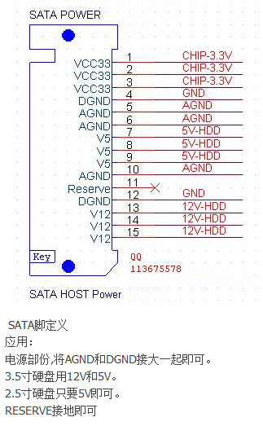

机械硬盘的接口：SATA、PATA以及IDE接口

并口硬盘叫做并行ATA硬盘,很久之前用的，采用的是一根四芯的[电源线](https://baike.baidu.com/item/电源线/8462701)和一根80芯的数据线与主板相连接，把数据并列传输和成列（串）传输。传输速率由于受到并行传输的限制，传输率较低。

SATA：像这样下图的接口就叫做SATA接口，最大的金属部分为电源接口，最小的则为数据接口，即跟主板连接：

PATA：如下图所示的那样子，针数最大的为数据口，其中的隔离开的两针为电源口：

IDE：IDE接口就是PATA接口，不过IDE不仅指接口形式，主要还指硬盘的形式，即IDE硬盘，但人们习惯用IDE来统称PATA接口类的硬盘。而PATA接口单纯指硬盘的接口形式，即“并行接口”，与之对应的是SATA（串行接口）。

其实PATA接口（并行接口）与SATA（串行接口）的硬盘的严格上说都是IDE硬盘，只是人们习惯上用  IDE←→SATA  或者  PATA←→SATA  来对比区分而已。如果说“PATA接口的IDE硬盘”或者“SATA接口的IDE硬盘”，那就准确了，不过太麻烦了。

SAS接口硬盘的一般用在服务器上面，传输速度快，可靠性强所以大部分的服务器都比较青睐SAS接口的硬盘。在物理层，SAS接口和SATA接口完全兼容，SATA硬盘可以直接使用在SAS的环境中，从接口标准上而言，SATA是SAS的一个子标准，因此SAS控制器可以直接操控SATA硬盘，反之不行。

IDE转SATA线如下，先把IDE一头接入到硬盘上，然后电源跟电脑电源线相连，然后把SATA则接入主板上面：

多功能的转接口，如下图所示，因为IDE已经淘汰了市面上都IDE转为SATA口的，因此购买后看说明书即可完成连接的。连接过程极为简单都是傻瓜式的：

现在的机械硬盘都是SATA3,接口如下图：

数据线为7pin，电源线为15pin。

供电接口15针定义如下：

三针一组，1、2、3是3.3V供电，5、6、10是AGND(模拟地)。7、8、9是5V供电，13、14、15是12V的电压供给。4、11、12是接地。理论上每一组的三根针只要接一根，一共接5根或4根，但是 稍微动一下可能就中断供电了，为避免每个触点电平电压不稳定或供给出问题，应该都接上。

*  **3.5英寸SATA台式机硬盘:**  阵脚1，2，3（即3.3V）是空脚，也就是可以不接。4、5、6脚接地1；7、8、9脚通+5V；10、11、12脚接地2；13、14、15脚接+12V
* **2.5英寸SATA笔记本硬盘**: 1、2、3空脚未定义；13、14、15脚悬空

也就是2.5英寸的硬盘，需要接5V；3.5英寸的硬盘，5V和12V都要接。如果3.5英寸的硬盘只接5V,那么会供电不足。3.3V的闲置用不到。

这样一来，3.3V的闲置，只用到12V、5V，加上有两组是接地，一共是4组，正好对应D口4pin。

**D型口:**

台式机主板上面，给硬盘和光驱供电的电源接口为D型口，由4芯组成；其中，红线所对应的+5V电压输入，黄线对应输出的是+12V电压，两条黑线为接地；5芯SATA电源线多了一组＋3.3V，可以减少硬盘内部供电二次转换时带来的损耗，减少发热量，让硬盘持续供电更加稳定。设计成D型,主要是防止你插反了。

硬盘和主板接线图：

