## Type C 接口特点
type a和type c定义的是两种接口形状，而不是协议。

Type C 是一组对称的连接器，在使用的过程中不需要如同使用 USBA，MinUSB，MicroUSB 那样来辨别接口方向。其次能够承受较高的功率所以可以支持高达 100W 的功率，所以使用该接口可以更好的支持快速充电，以及支持更高的数据吞吐量，普通规格也达到 10 Gb/s 的数据带宽，可用于高清视频的传输。对于同时满足以上的要求 USBA，MinUSB，MicroUSB 接口无法达到的。

## USB

为了能理解本文的术语，有必要先介绍USB。

### 传输标准

首先是混乱的命名：

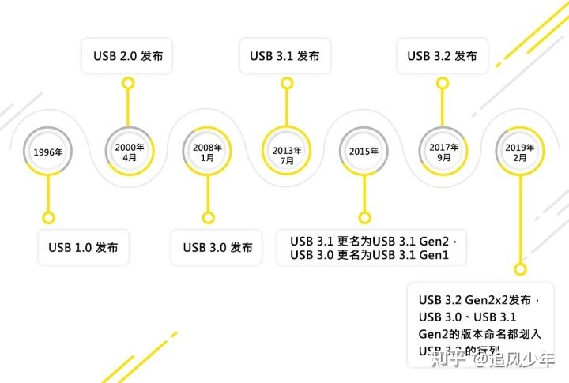

在经历了2019年的第三次改名之后，最终现在的命名是这样的，可以看下面这张图示：

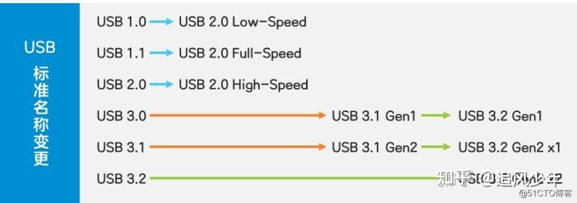

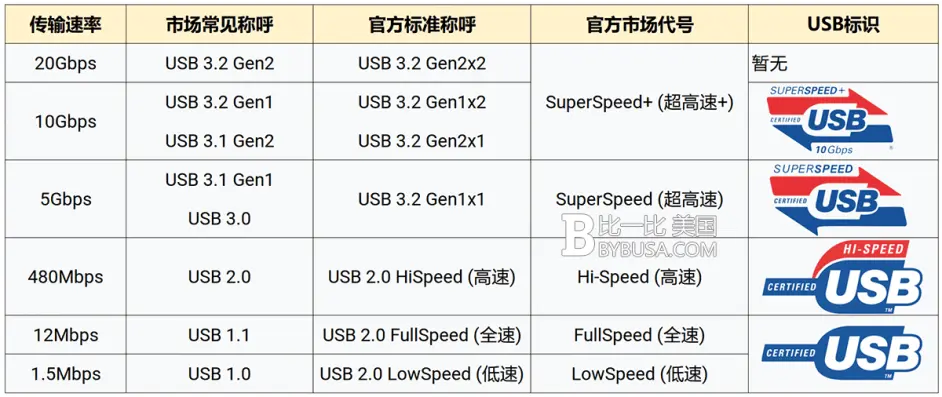

### USB接口类型

#### 标准USB接口

又分为Type-A和Type-B两种，样貌如下：

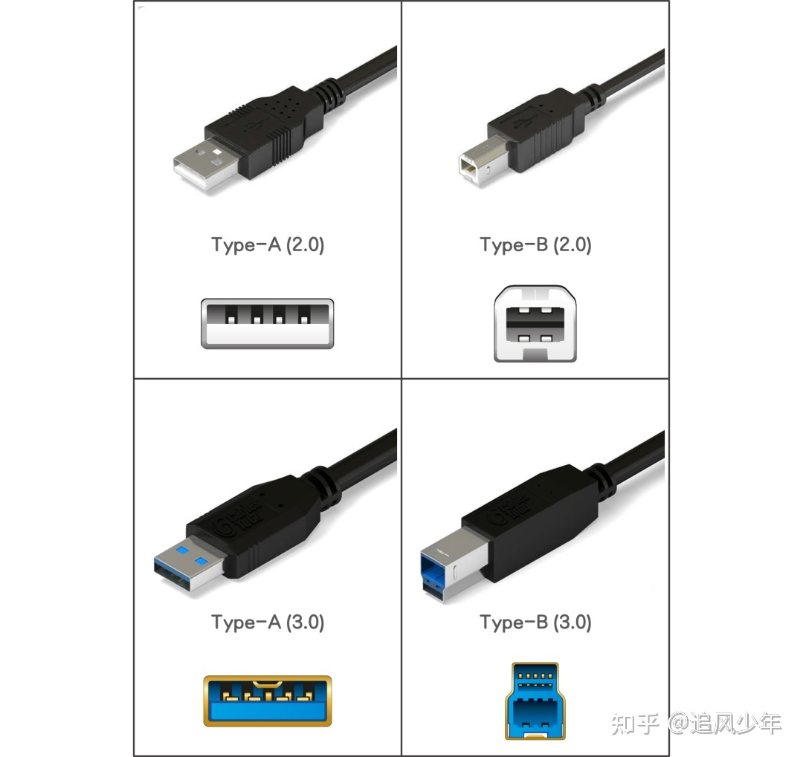

其中Type-A和Type-B根据支持的USB标准不同，又可以分为USB 2.0和USB 3.0标准USB接口。根据接口的颜色，我们很容易区分该接口是支持USB 2.0还是支持USB 3.0的。Type-A型接口也是我们日常生活中最常见的USB接口，广泛应用于鼠标、键盘、U盘等设备上，Type-B型则常用于打印机、特殊显示器等设备上。

#### Mini USB接口

Mini USB接口，是一种小型的USB接口，其指标与标准USB相同，但是加入了ID针脚（用于区分设备是主机还是外设），以支持OTG（On The Go，该功能允许在没有主机的情况下，实现设备间的数据传送）功能。Mini USB接口主要分为Mini-A和Mini-B两种，样貌如下：

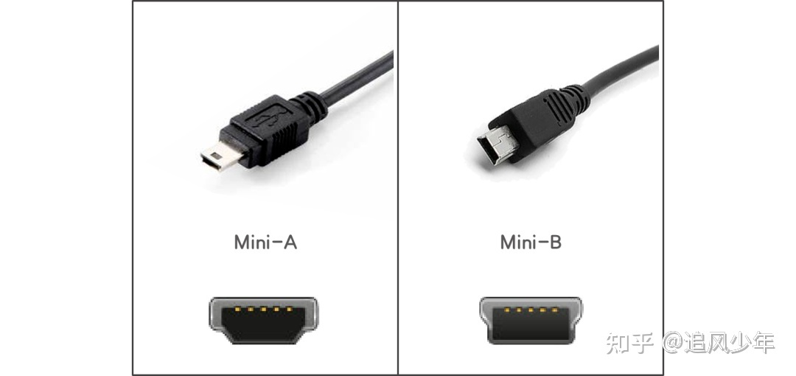

Mini USB接口由于相对较小的体型，常见于一些小型设备上，比如MP3、MP4、收音机等，某些型号的手机也采用了该接口。

#### Micro USB接口

Micro USB接口，属于Mini USB的下一代规格接口，Micro USB接口的插头采用了不锈钢材料，插拔寿命提高为10000次，相比Mini USB接口，在宽度几乎不变的情况下，高度减半，更为小巧。Micro USB接口也可分为Micro-A和Micro-B两种，样貌如下：

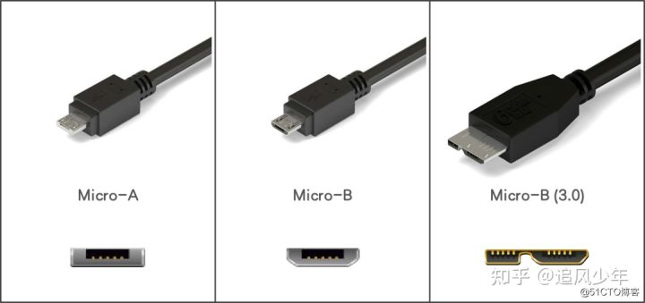

Micro-B类型的USB接口，相信大家都认识，只是不知道它的专业名称，在智能手机发展的前期，绝大多数的智能手机（苹果手机除外）都采用了Micro-B型接口作为充电和数据接口。**在USB 3.0标准发布后，Micro-B接口也有了新的造型**，相信大家也不陌生，我们购买的支持USB 3.0的移动硬盘盒大部分就采用了该接口。

#### Type-C接口

Type-C接口，是近几年出现的新型接口。Type-C可以用来支持USB协议，但是Type-C的强大，不仅仅限于USB。

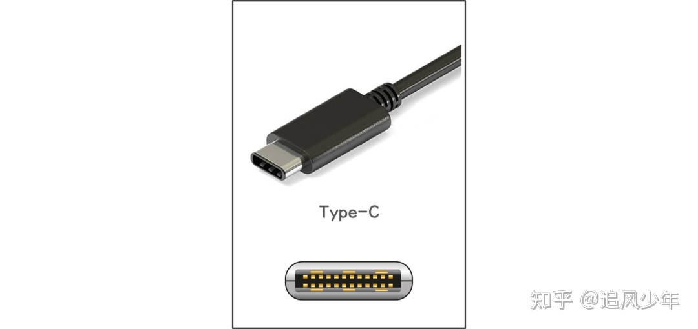

最新的USB4标准目前仅支持Type-C接口，同时USB4采用了Thunderbolt协议（俗称雷电接口协议，是由Intel主导开发的接口协议，具有速度快，供电强，可同时兼容雷电、USB、Display Port、PCIe等多种接口/协议的特点），因此，支持USB4标准的Type-C接口也是可以兼容雷电接口的。如此看来，Type-C接口已是大势所趋了。

### USB传输标准与接口之间的支持关系

一张图总结一下USB传输标准与接口之间的支持关系：

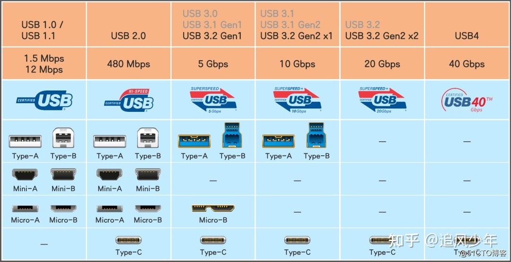

上图我们看到Type-A不支持USB 3.2 Gen2x2（USB 3.2 Gen2x2使用两个通道，USB-A只有一个通道，无法支持）。所以，那种一端是Type-A一端是Type-C的数据线，显然最多只能支持到USB3.2 Gen2 x1。

本文重点介绍Type-C。

## TYPE C 相关的专业名词

**DFP(Downstream Facing Port)**: 下行端口，可以理解为Host，DFP提供VBUS，也可以提供数据。典型的DFP设备是电源适配器，因为它永远都只是提供电源。

**UFP(Upstream Facing Port)**: 上行端口，可以理解为Device，UFP从VBUS中取电，并可提供数据。典型设备是U盘，移动硬盘，因为它们永远都是被读取数据和从VBUS取电，当然不排除未来可能出现可以作为主机的U盘。

**DRP(Dual Role Port)**: 双角色端口，DRP既可以做DFP(Host)，也可以做UFP(Device)，也可以在DFP与UFP间动态切换。典型的DRP设备是电脑(电脑可以作为USB的主机，也可以作为被充电的设备（苹果新推出的MAC Book Air）)，具OTG功能的手机(手机可以作为被充电和被读数据的设备，也可以作为主机为其他设备提供电源或者读取U盘数据)，移动电源(放电和充电可通过一个USB Type-C，即此口可以放电也可以充电)。

**CC（Configuration Channel）**：配置通道，这是USB Type-C里新增的关键通道，它的作用有检测USB连接，检测正反插，USB设备间数据与VBUS的连接建立与管理等。

**USB PD(USB Power Delivery)**: PD是一种通信协议，它是一种新的电源和通讯连接方式，它允许USB设备间传输最高至100W（20V/5A）的功率，同时它可以改变端口的属性，也可以使端口在DFP与UFP之间切换，它还可以与电缆通信，获取电缆的属性。

**Electronically Marked Cable**: 封装有E-Marker芯片的USB Type-C有源电缆，DFP和UFP利用PD协议可以读取该电缆的属性：电源传输能力，数据传输能力，ID等信息。所有全功能的Type-C电缆都应该封装有E-Marker，但USB2.0 Type-C电缆可以不封装E-Marker。

## Type C接口的应用

Type-C接口的一个特点——「**All in One**」, 可以传输DP，USB，PCIE，音频等信号。在Type-C上可以实现的数据协议有：

USB2.0：480Mbps，四根线

USB3.0（USB3.1 Gen1，USB3.2 Gen1）：5Gbps

USB3.1（USB3.1 Gen2，USB3.2 Gen2 x1）：10Gbps，这两个都是9根线，硬件完全兼容，最容易混淆，电脑厂商经常缩水，虽然是Type-C但采用Gen1的协议。

USB3.2（USB3.2 Gen2 x2）：20Gbps

USB4.0：40Gbps，2019年9月3日正式公布,物理接口只有 USB Type-C 一种，向下兼容 USB 3.2 / USB 2.0 和 Thunderbolt 3

雷电3（Thunderbolt3、）：40Gbps，24根线，苹果等高端笔记本才会有，传输功率15W～100W。

雷电4：雷电4接口主要改进了兼容性、可靠性及安全性，提升了连接能力，可以说是对雷电3接口的一次补充。

DisplayPort：视频支持4K/60Hz，三星S9、小米等旗舰手机支持，可以直接转接到显示器。

Type-C支持的充电协议与接口无关，如果是连笔记本电脑采用PD协议充电，要买专门的电缆，如Surface原装电缆。

需强调一下，不支持USB1.0。上面那张USB传输标准与接口之间的支持关系图可以清晰地看到。

**具体到我们看到的产品，产品类型有：**

* USB TYPE C转USB2.0数据线充电线
* USB TYPE C转USB2.0A F(母)数据线
* USB TYPE C转mini USB数据线充电线
* USB TYPE C转USB2.0 B数据线
* 同上，转USB3.0/3.1/3.2/4.0等
* USB TYPE C to USB TYPE C
* USB TYPE C转DHMI

购买时，要清楚自己的需求，看清楚产品支持3.1还是仅支持2.0，支持不支持快充。

Type-C接口外形都是一样的，但是有些支持快充有些支持视频输出，以数据传输为例，USB Type-C可选USB2.0、USB3.0（USB3.1 Gen1，USB3.2 Gen1）、USB3.1 Gen2（USB3.2 Gen2）、USB3.2 Gen2×2（USB4 20）和USB4（雷电3/4）等多档速度标准；以充电为例，USB Type-C线缆虽然都原生支持20V电压，但所支持的电流却存在3A和5A之别。同理，USB Type-C线缆的视频传输能力也是可选项目。

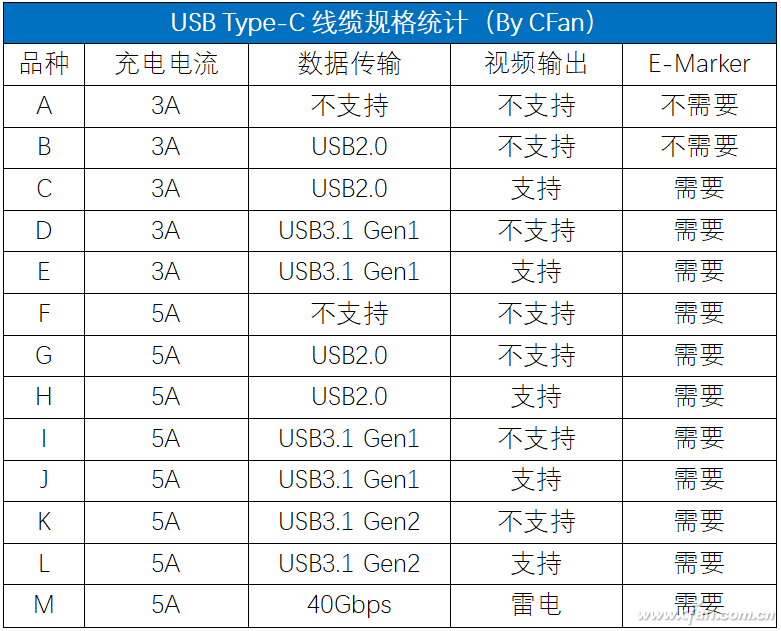

粗略的统计了一下，按照不同功能等级搭配出来的USB Type-C线缆就有13种之多，其中仅支持3A电流不支持数据传输和视频输出的线缆成本最低，我们可以将其理解为“乞丐版”），支持雷电的线缆规格最高售价最贵，而它也是所有USB Type-C线缆中的“皇帝”。

由此可见，USB Type-C是一种非常乱的线缆，其它的数据线一看就知道支持哪些功能，而type-c数据线，从外貌根本看不出来，可能只能用来充电，也可能能够接显示器。

可见Type-C接口只是一种物理接口外形，里面的结构是可能有物理上的差异的，并不是实现了全部引脚就支持全部功能。Type-C并不是纯的线缆+简单元器件，有些线里面是带芯片的。

上表的数据，从C~M规格的线缆都需要一颗名为“E-Marker”的芯片，那E-Marker到底是什么？

## E-Marker

规范Type-C的功能和电气性能，USB-IF设定了一个硬件门槛：1、想支持5A大电流；2、想支持USB3.0或更高的传输速度；3、想支持视频输出功能，都需要E-Marker芯片的加持。

E-Marker的全称为“Electronically Marked Cable”，我们可以将其理解为USB Type-C线缆的电子身份标签，通过这颗芯片可以读取该线缆的各种属性，包括电源传输能力、数据传输能力、视频传输能力和ID等信息。基于此，输出端（如充电头、笔记本）才能根据输出端连接的设备（如手机或显示器）调整匹配的电压/电流或音视频信号。

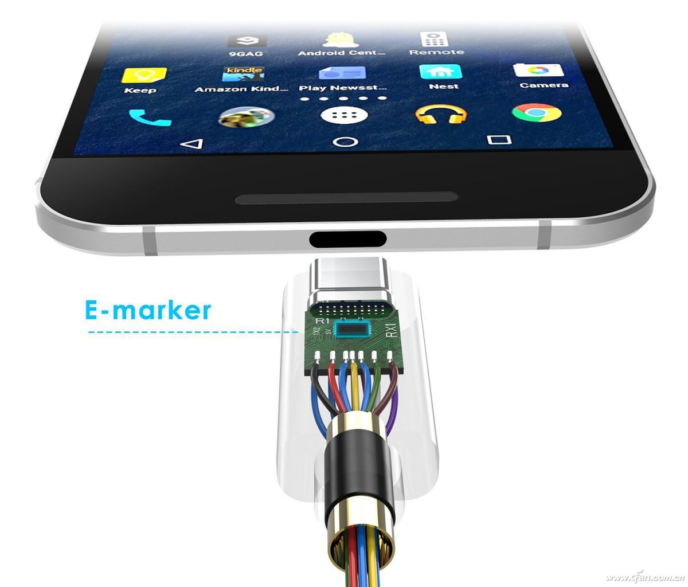

表中的品种A、B线缆之所以不需要E-Marker，是因为它们仅需要通过3A电流，无需考虑视频输出能力，USB2.0的传输速度对线缆也没有特别的要求。而C~M规格都绕不开1~3中的至少一项，所以都需要搭配E-Marker芯片用于输入/输出端设备的识别。

需要注意的是，E-Marker芯片自身也存在档次之别。有些仅支持视频输出、有些仅支持USB 3.1 Gen1或USB3.1 Gen2、还有些仅支持5A电流传输，这类仅支持一项特殊功能的E-Marker芯片都属于较低端的存在。中高端E-Marker芯片则拥有更高的集成度，可以支持1~3中的任意2项或全部功能，而支持所有特殊功能的线缆又可以称为“全功能型”。也就是说，全功能的Type-C接口，除了可以正反盲插，还支持诸如高速数据传输、PD快充、视频输出的功能。

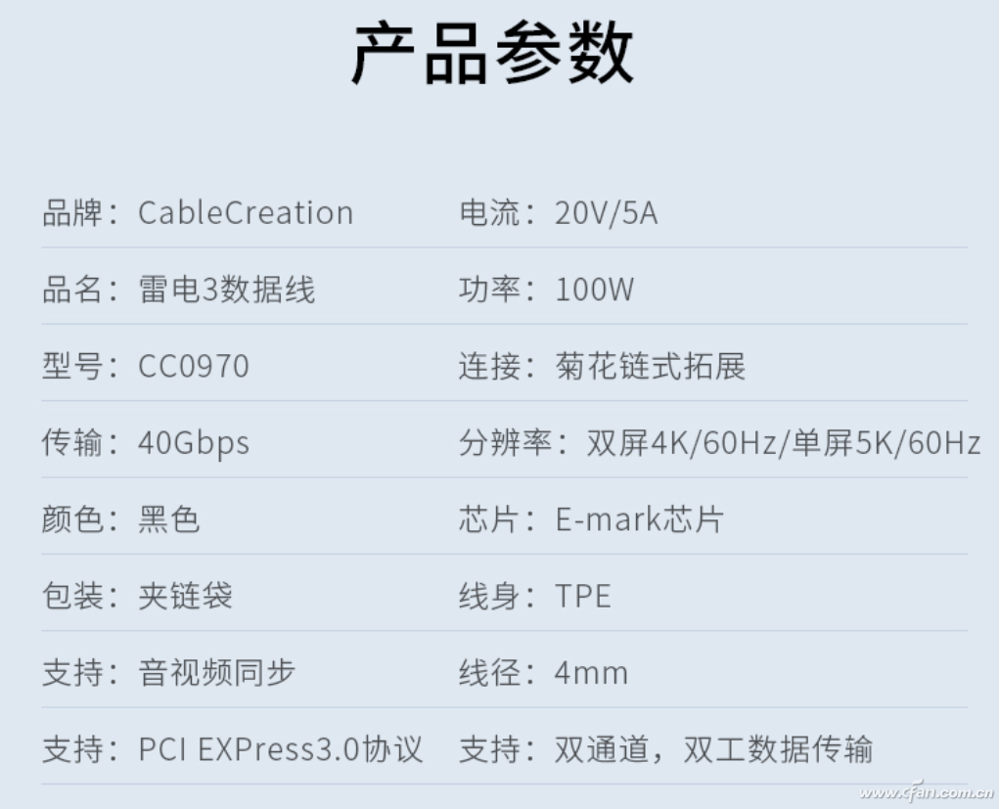

但正如前文所述，数据传输速度存在5Gbps、10Gbps、20Gbps和40Gbps，视频输出也有支持单4K@60Hz以及双4K@60Hz或8K@60Hz（雷电），因此全功能型的USB Type-C线缆也有强弱之分，规格越高价格自然也就越贵。

虽然USB Type-C to USB Type-C线缆前后共有2个接口，一般情况下只需在其中1个接口内嵌入E-Marker芯片即可，但也有极少数线缆会在两头接口上配备2颗E-Marker芯片，双芯片的好处是能让充电器读取芯片的成功率更高，保证稳定的大功率传输，当线缆长度达到2米或者更长时性能更好。

## Type C 接口引脚定义

USB Type C 母口

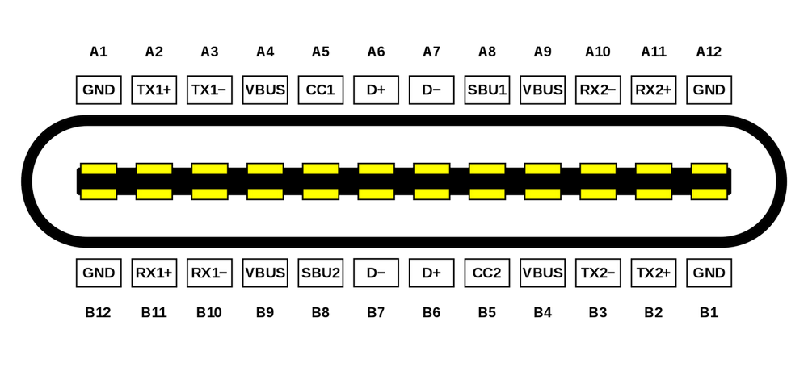

USB Type C 公头

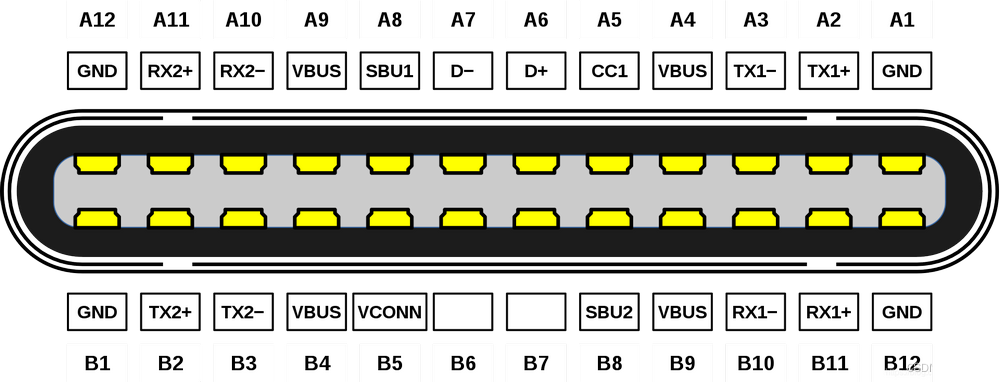

从上图的 Type C 公头和母口的引脚排列可以知道 Type C 的引脚功能是对称的,A1对B1，A2对B2，所以公头无论以什么方向接入母口，两者的功能引脚都可以完美对接。

***具体引脚，及其详细描述查看如下表格***

| Pin  | 名称     | 功能描述                         | Pin  | 名称     | 功能描述                         |
| ---- | -------- | -------------------------------- | ---- | -------- | -------------------------------- |
| A1   | `GND`    | 接地                             | B12  | `GND`    | 接地                             |
| A2   | `SSTXp1` | SuperSpeed 差分信号`#1`，TX，正  | B11  | `SSRXp1` | SuperSpeed 差分信号`#1`，RX，正  |
| A3   | `SSTXn1` | SuperSpeed 差分信号`#1`，TX，负  | B10  | `SSRXn1` | SuperSpeed 差分信号`#1`，RX，负  |
| A4   | `VBUS`   | 总线电源                         | B9   | `VBUS`   | 总线电源                         |
| A5   | `CC1`    | Configuration channel            | B8   | `SBU2`   | Sideband use (SBU)               |
| A6   | `Dp1`    | USB 2.0 差分信号，position 1，正 | B7   | `Dn2`    | USB 2.0 差分信号，position 2，负 |
| A7   | `Dn1`    | USB 2.0 差分信号，position 1，负 | B6   | `Dp2`    | USB 2.0 差分信号，position 2，正 |
| A8   | `SBU1`   | Sideband use (SBU)               | B5   | `CC2`    | Configuration channel            |
| A9   | `VBUS`   | 总线电源                         | B4   | `VBUS`   | 总线电源                         |
| A10  | `SSRXn2` | SuperSpeed 差分信号`#2`，RX，负  | B3   | `SSTXn2` | SuperSpeed 差分信号`#2`，TX，负  |
| A11  | `SSRXp2` | SuperSpeed 差分信号`#2`，RX，正  | B2   | `SSTXp2` | SuperSpeed 差分信号`#2`，TX，正  |
| A12  | `GND`    | 接地                             | B1   | `GND`    | 接地                             |

***TypeC 引脚分组详细功能***

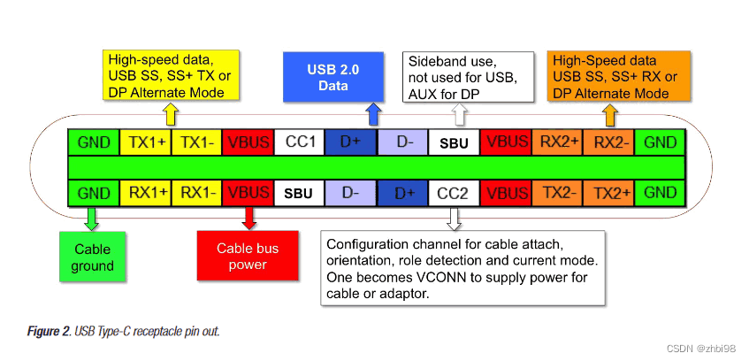

## Type C 接口 CC1/2 作用

最早快充协议属于高通发布的 QC 充电协议该协议通过提高充电适配器的输出电压从而提高充电功率。既让是协议就需要与适配器进行协议通信，让适配器调整输出电压，在 QC 协议中通信使用的是 USB2.0 的 DP 和 DM 引脚，这样带来的问题是充电的时对 USB 通信造成影响。为了解决这个问题 PD 快充协议对电源设备的识别通过 CC1 和 CC2 引脚来进行，从而避免了 QC 协议中 对 DP 和 DM 引脚的占用。使得 PD 协议快充在充电的同时，数据传输也可以稳定进行。

**注意**： 由于支持 PD 快充协议的适配器的电源输出受 CC1 和 CC2 引脚协议控制，所以对于在设计没有 PD 协议芯片的电子产品来说如果想从支持 USB-PD 快充协议的适配器中获取电源，则需要在 CC1 和 CC2 引脚连接 Ra/Rd 下拉电阻，如果悬空可能无法让适配器输出电源（**这一点是需要格外注意的**）。
如果在无 PD 快充协议的适配中（比如电脑 USB 接口，充电宝或普通电源适配中）则可以任意或悬空。

## Type-C 版本

理论上，按照规范，Type-C接口需要实现全部24个引脚，但是现实中，为了节约成本，按功能需求进行划分从而拥有多个版本。比如很多时候，不需要使用音视频传输，只需要使用 USB2.0，此时使用 24 片引脚的全功能版本 Type-C 就显得浪费。

全功能 Type-C，共有24 个功能引脚（并且带有E-Marker芯片） ，该版本可以支持 USB3.0、USB2.0、协议，音视频传输，快速充电协议等等。

* 全功能 USB3.0/3.1/3.2/雷电、USB2.0、音视频传输、快速充电协议，24P Type C，目前我们交流说的 Type C 默认指的就是 24P 全功能 Type C。

* 仅支持 USB2.0，16P/12P Type C，16Pin 和 12Pin 实际属于同一种接口。

* 仅支持充电，6P Type C。

所以对于 Type C 共有以上四个版本，实际使用因该是三个版本，在电路设计时按照自己实际需要实现的 USB 通信类型进行选择相应的 Type C 接口。

## 16P 与 12P Type C 接口定义

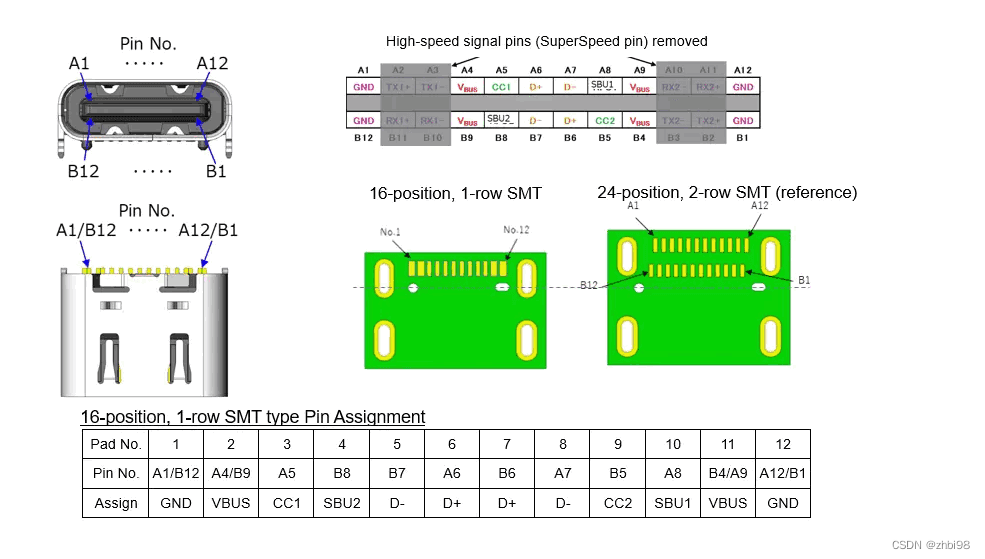

从上图可知 16Pin Type C 在 24Pin 全功能版本的基础上移除了 USB3.0 的 TX1/2、RX1/2 引脚，保留了 SBU1/2、CC1/2、USB2.0 的 D+ 和 D- 引脚，除了不支持 USB3.0/3.1 高速传输外，其他没有任何的差别，同样可以支持 PD 快充、音频传输、HDMI 传输、调试模式等其他功能。

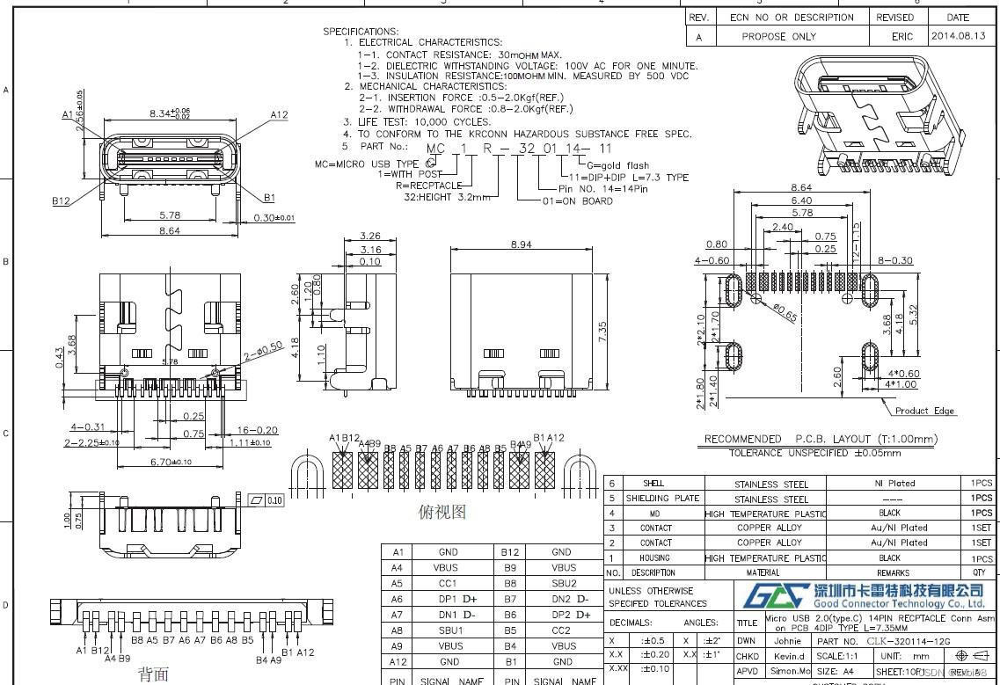

从上图的 俯视图 上可以看到 16 Pin Type C 实际上仅有12 Pin，这是因为 16 Pin 接口在设计时将 Type C 母口两端的两个 Vbus 和 GND 引脚两两相互靠近，注意仅仅是相互靠近并不是共用引脚所以接口实际还是存在 16 Pin，但对于其封装只要 12 Pin，其中相互靠近的引脚共用一个封装引脚，具体可以看下图的实物图：

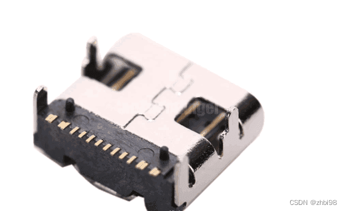

所以 16Pin 和 12Pin Type C 本质是相同的，是可以共用贴片 PCB 封装的。

## 6P Type C 接口定义

对于仅需支持充电，那么 USB2.0 D+ 和 D- 引脚也可移除进一步节约接口制造成本。6Pin Type C 仅保留Vbus、GND、CC1、CC2 引脚。接口两侧同样对称分布 Vbus 和 GND ，CC1，CC2 引脚用于支持正反接入，以及快充协议的支持，具体可以看下图的实物图。

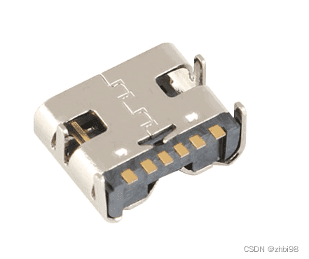

以上就是全功能 Type C 与精简版本 Type C 的引脚说明，通过这篇文章帮助需要设计 Type C 电路或想要了解 Type C 的人了解市面上或常用的 Type C 类型来更好的进行选型。

## 2022.10.21更新

USB又又又改名了。10月19日，USB-IF组织正式发布了全新的USB4 v2.0标准规范，带来了新一代USB 80Gbps接口，还有全新的命名体系。

USB接口将统一以传输带宽命名，USB4 v2.0对应USB 80Gbps，USB4对应USB 40Gbps，USB 3.2 Gen2x2对应20Gbps，USB 3.2 Gen2对应USB 10Gbps，USB 3.2 Gen1对应USB 5Gbps……

更古老的USB 2.0、USB 1.0保持不变。

## 参考

http://news.eeworld.com.cn/xfdz/2015/0323/article_40868.html