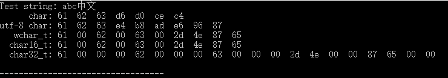
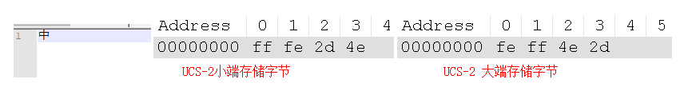
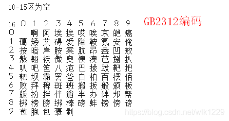
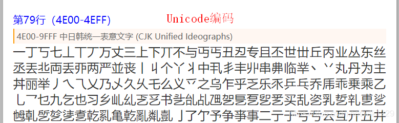

在C/C++中char为一个字节，最初是用于存储ASCII字符。但既然是字节流，，当然也可以存储中文字符和其它任意字符。对于中文字符需要两个char才能存储一个字符。因为char可存储多种编码的字符，所以我们必须明确知道字符char的编码类型，否则显示时容易出现乱码。

C++中除了char以外，还有wchar_t，char16_t，char32_t，各种字符类型对于的字符如下：

char可以表示ASCII，GBK，ISO-8859，UTF-8等等任何编码。

wchar_t用于表示Unicode，基本包括所有的常用字符，也就是Unicode第0平面中的字符。

char16_t用于表示UTF-16，大部分情况下与wchar_t相同。

char32_t 用于表示UTF-32

有些地方会提到UCS编码，UCS和Unicode编码完全一致，可以认为两者为同一个编码。UCS-2和UFT-16类似，UCS-4和UTF-32等价。

 

C++中可以通过在字符串前面添加一定的标识（字面量）来规定字符的编码，如L”abc”，代表wchar_t类型的字符串。以下是所有字符类型的字符串：

```c++
char cs[] = "abc中文";
char u8cs[] = u8"abc中文";
wchar_t wcs[] = L"abc中文";
char16_t u16cs[] = u"abc中文";
char32_t u32cs[] = U"abc中文";
```

字节值打印出来，得到以下结果：



*这个是在VS2015上运行的结果*。完整代码见文末。

 其中‘中’字的GBK编码是D6D0，Unicode编码是4E2D，UTF-8编码是E4B8AD

其中‘文’字的GBK编码是CEC4，Unicode编码是6587，UTF-8编码是E69687

从结果可以看到wchar_t，char16_t，char32_t中Unicode编码子节顺序是反的。这是因为采用小端存储，即底位字节在前面。

当然也有大端存储的方式，对于采用UTF-16/UCS-2编码的文本文件，文件开头会有两个BOM字节如果是FFFE则文件是采用小端存储，如果是FEFF文件则是采用大段存储。如下图，显示了一个只有‘中’字的文本文件的字节。



(*该图是通过Nodepad++的HexEdit插件显示的*)


## **windows控制台**

命令行窗口中输入chcp命令回车，可以查看当前命令行窗口的使用的编码表示符号。936指的就是GBK编码

```shell
F:\temp>chcp
活动代码页: 936
```

其它标识符见 https://www.qqxiuzi.cn/wz/zixun/1709.htm 这个网站。本文末尾附上。


## **C++控制显示的编码**

C++中的四种字符char、wchar_t、char16_t、char32_t，只有char、wchar_t可以直接输出到控制台，char使用cout输出，wchart_t通过wcout输出。

当char *s= “abc中文”时，s字符串的编码为系统默认的编码，也就是系统设置的默认编码；当char *s= u8”abc中文“时，s字符串的编码为UTF-8。wchar_t的字符串只能表示UTF-16/UCS-2编码。

C++中可以通过函数locale::global设置当前程序要输出到控制台使用的编码，这个函数只接受一个locale对象作为参数。以下是三种locale对象:

```c++
locale locC("C"); //默认编码 
locale locutf8 = locale("zh_cn.utf8");//UTF-8编码
locale locZH("zh"); //中文编码GBK

//使用
locale::global(locC);
cout << "LocC locale:\n";
cout << "str: " << str << endl;
cout << "u8str: " << u8str << endl;
wcout << L"wstr: " << wstr << endl;
wcout.clear();
cout.clear();
```

完整代码见文末demo。

## **控制台乱码**

一般有两种情况，1是当前程序输出的字符编码与控制台不符合。2是控制台当前编码中不包含程序的字符。

## 字符串排序

如果仔细查看GBK和Unicode的编码，可以发现GB2312(GBK)中汉族编码顺序是根据拼音来的，而Unicode编码顺序是按照偏旁部首来的。如下图：





 

在C++中字符串比较是通过比较字符的编码大小，因为GB2312和Unicode编码顺序不一致，这会导致两者的字符串排序结果也不一致。

## 编码转换

UTF-8与UCS-2之间的转换，因为两者转换有一定规律，所以转换也比较简单，C++11原生支持两者之间的转换，但C++17中弃用了。

UTF-8、UTF-16、UTF32之间的转换可以使用ConvertUTF库（[地址](https://www.cnblogs.com/MoreNotepad-plus-plus/articles/3155139.html)），这个库也很小，只有两个文件几百行代码。

Unicode与其他编码之间的转换：在win32平台中这种转换叫做宽字节与多字节之间的转换，可以通过系统函数WideCharToMultiByte/ MultiByteToWideChar完成。WideCharToMultiByte是Unicode的UTF-16与其他编码转换，MultiByteToWideChar则是相反的转换。  
对于其他平台可以通过libiconv库完成，[地址](http://www.gnu.org/software/libiconv/)，当然这个库也可以支持windows上使用，官网上没有提供VS平台的编译，github上有对于的编译版本，[地址](https://github.com/winlibs/libiconv)。


附录：

完整代码

```c++
//abc中文
#include <iostream>
#include <locale>
#include <clocale>
#include <string>
#include <chrono>
#include <sstream>
#include <iomanip>
#include <codecvt>

using namespace std;


int main()
{


	char cs[] = "abc中文";
	char u8cs[] = u8"abc中文";
	wchar_t wcs[] = L"abc中文";
	char16_t u16cs[] = u"abc中文";
	char32_t u32cs[] = U"abc中文";

	cout << "Test string: " << cs << endl;

	cout.setf(ios::hex, ios::basefield);
	unsigned char *ptr = nullptr;
	ptr = reinterpret_cast<unsigned char*>(cs);
	cout << setw(12) << "char: ";
	cout.fill('0');
	for (int i = 0; i < sizeof(cs) - sizeof(char); ++i)
	{
		cout << setw(2) << static_cast<int>(*(ptr + i)) << "  ";
	}
	cout << endl;

	ptr = reinterpret_cast<unsigned char*>(u8cs);
	cout << setfill(' ') << setw(12) << "utf-8 char: ";
	cout.fill('0');
	for (int i = 0; i < sizeof(u8cs) - sizeof(char); ++i)
	{
		cout << setw(2) << static_cast<int>(*(ptr + i)) << "  ";
	}
	cout << endl;

	ptr = reinterpret_cast<unsigned char*>(wcs);
	cout << setfill(' ') << setw(12) << "wchar_t: ";
	cout.fill('0');
	for (int i = 0; i < sizeof(wcs) - sizeof(wchar_t); ++i)
	{
		cout << setw(2) << static_cast<int>(*(ptr + i)) << "  ";
	}
	cout << endl;

	ptr = reinterpret_cast<unsigned char*>(u16cs);
	cout << setfill(' ') << setw(12) << "char16_t: ";
	cout.fill('0');
	for (int i = 0; i < sizeof(u16cs) - sizeof(char16_t); ++i)
	{
		cout << setw(2) << static_cast<int>(*(ptr + i)) << "  ";
	}
	cout << endl;

	ptr = reinterpret_cast<unsigned char*>(u32cs);
	cout << setfill(' ') << setw(12) << "char32_t: ";
	cout.fill('0');
	for (int i = 0; i < sizeof(u32cs) - sizeof(char32_t); ++i)
	{
		cout << setw(2) << static_cast<int>(*(ptr + i)) << "  ";
	}
	cout << endl;

	cout << "\n----------------------------------\n" << endl;


	//system("chcp 65001");
	//system("chcp 936");
	system("chcp");

	char *str = "abc中文";
	char *u8str = u8"abc中文";
	wchar_t *wstr = L"abc中文";

	locale locC("C"); //默认编码
	locale locutf8 = locale("zh_cn.utf8");
	locale locZH("zh"); 

	locale::global(locC);
	cout << "LocC locale:\n";
	cout << "str: " << str << endl;
	cout << "u8str: " << u8str << endl;
	wcout << L"wstr: " << wstr << endl;
	wcout.clear();
	cout.clear();
	cout << "\n" << endl;

	locale::global(locutf8); 
	cout << "UTF-8 locale:\n";
	cout << "str: " << str << endl;
	cout << "u8str: " << u8str << endl;
	wcout << L"wstr: " << wstr << endl;
	wcout.clear();
	cout.clear();
	cout << endl;

	locale::global(locZH);
	cout << "locZH locale:\n";
	cout << "str: " << str << endl;
	cout << "u8str: " << u8str << endl;
	wcout << L"wstr: " << wstr << endl;
	wcout.clear();
	cout.clear();
	cout << endl;

	return 0;
}
```


以数字编号标识字符集编码，全部选项如下：

| 标识符 | 名称                    | 备注                                     |
| ------ | ----------------------- | ---------------------------------------- |
| 37     | IBM037                  | IBM EBCDIC（美国 - 加拿大）              |
| 437    | IBM437                  | OEM 美国                                 |
| 500    | IBM500                  | IBM EBCDIC（国际）                       |
| 708    | ASMO-708                | 阿拉伯字符 (ASMO 708)                    |
| 720    | DOS-720                 | 阿拉伯字符 (DOS)                         |
| 737    | ibm737                  | 希腊字符 (DOS)                           |
| 775    | ibm775                  | 波罗的海字符 (DOS)                       |
| 850    | ibm850                  | 西欧字符 (DOS)                           |
| 852    | ibm852                  | 中欧字符 (DOS)                           |
| 855    | IBM855                  | OEM 西里尔语                             |
| 857    | ibm857                  | 土耳其字符 (DOS)                         |
| 858    | IBM00858                | OEM 多语言拉丁语 I                       |
| 860    | IBM860                  | 葡萄牙语 (DOS)                           |
| 861    | ibm861                  | 冰岛语 (DOS)                             |
| 862    | DOS-862                 | 希伯来字符 (DOS)                         |
| 863    | IBM863                  | 加拿大法语 (DOS)                         |
| 864    | IBM864                  | 阿拉伯字符 (864)                         |
| 865    | IBM865                  | 北欧字符 (DOS)                           |
| 866    | cp866                   | 西里尔字符 (DOS)                         |
| 869    | ibm869                  | 现代希腊字符 (DOS)                       |
| 870    | IBM870                  | IBM EBCDIC（多语言拉丁语 2）             |
| 874    | windows-874             | 泰语 (Windows)                           |
| 875    | cp875                   | IBM EBCDIC（现代希腊语）                 |
| 932    | shift_jis               | 日语 (Shift-JIS)                         |
| 936    | GBK                     | 简体中文 (GBK)                           |
| 949    | ks_c_5601-1987          | 朝鲜语                                   |
| 950    | big5                    | 繁体中文 (Big5)                          |
| 1026   | IBM1026                 | IBM EBCDIC（土耳其拉丁语 5）             |
| 1047   | IBM01047                | IBM 拉丁语 1                             |
| 1140   | IBM01140                | IBM EBCDIC（美国 - 加拿大 - 欧洲）       |
| 1141   | IBM01141                | IBM EBCDIC（德国 - 欧洲）                |
| 1142   | IBM01142                | IBM EBCDIC（丹麦 - 挪威 - 欧洲）         |
| 1143   | IBM01143                | IBM EBCDIC（芬兰 - 瑞典 - 欧洲）         |
| 1144   | IBM01144                | IBM EBCDIC（意大利 - 欧洲）              |
| 1145   | IBM01145                | IBM EBCDIC（西班牙 - 欧洲）              |
| 1146   | IBM01146                | IBM EBCDIC（英国 - 欧洲）                |
| 1147   | IBM01147                | IBM EBCDIC（法国 - 欧洲）                |
| 1148   | IBM01148                | IBM EBCDIC（国际 - 欧洲）                |
| 1149   | IBM01149                | IBM EBCDIC（冰岛语 - 欧洲）              |
| 1200   | utf-16                  | Unicode (UTF-16)                         |
| 1201   | unicodeFFFE             | Unicode (Big-Endian)                     |
| 1250   | windows-1250            | 中欧字符 (Windows)                       |
| 1251   | windows-1251            | 西里尔字符 (Windows)                     |
| 1252   | Windows-1252            | 西欧字符 (Windows)                       |
| 1253   | windows-1253            | 希腊字符 (Windows)                       |
| 1254   | windows-1254            | 土耳其字符 (Windows)                     |
| 1255   | windows-1255            | 希伯来字符 (Windows)                     |
| 1256   | windows-1256            | 阿拉伯字符 (Windows)                     |
| 1257   | windows-1257            | 波罗的海字符 (Windows)                   |
| 1258   | windows-1258            | 越南字符 (Windows)                       |
| 1361   | Johab                   | 朝鲜语 (Johab)                           |
| 10000  | macintosh               | 西欧字符 (Mac)                           |
| 10001  | x-mac-japanese          | 日语 (Mac)                               |
| 10002  | x-mac-chinesetrad       | 繁体中文 (Mac)                           |
| 10003  | x-mac-korean            | 朝鲜语 (Mac)                             |
| 10004  | x-mac-arabic            | 阿拉伯字符 (Mac)                         |
| 10005  | x-mac-hebrew            | 希伯来字符 (Mac)                         |
| 10006  | x-mac-greek             | 希腊字符 (Mac)                           |
| 10007  | x-mac-cyrillic          | 西里尔字符 (Mac)                         |
| 10008  | x-mac-chinesesimp       | 简体中文 (Mac)                           |
| 10010  | x-mac-romanian          | 罗马尼亚语 (Mac)                         |
| 10017  | x-mac-ukrainian         | 乌克兰语 (Mac)                           |
| 10021  | x-mac-thai              | 泰语 (Mac)                               |
| 10029  | x-mac-ce                | 中欧字符 (Mac)                           |
| 10079  | x-mac-icelandic         | 冰岛语 (Mac)                             |
| 10081  | x-mac-turkish           | 土耳其字符 (Mac)                         |
| 10082  | x-mac-croatian          | 克罗地亚语 (Mac)                         |
| 12000  | utf-32                  | Unicode (UTF-32)                         |
| 12001  | utf-32BE                | Unicode (UTF-32 Big-Endian)              |
| 20000  | x-Chinese-CNS           | 繁体中文 (CNS)                           |
| 20001  | x-cp20001               | TCA 台湾                                 |
| 20002  | x-Chinese-Eten          | 繁体中文 (Eten)                          |
| 20003  | x-cp20003               | IBM5550 台湾                             |
| 20004  | x-cp20004               | TeleText 台湾                            |
| 20005  | x-cp20005               | Wang 台湾                                |
| 20105  | x-IA5                   | 西欧字符 (IA5)                           |
| 20106  | x-IA5-German            | 德语 (IA5)                               |
| 20107  | x-IA5-Swedish           | 瑞典语 (IA5)                             |
| 20108  | x-IA5-Norwegian         | 挪威语 (IA5)                             |
| 20127  | us-ascii                | US-ASCII                                 |
| 20261  | x-cp20261               | T.61                                     |
| 20269  | x-cp20269               | ISO-6937                                 |
| 20273  | IBM273                  | IBM EBCDIC（德国）                       |
| 20277  | IBM277                  | IBM EBCDIC（丹麦 - 挪威）                |
| 20278  | IBM278                  | IBM EBCDIC（芬兰 - 瑞典）                |
| 20280  | IBM280                  | IBM EBCDIC（意大利）                     |
| 20284  | IBM284                  | IBM EBCDIC（西班牙）                     |
| 20285  | IBM285                  | IBM EBCDIC（英国）                       |
| 20290  | IBM290                  | IBM EBCDIC（日语片假名）                 |
| 20297  | IBM297                  | IBM EBCDIC（法国）                       |
| 20420  | IBM420                  | IBM EBCDIC（阿拉伯语）                   |
| 20423  | IBM423                  | IBM EBCDIC（希腊语）                     |
| 20424  | IBM424                  | IBM EBCDIC（希伯来语）                   |
| 20833  | x-EBCDIC-KoreanExtended | IBM EBCDIC（朝鲜语扩展）                 |
| 20838  | IBM-Thai                | IBM EBCDIC（泰语）                       |
| 20866  | koi8-r                  | 西里尔字符 (KOI8-R)                      |
| 20871  | IBM871                  | IBM EBCDIC（冰岛语）                     |
| 20880  | IBM880                  | IBM EBCDIC（西里尔俄语）                 |
| 20905  | IBM905                  | IBM EBCDIC（土耳其语）                   |
| 20924  | IBM00924                | IBM 拉丁语 1                             |
| 20932  | EUC-JP                  | 日语（JIS 0208-1990 和 0212-1990）       |
| 20936  | x-cp20936               | 简体中文 (GB2312-80)                     |
| 20949  | x-cp20949               | 朝鲜语 Wansung                           |
| 21025  | cp1025                  | IBM EBCDIC（西里尔 塞尔维亚 - 保加利亚） |
| 21866  | koi8-u                  | 西里尔字符 (KOI8-U)                      |
| 28591  | iso-8859-1              | 西欧字符 (ISO)                           |
| 28592  | iso-8859-2              | 中欧字符 (ISO)                           |
| 28593  | iso-8859-3              | 拉丁语 3 (ISO)                           |
| 28594  | iso-8859-4              | 波罗的海字符 (ISO)                       |
| 28595  | iso-8859-5              | 西里尔字符 (ISO)                         |
| 28596  | iso-8859-6              | 阿拉伯字符 (ISO)                         |
| 28597  | iso-8859-7              | 希腊字符 (ISO)                           |
| 28598  | iso-8859-8              | 希伯来字符 (ISO-Visual)                  |
| 28599  | iso-8859-9              | 土耳其字符 (ISO)                         |
| 28603  | iso-8859-13             | 爱沙尼亚语 (ISO)                         |
| 28605  | iso-8859-15             | 拉丁语 9 (ISO)                           |
| 29001  | x-Europa                | 欧罗巴                                   |
| 38598  | iso-8859-8-i            | 希伯来字符 (ISO-Logical)                 |
| 50220  | iso-2022-jp             | 日语 (JIS)                               |
| 50221  | csISO2022JP             | 日语（JIS- 允许 1 字节假名）             |
| 50222  | iso-2022-jp             | 日语（JIS- 允许 1 字节假名 - SO/SI）     |
| 50225  | iso-2022-kr             | 朝鲜语 (ISO)                             |
| 50227  | x-cp50227               | 简体中文 (ISO-2022)                      |
| 51932  | euc-jp                  | 日语 (EUC)                               |
| 51936  | EUC-CN                  | 简体中文 (EUC)                           |
| 51949  | euc-kr                  | 朝鲜语 (EUC)                             |
| 52936  | hz-gb-2312              | 简体中文 (HZ)                            |
| 54936  | GB18030                 | 简体中文 (GB18030)                       |
| 57002  | x-iscii-de              | ISCII 梵文                               |
| 57003  | x-iscii-be              | ISCII 孟加拉语                           |
| 57004  | x-iscii-ta              | ISCII 泰米尔语                           |
| 57005  | x-iscii-te              | ISCII 泰卢固语                           |
| 57006  | x-iscii-as              | ISCII 阿萨姆语                           |
| 57007  | x-iscii-or              | ISCII 奥里雅语                           |
| 57008  | x-iscii-ka              | ISCII 卡纳达语                           |
| 57009  | x-iscii-ma              | ISCII 马拉雅拉姆字符                     |
| 57010  | x-iscii-gu              | ISCII 古吉拉特字符                       |
| 57011  | x-iscii-pa              | ISCII 旁遮普字符                         |
| 65000  | utf-7                   | Unicode (UTF-7)                          |
| 65001  | utf-8                   | Unicode (UTF-8)                          |

上表中，中文常用编码标识符是936（现为GBK编码，以前为GB2312编码）、54936（GB18030编码）、65001（UTF-8编码）。