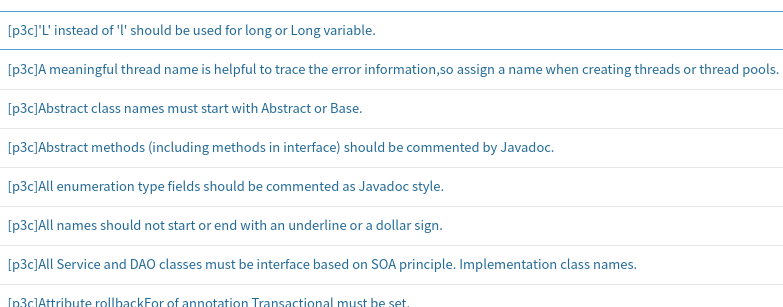
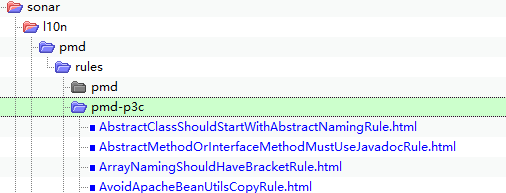
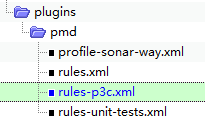
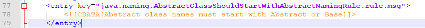
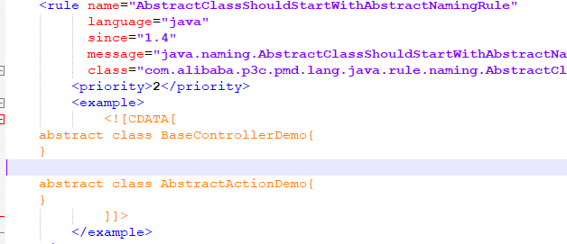
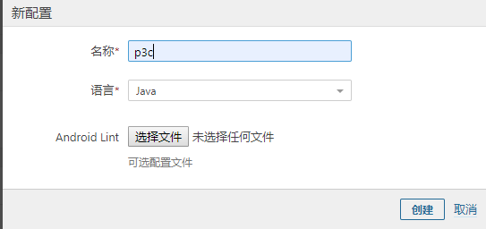
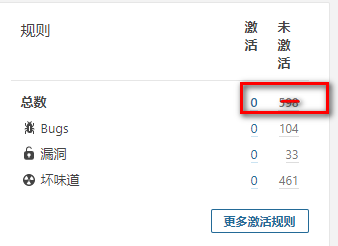

sonar官方的支持pmd的插件，代码地址是https://github.com/jensgerdes/sonar-pmd，但是里面不包含p3c。阿里官方提供了eclipse插件、idea插件、p3c-pmd, 代码地址是https://github.com/alibaba/p3c，但是没有提供sonar插件。如果想在sonarqube里添加p3c规则，我们需要自己改源码把两者整合。

第一步，下载sonar-pmd源代码：`git clone git@github.com:jensgerdes/sonar-pmd.git`

注意版本要求：

| PMD Plugin                  | 2.0  | 2.1  | 2.2   | 2.3   | 2.4.1 | 2.5   | 2.6   | 3.0.0 | 3.1.x | 3.2.x  | 3.3.x  |
| --------------------------- | ---- | ---- | ----- | ----- | ----- | ----- | ----- | ----- | ----- | ------ | ------ |
| PMD                         | 4.3  | 4.3  | 5.1.1 | 5.2.1 | 5.3.1 | 5.4.0 | 5.4.2 | 5.4.2 | 6.9.0 | 6.10.0 | 6.30.0 |
| Max. supported Java Version |      |      |       |       |       | 1.7   | 1.8   | 1.8   | 11    |        | 15     |
| Min. SonarQube Version      |      |      |       |       |       | 4.5.4 | 4.5.4 | 6.6   |       |        | 6.7    |

第二步，修改sonar-pmd源代码

1. sonar-pmd-plugin\pom.xml，添加项目对p3c-pmd的依赖：

   ```xml
   <dependency>
         <groupId>com.alibaba.p3c</groupId>
         <artifactId>p3c-pmd</artifactId>
         <version>2.1.1</version>
   </dependency>
   ```

   当前的最新版本就是2.1.1，你可以从https://github.com/alibaba/p3c/tree/master/p3c-pmd了解这一点。

2. 打开`sonar-pmd-plugin\src\main\resources\com\sonar\sqale\pmd-model.xml`，添加配置

   ```xml
   <chc>
           <key>P3C-PMD</key>
           <name>p3c-pmd</name>
           <chc>
               <key>P3C_PMD</key>
               <name>p3c pmd</name>
               <!--AlibabaJavaComments-->
               <chc>
                   <rule-repo>pmd</rule-repo>
                   <rule-key>CommentsMustBeJavadocFormatRule</rule-key>
                   <prop>
                       <key>remediationFunction</key>
                       <txt>CONSTANT_ISSUE</txt>
                   </prop>
                   <prop>
                       <key>offset</key>
                       <val>2</val>
                       <txt>min</txt>
                   </prop>
               </chc>
               .....省略
   ```

   

3. 打开文件`sonar-pmd-plugin\src\main\resources\org\sonar\l10n\pmd.properties`，添加：

   ```properties
   ##p3c##
   #AlibabaJavaComments
   rule.pmd.CommentsMustBeJavadocFormatRule.name=[p3c]Javadoc should be used for classes, class variables and methods. The format should be '/** comment **/', rather than '// xxx'.
   rule.pmd.AbstractMethodOrInterfaceMethodMustUseJavadocRule.name=[p3c]Abstract methods (including methods in interface) should be commented by Javadoc.
   rule.pmd.ClassMustHaveAuthorRule.name=[p3c]Every class should include information of author(s) and date.
   rule.pmd.EnumConstantsMustHaveCommentRule.name=[p3c]All enumeration type fields should be commented as Javadoc style.
   rule.pmd.AvoidCommentBehindStatementRule.name=[p3c]Single line comments in a method should be put above the code to be commented, by using // and multiple lines by using /* */.
   rule.pmd.RemoveCommentedCodeRule.name=[p3c]Codes or configuration that is noticed to be obsoleted should be resolutely removed from projects.
   
   #AlibabaJavaConcurrent
   rule.pmd.ThreadPoolCreationRule.name=[p3c]Manually create thread pool is better.
   rule.pmd.AvoidUseTimerRule.name=[p3c]Use ScheduledExecutorService instead.
   rule.pmd.ThreadShouldSetNameRule.name=[p3c]A meaningful thread name is helpful to trace the error information,so assign a name when creating threads or thread pools.
   rule.pmd.AvoidCallStaticSimpleDateFormatRule.name=[p3c]SimpleDataFormat is unsafe, do not define it as a static variable. If have to, lock or DateUtils class must be used.
   rule.pmd.ThreadLocalShouldRemoveRule.name=[p3c]type 'ThreadLocal' must call remove() method at least one times.
   rule.pmd.AvoidConcurrentCompetitionRandomRule.name=[p3c]Avoid using [Math.random()] by multiple threads.
   rule.pmd.CountDownShouldInFinallyRule.name=[p3c]should be called in finally block.
   rule.pmd.AvoidManuallyCreateThreadRule.name=[p3c]Explicitly creating threads is not allowed, use thread pool instead.
   rule.pmd.LockShouldWithTryFinallyRule.name=[p3c]Lock operation [%s] must immediately follow by try block, and unlock operation must be placed in the first line of finally block.
   .....省略
   ```

   这里的值就是sonarqube界面-代码规则显示的：

   

   为了在sonarqube里面搜索方便，每一项前面都加了前缀[p3c]。

4. 路径sonar-pmd-plugin\src\main\resources\org\sonar\l10n\pmd\rules\下面新建一个pmd-p3c，把描述文件放进去：

   

5. 目录sonar-pmd-plugin\src\main\resources\org\sonar\plugins\pmd\下面新建文件rules-p3c.xml，添加阿里的开发规则。这里新建文件是为了跟pmd原来的规则区分开来。

   

   rules-p3c.xml的内容格式如下：

   ```xml
   <rules>
       <!--p3c-->
       <!--AlibabaJavaComments-->
       <rule key="CommentsMustBeJavadocFormatRule">
           <priority>MAJOR</priority>
           <configKey><![CDATA[rulesets/java/ali-comment.xml/CommentsMustBeJavadocFormatRule]]></configKey>
       </rule>
       <rule key="AbstractMethodOrInterfaceMethodMustUseJavadocRule">
           <priority>MAJOR</priority>
           <configKey>
               <![CDATA[rulesets/java/ali-comment.xml/AbstractMethodOrInterfaceMethodMustUseJavadocRule]]></configKey>
       </rule>
       <rule key="ClassMustHaveAuthorRule">
           <priority>MAJOR</priority>
           <configKey><![CDATA[rulesets/java/ali-comment.xml/ClassMustHaveAuthorRule]]></configKey>
       </rule>
       <rule key="EnumConstantsMustHaveCommentRule">
           <priority>CRITICAL</priority>
           <configKey><![CDATA[rulesets/java/ali-comment.xml/EnumConstantsMustHaveCommentRule]]></configKey>
       </rule>
       <rule key="AvoidCommentBehindStatementRule">
           <priority>MAJOR</priority>
           <configKey><![CDATA[rulesets/java/ali-comment.xml/AvoidCommentBehindStatementRule]]></configKey>
       </rule>
       <rule key="RemoveCommentedCodeRule">
           <priority>MAJOR</priority>
           <configKey><![CDATA[rulesets/java/ali-comment.xml/RemoveCommentedCodeRule]]></configKey>
       </rule>
   .....more
   ```

6. 最后，因为我们新建了rules-p3c.xml文件，需要在PmdRulesDefinition.java里添加入口：

   ```java
       @Override
       public void define(Context context) {
           NewRepository repository = context
                   .createRepository(PmdConstants.REPOSITORY_KEY, PmdConstants.LANGUAGE_KEY)
                   .setName(PmdConstants.REPOSITORY_NAME);
   
           extractRulesData(repository, "/org/sonar/plugins/pmd/rules.xml", "/org/sonar/l10n/pmd/rules/pmd");
           
   		//添加代码----->
   		// p3c
           extractRulesData(repository, "/org/sonar/plugins/pmd/rules-p3c.xml", "/org/sonar/l10n/pmd/rules/pmd-p3c");
           //-------------END
           
           repository.done();
       }
   ```

   

7. 概括一下，这几个文件（目录）是我们添加规则的重点：

   - pmd.properties (src/main/resources/org/sonar/l10n/pmd.properties)
   - rules-p3c.xml (src/main/resources/org/sonar/plugins/pmd/rules-p3c.xml)
   - pmd-model.xml (src/main/resources/com/sonar/sqale/pmd-model.xml)
   - src\main\resources\org\sonar\l10n\pmd\rules\pmd-p3c\

   下载p3c-pmd的源码(https://github.com/alibaba/p3c/tree/master/p3c-pmd)，对照里面的规则来写，工作量比较大。

   主要参考`p3c-pmd\src\main\resources\messages_en.xml`、`p3c-pmd\src\main\resources\rulesets\java\`。比如，AbstractClassShouldStartWithAbstractNamingRule.html文件里的描述可以从messages_en.xml中来：

   

   里面的例子可以从ali-naming.xml里面来：

   

8. 原来的pmd规则可以删掉

9. 编译打包：mvn clean package -Dmaven.test.skip=true。因为有些测试用例不通过，所以加上skip跳过用例。

10. 从sonar-pmd-plugin/target目录把生成jar包拷出来，放到sonarqube-7.9.6/extensions/plugins路径下，然后重启sonarqube。

11. 如果上一步有问题，比如sonarqube起不来，或者起来后看不到p3c规则，试一下从应用市场安装pmd，装完后，sonarqube-7.9.6/extensions/plugins路径下有pmd插件的jar包，删掉，替换成我们编译的。重启。

12. 如果还有问题，查看sonarqube的日志sonarqube-7.9.6/logs，并仔细阅读官方文档。

13. 考虑到开发成本较高，可以从GitHub上下载别人写好的：https://github.com/caowenliang/sonar-pmd-p3c，这个版本比较新。然后你要检查里面使用的是不是最新的p3c-pmd。

14. sonar官方文档https://docs.sonarqube.org/latest/analysis/languages/java/

第三步，sonarqube里面新建质量配置，



这时新配置里面还没有规则：



点“更多激活规则”，搜索“p3c”，因为我们前面编写规则时，每个name都加了[p3c]前缀，所以可以用关键词“p3c”搜索出来。

浏览一遍确认无误后，点“批量修改”，应用。

回到质量配置，把p3c设为默认。动作-设为默认。

结束.